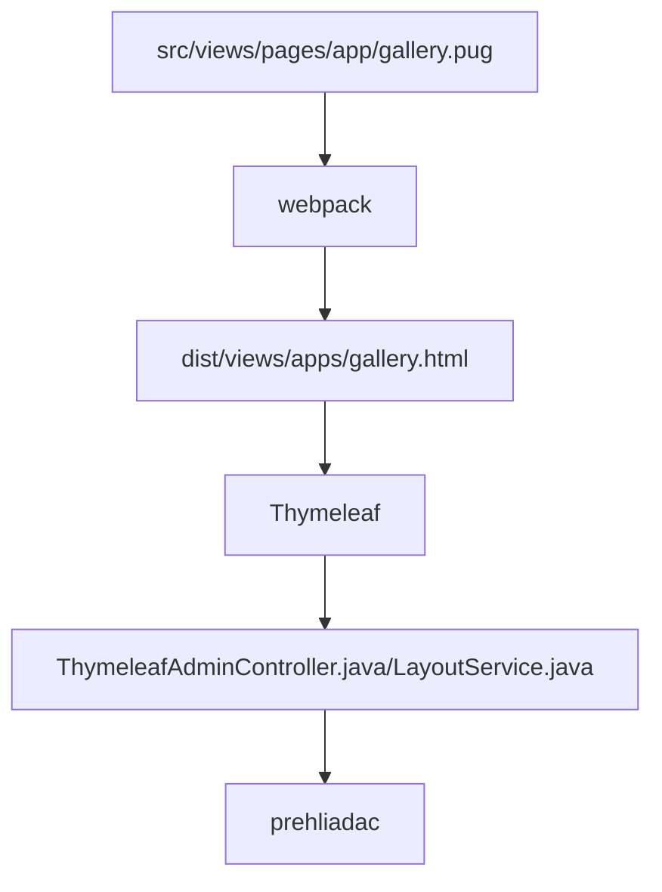

# Základní popis použitých rámců

Použité technologie:
- [Spring REST + Spring DATA](spring.md)
- [thymeleaf.org](thymeleaf.md) - šablonovací systém napojený na backend Javy
- `webpack+node` pro kompilaci souborů html/PUG/JS
- datatables.net + [editor](https://editor.datatables.net) - základní práce a editace tabulkových dat, napojení na Spring přes DatatablesRestControllerV2 - příklad v sekci [GalleryRestController.java](../../../src/main/java/sk/iway/iwcm/components/gallery/GalleryRestController.java) a [gallery.pug](../../../src/main/webapp/admin/v9/views/pages/apps/gallery.pug)
- [pugjs.org](pugjs.md) - `preprocessor` pro generování kódu HTML pro stránky
- [Vue.js](vue.md) - k dispozici jako `window.Vue`, krátká ukázka v [fotogalerie](../../../src/main/webapp/admin/v9/views/pages/apps/gallery.pug)

Celý postup generování webové stránky v systému `/admin/v9/` je následující:



proto je nutné přemýšlet o tom, co se v kterém kroku děje.

## npm

Pro sestavení souborů JS/CSS se používá `node`, základní příkazy:
- `npm install` - nainstaluje všechny potřebné moduly
- `npm outdated` - seznamy zastaralých modulů
- `npm update MODUL` - aktualizuje zadaný modul, ale pozor, aktualizuje pouze `minor` verze, pokud nezadáte název modulu, aktualizují se všechny moduly.
- `npm i MODUL@VERZIA` - nainstaluje/aktualizuje modul na zadanou verzi.
- `npm audit` - seznam modulů obsahujících zranitelnost
- `npm audit fix` - aktualizuje moduly obsahující zranitelnost
- `npm list --depth=0` - seznam nainstalovaných modulů, parametr depth lze použít k určení hloubky vnoření.
- `npm view MODUL version` - vypíše aktuální nejnovější verzi modulu

Pokud potřebujete aktualizovat také závislosti, můžete použít modul [npm-check-updates](https://flaviocopes.com/update-npm-dependencies/):

```shell
//instalacia modulu
npm install -g npm-check-updates
//vypis verzii na aktualizaciu
ncu
//aktualizacia verzii v zavislostiach
ncu -u
//aktualizacia
npm install
```

## Události

!>**Varování:** není možné použít událost v kódu JavaScript `$(document).ready`, protože je třeba nejprve inicializovat úložiště překladových klíčů. Implementovali jsme vlastní funkci `window.domReady.add` v knihovně [připraveno](../libraries/ready-extender.md), která se provede až po inicializaci úložiště překladových klíčů.

```javascript
window.domReady.add(function () {
    //vas kod
});

//nastavenie poradia na 10, cize typicky na koniec
window.domReady.add(function () {
    //vas kod
}, 10);
```

## Webpack

Skládání a sestavování `pug/js/css` provádí [webpack](https://webpack.js.org/).

Soubory JS a CSS jsou po kompilaci uloženy v `dist` složka. Odtud se PUG načte pomocí seznamu ze stránky `htmlWebpackPlugin.files`. Současně se ve výchozím nastavení vkládají pouze skripty, které nezačínají předponou. `pages_`. Soubor s touto předponou bude vložen pouze tehdy, pokud se jeho název shoduje s názvem souboru pug.

```javascript
// Outpul all script files
-
    let filename = htmlWebpackPlugin.options.filename;
    var slash = filename.lastIndexOf("/");
    var dot = filename.indexOf(".", slash);
    if (slash > 0 && dot > slash) filename = filename.substring(slash+1, dot);

each js in WPF.js
    - if (js.indexOf("pages_")==-1 || js.indexOf("pages_"+filename+".")!=-1)
        script(type='text/javascript', src=js)
```

Pokud tedy potřebujete vložit speciální soubor JavaScriptu pro stránku v administraci, vytvořte jej ve složce `src/main/webapp/admin/v9/src/js/pages/` Pokud předpokládáte, že budete používat několik samostatných souborů JS spojených do jednoho, vytvořte podsložku. Příkladem je `src/main/webapp/admin/v9/src/js/pages/web-pages-list/web-pages-list.js` který se nachází v podsložce `web-pages-list` a ve scénáři `web-pages-list.js` třída je importována z `preview.js`.

Tento skript se vloží pouze při volání webové stránky. `web-pages-list.pug`, tj. na adrese URL `/admin/v9/webpages/web-pages-list/`.

Výše uvedený postup lze použít pouze pro soubory PUG, protože skript je do generovaného HTML vložen během kompilace. Pro aplikace z `/apps` složky, které používají přímo `.html` soubory jsou připraveny k vložení JavaScriptu [soubor jako modul](../../custom-apps/admin-menu-item/README.md#přiložení-souboru-javascript) při zobrazení stránky HTML.
