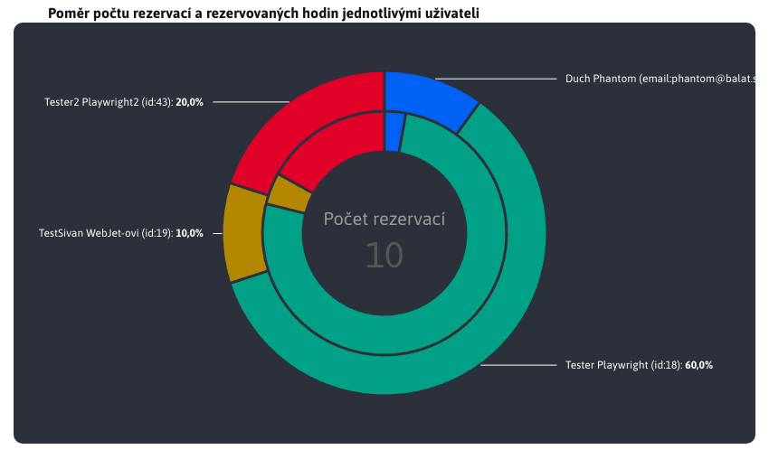

# Společné JS funkce

Tato část se bere společnými funkcemi pro práci s grafy, které nabízí soubor [chart-tools.js](../../../../../../src/main/webapp/admin/v9/src/js/libs/chart/chart-tools.js), který je dostupný jako `window.ChartTools` objekt.

## Graf typu BAR

Graf typu **BAR** je vytvářen pomocí instance třídy `BarChartForm`, která je dostupná jako `ChartTools.BarChartForm`.

```javascript
export class BarChartForm {
    constructor(yAxeName, xAxeName, chartTitle, chartDivId, chartData) {
        this.yAxeName = yAxeName;
        this.xAxeName = xAxeName;
        this.chartTitle = chartTitle;
        this.chartDivId = chartDivId;
        this.chartData = chartData;
        this.chart = undefined;
    }
}
```

Jednotlivé parametry třídy slouží k :
- `yAxeName`, textová hodnota reprezentující název proměnné v objektu, která uchovává textovou hodnotu osy Y (představuje kategorii).
- `xAxeName`, textová hodnota reprezentující název proměnné v objektu, která uchovává číselnou hodnotu osy X (představuje hodnotu kategorie).
- `chartTitle`, textová hodnota reprezentující nadpis, který se zobrazí ve formě hlavičky nad grafem.
- `chartDivId`, textová hodnota reprezentující ID div elementu, který má zobrazit vytvářený graf.
- `chartData`, pole objektů, které reprezentují data grafu. V každém objektu musí být zmíněná proměnná kategorie (yAxeName) a proměnná hodnoty kategorie (xAxeName).
- `chart`, chart představuje náš graf, který bude při vytvoření automaticky uložen do tohoto parametru třídy.

**Pozor**, parametr `chart` nelze nastavit skrz konstruktor a slouží na pozadí jako pomocná proměnná.

### Příklad použití

Příklad použití **BAR** grafu ze souboru [search-engine.html](../../../../../../src/main/webapp/apps/stat/admin/search-engines.html)

```javascript
    $.ajax({url: getUrl(ChartTools.ChartType.Bar), success: function(result) {

        barChartQueries = new ChartTools.BarChartForm("queryName", "queryCount", '[[#{stat.graph.searchQueriesBars}]]', "searchEngines-barQueries", result['content']);

        ChartTools.createAmchart(barChartQueries);
    }});
```

Výsledný vygenerovaný graf is nadpisem


## Graf typu PIE

Graf typu **PIE** je vytvářen pomocí instance třídy `PieChartForm`, která je dostupná jako `ChartTools.PieChartForm`.

```javascript
export class PieChartForm {
    constructor(yAxeName, xAxeName, chartTitle, chartDivId, chartData, labelKey) {
        this.yAxeName = yAxeName;
        this.xAxeName = xAxeName;
        this.chartTitle = chartTitle;
        this.chartDivId = chartDivId;
        this.chartData = chartData;
        this.labelKey = labelKey;
        this.chart = undefined;
        this.chartLegend = undefined;
    }
}
```

Jednotlivé parametry třídy slouží k :
- `yAxeName`, textová hodnota reprezentující název proměnné v objektu, která uchovává číselnou hodnotu kategorie.
- `xAxeName`, textová hodnota reprezentující název proměnné v objektu, která uchovává textovou hodnotu představující kategorii.
- `chartTitle`, textová hodnota reprezentující nadpis, který se zobrazí ve formě hlavičky nad grafem.
- `chartDivId`, textová hodnota reprezentující ID div elementu, který má zobrazit vytvářený graf.
- `chartData`, pole objektů, které reprezentují data grafu. V každém objektu musí být zmíněná proměnná kategorie (xAxeName) a proměnná hodnoty kategorie (yAxeName).
- `labelKey`, **nepovinná** textová hodnota představující překladový klíč s nadpisem k sumaru
- `chart`, představuje náš graf, který bude při vytvoření automaticky uložen do tohoto parametru třídy.
- `chartLegend`, představuje nastavenou legendu grafu. Nenastavuje ji uživatel, nastavena automaticky a je nutná na pozadí při aktualizování grafu.

**Pozor**, parametry `chart` a `chartLegend` nelze nastavit skrz konstruktor a slouží na pozadí jako pomocné proměnné.

### Příklad použití

Příklad použití **PIE** grafu ze souboru [referer.html](../../../../../../src/main/webapp/apps/stat/admin/referer.html)

```javascript
    $.ajax({url: getGraphUrl(), success: function(result) {

        pieChartVisits = new ChartTools.PieChartForm("visits", "serverName", '[[#{stat.referer.pieChart}]]', "referer-pieReferer", result['content']);

        ChartTools.createAmchart(pieChartVisits);
    }});
```

Výsledný vygenerovaný graf is nadpisem


### Parametr `labelKey`

Parametr `labelKey` je speciální v tom, že není povinen při vytváření instance třídy `PieChartForm`. Můžete to vidět v předchozí ukázce použití, jelikož tam chybí. Pokud byste jej však zadali, tak se použije jako překladový klíč k získání textu. Tento text se automaticky nastaví do středu grafu jako nadpis a pod ním se zobrazí vypočtená hodnota reprezentující celkový sumář hodnot v sérii grafu.

Díky tomu můžete mít přehledně v grafu celkovou hodnotu dat sérii. Velikost písma se automaticky upraví tak, aby se text vešel dovnitř grafu. Po změně dat grafu se hodnota automatický přepočítá.

**Pozor**, nedoporučujeme dlouhý text jinak bude font textu velmi malý.

Graf typu **PIE** s takovým nastavením aktuálně nemáme, ale můžete se podívat na sekci s graf typu **DOUBLE\_PIE**, kde je takový text viditelný.

## Graf typu DOUBLE\_PIE

Graf typu **DOUBLE\_PIE** je vytvářen pomocí instance třídy `DoublePieChartForm`, která je dostupná jako `ChartTools.DoublePieChartForm`. Jedná se o variaci grafu typu **PIE**, který však obsahuje dvě vnořené části.

```javascript
export class DoublePieChartForm {
    constructor(yAxeName_inner, yAxeName_outer, xAxeName, chartTitle, chartDivId, chartData, labelSeries, labelKey) {
        this.yAxeName_inner = yAxeName_inner;
        this.yAxeName_outer = yAxeName_outer;
        this.xAxeName = xAxeName;
        this.chartTitle = chartTitle;
        this.chartDivId = chartDivId;
        this.chartData = chartData;
        this.labelSeries = labelSeries;
        this.labelKey = labelKey;
        this.chart = undefined;
        this.chartLegend = undefined;
    }
}
```

Jednotlivé parametry třídy slouží k :
- `yAxeName_inner`, textová hodnota reprezentující název proměnné v objektu, která uchovává číselnou hodnotu kategorie. Jedná se o vnitřní kruh.
- `yAxeName_outer`, textová hodnota reprezentující název proměnné v objektu, která uchovává číselnou hodnotu kategorie. Jedná se o vnější kruh.
- `xAxeName`, textová hodnota reprezentující název proměnné v objektu, která uchovává textovou hodnotu představující kategorii.
- `chartTitle`, textová hodnota reprezentující nadpis, který se zobrazí ve formě hlavičky nad grafem.
- `chartDivId`, textová hodnota reprezentující ID div elementu, který má zobrazit vytvářený graf.
- `chartData`, pole objektů, které reprezentují data grafu. V každém objektu musí být zmíněná proměnná kategorie (xAxeName) a proměnná hodnoty kategorie (yAxeName).
- `labelSeries`, **nepovinná** textová hodnota pro označení série k součtu s povolenými hodnotami `inner` a `outer`
- `labelKey`, **nepovinná** textová hodnota na překladový klíč s textem, který bude sloužit jako nadpis pro součet hodnot
- `chart`, představuje náš graf, který bude při vytvoření automaticky uložen do tohoto parametru třídy.
- `chartLegend`, představuje nastavenou legendu grafu. Nenastavuje ji uživatel, nastavena automaticky a je nutná na pozadí při aktualizování grafu.

**Pozor**, parametry `chart` a `chartLegend` nelze nastavit skrz konstruktor a slouží na pozadí jako pomocné proměnné.

### Příklad použití

Příklad použití **DOUBLE\_PIE** grafu ze souboru [reservation-stat.html](../../../../../../src/main/webapp/apps/reservation/admin/reservation-stat.html)

```javascript
    $.ajax({url: getGraphUrl("pie", "users"), success: function(result) {

        doublePieChartTimeUsers = new ChartTools.DoublePieChartForm("valueB", "valueA", "category", '[[#{reservation.reservation_stat.hours_user_chart.title}]]', "reservationStat-doublePieTimeUsers", result, "outer", "reservation.reservation_stat.hours_user_chart.label.js");

        ChartTools.createAmchart(doublePieChartTimeUsers);
    }});
```

Výsledný vygenerovaný graf, s nadpisem nad grafem, který obsahuje i volitelný popisem ve středu grafu s číselným sumářem hodnot



### Parametry `labelKey` a `labelSeries`

Parametry `labelKey` a `labelSeries` jsou speciálně v tom, že nejsou povinné při vytváření instance třídy `DoublePieChartForm`. Pokud však zadané jsou, slouží k nastavení informace o sumaru hodnot ve středu grafu.

Parametry `labelKey` se použije jako překladový klíč k získání textu. Tento text se automaticky nastaví do středu grafu jako nadpis pro vypočtenou hodnotu.

Parametr `labelSeries` se používá k nastavení toho, kterou sérii dat chceme mít spočítanou. může nabýt hodnotu :
- `inner`, sečtou se hodnoty vnitřního grafu (`yAxeName_inner`)
- `outer`, sečtou se hodnoty vnějšího grafu (`yAxeName_outer`)

Díky tomu můžete mít přehledně v grafu celkovou hodnotu dat sérii. Velikost písma se automaticky upraví tak, aby se text vešel dovnitř grafu. Po změně dat grafu se hodnota automatický přepočítá.

**Pozor**, nedoporučujeme dlouhý text jinak bude font textu velmi malý.

## Graf typu LINE

Graf typu **LINE** je vytvářen pomocí instance třídy `LineChartForm`, která je dostupná jako `ChartTools.LineChartForm`. Oproti grafům jako **BAR** nebo **PIE** je jedinečný ve schopnosti zobrazit více různých hodnot pro více dat. Právě tato schopnost grafu typu **LINE** vyžaduje také speciální vstupní a konfigurační hodnoty, které jsou popsány v následujících pod-kapitolách.

```javascript
export class LineChartForm {
    constructor(yAxeNames, xAxeName, chartTitle, chartDivId, chartData, dateType) {
        this.yAxeNames = yAxeNames;
        this.xAxeName = xAxeName;
        this.chartTitle = chartTitle;
        this.chartDivId = chartDivId;
        this.chartData = chartData;
        this.dateType = dateType;
        this.chart = undefined;
    }
}
```

Jednotlivé parametry třídy slouží k :
- `yAxeName`, (podrobněji rozebráno v samostatné pod-kapitole)
- `xAxeName`, textová hodnota reprezentující název proměnné v objektu, která uchovává číselnou hodnotu osy Y (zaznamenaná hodnota).
- `chartTitle`, textová hodnota reprezentující nadpis, který se zobrazí ve formě hlavičky nad grafem.
- `chartDivId`, textová hodnota reprezentující ID div elementu, který má zobrazit vytvářený graf.
- `chartData`, (podrobněji rozebráno v samostatné pod-kapitole)
- `dateType`, (podrobněji rozebráno v samostatné pod-kapitole)
- `chart`, chart představuje náš graf, který bude při vytvoření automaticky uložen do tohoto parametru třídy.

**Pozor**, parametr `chart` nelze nastavit skrz konstruktor a slouží na pozadí jako pomocná proměnná.

### Příklad použití

Příklad použití **LINE** grafu

```javascript
    let yAxeNames =
        ChartTools.getLineChartYAxeNameObjs(
            ["visits", "sessions", "uniqueUsers"],
            ["stat.visits.js", "stat.sessions.js", "stat.unique_users.js"]
        );

    await $.ajax({url: getGraphUrl(), success: function(result) {

        lineChartVisits = new ChartTools.LineChartForm(yAxeNames, "dayDate", '[[#{stat.top.lineChart}]]', "stat-lineVisits", convertData(result['content']), ChartTools.DateType.Days);

        ChartTools.createAmchart(lineChartVisits);
    }});
```

Výsledný vygenerovaný graf is nadpisem


### Parametr yAxeName

Jak jsme mohli z příkladu použití vidět, parametr **yAxeName** má výrazně odlišný tvar než u grafů PIE a BAR, kde se jedná pouze o textovou hodnotu. Rozdíl je ve schopnosti LINE grafu zobrazit více číselných parametrů z datasetu jako samostatné čáry. Pro vygenerování správného tvaru **yAxeName** využíváme připravenou funkci `getLineChartYAxeNameObjs()` ze souboru [chart-tools.js](../../../../../../src/main/webapp/admin/v9/src/js/libs/chart/chart-tools.js). To, jak tato funkce funguje, není podstatné. Nás zajímá pouze fakt, že vstupní parametry tvoří 2 pole s textovými hodnotami.

První pole obsahuje název parametrů objektů z dat pro graf, reprezentující nějaké číselné hodnoty, které chceme zobrazit jako samostatné čáry na grafu. Druhé pole obsahuje překladové klíče, které se ve stejném pořadí mapují k názvům parametrů a reprezentují danou čáru grafu v legendě grafu.

Příklad použití jsme viděli v předchozí kapitole. Vidíme, že chceme zobrazit 3 číselné parametry a to `visits`, `sessions` a `uniqueUsers`. V přiloženém obrázku vidíme 3 vygenerované čáry reprezentující tyto parametry a v legendě grafu vidíme napříkad místo názvu parametru `visits` textovou hodnotu **Vidění**, která byla získána z překladového klíče `stat.visits.js` (klíč byl namapován k parametru nebo se nacházely na stejných pozicích v polích).

```javascript
    let yAxeNames =
        ChartTools.getLineChartYAxeNameObjs(
            ["visits", "sessions", "uniqueUsers"],
            ["stat.visits.js", "stat.sessions.js", "stat.unique_users.js"]
        );
```

Samozřejmě, překladové klíče (některé nebo všechny) nejsou povinné a mohou být nahrazeny hodnotou `undefined`. !! Musí být však dodržen stejný počet parametrů v ocbech polích, i když jde pouze o `undefined` hodnoty.

Příklad použití `getLineChartYAxeNameObjs` s prázdnou hodnotou překladového klíče.

```javascript
    let yAxeNames = ChartTools.getLineChartYAxeNameObjs(["visits"], [undefined]);
```

### Parametr chartData

Pro LINE graf mají data specifický formát jako mapa obsahující listy objektů, kde každý prvek v mapě (list objektů) představuje rozdílný dataset. Z těchto objektů v listu můžeme zobrazit 1 nebo více číselných hodnot než samostatné čáry v grafu. Při zobrazování těchto dat pomocí LINE grafu mohou nastat 3 rozdílné situace.

```java
Map<List<T>>
```

**1 dataset a 1 parametr**

1  dataset znamená, že mapa obsahuje pouze jeden prvek reprezentovaný dopisem objektů. Parametr **yAxeName** obsahuje pouze 1 prvek, což znamená, že výsledný LINE graf bude zobrazovat pouze 1 čáru, jejíž identifikační název v legendě grafu bude reprezentován překladovým klíčem z parametru **yAxeName**.

**1 dataset N parametrů**

1  dataset znamená, že mapa obsahuje pouze jeden prvek reprezentovaný dopisem objektů. Parametr **yAxeName** obsahuje N prvků, což znamená, že výsledný LINE graf bude zobrazovat N čar, jejichž identifikační název v legendě grafu bude reprezentován překladovými klíči z parametru **yAxeName**. Takže se jedná o více číselných parametrů ze stejné série dat.

Takový typ grafu jsme viděli v ukázce grafu, výše v této kapitole.

**M datasetů 1 parametrů**

M datasetů znamená, že mapa obsahuje M prvek reprezentovaných jako listy objektů. Parametr **yAxeName** obsahuje pouze 1 prvek, což znamená, že výsledný LINE graf bude zobrazovat M čar, jejichž identifikační název v legendě grafu bude reprezentován klíčem z mapy. Tento klíč označoval jednotlivé datasety. Ve výsledku graf bude zobrazovat stejný číselný parametr (např. `visits`) ale pro několik rozdílných sérii dat.

**M datasetů N parametrů**

Tento případ je kombinace předchozích. Ve výsledku bude graf obsahovat M\*N čar, jejichž identifikační název v legendě grafu bude reprezentován jako kombinace klíče mapy (identifikátor datasetu) přes pomlčku ("-") spojený s hodnotou překladového klíče z parametru **yAxeName**. Ve výsledku tak graf bude zobrazovat několik číselných hodnot pro několik rozdílných listů dat (datasetů).

### Parametr dateType

Poslední speciální parametr LINE grafu je **dateType**. Protože X osa grafu je datová, vzniká zde potřeba správné granulity této osy. To znamená, že pokud X vosa grafu zobrazuje interval 1 rok a datové hodnoty jsou od sebe vzdáleny 1 týden, chceme aby granulita byla nastavena na týdny s krokem 1. V jiném případě, pokud X vosa grafu zobrazuje interval několik dní a datové hodnoty jsou od sebe vzdáleny 5 minut, schématu X osy grafu nastavit granulitu.

K nastavení granulity využíváme poskytnutou enumeraci `DateType` ze souboru [chart-tools.js](../../../../../src/main/webapp/admin/v9/src/js/libs/chart/chart-tools.js).

Hodnota **DateType.Auto** se nastavuje, chceme-li nastavení granulity nechat na přednastavenou logiku (která je v souboru chart-tools.js). Ta kromě správného výběru hodnoty granulity nastaví také nejlepší krok tak, aby to vyhovovalo datům grafu.

Hodnota **DateType.Day\_1** je speciální hodnota, která se používá v případě potřeby nastavení rozsahu přesně na 1 den. V takovém případě se ignoruje parametr označený jako **xAxeName** (představující datumovou hodnotu) a využije se parametr `hour`, který musí být obsažen v datech pro graf a to v číselném formátu v rozsahu 0 - 23 (představující celé hodiny dne).

Ještě může nastat situace jako v případě stránky **Návštěvnost** ze sekce statistika, kde data pro LINE graf jsou specifický granulovány na BackEnd-e podle zadaného uskupení. To znamená že automatická granulace nastavena pomocí **DateType.Auto** fungovat nebude, jelikož i při nastaveném intervalu na 3 roky budou data stále granulována po dnech. Pro tento případ enumerace `DateType` nabízí také možnost ručního nastavení granulace a to na hodnoty:
- `DateType.Seconds`
- `DateType.Minutes`
- `DateType.Hours`
- `DateType.Days`
- `DateType.Weeks`
- `DateType.Months`

V případě ručního nastavení granulace, logik kolem grafu vypočítá pouze krok, ale nastavenou granulaci ponechá, i kdyby byla nastavena nesprávně. Třeba si dát pozor při ručním nastavování granulace, protože nastavení větší hodnoty než je třeba začne zkreslovat graf a nastavení menší hodnoty než je třeba poškodí fungování `Tooltip` logiky.

## Speciální (LIVE) grafy

Zmíníme také speciální grafy, které jsou využity v sekcí `Monitorovanie servera - Aktuálne hodnoty`. Jedná se o speciální grafy typu LINE, které se dokážou automaticky aktualizovat. Tyto grafy a logika jejich obsluhující je nastavena napevno pro tuto stránku a nelze ji znovu použít na jiných stránkách. Implementované použití je v souboru [vue-amchart-monitoring-server.vue](../../../../../src/main/webapp/admin/v9/src/vue/components/webjet-server-monitoring/components/vue-amchart-monitoring-server.vue).

K vytvoření grafů je opět využita logika poskytnutá souborem [chart-tools.js](../../../../../src/main/webapp/admin/v9/src/js/libs/chart/chart-tools.js) a jedná se o funkci `createServerMonitoringChart()`. Její vstupní parametry jsou pouze id div elementu ve kterém bude graf zobrazen a textová hodnota typu grafu. Podporován je typ `memoryAmchart` a `cpuAmchart`.

### Příklad použití

Příklad vytvoření monitoring grafů

```javascript
    if(this.type == "memoryAmchart") {
        ChartTools.createServerMonitoringChart("serverMonitoring-lineChartMemory", this.type).then((chart) => {
            this.chart = chart;
        });
    } else if(this.type == "cpuAmchart") {
        ChartTools.createServerMonitoringChart("serverMonitoring-lineChartCpu", this.type).then((chart) => {
            this.chart = chart;
        });
    }
```

Aktualizování hodnot těchto grafů se provádí pomocí funkce `addData()` ze souboru `chart-tools.js`, jejíž vstupní parametry jsou :
- `allSeries`, všechny série grafu (čáry), lze získat z instance grafu
- `xAxis`, X vosa grafu, lze získat z instance grafu
- `data`, nová data, která se přidají již ke stávajícím datům
- `type`, textový typ dat, který byl zmíněn při vytváření grafu

Příklad aktualizace monitoring grafu

```javascript
    ChartTools.addData(this.chart.series.values, this.chart.xAxes.values[0],  this.chartData, this.type);
```

V tomto případě je podstatné právě to, jak jsme z instance grafu získali `allSeries` a `xAxis`.

Ukázka obou LIVE grafů za aplikace `Monitorovanie servera - Aktuálne hodnoty` is vygenerovanými nadpisy


