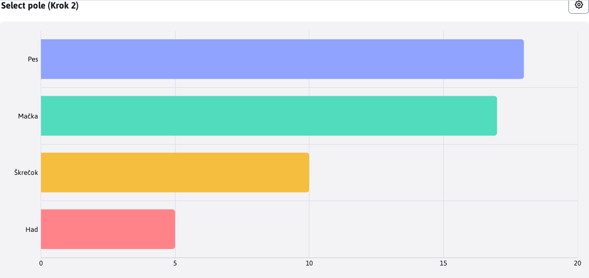
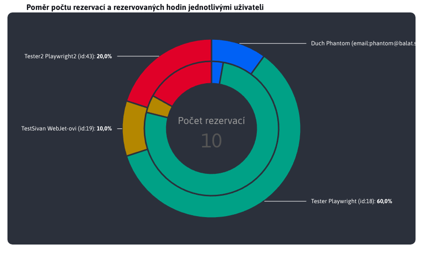
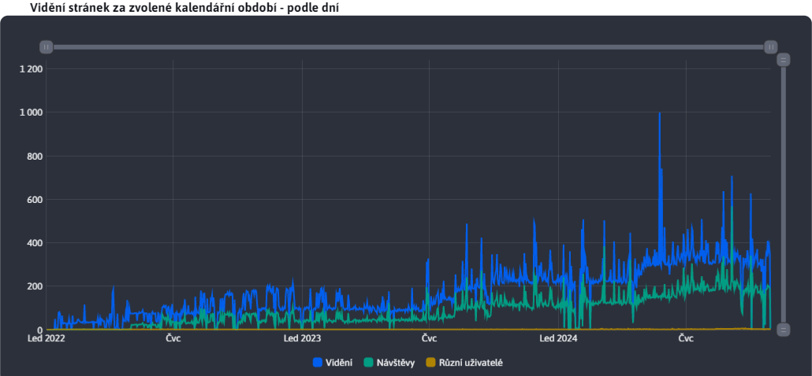
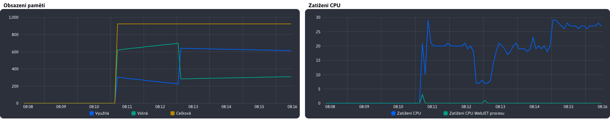

# Společné JS funkce

Tato část popisuje společné funkce pro práci s grafy, které poskytuje soubor [chart-tools.js](../../../../../../src/main/webapp/admin/v9/src/js/libs/chart/chart-tools.js). Funkce jsou dostupné přes objekt `window.ChartTools`.

!>**Upozornění:** Historicky se používal zápis bez konfiguračního objektu, kde se parametry zadávaly přímo do konstruktoru třídy. Tento způsob je stále podporován, ale nedoporučujeme jej používat.

## Přehled tříd a typů grafů

| Třída | Dostupná jako | Typ grafu |
| -------- | -------------- | ----------- |
| `LineChartForm` | `ChartTools.LineChartForm` | Čárový graf s datovou osou |
| `BarChartForm` | `ChartTools.BarChartForm` | Sloupcový graf (horizontální / vertikální) |
| `PieChartForm` | `ChartTools.PieChartForm` | Koláčový graf (klasický nebo donut) |
| `DoublePieChartForm` | `ChartTools.DoublePieChartForm` | Dvouvrstvý koláčový graf |
| `WordCloudChartForm` | `ChartTools.WordCloudChartForm` | Oblak slov |
| `TableChartForm` | `ChartTools.TableChartForm` | Jednoduchá tabulka v designu grafů |

## Enumerace `ChartType`

Konstantní objekt `ChartType` se používá k identifikaci typu dat při AJAX voláních na backend. Je dostupný jako `ChartTools.ChartType`.

| Hodnota | Řetězec | Popis |
| --------- | --------- | ------- |
| `ChartType.Line` | `"line"` | Čárový graf |
| `ChartType.Bar_Vertical` | `"bar_vertical"` | Vertikální sloupcový graf |
| `ChartType.Bar_Horizontal` | `"bar_horizontal"` | Horizontální sloupcový graf |
| `ChartType.Pie_Classic` | `"pie_classic"` | Klasický koláčový graf |
| `ChartType.Pie_Donut` | `"pie_donut"` | Donut koláčový graf |
| `ChartType.Double_Pie` | `"double_pie"` | Dvouvrstvý koláčový graf |
| `ChartType.Word_Cloud` | `"word_cloud"` | Oblak slov |
| `ChartType.Table` | `"table"` | Tabulková komponenta |
| `ChartType.Not_Chart` | `"not_chart"` | Speciální případ bez grafu |

```javascript
// Príklad použitia pri zostavení URL pre AJAX volanie
$.ajax({ url: getUrl(ChartTools.ChartType.Bar_Horizontal), success: function(result) { ... }});
```

## Graf typu `BAR`

Graf typu **`BAR`** se vytváří pomocí instance třídy `BarChartForm`, která je dostupná jako `ChartTools.BarChartForm`.

```javascript
export class BarChartForm {

    constructor(yAxeName_or_config, xAxeName, chartTitle, chartDivId, chartData, horizontal = true) {
        if(typeof yAxeName_or_config === "object") {
            this.initFromConfig(yAxeName_or_config);
        } else {
            console.warn("Deprecated constructor signature. Use config object instead.");
            this.initFromConfig({
                yAxeName: yAxeName_or_config,
                xAxeName: xAxeName,
                chartTitle: chartTitle,
                chartDivId: chartDivId,
                chartData: chartData,
                horizontal: horizontal
            });
        }
    }

    initFromConfig(config) {
        if (!config.yAxeName) throwConstructorError("BarChartForm", "yAxeName");
        if (!config.xAxeName) throwConstructorError("BarChartForm", "xAxeName");
        if (!config.chartDivId) throwConstructorError("BarChartForm", "chartDivId");
        if (config.chartData == null || config.chartData === undefined) throwConstructorError("BarChartForm", "chartData");

        Object.assign(this, {
            yAxeName: config.yAxeName,
            xAxeName: config.xAxeName,
            chartTitle: config.chartTitle,
            chartDivId: config.chartDivId,
            chartData: config.chartData,
            horizontal: config.horizontal == null ? true : config.horizontal,
            colorScheme: config.colorScheme
        });
    }
}
```

Jednotlivé parametry třídy slouží k:

- `yAxeName` je textová hodnota reprezentující název proměnné v objektu, která uchovává textovou hodnotu osy Y (kategorii).
- `xAxeName` je textová hodnota reprezentující název proměnné v objektu, která uchovává číselnou hodnotu osy X (hodnotu kategorie).
- `chartTitle` je textová hodnota reprezentující nadpis, který se zobrazí ve formě hlavičky nad grafem.
- `chartDivId` je textová hodnota reprezentující ID elementu `div`, ve kterém se graf vykreslí.
- `chartData` je pole objektů reprezentujících data grafu. Každý objekt musí obsahovat proměnnou kategorie (`yAxeName`) i proměnnou hodnoty kategorie (`xAxeName`).
- `horizontal` je logická hodnota, která určuje, zda bude graf horizontální nebo vertikální.
- `colorScheme` je textová hodnota určující barevné schéma grafu (povolené hodnoty jsou popsány v sekci [Barevná schémata](#barevné-schémata)).

!>**Upozornění:** Povinné parametry jsou `yAxeName`, `xAxeName`, `chartDivId` a `chartData`.

### Příklad použití

Příklad použití **`BAR`** grafu ze souboru [search-engine.html](../../../../../../src/main/webapp/apps/stat/admin/search-engines.html)

```javascript
    $.ajax({url: getUrl(ChartTools.ChartType.Bar), success: function(result) {

        const barConfig = {
            yAxeName: "queryName",
            xAxeName: "queryCount",
            chartTitle: '[[#{stat.graph.searchQueriesBars}]]',
            chartDivId: "searchEngines-barQueries",
            chartData: result['content']
        }

        barChartQueries = new ChartTools.BarChartForm(barConfig);

        ChartTools.createAmchart(barChartQueries);
    }});
```

Výsledný vygenerovaný graf typu `BAR_HORIZONTAL` is nadpisem:



Pokud je parametr `horizontal` nastaven na `false`, výsledkem je graf typu `BAR_VERTICAL`. V ukázce níže je zároveň upraveno barevné schéma přes parametr `colorScheme`.


## Graf typu `PIE`

Graf typu **`PIE`** se vytváří pomocí instance třídy `PieChartForm`, která je dostupná jako `ChartTools.PieChartForm`.

```javascript
export class PieChartForm {

    constructor(yAxeName_or_config, xAxeName, chartTitle, chartDivId, chartData, labelKey, labelTransformationFn = null, innerRadius = 50, leftLegendPosition = false) {
        if(typeof yAxeName_or_config === "object") {
            this.initFromConfig(yAxeName_or_config);
        } else {
            console.warn("Deprecated constructor signature. Use config object instead.");
            this.initFromConfig({
                yAxeName: yAxeName_or_config,
                xAxeName: xAxeName,
                chartTitle: chartTitle,
                chartDivId: chartDivId,
                chartData: chartData,
                labelKey: labelKey,
                labelTransformationFn: labelTransformationFn,
                innerRadius: innerRadius,
                leftLegendPosition: leftLegendPosition
            });
        }
    }

    initFromConfig(config) {
        if (!config.yAxeName) throwConstructorError("PieChartForm", "yAxeName");
        if (!config.xAxeName) throwConstructorError("PieChartForm", "xAxeName");
        if (!config.chartDivId) throwConstructorError("PieChartForm", "chartDivId");
        if (config.chartData == null || config.chartData === undefined) throwConstructorError("PieChartForm", "chartData");

        Object.assign(this, {
            yAxeName: config.yAxeName,
            xAxeName: config.xAxeName,
            chartTitle: config.chartTitle,
            chartDivId: config.chartDivId,
            chartData: config.chartData,
            labelKey: config.labelKey,
            labelTransformationFn: config.labelTransformationFn,
            innerRadius: config.innerRadius == null ? 50 : config.innerRadius,
            leftLegendPosition: config.leftLegendPosition == null ? false : config.leftLegendPosition,
            legendValueText: config.legendValueText,

            colorScheme: config.colorScheme
        });
    }
}
```

Jednotlivé parametry třídy slouží k:

- `yAxeName` je textová hodnota reprezentující název proměnné v objektu, která uchovává číselnou hodnotu kategorie.
- `xAxeName` je textová hodnota reprezentující název proměnné v objektu, která uchovává textovou hodnotu kategorie.
- `chartTitle` je textová hodnota reprezentující nadpis, který se zobrazí ve formě hlavičky nad grafem.
- `chartDivId` je textová hodnota reprezentující ID elementu `div`, ve kterém se graf vykreslí.
- `chartData` je pole objektů reprezentujících data grafu. Každý objekt musí obsahovat proměnnou kategorie (`xAxeName`) i proměnnou hodnoty kategorie (`yAxeName`).
- `labelKey` je textová hodnota představující překladový klíč pro nadpis sumáru.
- `labelTransformationFn` je funkce pro transformaci textu ve štítcích kategorií. Formát zůstává stejný, mění se pouze text. Funkce musí mít jeden vstupní parametr (původní text) a musí vrátit transformovaný text.
- `innerRadius` je číselná hodnota vnitřního poloměru grafu v rozsahu 0 - 100. Hodnota 0 znamená klasický koláčový graf, hodnota větší než 0 znamená donut.
- `leftLegendPosition` je logická hodnota určující, zda se legenda zobrazí na levé straně grafu.
- `legendValueText` je textová hodnota definující textový formát legendy.
- `colorScheme` je textová hodnota určující barevné schéma grafu (povolené hodnoty jsou popsány v sekci [Barevná schémata](#barevné-schémata)).

!>**Upozornění:** Povinné parametry jsou `yAxeName`, `xAxeName`, `chartDivId` a `chartData`.

### Příklad použití

Příklad použití **`PIE`** grafu ze souboru [referer.html](../../../../../../src/main/webapp/apps/stat/admin/referer.html)

```javascript
    $.ajax({url: getGraphUrl(), success: function(result) {

        const pieConfig = {
            yAxeName: "visits",
            xAxeName: "serverName",
            chartTitle: '[[#{stat.referer.pieChart}]]',
            chartDivId: "referer-pieReferer",
            chartData: result['content']
        }

        pieChartVisits = new ChartTools.PieChartForm(pieConfig);
        ChartTools.createAmchart(pieChartVisits);
    }});
```

Výsledný vygenerovaný graf typu `PIE_DONUT` is nadpisem:


Pokud je parametr `innerRadius` nastaven na 0, výsledkem je klasický koláčový graf typu `PIE_CLASSIC`. Parametrem `leftLegendPosition` nastaveným na `true` se legenda přesune do levé části grafu.


### Parametr `labelKey`

Parametr `labelKey` je speciální tím, že při vytváření instance `PieChartForm` není povinen. V předchozí ukázce proto není uveden. Pokud jej však zadáte, použije se jako překladový klíč pro získání textu. Tento text se automaticky zobrazí ve středu grafu jako nadpis a pod ním se zobrazí vypočtená hodnota reprezentující celkový součet série.

Díky tomu máte v grafu okamžitý přehled o celkové hodnotě dat. Velikost písma se automaticky upraví tak, aby se text vešel dovnitř grafu. Po změně dat se hodnota automaticky přepočítá.

!>**Upozornění:** Nedoporučujeme používat příliš dlouhý text, jinak bude písmo uprostřed grafu velmi malé.

Podobné chování naleznete také u grafu typu **`DOUBLE_PIE`**.

## Graf typu `DOUBLE_PIE`

Graf typu **`DOUBLE_PIE`** se vytváří pomocí instance třídy `DoublePieChartForm`, která je dostupná jako `ChartTools.DoublePieChartForm`. Jedná se o variantu grafu typu **`PIE`** se dvěma vnořenými částmi.

```javascript
export class DoublePieChartForm {

    constructor(yAxeName_inner_or_config, yAxeName_outer, xAxeName, chartTitle, chartDivId, chartData, labelSeries = null, labelKey = null) {
        if(typeof yAxeName_inner_or_config === "object") {
            this.initFromConfig(yAxeName_inner_or_config);
        } else {
            console.warn("Deprecated constructor signature. Use config object instead.");
            this.initFromConfig({
                yAxeName_inner: yAxeName_inner_or_config,
                yAxeName_outer: yAxeName_outer,
                xAxeName: xAxeName,
                chartTitle: chartTitle,
                chartDivId: chartDivId,
                chartData: chartData,
                labelSeries: labelSeries,
                labelKey: labelKey
            });
        }
    }

    initFromConfig(config) {
        if (!config.yAxeName_inner) throwConstructorError("DoublePieChartForm", "yAxeName_inner");
        if (!config.yAxeName_outer) throwConstructorError("DoublePieChartForm", "yAxeName_outer");
        if (!config.xAxeName) throwConstructorError("DoublePieChartForm", "xAxeName");
        if (!config.chartDivId) throwConstructorError("DoublePieChartForm", "chartDivId");
        if (config.chartData == null || config.chartData === undefined) throwConstructorError("DoublePieChartForm", "chartData");

        Object.assign(this, {
            yAxeName_inner: config.yAxeName_inner,
            yAxeName_outer: config.yAxeName_outer,
            xAxeName: config.xAxeName,
            chartTitle: config.chartTitle,
            chartDivId: config.chartDivId,
            chartData: config.chartData,
            labelSeries: config.labelSeries,
            labelKey: config.labelKey,
            colorScheme: config.colorScheme
        });
    }
}
```

Jednotlivé parametry třídy slouží k:

- `yAxeName_inner` je textová hodnota reprezentující název proměnné v objektu, která uchovává číselnou hodnotu vnitřní části grafu.
- `yAxeName_outer` je textová hodnota reprezentující název proměnné v objektu, která uchovává číselnou hodnotu vnější části grafu.
- `xAxeName` je textová hodnota reprezentující název proměnné v objektu, která uchovává textovou hodnotu kategorie.
- `chartTitle` je textová hodnota reprezentující nadpis, který se zobrazí ve formě hlavičky nad grafem.
- `chartDivId` je textová hodnota reprezentující ID elementu `div`, ve kterém se graf vykreslí.
- `chartData` je pole objektů reprezentujících data grafu. Každý objekt musí obsahovat proměnnou kategorie (`xAxeName`) i proměnné hodnot (`yAxeName_inner`, `yAxeName_outer`).
- `labelSeries` je textová hodnota určující sérii pro součet; povolené hodnoty jsou `inner` a `outer`.
- `labelKey` je textová hodnota představující překladový klíč pro nadpis součtu.
- `colorScheme` je textová hodnota určující barevné schéma grafu (povolené hodnoty jsou popsány v sekci [Barevná schémata](#barevné-schémata)).

!>**Upozornění:** Povinné parametry jsou `yAxeName_inner`, `yAxeName_outer`, `xAxeName`, `chartDivId` a `chartData`.

### Příklad použití

Příklad použití **`DOUBLE_PIE`** grafu ze souboru [reservation-stat.html](../../../../../../src/main/webapp/apps/reservation/admin/reservation-stat.html)

```javascript
    $.ajax({url: getGraphUrl("pie", "users"), success: function(result) {

        const doublePIeConfig = {
            yAxeName_inner: "valueB",
            yAxeName_outer: "valueA",
            xAxeName: "category",
            chartTitle: '[[#{reservation.reservation_stat.hours_user_chart.title}]]',
            chartDivId: "reservationStat-doublePieTimeUsers",
            chartData: result,
            labelSeries: "outer",
            labelKey: "reservation.reservation_stat.hours_user_chart.label.js"
        };

        doublePieChartTimeUsers = new ChartTools.DoublePieChartForm(doublePIeConfig);

        ChartTools.createAmchart(doublePieChartTimeUsers);
    }});
```

Výsledný vygenerovaný graf s nadpisem obsahuje také volitelný popis ve středu grafu s číselným součtem hodnot:



### Parametry `labelKey` a `labelSeries`

Parametry `labelKey` a `labelSeries` jsou speciálně tím, že při vytváření instance `DoublePieChartForm` nejsou povinné. Pokud je zadáte, slouží k zobrazení sumáru hodnot ve středu grafu.

Parametr `labelKey` se použije jako překladový klíč pro získání textu. Tento text se automaticky nastaví do středu grafu jako nadpis vypočtené hodnoty.

Parametr `labelSeries` určuje, která série se má spočítat. Může nabýt hodnotu:

- `inner` pro součet hodnot vnitřního grafu (`yAxeName_inner`)
- `outer` pro součet hodnot vnějšího grafu (`yAxeName_outer`)

Takto získáte přehlednou informaci o celkové hodnotě vybrané série. Velikost písma se automaticky upraví tak, aby se text vešel dovnitř grafu. Po změně dat se hodnota automaticky přepočítá.

!>**Upozornění:** Nedoporučujeme používat příliš dlouhý text, jinak bude písmo uprostřed grafu velmi malé.

## Graf typu `WORD_CLOUD`

Graf typu **`WORD_CLOUD`** se vytváří pomocí instance třídy `WordCloudChartForm`, která je dostupná jako `ChartTools.WordCloudChartForm`.

```javascript
export class WordCloudChartForm {
    constructor(config) {
        this.initFromConfig(config);
    }

    initFromConfig(config) {
        if (!config.chartDivId) throwConstructorError("WordCloudChartForm", "chartDivId");
        if (config.chartData == null || config.chartData === undefined) throwConstructorError("WordCloudChartForm", "chartData");

        Object.assign(this, {
            chartDivId: config.chartDivId,
            chartData: config.chartData,
            chartTitle: config.chartTitle,
            xAxeName: config.xAxeName,
            yAxeName: config.yAxeName,
            mode: config.mode == null ? "word" : config.mode,
        });
    }
}
```

Jednotlivé parametry třídy slouží k:

- `chartDivId` je textová hodnota reprezentující ID elementu `div`, ve kterém se graf vykreslí.
- `chartData` je pole objektů reprezentujících data grafu. V každém objektu musí být proměnná kategorie (`xAxeName`) i proměnná hodnoty kategorie (`yAxeName`).
- `chartTitle` je textová hodnota reprezentující nadpis, který se zobrazí ve formě hlavičky nad grafem.
- `yAxeName` je textová hodnota reprezentující název proměnné s číselnou hodnotou kategorie.
- `xAxeName` je textová hodnota reprezentující název proměnné s textovou hodnotou kategorie.
- `mode` určuje, v jakém režimu bude graf fungovat. Povolené hodnoty jsou:
  - `"word"` (výchozí hodnota) - vstupní `chartData` je řetězec (dlouhý text), ze kterého se automaticky extrahují slova a jejich frekvence. Parametry `xAxeName` a `yAxeName` se v tomto režimu nevyžadují.
  - `"line"` - ​​vstupní `chartData` je pole objektů, kde každý objekt obsahuje textovou (`xAxeName`) a číselnou (`yAxeName`) hodnotu. V tomto režimu jsou `xAxeName` a `yAxeName` povinné.

!>**Upozornění:** Povinné parametry jsou `chartDivId`, `chartData` a za určitých podmínek i `yAxeName` / `xAxeName`.

### Příklad použití

Příklad použití **`WORD_CLOUD`** grafu ze souboru [search-engine.html](../../../../../../src/main/webapp/apps/stat/admin/search-engines.html)

```javascript
    $.ajax({url: getUrl(ChartTools.ChartType.Bar), success: function(result) {

        const wordCloudConfig = {
             chartTitle: '[[#{stat.graph.searchQueriesBars}]]',
             chartDivId: "searchEngines-wordCloudQueries",
             chartData: result['content'],
             yAxeName: "queryCount",
             xAxeName: "queryName",
             mode: "line"
         }

         wordCloudChartQueries = new ChartTools.WordCloudChartForm(wordCloudConfig);
         ChartTools.createAmchart(wordCloudChartQueries);
    }});
```

Výsledný vygenerovaný graf s nadpisem:


## Graf typu `LINE`

Graf typu **`LINE`** se vytváří pomocí instance třídy `LineChartForm`, která je dostupná jako `ChartTools.LineChartForm`. Ve srovnání s grafy **`BAR`** nebo **`PIE`** je specifický tím, že dokáže zobrazovat více hodnot pro více datasetů. Proto vyžaduje také specifické vstupní a konfigurační parametry, které jsou popsány v následujících podkapitolách.

```javascript
export class LineChartForm {

    constructor(yAxeName_or_config, xAxeName, chartTitle, chartDivId, chartData, dateType, legendTransformationFn = null, hideEmpty = true) {

        //console.log(typeof yAxeName_or_config === "object", yAxeName_or_config.yAxeName));

        if(typeof yAxeName_or_config === "object" && Array.isArray(yAxeName_or_config) === false) {
            this.initFromConfig(yAxeName_or_config);
        } else {
            console.warn("Deprecated constructor signature. Use config object instead.");
            this.initFromConfig({
                yAxeNames: yAxeName_or_config,
                xAxeName: xAxeName,
                chartTitle: chartTitle,
                chartDivId: chartDivId,
                chartData: chartData,
                dateType: dateType,
                legendTransformationFn: legendTransformationFn,
                hideEmpty: hideEmpty
            });
        }
    }

    initFromConfig(config) {
        if (config.yAxeNames == null || config.yAxeNames === undefined) throwConstructorError("LineChartForm", "yAxeName");
        if (!config.xAxeName) throwConstructorError("LineChartForm", "xAxeName");
        if (!config.chartDivId) throwConstructorError("LineChartForm", "chartDivId");
        if (config.chartData == null || config.chartData === undefined) throwConstructorError("LineChartForm", "chartData");

         Object.assign(this, {
            yAxeNames: config.yAxeNames,
            xAxeName: config.xAxeName,
            chartTitle: config.chartTitle,
            chartDivId: config.chartDivId,
            chartData: config.chartData,
            dateType: config.dateType == null ? DateType.Auto : config.dateType,
            legendTransformationFn: config.legendTransformationFn,
            hideEmpty: config.hideEmpty == null ? true : config.hideEmpty,

            colorScheme: config.colorScheme
        });
    }
}
```

Jednotlivé parametry třídy slouží k:

- `yAxeNames` je speciální konfigurace Y os (podrobněji v samostatné podkapitole).
- `xAxeName` je textová hodnota reprezentující název proměnné v objektu, která uchovává hodnotu osy X (obvykle datum).
- `chartTitle` je textová hodnota reprezentující nadpis, který se zobrazí ve formě hlavičky nad grafem.
- `chartDivId` je textová hodnota reprezentující ID elementu `div`, ve kterém se graf vykreslí.
- `chartData` je datová struktura pro graf (podrobněji v samostatné podkapitole).
- `dateType` určuje granularitu datové osy (podrobněji v samostatné podkapitole).
- `legendTransformationFn` je funkce, která transformuje text v legendě grafu. Funkce musí mít jeden vstupní parametr (původní text) a musí vrátit transformovaný text.
- `hideEmpty` je logická hodnota určující, zda se mají v grafu zobrazovat tooltip-y i pro prázdné hodnoty (`null` nebo `0`). Výchozí hodnota je `true`, takže prázdné hodnoty se nezobrazí. Aplikuje se pouze tehdy, pokud graf zobrazuje více než 8 čar.
- `colorScheme` je textová hodnota určující barevné schéma grafu (povolené hodnoty jsou popsány v sekci [Barevná schémata](#barevné-schémata)).

!>**Upozornění:** Povinné parametry jsou `yAxeNames`, `xAxeName`, `chartDivId` a `chartData`.

### Příklad použití

Příklad použití **LINE** grafu ze souboru [index.html](../../../../../../src/main/webapp/apps/stat/admin/index.html)

```javascript
    let yAxeNames =
        ChartTools.getLineChartYAxeNameObjs(
            ["visits", "sessions", "uniqueUsers"],
            ["stat.visits.js", "stat.sessions.js", "stat.unique_users.js"]
        );

    $.ajax({url: getGraphUrl(), success: function(result) {

        const lineConfig = {
            yAxeNames: yAxeNames,
            xAxeName: "dayDate",
            chartTitle: '[[#{stat.top.lineChart}]]',
            chartDivId: "stat-lineVisits",
            chartData: convertData(result['content']),
            dateType: ChartTools.DateType.Days
        }

        lineChartVisits = new ChartTools.LineChartForm(lineConfig);

        ChartTools.createAmchart(lineChartVisits);

        WJ.hideLoader();
    }});
```

Výsledný vygenerovaný graf s nadpisem:



### Parametr `yAxeNames`

Jak je patrné z příkladu, parametr **`yAxeNames`** má jiný tvar než u grafů **`PIE`** a **`BAR`**, kde se jedná o jednu textovou hodnotu. Důvodem je, že graf **`LINE`** dokáže zobrazovat více číselných parametrů datasetu jako samostatné čáry.

Pro vytvoření správného tvaru parametru **`yAxeNames`** se používá pomocná funkce `getLineChartYAxeNameObjs()` ze souboru [chart-tools.js](../../../../../../src/main/webapp/admin/v9/src/js/libs/chart/chart-tools.js Pro uživatele je důležité zejména to, že vstup tvoří dvě pole textových hodnot.

První pole obsahuje názvy parametrů objektů v datech (číselné hodnoty, které mají být vykresleny jako samostatné čáry). Druhé pole obsahuje překladové klíče, které se ve stejném pořadí mapují na tyto názvy a určují text v legendě.

V ukázce výše se zobrazují tři parametry: `visits`, `sessions` a `uniqueUsers`. V legendě se pak namísto technických názvů zobrazí lokalizované texty získané z překladových klíčů, například hodnota pro `stat.visits.js`.

```javascript
    let yAxeNames =
        ChartTools.getLineChartYAxeNameObjs(
            ["visits", "sessions", "uniqueUsers"],
            ["stat.visits.js", "stat.sessions.js", "stat.unique_users.js"]
        );
```

Překladové klíče nejsou povinné. Některé nebo všechny hodnoty můžete nahradit `undefined`. Musí však zůstat zachován stejný počet položek v obou polích.

Příklad použití `getLineChartYAxeNameObjs()` bez překladového klíče:

```javascript
    let yAxeNames = ChartTools.getLineChartYAxeNameObjs(["visits"], [undefined]);
```

### Parametr `chartData`

U grafu **LINE** mají data specifický formát: jedná se o mapu obsahující seznamy objektů, kde každý prvek mapy (seznam objektů) reprezentuje samostatný dataset.

```java
Map<List<T>>
```

Při vizualizaci těchto dat mohou nastat čtyři základní scénáře:

1. **1 dataset, 1 parametr**
Mapa obsahuje jeden dataset (jeden seznam objektů). Parametr **`yAxeNames`** obsahuje jednu položku, proto výsledný graf zobrazuje jednu čáru.

2. **1 dataset, N parametrů**
Mapa obsahuje jeden dataset a parametr **`yAxeNames`** obsahuje více položek. Výsledný graf zobrazuje více čar pro stejný dataset.

Takový typ grafu je použit iv ukázce výše.

3. **M datasetů, 1 parametr**
Mapa obsahuje M datasetů a parametr **`yAxeNames`** obsahuje jednu položku. Výsledný graf zobrazuje M čar, každou pro jiný dataset, ale vždy pro stejný číselný parametr (např. `visits`).

4. **M datasetů, N parametrů**
Jedná se o kombinaci předchozích případů. Výsledný graf obsahuje M × N čar. Název položky v legendě se vytvoří kombinací klíče datasetu z mapy a překladového názvu parametru z **`yAxeNames`**.

### Parametr `dateType`

Poslední specifický parametr grafu **`LINE`** je **`dateType`**. Jelikož osa X je datová, je třeba správně nastavit její granularitu.

Příklad: Pokud osa X zobrazuje interval 1 roku a hodnoty jsou vzdálené po týdnu, vhodná granularita jsou týdny s krokem 1. Pokud osa X zobrazuje několik dní a hodnoty jsou po 5 minutách, granularita má být minutová s krokem 5.

K nastavení granularity se používá enumerace `DateType` ze souboru [chart-tools.js](../../../../../../src/main/webapp/admin/v9/src/js/libs/chart/chart-tools.js).

Hodnota **`DateType.Auto`** se používá tehdy, když chcete výběr granularity nechat na výchozí logice v souboru `chart-tools.js`. Tato logika určí vhodnou granularitu i optimální krok podle dat.

Hodnota **`DateType.Day_1`** je speciální pro případ, kdy potřebujete rozsah přesně 1 den. Tehdy se ignoruje parametr **`xAxeName`** (datová hodnota) a použije se parametr `hour`, který musí být v datech přítomen jako celé číslo v rozsahu 0 - 23.

Může nastat i situace jako na stránce **Návštěvnost** v sekci statistiky, kde je granularita dat určena k backendu podle zvoleného uskupení. V takovém případě nemusí automatická granularita přes **`DateType.Auto`** vyhovovat (například při intervalu 3 let mohou být data stále po dnech).

Pro takové případy nabízí `DateType` i manuální nastavení:

- `DateType.Seconds`
- `DateType.Minutes`
- `DateType.Hours`
- `DateType.Days`
- `DateType.Weeks`
- `DateType.Months`

Při manuálním nastavení graf vypočítá pouze krok, ale zvolenou granularitu ponechá. Proto je třeba zvolit ji správně:

- příliš velká granularita může graf zkreslit
- příliš malá granularita může zhoršit fungování logiky `Tooltip`

## Speciální (LIVE) grafy

V sekci `Monitorovanie servera - Aktuálne hodnoty` se používají speciální grafy typu **`LINE`**, které se dokáží automaticky aktualizovat. Jejich logika je připravena specificky pro tuto stránku a není určena k opakovanému použití na jiných stránkách. Implementace je v souboru [vue-amchart-monitoring-server.vue](../../../../../../src/main/webapp/admin/v9/src/vue/components/webjet-server-monitoring/components/vue-amchart-monitoring-server.vue

K vytvoření grafů se opět využívá logika ze souboru [chart-tools.js](../../../../../../src/main/webapp/admin/v9/src/js/libs/chart/chart-tools.js), konkrétně funkce `createServerMonitoringChart()`. Jejími vstupními parametry jsou pouze ID elementu `div`, ve kterém se graf zobrazí, a textová hodnota typu grafu. Podporované typy jsou `memoryAmchart` a `cpuAmchart`.

### Příklad použití

Příklad vytvoření monitorovacích grafů:

```javascript
    if(this.type == "memoryAmchart") {
        ChartTools.createServerMonitoringChart("serverMonitoring-lineChartMemory", this.type).then((chart) => {
            this.chart = chart;
        });
    } else if(this.type == "cpuAmchart") {
        ChartTools.createServerMonitoringChart("serverMonitoring-lineChartCpu", this.type).then((chart) => {
            this.chart = chart;
        });
    }
```

Aktualizace hodnot těchto grafů se provádí funkcí `addData()` ze souboru `chart-tools.js`. Vstupní parametry jsou:

- `allSeries` jsou všechny série grafu (čáry), které získáte z instance grafu
- `xAxis` je osa X, kterou získáte z instance grafu
- `data` jsou nová data, která se přidají ke stávajícím hodnotám
- `type` je textový typ dat použitý při vytváření grafu

Příklad aktualizace monitorovacího grafu:

```javascript
    ChartTools.addData(this.chart.series.values, this.chart.xAxes.values[0],  this.chartData, this.type);
```

V tomto případě je klíčové, jak se z instance grafu získají hodnoty `allSeries` a `xAxis`.

Ukázka obou LIVE grafů ze sekce `Monitorovanie servera - Aktuálne hodnoty` is vygenerovanými nadpisy:



## Speciální graf typu TABLE

Graf typu **TABLE** se vytváří pomocí instance třídy `TableChartForm`, která je dostupná jako `ChartTools.TableChartForm`.

Jedná se o speciální případ, protože se nejedná o graf typu `amCharts`. Komponent představuje jednoduchou tabulku bez pokročilých funkcí, jako jsou třídění, filtrování nebo interaktivní ovládání. Její hlavní výhodou je jednotný design sdílený s ostatními grafy, díky čemuž vizuálně zapadá mezi ostatní grafické prvky v rozhraní. Řešení je vhodné zejména v situacích, kdy potřebujete zobrazit více parametrů najednou v jednom řádku tabulky a zároveň zachovat konzistentní vzhled celé sekce.

```javascript
export class TableChartForm {
    constructor(config) {
        this.initFromConfig(config);
    }

    initFromConfig(config) {
        if (config.paramsNames == null || config.paramsNames === undefined || Array.isArray(config.paramsNames) == false) throwConstructorError("TableChartForm", "paramsNames");
        if (!config.chartDivId) throwConstructorError("TableChartForm", "chartDivId");
        if (config.chartData == null || config.chartData === undefined) throwConstructorError("TableChartForm", "chartData");

        Object.assign(this, {
            paramsNames: config.paramsNames,
            chartDivId: config.chartDivId,
            chartTitle: config.chartTitle,
            chartData: config.chartData,
            colorScheme: config.colorScheme,

            // PERMANENT
            isCustomChart: true
        });
    }
}
```

Jednotlivé parametry třídy slouží k:

- `paramsNames` je pole názvů parametrů, které se mají zobrazit v tabulce.
- `chartDivId` je textová hodnota reprezentující ID elementu `div`, ve kterém se tabulka vykreslí.
- `chartTitle` je textová hodnota reprezentující nadpis, který se zobrazí ve formě hlavičky nad tabulkou.
- `chartData` je pole objektů reprezentujících data tabulky. Každý objekt musí obsahovat parametry uvedené v `paramsNames`.
- `colorScheme` je textová hodnota určující barevné schéma komponenty (povolené hodnoty jsou popsány v sekci [Barevná schémata](#barevné-schémata)).

!>**Upozornění:** Povinné parametry jsou `paramsNames`, `chartDivId` a `chartData`.

### Příklad použití

```javascript
    $.ajax({url: getUrl(), success: function(result) {

        const tableChartConfig = {
            paramsNames: ["name", "count"],
            chartDivId: "some_div_id",
            chartTitle: '[[#{some_translation_key}]]',
            chartData: result
        }

        tableChart = new ChartTools.TableChartForm(tableChartConfig);

        ChartTools.createAmchart(tableChart);
    }});
```

Příklad, jak může takový tabulkový graf vypadat:


## Správa grafů

### Aktualizace grafu - `updateChart()`

Po změně dat v instanci `ChartForm` je třeba zavolat funkci `updateChart()`, která graf překreslí s novými hodnotami.

```javascript
// Zmena dát v chartForm objekte
barChartQueries.chartData = newData;
// Aktualizácia grafu
ChartTools.updateChart(barChartQueries);
```

Funkce funguje pro všechny typy grafů (`BarChartForm`, `PieChartForm`, `LineChartForm`, `DoublePieChartForm`, `WordCloudChartForm`). Data musí být před voláním `updateChart()` přiřazena do příslušného `chartForm` objektu.

!>**Upozornění:** U grafu typu **`LINE`** nelze aktualizovat pouze data - celý graf se zničí a vytvoří znovu. Ostatní typy grafů aktualizují pouze datovou sérii.

### Zničení grafu - `destroyChart()`

K odstranění grafu z DOM a uvolnění paměti amCharts použijte funkci `destroyChart()`:

```javascript
ChartTools.destroyChart(barChartQueries);
```

Funkce funguje pro všechny typy grafů. Pro `TableChartForm` vymaže obsah `div` elementu.

## Barevná schémata

Parametr `colorScheme` je volitelný pro všechny typy grafů. Pokud není zadán, použije se výchozí barevné schéma (kombinace `set1 + set3 + set5`).

| Hodnota | Popis |
| --------- | ------- |
| *(neuvedeno)* | Výchozí schéma - kombinace `set1 + set3 + set5` |
| `"set1"` | Světlé odstíny - modrá, zelená, žlutá, červená, oceánská |
| `"set2"` | Střední odstíny - modrá, zelená, žlutá, červená, oceánská |
| `"set3"` | Sytější odstíny - modrá, zelená, žlutá, červená, oceánská |
| `"set4"` | Tmavé odstíny - modrá, zelená, žlutá, červená, oceánská |
| `"set5"` | Velmi tmavé odstíny - modrá, zelená, žlutá, červená, oceánská |
| `"set_blue"` | Pět odstínů modré (od světlé po tmavou) |
| `"set_green"` | Pět odstínů zelené (od světlé po tmavou) |
| `"set_red"` | Pět odstínů červené (od světlé po tmavou) |
| `"set_yellow"` | Pět odstínů žluté (od světlé po tmavou) |

```javascript
const barConfig = {
    yAxeName: "queryName",
    xAxeName: "queryCount",
    chartDivId: "some-bar-div",
    chartData: result['content'],
    colorScheme: "set_blue"   // použijú sa odtiene modrej
}
```

## Pomocné funkce

Kromě tříd pro tvorbu grafů exportuje `chart-tools.js` i více pomocných funkcí.

### `setVisibility(selectedOption)`

Přepíná viditelnost `div` elementů `#tableDiv`, `#tableDiv_2`, `#graphsDiv`, `#graphsDiv_2` podle zvolené hodnoty. Používá se na stránkách, kde se zobrazuje tabulka i grafy a uživatel si může přepínat zobrazení.

| Hodnota `selectedOption` | Chování |
| -------------------------- | ----------- |
| `"graph"` | Zobrazí jen grafy, skryje tabulky |
| `"table"` | Zobrazí jen tabulky, skryje grafy |
| `"tableGraph"` | Zobrazí i tabulky i grafy |

```javascript
ChartTools.setVisibility("graph");
```

### `getDateRange(defaultRangeDaysValue)`

Vrátí řetězec s časovým rozsahem ve formátu `daterange:timestamp_od-timestamp_do` na základě hodnot filtrů v horní liště stránky (`.dt-filter-from-dayDate`, `.dt-filter-to-dayDate`). Pokud filtry nejsou vyplněny, použije se výchozí rozsah `defaultRangeDaysValue` dnů od aktuálního data.

```javascript
let dateRange = ChartTools.getDateRange(30); // posledných 30 dní ako predvolený rozsah
```

### `convertDataForLineChart(dataToConvert)`

Zkonvertuje data z formátu `Map<String, List<T>>` (jak je vrací backend) do formátu `Map` vhodného pro `LineChartForm`. Automaticky seřadí každý dataset podle pole `dayDate`.

```javascript
let convertedData = ChartTools.convertDataForLineChart(result['content']);
```

### `getLineChartYAxeNameObjs(yAxeNames, nameToShowKey)`

Vytvoří pole konfiguračních objektů pro parametr `yAxeNames` grafu **`LINE`**. Podrobněji je funkce popsaná v sekci [Parametr yAxeNames](#parameter-yaxenames).

### `filterColumns(wantedColumns, allColumns)` / `filterColumnsOut(unWanted, allColumns)`

Pomocné funkce pro filtrování sloupců DataTable podle názvů. `filterColumns` vrátí pouze sloupce se zadanými názvy, `filterColumnsOut` vrátí všechny sloupce kromě zadaných.

```javascript
let columns = ChartTools.filterColumns(["name", "count"], DATA.columns);
let columns = ChartTools.filterColumnsOut(["id", "createdDate"], DATA.columns);
```

### `setSearchEnginesSelect(dataUrl, valueToSelect)` / `setWebPagesSelect(dataUrl, valueToSelect)` / `setSelect(dataUrl, valueToSelect, elementId)`

Asynchronně načtou seznam možností pro `<select>` prvky ze zadané URL a automaticky vyberou položku podle `valueToSelect`. Funkce `setSearchEnginesSelect` a `setWebPagesSelect` pracují s konkrétními ID elementů (`#searchEngineSelect`, `#webPageSelect`), funkce `setSelect` pracuje s libovolným ID zadaným přes `elementId`.

```javascript
await ChartTools.setSelect("/admin/rest/stat/pages", selectedPageId, "webPageSelect");
```

### `saveSearchCriteria(DATA)` / `getSearchCriteria()`

Slouží k ukládání a načítání kritérií vyhledávání do/z `sessionStorage` pod klíčem `webjet.apps.stat.filter`. Díky tomu si všechny stránky statistik pamatují naposledy použitý filtr i po přechodu mezi stránkami.

```javascript
// Uložíme kritériá po ich zmene
ChartTools.saveSearchCriteria(DATA);

// Načítame kritériá pri inicializácii stránky
let defaultSearch = ChartTools.getSearchCriteria();
```