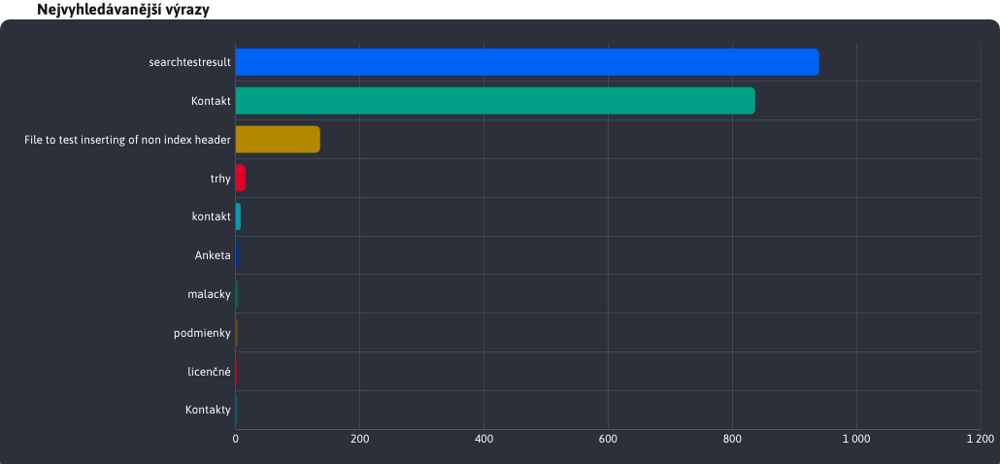
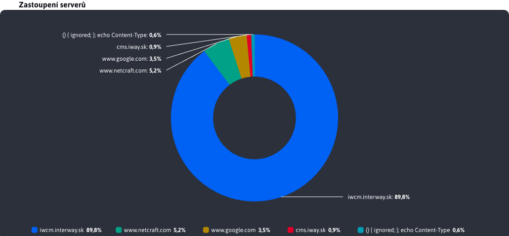
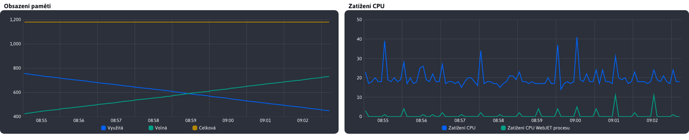

# Graf BAR

Typ grafu **BAR** je vytvořena instancí třídy `BarChartForm`.

```javascript
export class BarChartForm {
    constructor(yAxeName, xAxeName, chartTitle, chartDivId, chartData) {
        this.yAxeName = yAxeName;
        this.xAxeName = xAxeName;
        this.chartTitle = chartTitle;
        this.chartDivId = chartDivId;
        this.chartData = chartData;
        this.chart = undefined;
    }
}
```

Parametry jednotlivých tříd slouží k :
- `yAxeName`, textová hodnota představující název proměnné v objektu, který uchovává textovou hodnotu osy Y (představující kategorii).
- `xAxeName`, textová hodnota představující název proměnné v objektu, která uchovává číselnou hodnotu osy X (představující hodnotu kategorie).
- `chartTitle`, textová hodnota představující název, který se zobrazí jako záhlaví nad grafem.
- `chartDivId`, textová hodnota představující ID divu prvku pro zobrazení vygenerovaného grafu.
- `chartData`, pole objektů, které reprezentují data grafu. Každý objekt musí obsahovat proměnnou kategorie (yAxeName) a proměnnou hodnoty kategorie(xAxeName).
- `chart`, graf představuje náš graf, který bude automaticky uložen v parametru této třídy při jejím vytvoření.

Příklad použití BAR grafu

```javascript
    $.ajax({url: getUrl(ChartTools.ChartType.Bar), success: function(result) {

        barChartQueries = new ChartTools.BarChartForm("queryName", "queryCount", '[[#{stat.graph.searchQueriesBars}]]', "searchEngines-barQueries", result['content']);

        ChartTools.createAmchart(barChartQueries);
    }});
```

Výsledný vygenerovaný graf s názvem



# Graf PIE

Typ grafu **PIE** je vytvořena instancí třídy `PieChartForm`.

```javascript
export class PieChartForm {
    constructor(yAxeName, xAxeName, chartTitle, chartDivId, chartData) {
        this.yAxeName = yAxeName;
        this.xAxeName = xAxeName;
        this.chartTitle = chartTitle;
        this.chartDivId = chartDivId;
        this.chartData = chartData;
        this.chart = undefined;
        this.chartLegend = undefined;
    }
}
```

Parametry jednotlivých tříd slouží k :
- `yAxeName`, textová hodnota představující název proměnné v objektu, která uchovává číselnou hodnotu kategorie.
- `xAxeName`, textová hodnota představující název proměnné v objektu, která uchovává textovou hodnotu představující kategorii.
- `chartTitle`, textová hodnota představující název, který se zobrazí jako záhlaví nad grafem.
- `chartDivId`, textová hodnota představující ID divu prvku pro zobrazení vygenerovaného grafu.
- `chartData`, pole objektů, které reprezentují data grafu. Každý objekt musí obsahovat proměnnou kategorie (xAxeName) a proměnnou hodnoty kategorie(yAxeName).
- `chart`, graf představuje náš graf, který bude automaticky uložen v parametru této třídy při jejím vytvoření.
- `chartLegend`, chartLegend představuje nastavenou legendu grafu. Nenastavuje ji uživatel, nastavuje se automaticky a je potřeba ji nastavit na pozadí při aktualizaci grafu.

Příklad použití grafu PIE

```javascript
    $.ajax({url: getGraphUrl(), success: function(result) {

        pieChartVisits = new ChartTools.PieChartForm("visits", "serverName", '[[#{stat.referer.pieChart}]]', "referer-pieReferer", result['content']);

        ChartTools.createAmchart(pieChartVisits);
    }});
```

Výsledný vygenerovaný graf s názvem



# Graf LINE

Typ grafu **LINE** je vytvořena instancí třídy `LineChartForm`. V porovnání s grafy jako BAR a PIE je jedinečný svou schopností zobrazit více různých hodnot pro více datových souborů. Právě tato schopnost LINE grafu vyžaduje také speciální vstupní a konfigurační hodnoty, které jsou popsány v následujících podkapitolách.

```javascript
export class LineChartForm {
    constructor(yAxeNames, xAxeName, chartTitle, chartDivId, chartData, dateType) {
        this.yAxeNames = yAxeNames;
        this.xAxeName = xAxeName;
        this.chartTitle = chartTitle;
        this.chartDivId = chartDivId;
        this.chartData = chartData;
        this.dateType = dateType;
        this.chart = undefined;
    }
}
```

Parametry jednotlivých tříd slouží k :
- `yAxeName`, (podrobněji popsáno v samostatné podkapitole).
- `xAxeName`, textová hodnota představující název proměnné v objektu, která uchovává číselnou hodnotu osy Y (zaznamenanou hodnotu).
- `chartTitle`, textová hodnota představující název, který se zobrazí jako záhlaví nad grafem.
- `chartDivId`, textová hodnota představující ID divu prvku pro zobrazení vygenerovaného grafu.
- `chartData`, (podrobněji popsáno v samostatné podkapitole).
- `dateType`, (podrobněji popsáno v samostatné podkapitole).
- `chart`, graf představuje náš graf, který bude automaticky uložen v parametru této třídy při jejím vytvoření.

Příklad použití liniového grafu

```javascript
    let yAxeNames =
        ChartTools.getLineChartYAxeNameObjs(
            ["visits", "sessions", "uniqueUsers"],
            ["stat.visits.js", "stat.sessions.js", "stat.unique_users.js"]
        );

    await $.ajax({url: getGraphUrl(), success: function(result) {

        lineChartVisits = new ChartTools.LineChartForm(yAxeNames, "dayDate", '[[#{stat.top.lineChart}]]', "stat-lineVisits", convertData(result['content']), ChartTools.DateType.Days);

        ChartTools.createAmchart(lineChartVisits);
    }});
```

Výsledný vygenerovaný graf s názvem


## Parametr yAxeName

Jak je vidět z příkladu použití, parametr **yAxeName** má výrazně odlišný tvar než grafy PIE a BAR, kde se jedná pouze o textovou hodnotu. Rozdíl spočívá v možnosti LINE grafu zobrazit více číselných parametrů z datové sady jako samostatné řádky. Chcete-li vygenerovat správný tvar **yAxeName** používáme funkci ready `getLineChartYAxeNameObjs()` ze souboru [chart-tools.js](../../../../../src/main/webapp/admin/v9/src/js/libs/chart/chart-tools.js). Jak tato funkce funguje, není důležité. Zajímá nás pouze to, že vstupní parametry se skládají ze 2 polí s textovými hodnotami.

První pole obsahuje název parametrů datového objektu pro graf, které představují některé číselné hodnoty, jež chceme v grafu zobrazit jako samostatné řádky. Druhé pole obsahuje překladové klíče, které se mapují na názvy parametrů ve stejném pořadí a představují daný řádek grafu v legendě grafu.

Příklad tohoto použití jsme viděli v předchozí kapitole. Vidíme, že chceme zobrazit 3 číselné parametry, a to `visits`, `sessions` a `uniqueUsers`. Na přiloženém obrázku vidíme 3 vygenerované čáry představující tyto parametry a v legendě grafu můžeme místo názvu parametru vidět např. `visits` textová hodnota **Videnia** který byl získán z klíče překladu `stat.visits.js` (klika byla přiřazena k parametru, protože se nacházela na stejných místech v polích).

```javascript
    let yAxeNames =
        ChartTools.getLineChartYAxeNameObjs(
            ["visits", "sessions", "uniqueUsers"],
            ["stat.visits.js", "stat.sessions.js", "stat.unique_users.js"]
        );
```

Překladové klíče (některé nebo všechny) samozřejmě nejsou povinné a mohou být nahrazeny hodnotou `undefined`. !! V obou polích však musí být zachován stejný počet parametrů, i když se jedná pouze o jeden. `undefined` Hodnoty.

Příklad použití `getLineChartYAxeNameObjs` s prázdnou hodnotou překladového klíče.

```javascript
    let yAxeNames = ChartTools.getLineChartYAxeNameObjs(["visits"], [undefined]);
```

## Parametr chartData

V případě grafu LINE mají data specifický formát mapy obsahující listy objektů, přičemž každý prvek mapy (listu objektu) představuje jinou sadu dat. Z těchto objektů v listu můžeme v grafu zobrazit 1 nebo více číselných hodnot jako samostatné řádky. Při zobrazení těchto dat pomocí liniového grafu mohou nastat 3 různé situace.

```java
Map<List<T>>
```

### 1 soubor dat a 1 parametr

1  datová sada znamená, že mapa obsahuje pouze jeden prvek reprezentovaný listem objektů. Parametr **yAxeName** obsahuje pouze 1 prvek, což znamená, že výsledný graf LINE zobrazí pouze 1 čáru, jejíž identifikační název v legendě grafu bude reprezentován překladovým klíčem z parametru **yAxeName**.

### 1 soubor dat o N parametrech

1  datová sada znamená, že mapa obsahuje pouze jeden prvek reprezentovaný listem objektů. Parametr **yAxeName** obsahuje N prvků, což znamená, že výsledný graf LINE zobrazí N čar, jejichž identifikační název v legendě grafu bude reprezentován překladovými klíči z parametru **yAxeName**. Jedná se tedy o více číselných parametrů ze stejné datové řady.

Tento typ grafu jsme viděli v ukázkovém grafu dříve v této kapitole.

### M datových souborů o 1 parametru

M datových sad znamená, že mapa obsahuje M prvků reprezentovaných jako seznamy objektů. Parametr **yAxeName** obsahuje pouze 1 prvek, což znamená, že výsledný graf LINE bude zobrazovat M linií, jejichž identifikační název v legendě grafu bude reprezentován klíčem z mapy. Tento klíč označoval jednotlivé datové sady. Ve výsledném grafu bude zobrazen stejný číselný parametr (např. návštěvy), ale pro několik různých datových sad.

### M souborů dat N parametrů

Tento případ je kombinací předchozích. Výsledkem je, že graf bude obsahovat M \* N řádků, jejichž identifikační název v legendě grafu bude představovat kombinaci mapového klíče (identifikátoru datové sady) přes pomlčku ("-") spojenou s hodnotou překladového klíče z parametru **yAxeName**. V důsledku toho se v grafu zobrazí několik číselných hodnot pro několik různých datových listů (datových sad).

## Parametr dateType

Posledním speciálním parametrem grafu LINE je **dateType**. Vzhledem k tomu, že osa X grafu je datová osa, je třeba tuto osu správně granulovat. To znamená, že pokud osa X grafu zobrazuje interval 1 rok a hodnoty data jsou od sebe vzdáleny 1 týden, chceme, aby granularita byla nastavena na týdny s krokem 1. V jiném případě, pokud osa X grafu zobrazuje interval několika dnů a hodnoty data jsou od sebe vzdáleny 5 minut, plánujeme osu X grafu nastavit na granularitu minut s krokem 5.

Pro nastavení granularity použijeme poskytnutý výčet `DateType` ze souboru [chart-tools.js](../../../../../src/main/webapp/admin/v9/src/js/libs/chart/chart-tools.js).

Hodnota **DateType.Auto** je nastaveno, pokud chceme ponechat nastavení granularity na přednastavené logice (která je v souboru chart-tools.js). Ta kromě výběru správné hodnoty granularity nastaví také nejlepší krok, který bude odpovídat datům grafu.

Hodnota **DateType.Day\_1** je speciální hodnota, která se používá v případech, kdy je nutné nastavit rozsah přesně na 1 den. V tomto případě se parametr označený jako **xAxeName** (představující hodnotu data) a parametr `hour` které musí být obsaženy v údajích pro graf v číselném formátu v rozsahu 0-23 (což představuje celé hodiny dne).

Stále může nastat situace jako v případě stránky **Doprava** ze sekce statistik, kde jsou data pro graf LINE na BackEnd speciálně granulována podle zadaného shlukování. To znamená, že automatická granulace nastavená pomocí **DateType.Auto** nebude fungovat, protože i když je interval nastaven na 3 roky, data budou stále granulovaná po dnech. Pro tento případ se použije výčet `DateType` nabízí také možnost ručního nastavení granulace na hodnoty :
- `DateType.Seconds`
- `DateType.Minutes`
- `DateType.Hours`
- `DateType.Days`
- `DateType.Weeks`
- `DateType.Months`

V případě ručního nastavení granulace logika kolem grafu počítá pouze krok, ale nastavenou granulaci zachovává, i když je nastavena nesprávně. Při ručním nastavování granulace je třeba dbát zvýšené opatrnosti, protože nastavení větší hodnoty, než je nutné, začne graf zkreslovat a nastavení menší hodnoty, než je nutné, poškodí operaci. `Tooltip` logika.

# Speciální (LIVE) grafy

Zmíníme se také o speciálních grafech, které se používají v oddílech `Monitorovanie servera - Aktuálne hodnoty`. Jedná se o speciální grafy typu LINE, které se mohou automaticky aktualizovat. Tyto grafy a logika, která je ovládá, jsou pro tuto stránku pevně stanoveny a nelze je znovu použít na jiných stránkách. Implementované použití je v souboru [vue-amchart-monitoring-server.vue](../../../../../src/main/webapp/admin/v9/src/vue/components/webjet-server-monitoring/components/vue-amchart-monitoring-server.vue).

K vytvoření grafů se opět použije logika zadaná v souboru. [chart-tools.js](../../../../../src/main/webapp/admin/v9/src/js/libs/chart/chart-tools.js) a je funkcí `createServerMonitoringChart()`. Jeho vstupními parametry jsou pouze id prvku div, ve kterém bude graf zobrazen, a textová hodnota typu grafu. Podporovaný typ je `memoryAmchart` a `cpuAmchart`.

Příklad vytváření monitorovacích grafů

```javascript
    if(this.type == "memoryAmchart") {
        ChartTools.createServerMonitoringChart("serverMonitoring-lineChartMemory", this.type).then((chart) => {
            this.chart = chart;
        });
    } else if(this.type == "cpuAmchart") {
        ChartTools.createServerMonitoringChart("serverMonitoring-lineChartCpu", this.type).then((chart) => {
            this.chart = chart;
        });
    }
```

Aktualizace hodnot těchto grafů se provádí pomocí funkce `addData()` ze souboru `chart-tools.js`, jejíž vstupní parametry jsou :
- `allSeries`, všechny řady (čáry) grafu lze získat z instance grafu
- `xAxis`, osu X grafu, lze získat z instance grafu
- `data`, nové údaje, které se přidají ke stávajícím údajům
- `type`, textový datový typ, který byl uveden při vytváření grafu.

Příklad aktualizace monitorovacího grafu

```javascript
    ChartTools.addData(this.chart.series.values, this.chart.xAxes.values[0],  this.chartData, this.type);
```

V tomto případě záleží na tom, jak jsme získali instanci grafu ze serveru `allSeries` a `xAxis`.

Náhled obou grafů LIVE pro aplikaci `Monitorovanie servera - Aktuálne hodnoty` také s vygenerovanými nadpisy


