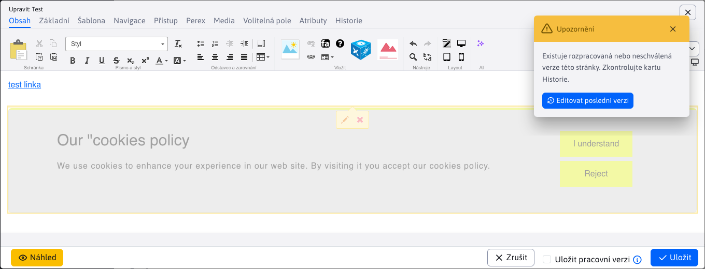

# Funkce WebJET v jazyce JavaScript

WebJET zapouzdřuje rozhraní API knihoven používaných v souboru webjet.js. Cílem není používat volání API knihoven přímo, ale zapouzdřit tato volání prostřednictvím našich funkcí. To nám umožní případně nahradit použitou knihovnu, aniž bychom měnili API.

<!-- @import "[TOC]" {cmd="toc" depthFrom=1 depthTo=6 orderedList=false} -->

<!-- code_chunk_output -->
- [Funkce WebJET v jazyce JavaScript](#Funkce-webjet-javascript)
  - [Oznámení](#oznámení)
  - [Potvrzení akce](#potvrzení-akce)
  - [Získání hodnoty](#získání-hodnoty)
  - [Formátování data a času](#formátování-data-a-času)
  - [Dialog Iframe](#dialog-iframe)
  - [Dialog pro výběr souboru/odkazu](#dialog-pro-výběr-odkazu-na-soubor)
  - [Udržování připojení k serveru (opakování)](#udržování-spojení-se-serverem-refresher)
  - [Navigační panel](#navigační-panel)
  - [Kontrola práv](#kontrola-práv)
  - [Markdown parser](#markdown-parser)
  - [Trvalé uživatelské nastavení](#nastavení-trvalého-uživatele)
    - [Použití na frontend](#použití-na-frontend)
    - [Použití na backendu](#použití-na-backendu)
  - [Animace načítání](#animace-načítání)
  - [Další funkce](#další-funkce)

<!-- /code_chunk_output -->

## Oznámení

Pro oznámení používáme knihovnu [toastr](https://github.com/CodeSeven/toastr), jsou připraveny následující funkce JS:

**WJ.notify(type, title, text, timeOut = 0, buttons = null, appendToExisting=false)** - zobrazí oznámení o přípitku (ekvivalentní `window.alert`), parametry:
- `type` (String) - typ zobrazovaného oznámení, možnosti: `success, info, warning, error`
- `title` (String) - název zobrazeného oznámení
- `text` (String) - text zobrazeného oznámení, nepovinné
- `timeout` (int) - doba, po které bude oznámení skryto, nepovinné, hodnota 0 znamená, že oznámení bude zobrazeno, dokud jej uživatel nezavře.
- `buttons` (json) - pole tlačítek zobrazených pod textem oznámení
- `appendToExisting` (boolean) - po nastavení na `true` je text přidaný ke stávajícímu oznámení stejného typu. Pokud ještě neexistuje, vytvoří se nové oznámení.

K dispozici jsou také zkrácené verze, které doporučujeme používat:
- `WJ.notifySuccess(title, text, timeOut=0, buttons=null)`
- `WJ.notifyInfo(title, text, timeOut=0, buttons=null)`
- `WJ.notifyWarning(title, text, timeOut=0, buttons=null)`
- `WJ.notifyError(title, text, timeOut=0, buttons=null)`

Požadovaný je parametr `title`, ostatní jsou nepovinné.



Příklady:

```javascript
//zobrazenie chybovej spravy
WJ.notifyError("Zvoľte si riadky na vykonanie akcie");

//zobrazenie chybovej spravy, ktora sa po 5 sekundach schova
WJ.notifyError("Vyberte adresár", null, 5000);

//zobrazenie chybovej spravy s doplnkovym textom a HTML kódom
WJ.notifyError('Nepodarilo sa to', 'Skúste to <strong>neskôr</strong>');
```

V tabulce dat můžete odeslat [oznámení serveru](../datatables-editor/notify.md).

Pokud potřebujete zobrazit tlačítko, zadejte jej jako pole JSON:

```javascript
[
    {
        "title":"Editovať poslednú verziu", //text tlacidla
        "cssClass":"btn btn-primary", //CSS trieda
        "icon":"ti ti-pencil", //Tabler ikona
        "click":"editFromHistory(38, 33464)" //onclick funkcia
    }
]
```

Hodnota v `click` je nastaven přímo na `onclick` atribut tlačítka, neměl by obsahovat znak ", doporučujeme volat pouze příslušnou JS funkci.

## Potvrzení akce

Potvrzení akce (ekvivalentní `window.confirm` kde po kliknutí na OK/Potvrdit mohu provést vybranou akci) je připravena funkce JS `WJ.confirm(options)`. V `options` objekt může mít následující parametry:
- `title` (String) - název zobrazené otázky
- `message` (String) - text zobrazené otázky
- `btnCancelText` (String) - text zobrazený na tlačítku zrušit (výchozí Cancel)
- `btnOkText` (String) - text zobrazený na tlačítku pro potvrzení akce (ve výchozím nastavení Confirm)
- `success` (funkce) - funkce, která se provede po potvrzení akce.
- `cancel` (funkce) - funkce, která se provede po zrušení akce.

Příklady použití:

```javascript
WJ.confirm({
    title: "Skutočne chcete zmazať údaje?",
    success: function() {
        console.log("deleting data...");
    }
});
```

## Získání hodnoty

Pro získání hodnoty (ekvivalentní `window.prompt` kde je nutné zadat hodnotu do dialogu) je připravena funkce `WJ.propmpt(options)`. V `options` objektu je možné zadat stejné hodnoty jako u objektu [potvrzení akce](#potvrzení-akce).

Příklad použití:

```javascript
WJ.confirm({
    title: "Zadajte hodnotu",
    success: function(value) {
        console.log("Zadana hodnota: ", value);
    }
});
```

## Formátování data a času

Pro jednotné formátování data a času jsou k dispozici následující funkce:
- `WJ.formatDate(timestamp)` - zformátuje zadaný `timestamp` jako datum
- `WJ.formatDateTime(timestamp)` - zformátuje zadaný `timestamp` jako datum a čas (hodiny:minuty)
- `WJ.formatDateTimeSeconds(timestamp)` - zformátuje zadaný `timestamp` jako datum a čas včetně sekund
- `WJ.formatTime(timestamp)` - zformátuje zadaný `timestamp` jako čas (hodiny:minuty)
- `WJ.formatTimeSeconds(timestamp)` - zformátuje zadaný `timestamp` jako čas včetně sekund

## Dialog Iframe

Použití volání `WJ.openIframeModal(options)` je možné otevřít dialogové okno s iframe zadané adresy URL. Neotevře se `popup` okno, ale dialogové okno přímo na stránce. V `options` objekt může mít následující parametry:
- `url` = adresa URL vloženého rámce iframe
- `width` = šířka okna
- `height` = výška vloženého iframe (modal bude o jednu hlavičku a patičku vyšší).
- `title` = titulek okna
- `buttonTitleKey` = překladový klíč textu na primárním tlačítku pro uložení (ve výchozím nastavení je klíč `button.submit` - Potvrzení)
- `closeButtonPosition` = poloha tlačítka pro zavření okna
  - `prázdna hodnota` - Ikona X v záhlaví okna
  - `close-button-over` - ikona X v záhlaví, ale nad obsahem okna (nevytvoří samostatný řádek).
  - přidáním `nopadding`, např. `closeButtonPosition: "close-button-over nopadding"` horní odrážka v záhlaví je také odstraněna.
- `okclick` = zpětné volání po kliknutí na potvrzovací tlačítko, neobsahuje žádné parametry, v implementaci zpětného volání je třeba vytáhnout hodnotu z iframe.
- `onload` = zpětné volání po načtení okna, jako parametr obdrží `event.detail` obsahující objekt `window` s odkazem na okno v iframe.

Dialogové okno má vlastní tlačítko pro zavření, v případě potřeby lze použít volání API. `WJ.closeIframeModal()` zavřít okno.

Pro okna obsahující datovou tabulku existuje funkce `openIframeModalDatatable(options)` který nastavuje funkce `okclick` a `onload` pro volání uložení a správné zavření okna po uložení záznamu v tabulce dat.

**Poznámky k implementaci**

Kód HTML dialogu je staticky vložen do souboru [iframe.pug](../../../../src/main/webapp/admin/v9/views/modals/iframe.pug) a odkaz na stránku v [layout.pug](../../../../src/main/webapp/admin/v9/views/partials/layout.pug). Rám iframe je tak opakovaně používán pro různé dialogy. V proměnné `modalIframe` je odkaz na instanci dialogu.

Problematické bylo použití dialogu v editoru datových tabulek, který je sám o sobě dialogem. Modal-backdrop neměl nastavený příslušný z-index a nacházel se za oknem editoru, takže byl špatně umístěn (nepřekrýval editor). Proto jsme při otevření iframe dialogu nastavili. `.modal-backdrop` Třída CSS `modalIframeShown` který správně nastaví `z-index` na prvcích pozadí.

## Dialog pro výběr souboru/odkazu

Snadné použití zobrazení dialogového okna pro výběr odkazu na soubor/obrázek/stránku (otevřít) `elfinder` dialogového okna) lze použít funkce:
- `WJ.openElFinder(options)` - otevře dialogové okno s nastavením, které se používá pro dialogové okno Iframe (kromě url, která se nastaví automaticky).
- `WJ.openElFinderButton(button)` - po kliknutí na tlačítko otevře dialogové okno. `button`. V rodičovském prvku `div.input-group` automaticky vyhledá vstupní pole formuláře a pomocí něj získá aktuální hodnotu a po výběru ji nastaví. Podle prvku `label.col-form-label` nastaví titulek okna.

Příklad použití `WJ.openElFinder`:

```javascript
WJ.openElFinder({
    link: conf._input.val(),
    title: conf.label,
    okclick: function(link) {
        //console.log("OK click");
        setValue(conf, link);
    }
});
```

Příklad kódu HTML pro použití `onclick="WJ.openElFinderButton(this);"`:

```html
<div class="input-group">
  <div class="input-group-prepend">
    <span class="input-group-text has-image" style="background-image: url(/images/investicny-vklad/business-3175110_960_720.jpg);">
      <i class="ti ti-photo"></i>
    </span>
  </div>
  <input id="DTE_Field_fieldE" maxlength="255" data-warninglength="" data-warningmessage="" value="/images/investicny-vklad/business-3175110_960_720.jpg" class="form-control" type="text">
  <div class="input-group-append">
    <button class="btn btn-outline-secondary" type="button" onclick="WJ.openElFinderButton(this);">
      <i class="ti ti-pencil"></i>
    </button>
  </div>
</div>
```

## Udržování připojení k serveru (opakování)

Aby nedošlo k vypršení přihlášení uživatele (např. při dlouhodobé editaci webové stránky), je služba REST volána v minutových intervalech. `/admin/rest/refresher`. Udržuje relaci a také kontroluje nové zprávy pro správce. Pokud se objeví nové zprávy, zobrazí se vyskakovací okno.

K dispozici jsou následující funkce:
- `keepSession()` - inicializační funkce, která spustí časovač volání služby REST.
- `keepSessionShowLogoffMessage()` - zobrazí chybovou zprávu při přerušení spojení se serverem a zajistí, aby se zpráva nezobrazovala vícekrát. Po 5 minutách dojde k přesměrování na přihlášení.
- `keepSessionShowTokenMessage(errorMessage)` - zobrazí chybovou zprávu pro nesprávný token CSRF a zajistí, aby se zpráva nezobrazovala vícekrát.

**Poznámky k implementaci**

Chybová hlášení se zobrazují prostřednictvím knihovny toastr v samostatném kontejneru. `toast-container-logoff` v horní části obrazovky. Používají `window` objekty na ochranu proti vícenásobnému hlášení.

Inicializace časovače je spuštěna z [app-init.js](../../../src/main/webapp/admin/v9/src/js/app-init.js) voláním funkce `WJ.keepSession();`.

Ochrana pro tokeny CSRF a připojení k serveru je nastavena navíc k časovači v položce [head.pug](../../../src/main/webapp/admin/v9/views/partials/head.pug) v nastavení ajaxového volání pomocí funkce `$.ajaxSetup`. Pro chybu HTTP se stavem 401 se volá funkce `WJ.keepSessionShowLogoffMessage()`, pro funkci error 403 `WJ.keepSessionShowTokenMessage(errorMessage)`.

## Navigační panel

Na navigačním panelu se obvykle zobrazuje název stránky. Někdy však může obsahovat také název aplikace, pokud se jedná o aplikaci, která má více podstránek (např. GDPR nebo Statistiky).

Při generování stránky z `pug` souboru je použit mixin `+breadcrumb`, se standardní stránkou aplikace v `/apps/` adresář, ale navigační panel musí být vygenerován voláním funkce JS `JS.breadcrumb`, který jako parametr obdrží konfigurační objekt JSON ve formátu:

```javascript
{
    id: "regexp",
    tabs: [
        {
            url: '/apps/gdpr/admin/',
            title: '[[#{components.gdpr.menu}]]',
            active: false
        },
        {
            url: '/apps/gdpr/admin/regexps/',
            title: '[[#{components.gdpr.regexp.title}]]'
        }
    ],
    backlink: {
        url: "#/",
        title: WJ.translate('forms.formsList.js'),
    },
    showInIframe: false
}
```

Kde:
- `id` - jedinečný identifikátor
- `tabs` - pole zobrazených položek navigačního panelu
  - `url` - adresa stránky po kliknutí na položku.
  - `title` - název položky
  - `active` - (nepovinné) pokud false, zobrazí se jako neaktivní možnost - používá se pro podstránky aplikace, kde první položka odkazuje na domovskou/hlavní stránku aplikace.
- `backlink` - (nepovinné) odkaz na předchozí stránku (používá se v položce `master-detail` zobrazení, např. v detailu formuláře odkaz na seznam formulářů).
- `showInIframe` - (nepovinné), pokud je nastaveno na `true`, nebo je na kartách atribut s hodnotou `title: '{filter}'` záhlaví se zobrazuje také v `iframe` prvek - obvykle ve vlastnostech aplikace v editoru stránky

Současně nadpis položky, která jako první nemá atribut `active: false` je nastaven jako název webové stránky (atribut `title` html kód stránky).

**Výběr jazyka displeje**

V některých případech je nutné zobrazit data v datové tabulce podle zvoleného jazyka (nikoli podle jazyka aktuálně přihlášeného správce). Příkladem může být aplikace GDPR->Cookie Manager, kde jsou jednotlivé `cookies` můžete nastavit popisy pro různé jazyky.


Navigační panel umožňuje vložit výběr jazyka přímo do něj pomocí makra. `{LANGUAGE-SELECT}`:

```javascript
WJ.breadcrumb({
    id: "regexp",
    tabs: [
        {
            url: '/apps/gdpr/admin/',
            title: '[[#{components.gdpr.menu}]]',
            active: false
        },
        {
            url: '/apps/gdpr/admin/',
            title: '[[#{components.cookies.cookie_manager}]]'
        },
        {
            url: '#translation-keys-language',
            title: '{LANGUAGE-SELECT}',
            active: false
        }
    ]
})
```

do navigačního panelu se dynamicky vloží výběrové pole se seznamem jazyků s `id=breadcrumbLanguageSelect`. Na změnu jazyka pak můžete reagovat nastavením adres URL pro služby REST:

```javascript
$("#breadcrumbLanguageSelect").change(function() {
    let lng = $(this).val();
    //console.log("Select changed, language=", lng);
    url = "/admin/rest/cookies?breadcrumbLanguage="+lng;
    cookiesDataTable.ajax.url(url);
    cookiesDataTable.EDITOR.s.ajax.url = WJ.urlAddPath(url, '/editor');
    cookiesDataTable.ajax.reload();
});
```

V rozhraní REST získáte jazyk pomocí parametru URL. `breadcrumbLanguage`:

```java
@Override
public CookieManagerBean getOneItem(long id) {

    CookieManagerDB cookieMangerDB = new CookieManagerDB();

    String language = getRequest().getParameter("breadcrumbLanguage");
    Prop prop = Prop.getInstance(language);

    CookieManagerBean entity;

    if(id != -1) {
        entity = cookieMangerDB.getById((int) id);
        setTranslationKeysIntoEntity(entity, prop);
    } else {
        entity = new CookieManagerBean();
    }

    return entity;
}
```

**Vložení značky pro externí filtr**

Pokud potřebujete mít na navigačním panelu externí filtr, můžete použít značku jako titulek. `{TEXT}`. Pokud titulek začíná znakem `{` je vložen text zabalený do kontejneru DIV. Ten pak lze použít k přesunu [externí filtr](../datatables/README.md#externí-filtr) například v aplikaci GDPR/Vyhledávání.


```html
<script>
    var searchDataTable;

    window.domReady.add(function () {

        WJ.breadcrumb({
            id: "regexpsearch",
            tabs: [
                {
                    url: '/apps/gdpr/admin/',
                    title: '[[#{components.gdpr.menu}]]',
                    active: false
                },
                {
                    url: '/apps/gdpr/admin/search/',
                    title: '[[#{components.gdpr.list}]]'
                },
                {
                    url: '#value',
                    title: '{filter}',
                    active: false
                }
            ]
        });

        ...

        $("#searchDataTable_extfilter").on("click", "button.filtrujem", function() {
            //umele vyvolanie reloadu, kedze je zapnute klientske strankovanie/filtrovanie
            searchDataTable.ajax.reload();
        });
    });
</script>

<div id="searchDataTable_extfilter">
    <div class="row datatableInit">
        <div class="col-auto dt-extfilter-title-value"></div>
        <div class="col-auto dt-extfilter dt-extfilter-value"></div>
    </div>
</div>
```

Pro [zvýraznění položky nabídky](../../custom-apps/admin-menu-item/README.md#frontend) v `master-detail` stránky mohou používat funkci `WJ.selectMenuItem(href)`.

## Kontrola práv

Při zobrazení webové stránky se vygeneruje objekt. `window.nopermsJavascript` se seznamem práv, která uživatel nemá povolena. Nikdy nepoužívejte toto pole přímo, ke kontrole práv použijte volání API:
- `WJ.hasPermission(permission)` - návraty `true` pokud má aktuálně přihlášený uživatel právo `permission`. V opačném případě vrátí false.

## Markdown parser

Funkce `parseMarkdown(markdownText, options)` umožňuje převést základní formát Markdown do kódu HTML. Podporovány jsou následující značky:
- `#, ##, ###` - nadpisy 1-3 (`h1-h3`)
- `> text` - značka `blockquote`
- `**text**` - tučné písmo
- `*text*` - kurzíva
- ` ` - obrázek s alternativním textem
- `[stranka.html](nazov) ` - odkaz na jinou stránku (vyžaduje nastavení ` options { link: true }`)
- `- odrazka` - nečíslovaný seznam
- `` \`text\` `` - blok kódu v textu, zabalený do `<span class="code-inline">`
- `` \`\`\`text\`\`\` `` - blok kódu na více řádcích, zabalený do `<div class="code">`
- ` ` - obrázek

Funkce obsahuje parametry:
- `markdownText` - text ve formátu Markdown
- `options` - volitelná nastavení
  - `link` - ve výchozím nastavení se odkazy do generovaného kódu HTML nevkládají, nastavením na hodnotu `true` je zapnuto vkládání odkazů
  - `badge` - nastavením na hodnotu `true` první slovo před znakem pomlčky v nečíslovaném seznamu bude zabaleno do znaku `<span class="badge bg-secondary">`
  - `imgSrcPrefix` - URL adresa předpony pro obrázek (název domény), pokud je obrázek načten z jiné domény, použije se stejná předpona pro odkazy.

Příklad použití:

```javascript
let tooltipText = WJ.parseMarkdown("Meno priečinka v URL adrese web stránok.\nZadajte **prázdnu hodnotu** pre automatické nastavenie podľa **názvu priečinku**.");
```

## Trvalé uživatelské nastavení

Pokud potřebujete uložit některá uživatelská nastavení, můžete použít `window.localStorage` objekt. Bude však uložen pouze v prohlížeči. Pokud potřebujete, aby nastavení uživatele bylo ve všech prohlížečích stejné nebo aby bylo k dispozici na serveru, musíte použít objekt `UserDetails.adminSettings`, které jsou uloženy v databázové tabulce `user_settings_admin`. Jsou uloženy ve formátu klíč/hodnota, přičemž hodnota je často objekt JSON.

K dispozici jsou rozhraní API pro zpracování v jazyce JavaScript i na straně serveru.

**Oznámení**: neukládejte velké objekty do nastavení, nastavení je vloženo do kódu HTML administrace a velké objekty by neúměrně zvýšily objem přenášených dat.

### Použití na frontend

Pro práci je k dispozici rozhraní API:
- `WJ.getAdminSetting(key)` - vrátí řetězec nastavení uživatele se zadaným klíčem.
- `WJ.setAdminSetting(key, value)` - uloží zadanou hodnotu se zadaným klíčem do uživatelského nastavení.

Příklad použití:

```javascript
export class JstreeSettings {
    STORAGE_KEY = "jstreeSettings_web-pages-list";

    //ziska objekt nastaveni a vrati ho ako JSON
    getSettings() {
        let storeItem = window.WJ.getAdminSetting(this.STORAGE_KEY);
        if (typeof storeItem != "undefined") {
            return JSON.parse(storeItem);
        }
        return {}
    }

    //overi, ci JSON hodnota .showId je true
    isIdShow() {
        let show = (true === this.getSettings().showId);
        //console.log("isIdShow=", show);
        return show;
    }

    //ulozi nastavenia
    saveSettings() {
        //ziskaj zakladny objekt, ak neexistuje, je to prazdny objekt
        let settings = self.getSettings();
        //nastav hdonoty podla checkboxov
        settings.showId = $("#jstree-settings-showid").is(":checked");
        settings.showPriority = $("#jstree-settings-showorder").is(":checked");
        settings.showPages = $("#jstree-settings-showpages").is(":checked");

        //console.log("settings: ", settings);

        window.WJ.setAdminSetting(this.STORAGE_KEY, JSON.stringify(settings));
    }
}
```

### Použití na backendu

Třídu lze použít na backendu `AdminSettingsService` k získání údajů:

```java
AdminSettingsService ass = new AdminSettingsService(user);
boolean showPages = ass.getJsonBooleanValue("jstreeSettings_web-pages-list", "showPages");
```

Ukládání dat zajišťuje služba REST `/admin/rest/admin-settings/`:

```java
@RestController
@PreAuthorize("@WebjetSecurityService.isAdmin()")
public class AdminSettingsRestController {

   @PostMapping("/admin/rest/admin-settings/")
   public boolean save(@RequestBody LabelValue settings, final HttpServletRequest request) {
      Identity user = UsersDB.getCurrentUser(request);
      AdminSettingsService ass = new AdminSettingsService(user);
      boolean saveok = ass.saveSettings(settings.getLabel(), settings.getValue());
      return saveok;
   }

}
```

## Animace načítání

Pokud načítání stránky trvá déle (např. načítání grafů ve statistikách), je možné zobrazit animaci načítání. Pro zobrazení a skrytí animace je možné použít funkce v kódu JavaScriptu:

```javascript
//zobrazenie animacie
WJ.showLoader();
WJ.showLoader("text");

//schovanie animacie
WJ.hideLoader();
```

Pokud potřebujete blok během nahrávání skrýt, můžete nastavit jeho třídu CSS. `hide-while-loading`. Prvek se automaticky skryje, pokud je zobrazena nahrávací animace, a poté se zobrazí, když je skrytý.

```html
<div id="graphsDiv" class="hide-while-loading">
    <div id="visits" class="amcharts"></div>
</div>
```

## Další funkce

- `WJ.showHelpWindow()` - Vyvoláním se zobrazí okno nápovědy. Na základě aktuální adresy URL se pokusí otevřít odpovídající stránku nápovědy.
- `WJ.changeDomain(select)` - Vyvolá akci změny pro vybranou doménu. Používá se v záhlaví okna při instalaci více domén s externími soubory. V tomto režimu jsou soubory i data aplikace (např. bannery, skripty) vázány na vybranou doménu.
- `WJ.translate(key, ...params)` - Funkce na [překlad klíče do textu](jstranslate.md).
- `WJ.openPopupDialog(url, width, height)` - Otevře vyskakovací okno se zadanou adresou URL a zadanou velikostí okna, ale doporučujeme použít funkci [WJ.openIframeModal](#dialog-iframe) pokud je to možné
- `WJ.urlAddPath(url, pathAppend)` - Přidá cestu k (zbytkové) adrese URL, zkontroluje, zda v adrese URL není cesta. `?param` - Např. `WJ.urlAddPath('/admin/rest/tree?click=groups', '/list')` bude vytvořen `/admin/rest/tree/list?click=groups`.
- `WJ.urlAddParam(url, paramName, paramValue)` - Přidá parametr do adresy URL. Zkontroluje, zda se v adrese URL již nachází parametr, a přidá ? nebo \&amp;.
- `WJ.urlUpdateParam(url, paramName, paramValue)` - Aktualizuje zadaný parametr v adrese URL.
- `urlGetParam(name, queryString=null)` - získá hodnotu parametru v adrese URL. Pokud není zadána žádná hodnota `queryString` se získá z `window.location.search`.
- `WJ.setJsonProperty(obj, path, value)` - Nastaví (JSON) hodnotu v objektu podle zadaného názvu, akceptuje také vnořené objekty typu `editorFields.groupCopyDetails` (pokud `editorFields` ještě neexistuje, vytvoří se).
- `WJ.getJsonProperty(obj, path)` - Získá (JSON) hodnotu v objektu podle zadaného názvu, akceptuje také vnořené objekty typu `editorFields.groupCopyDetails`.
- `WJ.dispatchEvent(name, detail)` - Zvyšuje událost na `window` objekt zadaný názvem `name`. JSON objekt `detail` přidává jako `e.detail` objektu ke spuštěné události. Událost musí být vyslechnuta voláním typu `window.addEventListener("WJ.DTE.close", function() { console.log("HAHA, yes"); });`
- `WJ.htmlToText(htmlCode)` - Převede zadaný kód HTML na prostý text. Vytvoří skrytý `DIV` prvek, kterému nastaví kód HTML a poté z něj získá prostý text.
- `WJ.initTooltip($element)` - Inicializuje na zadaném prvku (nebo kolekci) jQuery `tooltip` s podporou MarkDown.
- `WJ.escapeHtml(string)` - Nahradí nebezpečné znaky v kódu HTML entitami pro jejich bezpečné vypsání.
