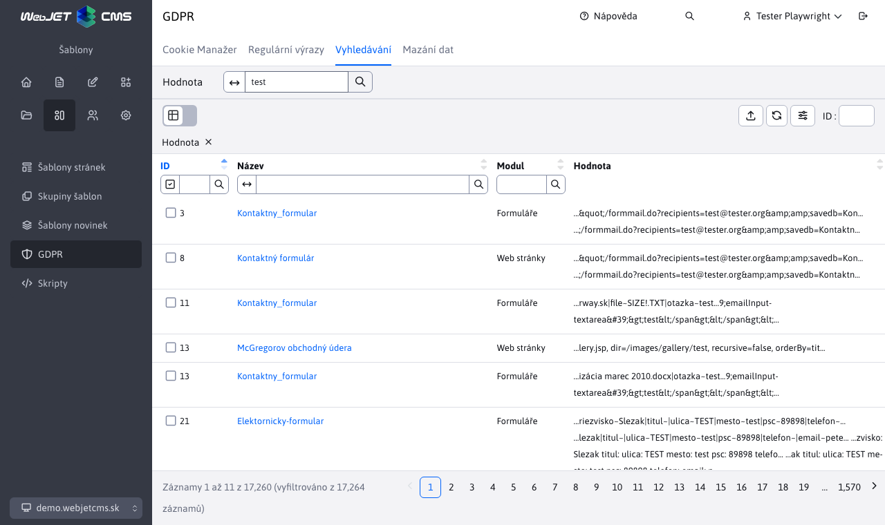

# WebJET JavaScript funkce

WebJET v souboru webjet.js zapouzdřuje API použitých knihoven. Cílem je, aby se nepoužívaly přímo API volání z knihoven, ale zapouzdřené volání přes naše funkce. Umožní nám to beze změny API případně vyměnit použitou knihovnu.

## Notifikace

Pro notifikace používáme knihovnu [toastr](https://github.com/CodeSeven/toastr), připraveny jsou následující JS funkce:

`WJ.notify(type, title, text, timeOut = 0, buttons = null, appendToExisting = false, containerId = null)` - zobrazí toast notifikaci (ekvivalent `window.alert`), parametry:
- `type` (String) - typ zobrazené notifikace, možnosti: `success, info, warning, error`
- `title` (String) - titulek zobrazené notifikace
- `text` (String) - text zobrazené notifikace, nepovinné
- `timeout` (int) - čas, po kterém se notifikace schová, nepovinné, hodnota 0 znamená, že se notifikace bude zobrazovat, dokud ji uživatel nezavře
- `buttons` (json) - pole tlačítek zobrazených pod textem notifikace
- `appendToExisting` (boolean) - po nastavení na `true` je text přidán do existující notifikace stejného typu. Pokud ještě neexistuje, vytvoří se nová notifikace.
- `containerId` (String) - CSS ID kontejneru, do kterého bude notifikace vložena.

Připraveny jsou i zkrácené verze, doporučujeme používat ty:
- `WJ.notifySuccess(title, text, timeOut=0, buttons=null)`
- `WJ.notifyInfo(title, text, timeOut=0, buttons=null)`
- `WJ.notifyWarning(title, text, timeOut=0, buttons=null)`
- `WJ.notifyError(title, text, timeOut=0, buttons=null)`

Povinný je parametr `title`, ostatní jsou nepovinné.


Příklady:

```javascript
//zobrazenie chybovej spravy
WJ.notifyError("Zvoľte si riadky na vykonanie akcie");

//zobrazenie chybovej spravy, ktora sa po 5 sekundach schova
WJ.notifyError("Vyberte adresár", null, 5000);

//zobrazenie chybovej spravy s doplnkovym textom a HTML kódom
WJ.notifyError('Nepodarilo sa to', 'Skúste to <strong>neskôr</strong>');
```

V datatabulce můžete posílat [notifikace ze serveru](../datatables-editor/notify.md).

Pokud potřebujete zobrazit tlačítko zadáte jej jako JSON pole:

```javascript
[
    {
        title: "Editovať poslednú verziu", //button title
        cssClass: "btn btn-primary", //button CSS class
        icon: "ti ti-pencil", //optional: Tabler icon
        click: "editFromHistory(38, 33464)", //onclick function
        closeOnClick: true //close toastr on button click, default true
    }
]
```

Hodnota v `click` se nastaví přímo na `onclick` atribute tlačítka, nesmí obsahovat znak ", doporučujeme jen volat vhodnou JS funkci.

## Potvrzení akce

Pro potvrzení akce (ekvivalent `window.confirm` kde kliknutím na OK/Potvrdit můžu provést zvolenou akci) je připravena JS funkce `WJ.confirm(options)`. V `options` objektu mohou být následující parametry:
- `title` (String) - titulek zobrazené otázky
- `message` (String) - text zobrazené otázky
- `btnCancelText` (String) - text zobrazený na tlačítku pro zrušení (výchozí Zrušit)
- `btnOkText` (String) - text zobrazený na tlačítku pro potvrzení akce (výchozí Potvrdit)
- `success` (funkce) - funkce, která se vykoná po potvrzení akce
- `cancel` (funkce) - funkce, která se vykoná po zrušení akce

Příklady použití:

```javascript
WJ.confirm({
    title: "Skutočne chcete zmazať údaje?",
    success: function() {
        console.log("deleting data...");
    }
});
```

## Získání hodnoty

Pro získání hodnoty (ekvivalent `window.prompt` kde je do dialogu třeba zadat hodnotu) je připravena funkce `WJ.propmpt(options)`. V `options` objektu lze zadat stejné hodnoty jako pro [potvrzení akce](#potvrzení-akce).

Příklad použití:

```javascript
WJ.confirm({
    title: "Zadajte hodnotu",
    success: function(value) {
        console.log("Zadana hodnota: ", value);
    }
});
```

## Formátování data a času

Pro unifikované formátování data a času jsou dostupné následující funkce:
- `WJ.formatDate(timestamp)` - naformátuje zadaný `timestamp` jako datum
- `WJ.formatDateTime(timestamp)` - naformátuje zadaný `timestamp` jako datum a čas (hodiny:minuty)
- `WJ.formatDateTimeSeconds(timestamp)` - naformátuje zadaný `timestamp` jako datum a čas včetně sekund
- `WJ.formatTime(timestamp)` - naformátuje zadaný `timestamp` jako čas (hodiny:minuty)
- `WJ.formatTimeSeconds(timestamp)` - naformátuje zadaný `timestamp` jako čas včetně vteřin

## Formátování čísel

Pro unifikované formátování čísel jsou dostupné následující funkce:
- `WJ.formatPrice(price)` - naformátuje zadané číslo jako menu zaokrouhlenou na 2 desetinná místa, příklad: `WJ.formatPrice(1089) - 1 089,00`.

## Iframe dialog

Pomocí volání `WJ.openIframeModal(options)` je možné otevřít dialogové okno s iframe zadané URL adresy. Neotevírá se tak `popup` okno, ale dialogové okno přímo ve stránce. V `options` objektu mohou být následující parametry:
- `url` = URL adresa vloženého iframe
- `width` = šířka okna
- `height` = výška vloženého iframe (modal bude o hlavičku a patičku vyšší)
- `title` = titulek okna
- `buttonTitleKey` = překladový klíč textu na primárním tlačítku pro uložení (výchozí klíč `button.submit` - Potvrdit)
- `closeButtonPosition` = pozice tlačítka pro zavření okna
  - `prázdna hodnota` - ikona X v hlavičce okna
  - `close-button-over` - ikona X v hlavičce ale přes obsah okna (nevytváří samostatný řádek)
  - přidáním `nopadding`, neboli například. `closeButtonPosition: "close-button-over nopadding"` se zruší i horní odsazení v hlavičce
- `okclick` = callback po kliknutí na tlačítko potvrdit, neobsahuje žádné parametry, hodnotu z iframe je třeba si vytáhnout v implementaci callbacku
- `onload` = callback po načtení okna, jak parametr dostane `event.detail` obsahující objekt `window` s odkazem na okno v iframu

Dialogové okno má vlastní tlačítko pro zavření, v případě potřeby lze využít API volání `WJ.closeIframeModal()` pro zavření okna.

Pro okna obsahující datatabulku existuje funkce `openIframeModalDatatable(options)` která nastavuje funkce `okclick` a `onload` pro volání uložení a korektní zavření okna po uložení záznamu v data tabulce. Nastavená výška je automaticky snížena podle velikosti okna.

**Poznámky k implementaci**

HTML kód dialogu je staticky vložen v souboru [iframe.pug](../../../../src/main/webapp/admin/v9/views/modals/iframe.pug) a linkované do stránky v [layout.pug](../../../../src/main/webapp/admin/v9/views/partials/layout.pug). Iframe se tedy opakovaně používá pro různé dialogy. V proměnné `modalIframe` je odkaz na instanci dialogu.

Problémové bylo použití dialogu v datatables editoru, který sám o sobě je dialog. Modal-backdrop neměl nastaven vhodný z-index a byl za oknem editoru, čili nekorektně poziciovaný (nepřekryl editor). Při otevření iframe dialogu proto nastavujeme na elementu `.modal-backdrop` CSS třídu `modalIframeShown`, která korektně nastavuje `z-index` na backdrop elementu.

## Dialog pro výběr souboru/odkazu

Pro snadné použití zobrazení dialogového okna výběru souboru/obrázku/odkazu na stránku (otevření `elfinder` dialogového okna) lze použít funkce:
- `WJ.openElFinder(options)` - otevře dialogové okno se zadanými nastaveními jak jsou použity pro Iframe dialog (kromě url, které je automaticky nastaveno).
- `WJ.openElFinderButton(button)` - otevře dialogové okno po kliknutí na tlačítko `button`. V rodičovském elementu `div.input-group` automaticky vyhledá formulářové vstupní pole a to použije pro získání aktuální hodnoty a její nastavení po výběru. Podle elementu `label.col-form-label` nastaví titulek okna.

Příklad použití `WJ.openElFinder`:

```javascript
WJ.openElFinder({
    link: conf._input.val(),
    title: conf.label,
    volumes: "images", //or link
    okclick: function(link) {
        //console.log("OK click");
        setValue(conf, link);
    }
});
```

Příklad HTML kódu pro použití `onclick="WJ.openElFinderButton(this);"`:

```html
<div class="input-group">
  <div class="input-group-prepend">
    <span class="input-group-text has-image" style="background-image: url(/images/investicny-vklad/business-3175110_960_720.jpg);">
      <i class="ti ti-photo"></i>
    </span>
  </div>
  <input id="DTE_Field_fieldE" maxlength="255" data-warninglength="" data-warningmessage="" value="/images/investicny-vklad/business-3175110_960_720.jpg" class="form-control" type="text">
  <div class="input-group-append">
    <button class="btn btn-outline-secondary" type="button" onclick="WJ.openElFinderButton(this);">
      <i class="ti ti-pencil"></i>
    </button>
  </div>
</div>
```

## Udržování spojení se serverem (refresher)

Aby nedocházelo k vypršení přihlášení uživatele (např. při dlouhé editaci web stránky) je v minutovém intervalu volána REST služba `/admin/rest/refresher`. Ta udrží session a zároveň kontroluje nové zprávy pro administrátora. Pokud existují nové zprávy zobrazí vyskakovací okno.

Dostupné jsou následující funkce:
- `keepSession()` - inicializační funkce, která spustí časovač volání REST služby.
- `keepSessionShowLogoffMessage()` - zobrazí chybové hlášení při přerušení spojení se serverem, zajistí, aby se hlášení nezobrazilo vícekrát. Po 5 minutách přesměruje na přihlášení.
- `keepSessionShowTokenMessage(errorMessage)` - zobrazí chybové hlášení při nesprávném CSRF tokenu, zajistí, aby se hlášení nezobrazilo vícekrát.

**Poznámky k implementaci**

Chybová hlášení jsou zobrazena přes knihovnu toastr v samostatném kontejneru `toast-container-logoff` v horní části obrazovky. Používají `window` objekty pro ochranu před více násobným zobrazením hlášení.

Inicializace časovače je spuštěna z [app-init.js](../../../../src/main/webapp/admin/v9/src/js/app-init.js) voláním funkce `WJ.keepSession();`.

Ochrana pro CSRF tokeny a spojení se serverem je kromě časovače nastavena i v [head.pug](../../../../src/main/webapp/admin/v9/views/partials/head.pug) v nastavení ajax volání pomocí funkce `$.ajaxSetup`. Pro HTTP chybu se stavem 401 je volaná funkce `WJ.keepSessionShowLogoffMessage()`, pro chybu 403 funkce `WJ.keepSessionShowTokenMessage(errorMessage)`.

## Navigační lišta

Navigační lištu typicky s filtrem, nebo návratem zpět, vygenerujete voláním JS funkce `JS.breadcrumb`, ta jako parametr dostává konfigurační JSON objekt ve formátu:

```javascript
{
    id: "regexp",
    tabs: [
        {
            url: '/apps/gdpr/admin/',
            title: '[[#{components.gdpr.menu}]]',
            active: false
        },
        {
            url: '/apps/gdpr/admin/regexps/',
            title: '[[#{components.gdpr.regexp.title}]]'
        }
    ],
    backlink: {
        url: "#/",
        title: WJ.translate('forms.formsList.js'),
    },
    showInIframe: false
}
```

kde:
- `id` - unikátní identifikátor
- `tabs` - pole zobrazených položek navigační lišty
  - `url` - adresa stránky po kliknutí na položku
  - `title` - název položky
  - `active` - (volitelné) je-li false zobrazí se jako neaktivní možnost - používá se pro pod-stránky aplikace kde první položka odkazuje na úvodní/hlavní stránku aplikace
- `backlink` - (volitelné) odkaz na předchozí stránku (používá se v `master-detail` zobrazení, například. v detailu formuláře odkaz na seznam formulářů)
- `showInIframe` - (volitelné) pokud je nastaveno na `true`, nebo v kartách existuje atribut s hodnotou `title: '{filter}'` zobrazí se hlavička iv `iframe` elemente - typicky ve vlastnostech aplikace v editoru stránek

Zároveň titulek položky, která první nemá atribut `active: false` se nastaví jako titulek web stránky (atribut `title` html kódu stránky).

**Zobrazení výběru jazyka**

V některých případech je třeba zobrazit údaje v datatabulce podle vybraného jazyka (ne podle jazyka aktuálně přihlášeného administrátora). Příkladem je aplikace GDPR->Cookie Manažer, kde se jednotlivým `cookies` může nastavovat popis pro různé jazyky.


Navigační lišta umožňuje vložit výběr jazyka přímo do ní pomocí makra `{LANGUAGE-SELECT}`:

```javascript
WJ.breadcrumb({
    id: "regexp",
    tabs: [
        {
            url: '/apps/gdpr/admin/',
            title: '[[#{components.gdpr.menu}]]',
            active: false
        },
        {
            url: '/apps/gdpr/admin/',
            title: '[[#{components.cookies.cookie_manager}]]'
        },
        {
            url: '#translation-keys-language',
            title: '{LANGUAGE-SELECT}',
            active: false
        }
    ]
})
```

do navigační lišty je takto dynamicky vloženo výběrové pole se seznamem jazyků s `id=breadcrumbLanguageSelect`. Následně můžete reagovat na změnu jazyka nastavením URL adres pro REST služby:

```javascript
$("#breadcrumbLanguageSelect").change(function() {
    let lng = $(this).val();
    //console.log("Select changed, language=", lng);
    url = "/admin/rest/cookies?breadcrumbLanguage="+lng;
    cookiesDataTable.setAjaxUrl(url);
    cookiesDataTable.EDITOR.s.ajax.url = WJ.urlAddPath(url, '/editor');
    cookiesDataTable.ajax.reload();
});
```

Výběr jazyka můžete vložit také přímo do nástrojové lišty tabulky, příklad vložení jako první položky před tlačítko pro přidání záznamu:

```javascript
let select = $("div.breadcrumb-language-select").first();
$("#cookiesDataTable_wrapper .dt-header-row .row .col-auto .dt-buttons").prepend(select);
select.show();

$("#cookiesDataTable_wrapper .dt-header-row .row .col-auto .dt-buttons div.breadcrumb-language-select select").change(function() {
    let lng = $(this).val();
    //console.log("Select changed, language=", lng);
    url = "/admin/rest/cookies?breadcrumbLanguage="+lng;
    cookiesDataTable.setAjaxUrl(url);
    cookiesDataTable.EDITOR.s.ajax.url = WJ.urlAddPath(url, '/editor');
    cookiesDataTable.ajax.reload();
});
```

V REST rozhraní získáte jazyk pomocí získání URL parametru `breadcrumbLanguage`:

```java
@Override
public CookieManagerBean getOneItem(long id) {

    CookieManagerDB cookieMangerDB = new CookieManagerDB();

    String language = getRequest().getParameter("breadcrumbLanguage");
    Prop prop = Prop.getInstance(language);

    CookieManagerBean entity;

    if(id != -1) {
        entity = cookieMangerDB.getById((int) id);
        setTranslationKeysIntoEntity(entity, prop);
    } else {
        entity = new CookieManagerBean();
    }

    return entity;
}
```

**Vložení značky pro externí filtr**

Pokud v navigační liště potřebujete mít externí filtr je možné použít jako titulek značku `{TEXT}`. Pokud titulek začíná na znak `{` vloží se text obalený do DIV kontejneru. To je následně možné použít pro přesun [externího filtru](../datatables/README.md#externí-filtr) jako je např. v aplikaci GDPR/Vyhledávání.



```html
<script>
    var searchDataTable;

    window.domReady.add(function () {

        WJ.breadcrumb({
            id: "regexpsearch",
            tabs: [
                {
                    url: '/apps/gdpr/admin/',
                    title: '[[#{components.gdpr.menu}]]',
                    active: false
                },
                {
                    url: '/apps/gdpr/admin/search/',
                    title: '[[#{components.gdpr.list}]]'
                },
                {
                    url: '#value',
                    title: '{filter}',
                    active: false
                }
            ]
        });

        ...

        $("#searchDataTable_extfilter").on("click", "button.filtrujem", function() {
            //umele vyvolanie reloadu, kedze je zapnute klientske strankovanie/filtrovanie
            searchDataTable.ajax.reload();
        });
    });
</script>

<div id="searchDataTable_extfilter">
    <div class="row datatableInit">
        <div class="col-auto dt-extfilter-title-value"></div>
        <div class="col-auto dt-extfilter dt-extfilter-value"></div>
    </div>
</div>
```

Pro [zvýraznění menu položky](../../custom-apps/admin-menu-item/README.md#frontend) v `master-detail` stránkách lze použít funkci `WJ.selectMenuItem(href)`.

## Karty v hlavičce

V hlavičce se standardně zobrazují navigační karty jako položky navigace druhé úrovně. V některých případech (např. v sekci web stránky) se ale používají k filtrování seznamu web stránek (Aktivní, Neschválené, Systémové...). Můžete použít funkci `WJ.headerTabs(config)` pro jejich vygenerování:

```JavaScript
WJ.headerTabs({
    id: 'pages',
    tabs: [
        { url: '#pages', title: '[[\#{webpages.tab.pages}]]', active: true },
        { url: '#changes', title: '[[\#{webpages.tab.changes}]]' },
        { url: '#waiting', title: '[[\#{webpages.tab.waiting}]]' },
        { url: '#system', title: '[[\#{webpages.tab.system}]]' },
        { url: '#trash', title: '[[\#{webpages.tab.trash}]]' },
        { url: '#folders-dt', title: '[[\#{webpages.tab.folders}]]' }
    ]
});
```

Pokud inicializujete karty později (po inicializaci WebJETu) je třeba ještě zavolat funkci`window.initSubmenuTabsClick();` pro nastavení událostí. Příklad:

```javascript
WJ.headerTabs({
    id: 'tabsFilter',
    tabs: [
        { url: "javascript:elfinderTabClick('file')", id: "files", title: '[[\#{fbrowse.file}]]', active: true },
        { url: "javascript:elfinderTabClick('tools')", id: "tools", title: '[[\#{editor_dir.tools}]]', active: false },
        { url: "javascript:WJ.openPopupDialog('/components/sync/export_setup.jsp', 650, 500);", id: "export", title: 'Export - Import', active: false }
    ]
});
window.initSubmenuTabsClick();
```

Na událost změny karty můžete reagovat jako:

```javascript
$('#pills-linkcheck a[data-wj-toggle="tab"]').on('click', function (e) {
    let selectedTab = e.target.id;

    if(selectedTab === "pills-brokenLinks-tab") {
        linkCheckDataTable.setAjaxUrl(WJ.urlUpdateParam(linkCheckUrl, "tableType", "brokenLinks"));
        linkCheckDataTable.ajax.reload();
    } else if(selectedTab === "pills-hiddenPages-tab") {
        linkCheckDataTable.setAjaxUrl(WJ.urlUpdateParam(linkCheckUrl, "tableType", "hiddenPages"));
        linkCheckDataTable.ajax.reload();
    } else if(selectedTab === "pills-emptyPages-tab") {
        linkCheckDataTable.setAjaxUrl(WJ.urlUpdateParam(linkCheckUrl, "tableType", "emptyPages"));
        linkCheckDataTable.ajax.reload();
    }
});
```

## Kontrola práv

Při zobrazení web stránky je vygenerovaný objekt `window.nopermsJavascript` se seznamem práv, které uživatel nemá povoleno. Toto pole nikdy nepoužívejte přímo, pro kontrolu práv použijte API volání:
- `WJ.hasPermission(permission)` - vrátí `true`, pokud aktuálně přihlášený uživatel má povoleno právo `permission`. Jinak vrátí false.

## Markdown parser

Funkce `parseMarkdown(markdownText, options)` umožňuje konvertovat základní Markdown formát na HTML kód. Podporovány jsou následující značky:
- `#, ##, ###` - nadpis 1-3 (`h1-h3`)
- `> text` - značka `blockquote`
- `**text**` - tučné písmo
- `*text*` - kurzíva
- ` ` - obrázek s alternativním textem
- `[stranka.html](nazov) ` - odkaz na jinou stránku (vyžaduje nastavit ` options { link: true }`)
- `- odrazka` - ne-číslovaný seznam
- `` \`text\` `` - blok kódu v textu, obalené do `<span class="code-inline">`
- `` \`\`\`text\`\`\` `` - blok kódu na více řádků, obalené do `<div class="code">`
- ` ` - obrázek

Funkce obsahuje parametry:
- `markdownText` - text ve formátu Markdown
- `options` - volitelná nastavení
  - `link` - ve výchozím nastavení se do generovaného HTML kódu nevkládají odkazy, nastavením na `true` se vkládání odkazů zapne
  - `badge` - nastavením na `true` bude první slovo před znakem pomlčka v ne-číslovaném seznamu obalené do `<span class="badge bg-secondary">`
  - `imgSrcPrefix` - URL adresa prefixu pro obrázek (doménové jméno) pokud se obrázek čte z jiné domény, stejný prefix se použije i pro odkazy
  - `removeLastBr` - po nastavení na `true` je odstraněna poslední značka `<br>` na konci textu

Příklad použití:

```javascript
let tooltipText = WJ.parseMarkdown("Meno priečinka v URL adrese web stránok.\nZadajte **prázdnu hodnotu** pre automatické nastavenie podľa **názvu priečinku**.");
```

## Perzistentní nastavení uživatele

Pokud potřebujete ukládat některá nastavení uživatele můžete použít `window.localStorage` objekt. Ten ale zůstane uložen jen v prohlížeči. Pokud potřebujete nastavení pro uživatele mít stejné ve všech prohlížečích, nebo je mít dostupné i na serveru je třeba využít možnosti `UserDetails.adminSettings`, které se ukládají do databázové tabulky `user_settings_admin`. Uloženy jsou ve formátu klíč/hodnota, kde hodnota často bývá JSON objekt.

Pro použití je dostupné API pro JavaScript i pro serverové zpracování.

!>**Upozornění**: do nastavení neukládejte velké objekty, nastavení jsou vkládána do HTML kódu administrace a velké objekty by neúměrně zvětšovaly objem přenášených dat.

### Použití na frontendu

Pro práci je dostupné API:
- `WJ.getAdminSetting(key)` - vrátí řetězec nastavení uživatele se zadaným klíčem.
- `WJ.setAdminSetting(key, value)` - uloží zadanou hodnotu se zadaným klíčem do nastavení uživatele.

Příklad použití:

```javascript
export class JstreeSettings {
    STORAGE_KEY = "jstreeSettings_web-pages-list";

    //ziska objekt nastaveni a vrati ho ako JSON
    getSettings() {
        let storeItem = window.WJ.getAdminSetting(this.STORAGE_KEY);
        if (typeof storeItem != "undefined") {
            return JSON.parse(storeItem);
        }
        return {}
    }

    //overi, ci JSON hodnota .showId je true
    isIdShow() {
        let show = (true === this.getSettings().showId);
        //console.log("isIdShow=", show);
        return show;
    }

    //ulozi nastavenia
    saveSettings() {
        //ziskaj zakladny objekt, ak neexistuje, je to prazdny objekt
        let settings = self.getSettings();
        //nastav hdonoty podla checkboxov
        settings.showId = $("#jstree-settings-showid").is(":checked");
        settings.showPriority = $("#jstree-settings-showorder").is(":checked");
        settings.showPages = $("#jstree-settings-showpages").is(":checked");

        //console.log("settings: ", settings);

        window.WJ.setAdminSetting(this.STORAGE_KEY, JSON.stringify(settings));
    }
}
```

### Použití na backendu

Na backendu lze použít třídu `AdminSettingsService` pro získání údajů:

```java
AdminSettingsService ass = new AdminSettingsService(user);
boolean showPages = ass.getJsonBooleanValue("jstreeSettings_web-pages-list", "showPages");
```

Ukládání dat zajišťuje REST služba `/admin/rest/admin-settings/`:

```java
@RestController
@PreAuthorize("@WebjetSecurityService.isAdmin()")
public class AdminSettingsRestController {

   @PostMapping("/admin/rest/admin-settings/")
   public boolean save(@RequestBody LabelValue settings, final HttpServletRequest request) {
      Identity user = UsersDB.getCurrentUser(request);
      AdminSettingsService ass = new AdminSettingsService(user);
      boolean saveok = ass.saveSettings(settings.getLabel(), settings.getValue());
      return saveok;
   }

}
```

## Animace načítání

Pokud zobrazení stránky trvá déle (např. načtení grafů ve statistice) je možné zobrazit animaci načítání. V JavaScript kódu lze využít funkce pro zobrazení a schování animace:

```javascript
//show loader
WJ.showLoader();
WJ.showLoader("text");
WJ.showLoader(null, "#pills-dt-datatableInit-index > div.panel-body");

//hide loader
WJ.hideLoader();
```

Pokud potřebujete skrýt během nahrávání určitý blok můžete mu nastavit CSS třídu `hide-while-loading`. Element se automaticky schová pokud bude zobrazena animace nahrávání a následně po jejím schování se zobrazí.

```html
<div id="graphsDiv" class="hide-while-loading">
    <div id="visits" class="amcharts"></div>
</div>
```

## Ostatní funkce

- `WJ.showHelpWindow(link)` - Volání způsobí zobrazení okna s pomocníkem. Hodnota otevřeného odkazu se získá z parametru `link` nebo z `window.helpLink`.
- `WJ.changeDomain(select)` - Vyvolá akci změny zvolené domény. Používá se v hlavičce okna při multidomain instalaci s externími soubory. V takovém režimu jsou ke zvolené doméně vázány soubory ale i data aplikací (např. bannery, skripty).
- `WJ.translate(key, ...params)` - Funkce na [překlad klíče na text](jstranslate.md).
- `WJ.openPopupDialog(url, width, height)` - Otevře vyskakovací okno se zadaným URL a zadanou velikostí okna, doporučujeme ale využít `WJ.openIframeModal` pokud je to možné
- `WJ.urlAddPath(url, pathAppend)` - Přidá do (rest) URL cestu, kontroluje, zda v URL není `?param` - Např. `WJ.urlAddPath('/admin/rest/tree?click=groups', '/list')` vznikne `/admin/rest/tree/list?click=groups`.
- `WJ.urlAddParam(url, paramName, paramValue)` - Přidá do URL parametr. Kontroluje, zda v URL už nějaký parametr je, a podle toho přidá ? nebo &, hodnotu `paramValue` zakóduje pomocí `encodeURIComponent`.
- `WJ.urlUpdateParam(url, paramName, paramValue)` - Aktualizuje zadaný parametr v URL adrese.
- `urlGetParam(name, queryString=null)` - získá hodnotu parametru v URL adrese. Pokud není zadaná hodnota `queryString` získá se z `window.location.search`.
- `WJ.setJsonProperty(obj, path, value)` - Nastaví (JSON) hodnotu v objektu podle zadaného jména, akceptuje i vnořené objekty typu `editorFields.groupCopyDetails` (pokud `editorFields` zatím neexistuje, vytvoří jej).
- `WJ.getJsonProperty(obj, path)` - Získá (JSON) hodnotu v objektu podle zadaného jména, akceptuje i vnořené objekty typu `editorFields.groupCopyDetails`.
- `WJ.dispatchEvent(name, detail)` - Vyvolá událost na `window` objektu zadanou s názvem `name`. JSON objekt `detail` přidá jako `e.detail` objekt do vyvolané události. Na událost je třeba poslouchat voláním typu `window.addEventListener("WJ.DTE.close", function() { console.log("HAHA, yes"); });`
- `WJ.htmlToText(htmlCode)` - Převede zadaný HTML kód na čistý text. Interně vytvoří skrytý `DIV` element, kterému nastaví HTML kód a následně z něj získá čistý text.
- `WJ.initTooltip($element)` - Inicializuje na zadaném jQuery elementu (nebo kolekci) `tooltip` s MarkDown podporou.
- `WJ.escapeHtml(string)` - Nahradí nebezpečné znaky v HTML kódu za entity pro jejich bezpečné vypsání.
- `WJ.base64encode(text)` - zakóduje algoritmem `base64` zadaný text s podporou znaků v `utf-8`.
- `WJ.base64decode(encodedText)` - dekóduje algoritmem `base64` zadaný text s podporou znaků v `utf-8`.
- `WJ.debugTimer(message)` - vypíše hlášení s časovým údajem od první zprávy.`WJ.debugTimer(true)`, jinak se nezobrazí. Není tam potřeba zakomentovat všechna hlášení v kódu.
