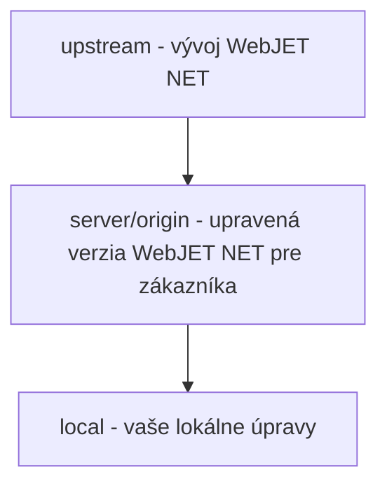

# Práce s Git/Gitlab

<!-- @import "[TOC]" {cmd="toc" depthFrom=1 depthTo=6 orderedList=false} -->

<!-- code_chunk_output -->
- [Práce s Git/Gitlab](#práce-s-gitgitlab)
  - [Instalace a nastavení](#instalace-a-nastavení)
  - [Naklonování repozitáře ze serveru na váš počítač](#naklonování-repozitáře-ze-serveru-na-váš-počítač)
  - [Práce ve VS Code](#práce-ve-vs-code)
  - [Branching](#branching)
    - [Implementace nového požadavku](#implementace-nového-požadavku)
    - [Release do produkce](#release-do-produkce)
    - [Oprava chyby v produkci](#oprava-chyby-v-produkci)
    - [Spojení (`merge`) branch](#spojení-merge-branch)
  - [Akceptování změn (Merge Request)](#akceptování-změn-merge-request)
    - [Jak a kdy vytvořit Merge Request](#jak-a-kdy-vytvořit-merge-request)
    - [Přechod z Work In Progress](#přechod-z-work-in-progress)
    - [Ověření merge konfliktů](#ověření-merge-konfliktů)
    - [Kontrola kvality kódu](#kontrola-kvality-kódu)
    - [Merge](#merge)

<!-- /code_chunk_output -->

> **`tl;dr`** Vysvětlení používání GIT: základní pojmy, filozofie práce, workflow. Fungování Merge Requestů v Gitlabe, kontrola kvality kódu.

Gitlab je dostupný na adrese https://gitlab.web.iway.local. Pokud jste dosud pracovali jen s SVN je třeba si osvojit hlavní rozdíl mezi SVN a GITem - **git je distribuován** verzovací software, každý má na svém počítači kopii repozitáře a může s ním pracovat lokálně. Teprve když máte práci hotovou "pushnete" ji na vzdálený repozitář (na server).

Základní pojmy:
- git `clone` - přenese (**naklonuje**) repozitář ze serveru **na váš počítač**
- git `commit` - odešle (**uloží**) provedené změny **do vašeho** lokálního **repozitáře**. Je to podobné jako ve SVN, ale změny se zatím neodesílají na server. Commitovat si tedy můžete i rozpracovanou práci dle potřeby.
- git `branch` - vytvoří **novou větev v kódu**, více v sekci [Branching](#branching)
- git `push` - **odešle** vaše změny (commity) **na server**
- git `pull` - **aktualizuje** váš lokální git repozitář **ze serveru**
- git `merge` - **spojí změny** mezi větvemi (branch) kódu

V tomto návodu se snažíme o „laické“ vysvětlení pojmů, takže omluvte netechnické výrazy. Mluvíme o serveru, i když git je prakticky distribuován a může mít dokonce více serverů a jiných závislostí. Typicky budeme používat následující výrazy:
- `local` - váš lokální git repozitář - repozitář na vašem počítači
- `server` (označovaný také jako `origin`) - primární git repozitář ze kterého jste provedli git clone do vašeho počítače
- `upstream` - git repozitář, ze kterého je forknut projekt na serveru

Abyste pochopili rozdíl mezi serverem a upstream uvědomte si následující situaci:

Máte vývoj "generického" produktu WebJET NET (upstream) a jeho kopii pro zákazníka (server) včetně vaší lokální kopie na počítači (local).



**Zákazník má upravenou verzi** WebJET NET která je uložena v git repozitáři na serveru. Tato verze **vznikla rozvětvením (`fork`) z původního WebJET NET repozitáře**.

**Pro zákazníka** (na serveru) tedy **programujete úpravy** pro daného klienta, můžete soubory měnit, mazat přidávat a **žádné to neovlivňuje vývoj "generického" produktu** WebJET NET. Vývoj produktu si žije vlastním životem, přidává nové vlastnosti a funkce. **Klient má zafixovanou verzi intranetu** ze serveru.

V určitý moment přijde **požadavek na aktualizaci intranetu** zákazníka. V tom momentě na provedete **pull aktuálního kódu z upstream serveru** a aktualizujete kód zákazníka podle změn na upstream serveru, tedy podle vývoje generického produktu. Při spojování kódu z `upstream` serveru a vašeho kódu zákazníka může vzniknout tzv. `merge conflict`, ve vašem IDE se vám zobrazí možnost ponechat změny, nebo je aktualizovat podle upstream serveru.

## Instalace a nastavení

Před prvním použitím Gitlabu je třeba nainstalovat GIT klienta a vygenerovat šifrovací klíče, jelikož do gitu se připojujete s použitím SSH klíčů.

Podrobný manuál se nachází v [PDF dokumentu na intranetu](https://intra.iway.sk/files/dokumenty/webove-oddelenie/development/instalacia-git-vo-win.pdf).

!>**Upozornění:** při generování SSH klíčů **nedoporučujeme zadávat heslo** (na screenshotu je uvedeno jako NějakeTvéTajněHeslo007), protože VS Code / git může mít problém heslo zadat. Výhoda SSH klíčů je právě v tom, že přináší komfort nezadávání hesla.

Ve zkratce si nainstalujte [GIT klienta pro windows](https://git-scm.com/download/win) a následně v programu **GitBash** (pro MacOS v terminálu) si vygenerujte SSH klíče zadáním příkazu:

```shell
ssh-keygen -m PEM -t rsa -b 4096 -C tvoj.email@interway.sk
```

Složku pro uložení klíčů potvrďte výchozí (složku `.ssh` ve vaší domovské složce), při výzvě zadání **Passphrase nezadávejte** nic (potvrďte klávesou enter).

Následně po vygenerování klíčů ještě zadejte příkazy k nastavení vašeho jména a emailu:

```shell
git config --global user.name "Meno Priezvisko"
git config --global user.email tvoj.email@interway.sk
```

**Soubor .pub** není třeba posílat, **zadáte si ho sami do Gitlabu**. Přihlaste se a přejděte kliknutím na vaši ikonu vpravo nahoře do menu Settings, následně v levém menu zvolte [SSH Keys](https://gitlab.web.iway.local/profile/keys). Soubor id\_rsa.pub otevřete v textovém editoru a zkopírujte jeho obsah do textového pole Key, zadejte jméno klíče (libovolné) a klikněte na Add key.

## Naklonování repozitáře ze serveru na váš počítač

Po nastavení klíčů pro komunikaci s git serverem můžete naklonovat git repozitář na váš počítač.

> Doporučuji Vám si kvůli pořádku v lokálním workspace **vytvářet podadresář pro klienta**, a až do něj naklonovat projekt. Budete mít workspace adresář **organizovaný podle klientů a následně podle projektů**.
>
> Workspace adresář s projekty pro vaše IDE doporučuji mít přímo v home adresáři.

Adresu pro příkaz `git clone` získáte přímo v gitlabu. Na úvodní stránce projektu je v pravé horní části **modré tlačítko Clone**. Klepněte na něj a zobrazí se vám kontextové menu, zkopírujte část z pole Clone with SSH.

```
cd workspace
mkdir menoklienta
cd menoklienta
git clone git@gitlab.web.iway.local:menoklienta/projekt.git
cd projekt
```

Například v gitlabu jste zkopírovali adresu `git@gitlab.web.iway.local:mpsvr/mpsvr-intranet.git`. Hodnota **mpsvr** je **menoklienta** a **mpsvr-intranet** je **jméno projektu**. Postupujte tedy následovně:

```
cd workspace
mkdir mpsvr
cd mpsvr
git clone git@gitlab.web.iway.local:mpsvr/mpsvr-intranet.git
cd mpsvr-intranet

#ak pouzivate VS Code mozete ho rovno spustit prikazom
code .
```

Zvykem je jméno projektu přefixovat jménem kllienta. Je to praktické z toho důvodu, že ve VS Code se vám v titulku/seznamu projektů/otevřených oken zobrazuje jen jméno projektu a ne jeho rodičovský adresář. Pokud jméno projektu obsahuje i jméno klienta, lépe se v tom orientuje.

## Práce ve VS Code

**Ve VS Code se branche zobrazují v levo dole**, kliknutím na jméno branche se vám zobrazí seznam všech branch. Branche, které již máte lokálně na počítači jsou označeny jako master, nebo feature/xxx, **ty které jsou na serveru začínají na prefix origin** (např. origin/master, origin/feature/xxx). Branche začínající na upstream jsou ty, které zastřešují vývoj produktu (např. upstream/master, upstream/feature/xxx).

V okně `Source Control` se vám zobrazuje seznam změněných souborů a kliknutím na `...` se vám zobrazí nabídka (v okně se 2x zobrazuje nadpis `Source Control`, kliknutí na ... je třeba vpravo ve druhém řádku nad polem pro zadání `Commit Message`).

**V menu `Commit`** je možnost `Commit` na **uložení práce**, v **menu `Pull`, `Push`** jsou možnosti `Pull` a `Push` pro **odeslání na server (`push`)/aktualizaci ze serveru (`pull`)** a v **menu `Branch`** je možnost `Merge Branch` na [spojení branchí](#spojení-merge-branch).

## Branching

**Výhodou kyt-u je**, že můžete mít na vašem počítači **rozpracovaných několik částí projektu (branch)**, ty commitujete na svém počítači. Branch-e jsou navzájem nezávislé (změny v jedné části/v jedné branchi vám neovlivňují jinou část/jinou branchu).

Představte si, že máte rozpracovanou nějakou větší úpravu a zároveň dostanete požadavek na drobnou úpravu ve zcela jiné části kódu. **Commitnete rozpracovanou roli a přepnete se do nové branche**, kde provedete druhou úpravu, tu commitnete a pushnete na server. Nemusíte řešit, že jinde máte rozpracovanou první roli a nemusíte si pamatovat, co všechno máte odeslat na server.

Základním požadavkem je tedy vytvoření branche pro každý úkol, který řešíte. Pro vývoj používáme metodologii gitlab flow (obvykle bez develop branche). Používáme následující jména branch-í:
- `master` - hlavní brancha ve které se nachází jen **schválený a otestovaný kód**. Master brancha **je obvykle chráněna** a běžný vývojář do ní nemá právo pushnout změny. Ty se akceptují přes tzv. [Merge request](#akceptování-změn-merge-request)
- `feature/xxxxx-nazov-tiketu` - brancha, ve které se implementuje požadovaná změna v tiketu xxxxx. Jméno branche začíná na prefix feature/ a pokračuje číslem tiketu/požadavky a jejím krátkým názvem (pro lepší přehled)
- `release/yyyy.ww` - v branchi release jsou uchovány **produkční (releaslé) verze** projektu. V řetězci `yyyy.ww` je číslo release, doporučuji používat formát rok.týden, tedy například 2020.43.
- `hotfix/xxxxx-nazov-tiketu` - obsahuje **rychlé opravy (hotfix) produkční** verze. Typická situace je bug na produkci, který je třeba rychle opravit.
- `develop` - pro některé projekty může být použita i develop brancha, která **zastupuje roli master branche a může obsahovat i rozpracované části**, doporučujeme ji ale nepoužívat, protože spíše přináší chaos do vývoje.

Ukážeme si několik příkladů, jak postupovat během vývoje. **Před** každým **vytvořením nové branche** si musíte uvědomit, že **ji vytváříte jako novou větev** z **branche**, kterou máte **právě otevřenou**. Typicky tedy se musíte předem přepnout do potřebné branche ze které se větvíte a také ji aktualizovat ze serveru.

Popis [workflow/branch modelu](https://intra.iway.sk/files/dokumenty/webove-oddelenie/development/gitflow-workflow.pdf) je také v dokumentu na intranetu.

> **Upozornění**: když se přepínáte mezi branchami mění se vám i kód. Některé soubory jsou smazány (neboť v dané branchi neexistují) a některé jsou přidány. Po změně branch vám doporučuji spustit příkaz **gradlew clean** pro smazání zkompilovaných souborů a pokud používáte NPM provést i **npm install** pro doinstalování potřebných knihoven. Pro npm doporučujeme připravit i gradle task **[gradlew npminstall](../../build.gradle) **, aby nebylo nutné přecházet do podadresářů s npm moduly.

### Implementace nového požadavku

- commitnite aktuálně rozpracované soubory (pokud již pracujete na jiném požadavku)
- ** přepněte** se na **master** branch
- aktualizujte master branch ze serveru přes `git pull`
- vytvořte **novou branch** se jménem **feature/IDTIKETU-kratke-jméno-tiketu**, čili například `feature/47419-monitorovanie-servera`

Brancha se vám vytvoří lokálně, můžete pracovat na změnách a lokálně commitovat kód. Když budete hotovi můžete branchu **"odeslat na server"** pomocí `git push`. Vaše IDE se vás může zeptat, jestli skutečně chcete branchu odeslat na server a případně i změnit její jméno (to ale zachovejte stejné jako je u vás lokální).

### Release do produkce

Do produkce typicky dáváte aktuální otestovaný kód z master branche. Prakticky byste mohli rovnou z master branche vytvořit war archiv a ten nasadit na server. Neměli byste ale **zafixovanou verzi nasazeného kódu** a špatně by se vám programovaly hotfixy.

- **přepněte** se na **master** branch
- aktualizujte master branch ze serveru přes `git pull`
- vytvořte **novou branch** se jménem **release/yyyy.ww**, tedy například `release/2020.43`
- pushněte branchu na server přes `git push`

Takto vytvořená brancha je jen **rozvětvení z původní master branche**, zatím neobsahuje žádné změny, je to jen **uchování stavu** pro potřebu hotfixu k produkci.

### Oprava chyby v produkci

Pokud nastane chyba na produkci a je třeba provést hotfix:
- **přepněte** se na **release branchu**, která je použita v produkci, tedy např. `release/2020.43`
- **pro jistotu aktualizujte** branchu ze serveru přes `git pull`
- vytvořte **novou branch** se jménem **hotfix/IDTIKETU-kratke-jméno-tiketu**, čili například `hotfix/47326-oprava-prihlasenia`

Nyní máte na svém počítači stejný kód jako je na serveru, můžete implementovat opravy dle požadavku. Opravu následně odešlete na server přes `git push`.

!>**Upozornění:** změny v hotfix branchi je následně zapotřebí **spojit (merge)** do dané **release branche a také do master branche** (aby se hotfix neztratil).

Na server vám následně stačí nasadit jen změněné soubory. Po merge do release branch ale můžete nasadit i celou release branch.

### Spojení (`merge`) branch

**Během vývoje na feature/** branch můžete potřebovat **aktualizaci kódu z master** branche (případně i jiné). Postupujte následovně:
- commitnite aktuálně rozpracované soubory
- **přepněte** se na **master** branch
- aktualizujte master branch ze serveru přes `git pull`
- **přepněte se zpět** na branch **feature/IDTIKETU-kratke-jméno-tiketu** kterou chcete podle master branche aktualizovat
- spusťte příkaz `git merge` a vyberte branch master

Čili, **do branch feature/IDTIKETU-kratke-jméno-tiketu spojujete** kód branche **master**.

**Ve VS Code** uvedené operace provedete v Source Control kliknutím na `...` napravo od textu Source Control (... ve druhém řádku). Zobrazí se vám menu Commit máte možnost Commit, v Pull, Push máte možnost Pull a v menu Branch máte možnost Merge Branch.

Samozřejmě, mohou vám vzniknout konflikty (merge conflict), když jste provedli změnu v souboru vy i někdo jiný v master branch. Konflikty je třeba vyřešit.

Ve VS Code se vám **konflikty zobrazí v okně Source Control v bloku MERGE CHANGES**. Klepnutím na soubor se vám zobrazí is možnostmi akceptovat vaše změny, akceptovat obě změny, akceptovat změny ze serveru. V jednom souboru může být také několik takových změn. Můžete je upravit i manuálně, je to jen text v editoru ohraničený značkami `<<< ----- >>>`. Po **vyřešení konfliktů** v souboru na něj klikněte pravým tlačítkem a zvolte možnost `Stage changes`. To upravený soubor připraví na commit. Když vyřešíte konflikty ve všech souborech commitnite změny kliknutím na ikonu kvačky (commit). Předvyplní se vám popis `Merge xxx with branch yyyy`.

## Akceptování změn (Merge Request)

Pomocí funkce Merge Request v gitlabu je možné **provést kontrolu kvality kódu (code review)** před akceptováním změn ve feature/hotfix branch do master branch. Typicky je master branch chráněna a může do ní pushnout změny jen uživatel ve skupině **maintainer**.

Funkce je ale **užitečná již během vývoje**, zobrazuje seznam změněných souborů a máte tak přehled, co všechno jste měnili.

### Jak a kdy vytvořit Merge Request

Merge Request vytvoříte v Gitlabu. V příslušném projektu vyberte v levém menu **Repositury->Branches**. U každé branchi (kromě master) se vám zobrazí **tlačítko Merge request**, klepněte na něj.

Ve formuláři vyplňte **Title**, mělo by být **shodné se jménem branche** Např. `feature/47419-monitorovanie-servera`. Pokud je brancha ještě nedokončená zadejte do title prefix **WIP:** (Work In Progress) neboli `WIP: feature/47419-monitorovanie-servera`.

**Description** můžete vyplnit podle zadání tiketu, v **Assignee** vyberte developera, který vám bude provádět kontrolu kvality kódu (code review), nebo správce repozitáře (hlavního developera projektu). Během Work In Progress můžete pole Assignee nechat prázdné.

Ostatní pole nevyplňujte, pole v **Merge options nechte nezaškrtnuté**.

Klepnutím na **Submit merge request** jej vytvoříte. Seznam vytvořených Merge requestů zobrazíte kliknutím na položku Merge Requests v levém menu.

> Shrnutí: Merge Request doporučujeme vytvořit hned po pushnutí branche s prefixem WIP. Získáte tak přehled změn v branchi a sami si můžete provést kontrolu kvality kódu.

### Přechod z Work In Progress

Máte-li Merge Request vytvořen s prefixem WIP: a vaše brancha je již **hotová a připravená k revizi/merge do master** branche klepněte na tlačítko **Mark as ready** v daném Merge Requeste.

Nezapomeňte také vyplnit pole Assignee (po klepnutí na tlačítko Edit).

### Ověření merge konfliktů

V záložce Overview je vidět stav, zda lze provést merge branch do mastra. Je-li tlačítko **Merge zelené, všechno je v pořádku**. Je-li zašedlé s textem **There are merge conflicts** je třeba nejprve vyřešit merge konflikty.

> Vždy doporučuji před finálním pushnutím změn v branchi **předem provést merge vůči master branchi**. Dostanete tak do vaší feature branche aktuální kód z mastra a ověříte, že vaše změna je v pořádku **spuštěním automatizovaných testů**. Pokud vaše feature branch pokazila některou vlastnost/test, je třeba implementovat opravu.

### Kontrola kvality kódu

V Merge Requeste v záložce Changes je vidět seznam změn v souborech. Při přechodu kurzoru přes řádku se vám zobrazí na začátku řádku **ikona pro přidání komentáře**. Klepnutím na ikonu se zobrazí textové pole pro přidání komentáře.

Pomocí @jméno můžete označit řešitele komentáře. Pod komentářem se zobrazují tlačítka **Start review** a **Add comment now**. Rozdíl je v tom, že pomocí **Start review** můžete přidat **více komentářů** a odeslat notifikaci najednou na konci. Pomocí **Add comment now** rovně **přidáte komentář a odešlete** i notifikaci.

V Merge Requeste se vám zároveň v horní části zobrazuje hlášení **X unresolved threads**, kde X je počet nevyřešených komentářů.

Jako developer byste měli na komentáře reagovat. Zapracovat změny, ty pushnout na server a následně daný komentář označit jako vyřešený kliknutím na tlačítko **Resolve thread**.

### Merge

Finální merge do master branche provede správce projektu kliknutím na zelené tlačítko **Merge**. Vaše branch dostane v seznamu branchí ikonu **merged**.

Nedoporučujeme použít možnost **Squash commits** ani Delete source branch, tyto možnosti ponechte nezaškrtnuté. Možnost **Squash commits by "spojila" více commit** ve vaší feature branchi do jednoho a tak to mergla do master branche. Je to v pořádku, pokud ve feature branchi už nikdy nebudete dělat změny, pokud byste ale následně ve feature branchi udělali další commit, tak se pokazí historie vůči master branchi. Možnost **Delete source branch** je zřejmá z názvu, zatím platí pravidlo, že z důvodu historie staré branche nemažeme.
