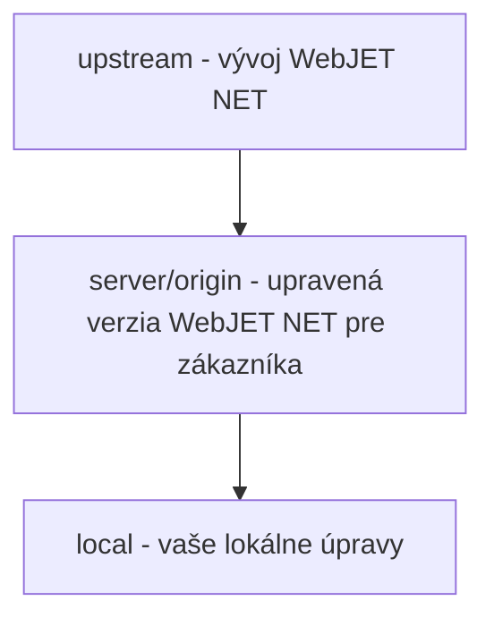

# Práce se systémem Git/Gitlab

<!-- @import "[TOC]" {cmd="toc" depthFrom=1 depthTo=6 orderedList=false} -->

<!-- code_chunk_output -->
- [Práce se systémem Git/Gitlab](#práce-s-gitgitlab)
  - [Instalace a nastavení](#instalace-a-nastavení)
  - [Klonování úložiště ze serveru do počítače](#klonování-úložiště-ze-serveru-do-počítače.)
  - [Práce v kódu VS](#práce-v-kódu-vs)
  - [Rozvětvení](#větvení)
    - [Zavedení nového požadavku](#zavedení-nového-požadavku)
    - [Uvolnění do produktu](#uvolnění-produktu)
    - [Oprava chyby ve výrobě](#oprava-výrobní-chyby)
    - [Připojení (`merge`) větev](#sloučit-větev)
  - [Přijetí změn (požadavek na sloučení)](#přijetí-změn-v-požadavcích-na-sloučení)
    - [Jak a kdy vytvořit požadavek na sloučení](#jak-a-kdy-vytvořit-požadavek-na-sloučení)
    - [Přechod z rozpracované výroby](#přechod-z-rozpracované-výroby)
    - [Ověření konfliktů při slučování](#ověření-konfliktů-při-slučování)
    - [Kontrola kvality kódu](#kontrola-kvality-kódu)
    - [Sloučení](#sloučit)

<!-- /code_chunk_output -->

> **`tl;dr`** Vysvětlení používání GIT: základní pojmy, filozofie práce, pracovní postupy. Fungování požadavků na sloučení v systému Gitlab, kontrola kvality kódu.

Gitlab je k dispozici na adrese https://gitlab.web.iway.local. Pokud jste dosud pracovali pouze s SVN, je třeba pochopit hlavní rozdíl mezi SVN a GIT. **git je distribuován** verzovacího softwaru má každý kopii úložiště na svém počítači a může s ním pracovat lokálně. Teprve po dokončení práce ji "odešlete" do vzdáleného úložiště (na serveru).

Základní pojmy:
- git `clone` - budou přeneseny (**klony**) úložiště ze serveru **do počítače**
- git `commit` - odesílá (**uložit**) provedené změny **k vašemu** Místní **Úložiště**. Je to podobné jako SVN, ale změny se ještě neodesílají na server. Můžete tedy podle potřeby odevzdávat i rozpracovanou práci.
- git `branch` - vytváří **nová větev v kódu**, více v sekci [Rozvětvení](#větvení)
- git `push` - **zaslaný** vaše směny (commity) **na server**
- git `pull` - **Aktualizace** váš místní repozitář git **ze serveru**
- git `merge` - **spojí změny** mezi větvemi kódu

V této příručce se snažíme vysvětlovat pojmy "laicky", proto prosím omluvte netechnické výrazy. Mluvíme o serveru, i když je git prakticky distribuovaný a může mít i více serverů a dalších závislostí. Typicky budeme používat následující pojmy:
- `local` - váš místní repozitář git - repozitář ve vašem počítači.
- `server` (označované také jako `origin`) - primární repozitář git, ze kterého jste provedli klonování git do svého počítače.
- `upstream` - repozitář git, ze kterého je projekt na serveru forknut.

Pro pochopení rozdílu mezi serverem a upstreamem uvažujte následující situaci:

Máte k dispozici vývoj "obecného" produktu WebJET NET (upstream) a jeho kopii pro zákazníka (server), včetně vaší místní kopie v počítači (local).



**Zákazník má upravenou verzi** WebJET NET, který je uložen v úložišti git na serveru. Tato verze **byl vytvořen větvením (`fork`) z původního úložiště WebJET NET**.

**Pro zákazníka** (na serveru) takto **programujete úpravy** pro daného klienta, můžete měnit soubory, odstraňovat přidávat a **nijak neovlivňuje vývoj "generického" produktu.** WebJET NET. Vývoj produktu žije vlastním životem, přidává nové vlastnosti a funkce. **Klient má pevnou verzi intranetu.** ze serveru.

V určitém okamžiku přijde **žádost o aktualizaci intranetu** zákazníka. V tu chvíli provedete **stáhnout aktuální kód ze serveru upstream** a aktualizovat zákaznický kód podle změn na upstream serveru, tj. podle vývoje generického produktu. Při slučování kódu z `upstream` server a váš zákaznický kód mohou vytvořit tzv. `merge conflict`, zobrazí se v IDE možnost zachovat změny nebo je aktualizovat podle serveru upstream.

## Instalace a nastavení

Před prvním použitím Gitlabu je třeba nainstalovat klienta GIT a vygenerovat šifrovací klíče, protože se ke gitovi připojujete pomocí klíčů SSH.

Podrobnou příručku naleznete v [Dokumenty PDF na intranetech](https://intra.iway.sk/files/dokumenty/webove-oddelenie/development/instalacia-git-vo-win.pdf).

!>**Varování:** při generování klíčů SSH **nedoporučujeme zadávat heslo** (na obrázku je uvedeno jako NejakeYourSecretPassword007), protože VS Code / git může mít problémy se zadáváním hesla. Výhodou klíčů SSH je právě to, že přináší pohodlí, že nemusíte zadávat heslo.

Stručně řečeno, nainstalujte [Klient GIT pro Windows](https://git-scm.com/download/win) a pak v programu **GitBash** (pro macOS v terminálu) vygenerujte klíče SSH zadáním příkazu:

```shell
ssh-keygen -m PEM -t rsa -b 4096 -C tvoj.email@interway.sk
```

Potvrďte výchozí složku pro ukládání klíčů (složka `.ssh` ve vaší domovské složce), když budete vyzváni k zadání **Nezadávejte přístupový kód** nic (potvrďte enterem).

Po vygenerování klíčů zadejte příkazy pro nastavení jména a e-mailu:

```shell
git config --global user.name "Meno Priezvisko"
git config --global user.email tvoj.email@interway.sk
```

**.pub soubor** není třeba odesílat, **zadáte ji do systému Gitlab sami**. Přihlaste se a kliknutím na svou ikonu vpravo nahoře přejděte do nabídky Nastavení a poté vyberte z levého menu. [Klíče SSH](https://gitlab.web.iway.local/profile/keys). Otevřete soubor id\_rsa.pub v textovém editoru a zkopírujte jeho obsah do textového pole Klíč, zadejte název klíče (libovolný) a klikněte na tlačítko Přidat klíč.

## Klonování úložiště ze serveru do počítače

Po nastavení klíčů pro komunikaci se serverem git můžete klonovat repozitář git do svého počítače.

> Doporučuji udržovat místní pracovní prostor v pořádku. **vytvořit podadresář pro klienta** a naklonujte do něj projekt. Získáte adresář pracovního prostoru **uspořádané podle klientů a následně podle projektů**.
>
> Doporučuji mít adresář Workspace s projekty pro vaše IDE přímo v domovském adresáři.

Adresa pro příkaz `git clone` můžete získat přímo v gitlabu. Na domovské stránce projektu v pravé horní části. **modré tlačítko Klonovat**. Klikněte na něj a zobrazí se kontextová nabídka, zkopírujte část z pole Klonovat pomocí SSH.

```
cd workspace
mkdir menoklienta
cd menoklienta
git clone git@gitlab.web.iway.local:menoklienta/projekt.git
cd projekt
```

Například v systému gitlab jste zkopírovali adresu `git@gitlab.web.iway.local:mpsvr/mpsvr-intranet.git`. Hodnota **mpsvr** Je **menoclient** a **mpsvr-intranet** Je **název projektu**. Postupujte tedy následovně:

```
cd workspace
mkdir mpsvr
cd mpsvr
git clone git@gitlab.web.iway.local:mpsvr/mpsvr-intranet.git
cd mpsvr-intranet

#ak pouzivate VS Code mozete ho rovno spustit prikazom
code .
```

Je obvyklé, že název projektu je uvozen jménem klienta. Je to užitečné, protože ve VS Code se v seznamu title/project/open zobrazuje pouze název projektu, nikoli jeho nadřazený adresář. Pokud název projektu obsahuje také jméno klienta, je navigace snazší.

## Práce v kódu VS

**Ve VS Code se větve zobrazují v levém dolním rohu.**, kliknutím na název pobočky zobrazíte seznam všech poboček. Větve, které již máte lokálně v počítači, jsou označeny jako master nebo feature/xxx, **ty na serveru začínají předponou origin** (např. origin/master, origin/feature/xxx). Větve začínající na upstream jsou ty, které pokrývají vývoj produktu (např. upstream/master, upstream/feature/xxx).

V okně `Source Control` zobrazí se seznam změněných souborů a klikněte na tlačítko `...` zobrazí se nabídka (název se v okně zobrazí dvakrát). `Source Control`, klikněte na ... je vyžadováno vpravo ve druhém řádku nad vstupním polem. `Commit Message`).

**V nabídce `Commit`** je možnost `Commit` na adrese **úspora práce**, v **nabídka `Pull`, `Push`** jsou možnosti `Pull` a `Push` Pro **odeslání na server (`push`)/aktualizace ze serveru (`pull`)** a v **nabídka `Branch`** je možnost `Merge Branch` na adrese [propojení poboček](#sloučit-větev).

## Rozvětvení

**Výhodou systému git je, že**které můžete mít v počítači **několik částí probíhajícího projektu (větve).**, které jste spáchali v počítači. Větve jsou na sobě nezávislé (změny v jedné větvi neovlivňují jinou větev).

Představte si, že probíhá velká změna a současně obdržíte požadavek na menší změnu v úplně jiné části kódu. **Odevzdání probíhající úlohy a přepnutí na novou bránu** kde provedete druhou úpravu, odevzdáte ji a odešlete na server. Nemusíte se zabývat tím, že máte jinde rozpracovanou první práci, a nemusíte si pamatovat, co máte na server odeslat.

Základním požadavkem je tedy vytvořit bránu pro každou řešenou úlohu. Pro vývoj používáme metodiku gitlab flow (obvykle bez větve develop). Používáme následující názvy větví:
- `master` - hlavní brána, ve které je pouze **Schválený a otestovaný kód**. Master brancha **je obvykle chráněn** a normální vývojář nemá právo do něj vkládat změny. Ty jsou přijímány prostřednictvím tzv. [Požadavek na sloučení](#přijetí-změn-v-požadavcích-na-sloučení)
- `feature/xxxxx-nazov-tiketu` - Větev, ve které je provedena požadovaná změna v tipu xxxxx. Název větve začíná předponou feature/ a pokračuje číslem tiketu/požadavku a jeho zkráceným názvem (pro lepší přehled).
- `release/yyyy.ww` - v uvolnění branchi jsou zachovány **produkční (uvolněné) verze** Projekt. V řetězci `yyyy.ww` je číslo vydání, doporučuji použít formát rok.týden, například 2020.43.
- `hotfix/xxxxx-nazov-tiketu` - obsahuje **výroba rychlých oprav (hotfix)** Verze. Typickou situací je chyba ve výrobě, kterou je třeba rychle opravit.
- `develop` - pro některé projekty lze použít také vývojovou branži, která **představuje roli hlavní větve a může obsahovat i rozpracované části.**, ale doporučujeme ji nepoužívat, protože do vývoje vnáší spíše chaos.

Ukážeme si několik příkladů, jak postupovat při vývoji. **Před** Podle **vytvořením nové brány** musíte si uvědomit, že **vytvoříte ji jako novou větev** z **branche** že máte **právě otevřeno**. Obvykle je třeba přepnout na potřebnou bránu, ze které se bude odvíjet a aktualizovat ji ze serveru.

Popis [model pracovních postupů/odvětví](https://intra.iway.sk/files/dokumenty/webove-oddelenie/development/gitflow-workflow.pdf) je také v dokumentu na intranetu.

> **Oznámení**: při přepínání mezi větvemi se kód mění. Některé soubory se odstraní (protože v dané větvi neexistují) a některé se přidají. Po změně větve doporučuji spustit příkaz **gradlew clean** odstranit zkompilované soubory a pokud používáte NPM, proveďte také **npm install** nainstalovat potřebné knihovny. Pro npm doporučujeme připravit také úlohu gradle **[gradlew npminstall](../../build.gradle) ** &#x61;byste nemuseli přecházet do podadresářů s moduly npm.

### Zavedení nového požadavku

- odevzdejte své aktuální rozpracované soubory (pokud již pracujete na jiném požadavku).
- ** přepínač** na **master** pobočka
- aktualizovat hlavní větev ze serveru prostřednictvím `git pull`
- vytvořit **nová pobočka** s názvem **feature/IDTIKETU-short-menu-label** to je například `feature/47419-monitorovanie-servera`

Větev bude vytvořena lokálně, můžete pracovat na změnách a odevzdávat kód lokálně. Až budete hotovi, můžete **"odeslat na server"** přes `git push`. IDE se vás může zeptat, zda chcete bránu skutečně odeslat na server a případně změnit její název (ale ponechat ji stejnou jako lokálně).

### Uvolnění do produktu

Obvykle se do výroby vloží aktuální testovaný kód z hlavní brány. Prakticky můžete vytvořit archiv war přímo z hlavní větve a nasadit jej na server. Ale neměli byste **opravená verze nasazeného kódu** a špatně byste programovali hotfixy.

- **přepínač** na **master** pobočka
- aktualizovat hlavní větev ze serveru prostřednictvím `git pull`
- vytvořit **nová pobočka** s názvem **release/yyyy.ww**, zda např. `release/2020.43`
- odeslat bránu na server prostřednictvím `git push`

Takto vytvořená brancha je pouze **větvení z původní větve master**, zatím neobsahuje žádné změny, je pouze **státní památková péče** pro potřebu opravy hotfix ve výrobě.

### Oprava chyby ve výrobě

Pokud dojde k chybě ve výrobě a je třeba provést opravu:
- **přepínač** na **uvolnění brány** který se používá ve výrobě, např. `release/2020.43`
- **pro jistotu aktualizujte** brány ze serveru prostřednictvím `git pull`
- vytvořit **nová pobočka** s názvem **hotfix/IDTIKETU-short-menu-label** to je například `hotfix/47326-oprava-prihlasenia`

Nyní máte na svém počítači stejný kód jako na serveru a můžete podle potřeby implementovat opravy. Poté odešlete opravu na server prostřednictvím `git push`.

!>**Varování:** následně jsou vyžadovány změny ve větvi hotfix. **sloučit** k danému **release branche a také do master branche.** (aby se oprava neztratila).

Poté stačí na server nasadit pouze změněné soubory. Po sloučení do větve vydání můžete nasadit i celou větev vydání.

### Připojení (`merge`) větev

**Během vývoje funkce/** pobočka, kterou můžete potřebovat **aktualizace kódu z předlohy** větve (případně jiné). Postupujte takto:
- odevzdat aktuální rozpracované soubory
- **přepínač** na **master** pobočka
- aktualizovat hlavní větev ze serveru prostřednictvím `git pull`
- **přepnout zpět** na větvi **feature/IDTIKETU-short-menu-label** které chcete aktualizovat podle hlavní brány.
- spustit příkaz `git merge` a vyberte větev master

To znamená, **do branch feature/IDTIKETU-short-menu-label merge** kód pobočky **master**.

**V kódu VS** Chcete-li provést výše uvedené operace v nástroji Source Control, klikněte na tlačítko `...` vpravo od textu Source Control (... v druhém řádku). V nabídce Commit (Odevzdat) máte možnost Commit (Odevzdat), v nabídce Pull (Vytáhnout), Push (Tlačit) máte možnost Pull (Vytáhnout) a v nabídce Branch (Větve) máte možnost Merge Branch (Sloučit větve).

Samozřejmě může dojít ke konfliktům při slučování, pokud jste změnu v souboru provedli vy i někdo jiný z hlavní větve. Konflikty je třeba vyřešit.

V aplikaci VS Code budete **konflikty jsou zobrazeny v okně Source Control v bloku MERGE CHANGES**. Po kliknutí na soubor se také zobrazí možnosti přijmout vaše změny, přijmout obě změny, přijmout změny ze serveru. Takových změn může být v jednom souboru více. Můžete je také upravovat ručně, je to jen text v editoru ohraničený značkami `<<< ----- >>>`. Po **řešení konfliktů** v souboru, klikněte na něj pravým tlačítkem myši a vyberte možnost `Stage changes`. Tím se upravený soubor připraví k odevzdání. Po vyřešení konfliktů ve všech souborech odevzdejte změny kliknutím na ikonu odevzdat. Zobrazí se popis `Merge xxx with branch yyyy`.

## Přijetí změn (požadavek na sloučení)

Pomocí funkce Merge Request v systému gitlab můžete **provést kontrolu kvality kódu (code review).** před přijetím změn ve větvi feature/hotfix do větve master. Hlavní větev je obvykle chráněna a změny do ní může odesílat pouze uživatel ve skupině. **správce**.

Funkce je však **užitečné již během vývoje**, zobrazí seznam změněných souborů, abyste viděli, co jste změnili.

### Jak a kdy vytvořit požadavek na sloučení

V Gitlabu vytvoříte požadavek na sloučení. V příslušném projektu vyberte v levém menu **Úložiště->Branche**. Pro každou větev (kromě hlavní) uvidíte. **Tlačítko pro sloučení požadavků**, klikněte na něj.

Vyplňte formulář **Název**, mělo by to být **totožný s názvem branche**, např. `feature/47419-monitorovanie-servera`. Pokud je brána stále nedokončená, zadejte předponu názvu. **WIP:** (nedokončená výroba), tj. `WIP: feature/47419-monitorovanie-servera`.

**Popis** lze vyplnit podle zadání tipu, v položce **Příjemce** vybrat vývojáře, který provede revizi kódu, nebo správce úložiště (vedoucího vývojáře projektu). Během probíhající práce můžete nechat pole Assignee (Příjemce) prázdné.

Ostatní pole nevyplňujte, pole v části **Možnosti sloučení ponechte bez zaškrtnutí**.

Klikněte na **Odeslat požadavek na sloučení** vytvoříte. Chcete-li zobrazit seznam vytvořených požadavků na sloučení, klikněte na položku Požadavky na sloučení v levém menu.

> Shrnutí: Doporučujeme vytvořit požadavek na sloučení hned po odeslání větve s předponou WIP. Získáte tak přehled o změnách ve větvi a můžete sami provést kontrolu kvality kódu.

### Přechod z rozpracované výroby

Pokud máte vytvořený požadavek na sloučení s předponou WIP: a vaše brána je již. **připraveno k revizi/spojení s předlohou** kliknutí na pobočku **Označit jako připravené** v daném požadavku na sloučení.

Nezapomeňte vyplnit také pole Příjemce (po kliknutí na tlačítko Upravit).

### Ověření konfliktů při slučování

Karta Přehled zobrazuje stav, zda je možné větev sloučit s hlavní větví. Pokud je tlačítko **Sloučení zelené, vše je v pořádku**. Pokud je šedá s textem **Dochází ke konfliktům při slučování** nejprve je třeba vyřešit konflikty při slučování.

> Vždy doporučuji před finálním odesláním změn v branchi **pre-merge proti větvi master**. Tímto způsobem získáte skutečný kód z masteru do brány funkcí a ověříte, zda je vaše změna v pořádku. **spuštění automatizovaných testů**. Pokud vaše funkční větev rozbila nějakou funkci/test, musíte implementovat opravu.

### Kontrola kvality kódu

V žádosti o sloučení se na kartě Změny zobrazí seznam změn v souborech. Když najedete kurzorem na řádek, zobrazí se začátek řádku. **ikona pro přidání komentáře**. Kliknutím na ikonu zobrazíte textové pole pro přidání komentáře.

Pro označení řešitele komentáře použijte @name. Pod komentářem se zobrazí tlačítka **Spustit recenzi** a **Přidat komentář**. Rozdíl je v tom, že při použití **Spustit recenzi** můžete přidat **další komentáře** a na konci odeslat oznámení najednou. Použití **Přidat komentář** přímo **přidat komentář a odeslat** a oznámení.

V požadavku na sloučení se v horní části zobrazí také zpráva. **X nevyřešených vláken**, kde X je počet nevyřízených připomínek.

Jako vývojář byste měli na připomínky reagovat. Zapracujte změny, odešlete je na server a poté označte komentář jako vyřešený kliknutím na tlačítko. **Vlákno Řešení**.

### Sloučení

Konečné sloučení s hlavní bránou provede správce projektu kliknutím na zelené tlačítko. **Sloučení**. Vaše pobočka získá ikonu v seznamu poboček **sloučené**.

Nedoporučujeme používat možnost **Závazky Squash** nebo Odstranit zdrojovou větev, ponechte tyto možnosti nezaškrtnuté. Možnost **Revize Squash by "sloučily" více revizí** ve větvení funkcí do jedné a začlenil ji do větvení master. To je v pořádku, pokud už nikdy neprovedete změny ve větvi feature, ale pokud následně provedete další revizi ve větvi feature, historie proti větvi master bude zpřeházená. Možnost **Odstranění zdrojové větve** je zřejmé z názvu, prozatím platí pravidlo, že staré větve nemažeme kvůli historii.
