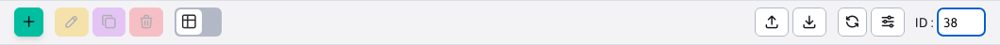

# DatatableOpener

Třída `DatatableOpener` zajistí, aby se ID aktuálně otevřeného záznamu zobrazilo v adrese URL prohlížeče (parametr `id`), zobrazení ID v záhlaví datového souboru a vyhledání zadaného ID v záhlaví datového souboru. Třída je implementována podle třídy [AbstractJsTreeOpener](js-tree-document-opener.md).



Třída je inicializována přímo v `index.js` DATATabulky. Otevírání lze zakázat nastavením konfiguračního parametru `idAutoOpener: false`.

```javascript
...
import {DatatableOpener} from "../../src/js/libs/data-tables-extends/";
...
DATA.idAutoOpener = (typeof options.idAutoOpener !== "undefined") ? options.idAutoOpener : true;
...

//inicializacia openera
if (DATA.idAutoOpener===true) {
    //inicializuj DT opener
    TABLE.datatableOpener = new DatatableOpener();
    TABLE.datatableOpener.dataTable = TABLE;
    TABLE.datatableOpener.init();
}

//ukazka vypnutia openera nastavenim idAutoOpener: false
webpagesDatatable = WJ.DataTable({
    url: webpagesUrl,
    columns: webpageColumns,
    tabs: tabs,
    editorId: "docId",
    idAutoOpener: false
});
```

Hodnota ID je v parametru URL nastavena pouze v době, kdy je editor otevřen, po zavření editoru je parametr z URL odstraněn. `id` vymaže. Takové chování nám připadá přirozenější a reprezentuje současný stav věcí.

Třída po inicializaci v záhlaví datového souboru vytvoří volání funkce `bindInput` vstupní pole pro zadání ID, ve kterém klávesa čeká na stisknutí. `Enter`. Poté nastaví zadanou hodnotu atributu `this.id` a spustí `this.dataTable.draw();` k zahájení procesu zobrazení editoru, podobně jako při inicializaci z parametru URL.

## Nastavení ID v adrese URL

Třída po otevření editoru (pomocí události `this.dataTable.EDITOR.on( 'open', ( e, type ) => {`) získá aktuální objekt JSON `this.dataTable.EDITOR.currentJson` z něhož ID získá hodnotu podle sloupce v položce `this.dataTable.DATA.editorId` (ID není vždy hodnota ve sloupci id, může to být např. `insertScriptId`). Získanou hodnotu nastaví voláním `setInputValue` ve vstupním poli a v parametru URL id.

## Otevření editoru na základě parametru URL

Po inicializaci v `index.js` nastaví hodnotu z parametru URL na interní objekty. Událost je vyslechnuta `this.dataTable.on('draw.dt', (evt, settings) => {`, tj. vykreslení tabulky. Z ní se na základě ID načte příslušný řádek a vyvolá se funkce pro otevření editoru `this.dataTable.wjEditFetch($('.datatableInit tr[id=' + id + ']'));`.

## Vyhledání zadaného ID

Problémem při otevírání editoru je stav, kdy se zadané ID nenachází na aktuálně zobrazené stránce datové tabulky. I zde je třeba rozlišovat mezi stavem stránkování serveru a klienta. Voláním `const idIndex = Object.keys(settings.aIds).indexOf(id.toString());` získá se pořadový index v aktuálních datech pro zadané id. Současně se vypočítá stránka, na které se má záznam nacházet, a to tak, že se vypočte `const pageNumber = info.length < 0 ? 0 : Math.floor(idIndex / info.length);`.

Pokud se jedná o aktuální stránku (nebo byl záznam nalezen v datech během stránkování serveru), je zobrazení editoru vyvoláno voláním `this.dataTable.wjEditFetch($('.datatableInit tr[id=' + id + ']'));`.

Pokud se záznam nachází na jiné stránce, vyvolá se zobrazení této stránky voláním `setTimeout(() => this.dataTable.page(pageNumber).draw('page'), 500);`.

Při stránkování na straně serveru však nemůžeme snadno určit stránku, na které se záznam nachází na straně klienta. Proto se spouští postupné stránkování dat voláním služby REST serveru. Aby nedocházelo k zahlcení, je stránkování voláno prostřednictvím funkce `setTimeout` v intervalu 500 ms. Aby se zabránilo zacyklení, počítá se volání serveru v atriu. `failsafeCounter`, kde je stanoven limit 30 volání. **Vyhledávání tedy najde zadané ID maximálně na prvních 30 stránkách**.

V budoucnu zvažujeme implementaci načítání stránek do služby REST na straně serveru, což by odstranilo problém s inkrementálním stránkováním dat na straně klienta.

## Filtrování podle parametrů hash

Knihovna také umožňuje filtrovat tabulku podle parametrů zadaných v hashovém výrazu, např. `/admin/v9/users/user-list/#dt-filter-id=3`. Parametry zadané v `window.location.hash` začínající na `dt-filter-` jsou po inicializaci tabulky nastaveny na příslušná pole filtru v záhlaví. Následně se provede kliknutí na ikonu vyhledávání vedle prvního pole.

Pokud je v hashovém výrazu také hodnota `dt-select=true`, takže po načtení záznamů jsou řádky označeny. Je tedy snadné provést akci, jako je schválení uživatelem kliknutím na tlačítko apod.

Pokud je v hashovém výrazu také hodnota `dt-open-editor=true` editor se otevře po označení řádků (řádky jsou označeny automaticky, není potřeba žádný parametr). `dt-select=true`).

Implementace je ve funkci `filterTableByHashParameters` která je spuštěna událostí `this.dataTable.one('draw.dt', (evt, settings) => {`.
