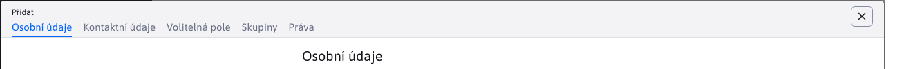

# Kvalita hesel

Naše implementace zapouzdřuje knihovnu [zxcvbn-ts](https://zxcvbn-ts.github.io/zxcvbn/), který vyhodnocuje kvalitu hesla na základě několika parametrů. Kromě standardních pravidel, jako např. **Délka** hesla, **velké** dopisy, **Speciální pro** znaky zaškrtnuté i v hesle:
- posloupnost znaků na klávesnici, např. `asdf`
- data a roky
- opakující se sekvence typu `abcabc`
- běžná jména a příjmení
- známé slogany jako např. `password`

Knihovna má **vestavěný slovník nejčastěji používaných hesel** a jména, podle kterých kontroluje heslo.

Kontrola se provádí v administraci při vytváření/změně uživatele, ale také na přihlašovací stránce v administraci, kde informuje uživatele o kvalitě zadaného hesla.



## Příklad použití

Automatické použití v datové tabulce je jednoduché, konstruktor třídy `WjPasswordStrength` používá následující možnosti:
- `element` - HTML DOM nebo ID prvku (které se následně získá jako `document.querySelector`)

```javascript
(new WjPasswordStrength({element: "#DTE_Field_password"})).load();
```

Při tomto použití se automaticky nastaví na zadanou hodnotu. `element` inicializuje kontrolu kvality hesla. V prvku se vyhledá příslušný `div[data-dte-e=msg-info]` do kterého se zapisují informace o kvalitě hesla.

## Funkce

- `load()` - asynchronně načte slovník často používaných hesel a po načtení zavolá funkci. `bindToElement()`.
- `bindToElement(element)` - inicializuje `keyup` událost na zadaném prvku pro kontrolu kvality hesla. Vypíše informace do příslušného `div[data-dte-e=msg-info]`.
- `checkPassword(password)` - ověří kvalitu zadaného hesla a vrátí výsledek v objektu JSON.

## Implementační detaily

Současná knihovna `zxcvbn-ts` obsahuje pouze `en,de,fr` slovníky často používaných hesel. V naší implementaci je funkce `load()` Používá se pouze `en` Slovník.

Informace o kvalitě hesel používají překladové klíče z WebJETu `wj-password-strength.warnings.` a `wj-password-strength.rating.`. Objekt `zxcvbn` je inicializován prázdným `translations` a vrací přímo klíče. Ty se vloží do překladových klíčů WebJETu, aby se získaly informace. Původní knihovna `zxcvbn` neobsahuje překlady do jazyků potřebných pro WebJET, proto jsme zvolili toto řešení. Texty lze navíc upravovat přímo prostřednictvím WebJETu.

Knihovna je importována v `app.js` a jsou k dispozici po celém světě:

```javascript
import { WjPasswordStrength } from './libs/wj-password-strength';
global.WjPasswordStrength = WjPasswordStrength;
```

## Přihlašovací obrazovka

Knihovna se používá také na přihlašovací obrazovce do administrace.

Protože je však přihlášení implementováno ve starém formátu JSP a nechceme již na přihlašovací obrazovce zpřístupňovat soubory JavaScriptu plné administrace, použijeme přímo přihlašovací obrazovku. `zxcvbn-ts` knihovna. Vzhledem k tomu, že adresář `node_modules` není přímo k dispozici, soubory se kopírují z adresářů v adresáři `node_modules/@zxcvbn-ts` do adresářů v `admin/skins/webjet8/assets/js/zxcvbn` zajistit, aby byly knihovny po aktualizaci prostřednictvím `npm update`.

Použití knihovny je implementováno přímo v `logon-spring.js` podobně jako v této knihovně se texty překladu zadávají také přímo do souboru JSP (ale prostřednictvím překladových klíčů synchronizovaných s administrací).


