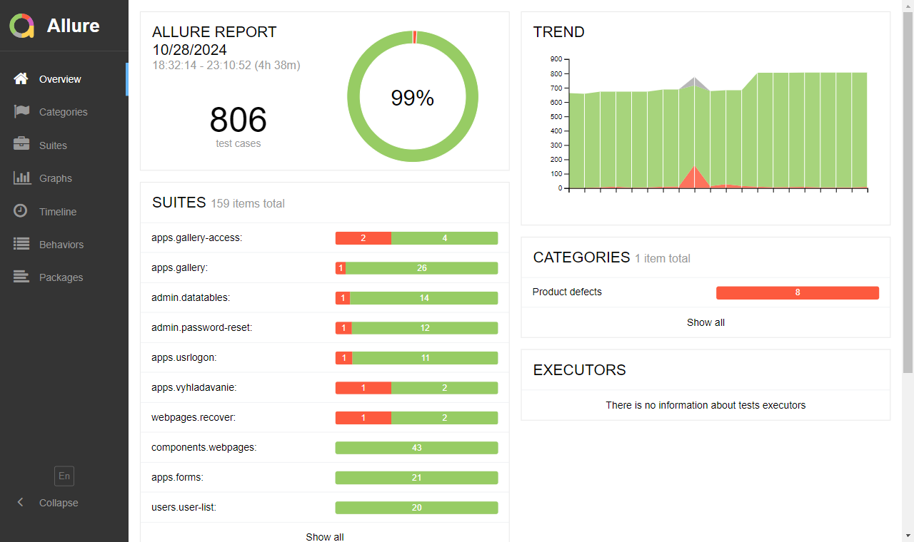

# Reporty přes Allure

Během automatizovaného testu se generuje i report ve formátu pro [Allure](https://docs.qameta.io/allure/). Zveřejněny jsou pro [chromium](http://docs.webjetcms.sk/allure/chromium/) i pro [firefox](http://docs.webjetcms.sk/allure/firefox/).

Generování vstupních dat pro report je zajištěno rozšířením [codecept-allure](https://codecept.io/plugins/).



Zobrazeny jsou následující údaje:
- `Overview` - základní přehled stavu a historie
- `Categories` - zobrazuje kategorizovaný seznam chyb, kategorie se definují podle [regulárních výrazů](https://docs.qameta.io/allure/#_categories_2) vrácené chyby v souboru `src/test/webapp/allure/categories.json`
- `Suites` - seznam jednotlivých testů, vidět jednotlivé provedené kroky
- `Graphs` - grafy aktuálního a historického vývoje
- `Timeline` - časové zobrazení provedení jednotlivých testů
- `Behaviors` - umožňuje členění testů na `Epic, Feature, Story`, co WebJET CMS se aktuálně nepoužívá
- `Packages` - stromová reprezentace jednotlivých testů

## Spuštění reportu

Proces generování reportu je komplikovanější z důvodu zachování historie. To vyžaduje získat předchozí report (přečinek `history`) před generováním reportu.

Celý proces je ve skriptu `npx-allure.sh`, který před spuštěním testu stáhne poslední výsledky z dokumentačního serveru a po provedení testu je na dokumentační server uloží.

Skript se používá s parametry:
- `CODECEPT_BROWSER` - jméno použitého prohlížeče - `chromium` nebo `firefox` (výchozí `chromium`)
- `CODECEPT_URL` - URL adresa domény, která se bude testovat (výchozí `demotest.webjetcms.sk`)
- `HOST_USER` - jméno SSH uživatele pro stažení historie a uložení výsledku
- `HOST_NAME` - doménové jméno serveru pro SSH spojení historie a uložení výsledku
- `HOST_DIR` - složku s reportem na serveru, ke jménu složky se přidává ještě jméno použitého prohlížeče

```sh
#spustenie s chrome a predvolenou domenou
npx-allure.sh
#spustenie s firefox a predvolenou domenou
npx-allure.sh firefox
#spustenie s firefoxom a domenou iwcm.interway.sk
npx-allure.sh firefox http://iwcm.interway.sk
#spustenie s chrome a domenou demo.webjetcms.sk
npx-allure.sh chromium http://demo.webjetcms.sk
```

## Technické informace

Jak je psáno výše, pro zachování historie je třeba před generováním reportu získat složku `history` z předchozí verze. To je ve skriptu zabezpečeno použitím `rsync` z dokumentační stránky.

Kromě toho se při spuštění generuje soubor `build/test/environment.properties` se jménem použitého prohlížeče a použitou doménou. To se zobrazí na kartě `Overview` v části `environment`.

Spouštění testů a generování reportu je zajištěno pomocí CI-CD v souboru `gitlab-ci.yml` spuštěním gradle úlohy `rune2etest` a `rune2etestfirefox`.
