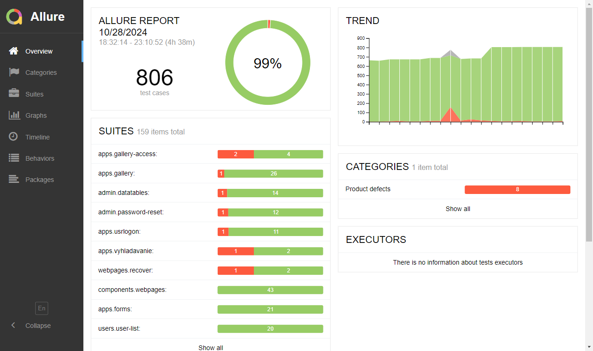

# Reporty přes Allure

Během automatizovaného testu se generuje i report ve formátu pro [Allure](https://docs.qameta.io/allure/). Zveřejněny jsou pro [chromium](http://docs.webjetcms.sk/allure/chromium/) i pro [firefox](http://docs.webjetcms.sk/allure/firefox/).

Generování vstupních dat pro report je zajištěno rozšířením [codecept-allure](https://codecept.io/plugins/).



Zobrazeny jsou následující údaje:

- ```Overview``` - ​​základní přehled stavu a historie
- ```Categories``` - ​​zobrazuje kategorizovaný seznam chyb, kategorie se definují podle [regulárních výrazů](https://docs.qameta.io/allure/#_categories_2) vrácené chyby v souboru ```src/test/webapp/allure/categories.json```
- ```Suites``` - ​​seznam jednotlivých testů, vidět jednotlivé provedené kroky
- ```Graphs``` - ​​grafy aktuálního a historického vývoje
- ```Timeline``` - ​​časové zobrazení provedení jednotlivých testů
- ```Behaviors``` - ​​umožňuje členění testů na ```Epic, Feature, Story```, co WebJET CMS se aktuálně nepoužívá
- ```Packages``` - ​​stromová reprezentace jednotlivých testů

## Spuštění reportu

Proces generování reportu je komplikovanější z důvodu zachování historie. To vyžaduje získat předchozí report (složku ```history```) před generováním reportu.

Celý proces je ve skriptu ```npx-allure.sh```, který před spuštěním testu stáhne poslední výsledky z dokumentačního serveru a po provedení testu je na dokumentační server uloží.

Skript postupně spustí Java testy (`./gradlew test`) a CodeceptJS, který zahrnuje E2E i [JavaScript helper testy](README.md#testy-javascript-funkcí-a-komponentů). Pokud některá skupina selže, pokračuje dalšími testy a generováním reportu, ale na konci vrátí nenulový návratový kód, aby pipeline nezobrazila úspěch. Samostatné spuštění `./gradlew test` helper testy nespouští.

Výsledky helper testů naleznete přímo v Alluru v suite `helpers.node-tests`. Soubor `tests/helpers/node-tests.js` automaticky vytvoří jeden scénář CodeceptJS pro každý soubor `helpers/*.test.js`. Scénář spustí daný soubor přes Node.js a přiloží jeho kompletní výpis jako textovou přílohu, i při úspěšném výsledku. Selhání některého testu označí příslušný scénář jako neúspěšný; v příloze je uveden název konkrétního testu a podrobnosti chyby. Helper testy se ve skriptu nespouštějí podruhé samostatně.

I při E2E testování ve Firefoxu používají helper testy, které potřebují prohlížeč, vlastní Chromium. Pro lokální spuštění pouze této suite použijte `npm run all -- tests/helpers/node-tests.js` ze složky `src/test/webapp`.

Skript se používá s parametry:

- ```CODECEPT_BROWSER``` - ​​jméno použitého prohlížeče - ```chromium``` nebo ```firefox``` (výchozí ```chromium```)
- ```CODECEPT_URL``` - ​​URL adresa domény, která se bude testovat (výchozí ```demotest.webjetcms.sk```)
- ```HOST_USER``` - ​​jméno SSH uživatele pro stažení historie a uložení výsledku
- ```HOST_NAME``` - ​​doménové jméno serveru pro SSH spojení historie a uložení výsledku
- ```HOST_DIR``` - ​​složka s reportem na serveru, ke jménu složky se přidává ještě jméno použitého prohlížeče

```sh
#spustenie s chrome a predvolenou domenou
npx-allure.sh
#spustenie s firefox a predvolenou domenou
npx-allure.sh firefox
#spustenie s firefoxom a domenou iwcm.interway.sk
npx-allure.sh firefox http://iwcm.interway.sk
#spustenie s chrome a domenou demo.webjetcms.sk
npx-allure.sh chromium http://demo.webjetcms.sk
```

## Technické informace

Jak je psáno výše, pro zachování historie je třeba před generováním reportu získat složku ```history``` z předchozí verze. To je ve skriptu zabezpečeno použitím ```rsync``` z dokumentační stránky.

Kromě toho se při spuštění generuje soubor ```build/test/environment.properties``` se jménem použitého prohlížeče a použitou doménou. To se zobrazí na kartě ```Overview``` v části ```environment```.

Spouštění testů a generování reportu je zabezpečeno pomocí CI-CD v souboru ```gitlab-ci.yml``` spuštěním gradle úlohy ```rune2etest``` a ```rune2etestfirefox```.
