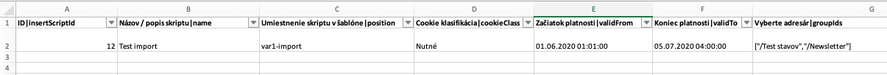

# Testování importu do datatabulky

Připravili jsme také možnost automaticky testovat import dat do datatabulky. Test provede následující operace:

- ověří, že v tabulce nejsou zadaná data
- naimportuje data a ověří jejich zobrazení/filtrování
- upraví povinná pole (přidá výraz ```-changed```) a ověří jejich zobrazení po uložení
- znovu naimportuje data s párováním podle zadaného sloupce, ověří že data již neobsahují ```-changed``` text

Implementace je podobná jako pro [Automatické testování DataTables](datatable.md). Pro přípravu je třeba:

- vytvořit testovací záznam v tabulce (ideální, aby měl vyplněných co nejvíce údajů)
- exportovat tabulku do Excelu, v něm ponechte jen hlavičku a testovací záznam
- v Excelu upravte údaje následovně:
  - hodnotu ID sloupce ponechte, bude se tak ověřovat přepsání původního záznamu (nesmí se importem přepsat)
  - ostatní sloupce patřičně upravte, doporučujeme doplnit výraz ```-import-test```
  - určit jeden unikátní sloupec (např. jméno) který se bude používat k ověření Aktualizovat stávající záznamy

Takto připravený Excel soubor pro řád uložte do stejného adresáře jako máte testovací script a také jej rovněž pojmenujte (jen samozřejmě s .xlsx příponou). Příkladem je ```insert-script.js``` a ```insert-script.xlsx```.



Příklad testu:

```javascript
Scenario('insert script-import', async ({ I, DataTables }) => {
     I.waitForText('Skripty', 5);
     await DataTables.importTest({
          dataTable: 'insertScriptTable',
          requiredFields: ['name', 'position'], //For this table we have fixedly defined that only these attributes are filled in, try leaving them empty so that all are filled in
          file: 'tests/components/insert-script.xlsx',
          updateBy: 'Názov / popis skriptu - name',
          rows: [
               {
                    name: "Test import"
               }
          ],
          editSteps: function (row, counter, I, options, DT, DTE) {
               I.seeInField('#DTE_Field_sortPriority', '10');
          }
     });
});
```

Kromě standardních parametrů [automatizovaného testu datatabulky](datatable.md) jsou použity doplňující parametry:

- ```file``` - ​​cesta k xlsx souboru s testovacími daty importu
- ```updateBy``` - ​​hodnota použitá pro testování Aktualizovat stávající záznamy
- ```rows``` - ​​pole obsahující jméno sloupce a hodnotu, která se použije pro kontrolu/filtrování v tabulce po importu
- `preserveColumns` - ​​seznam sloupců, které se nenacházejí v Excel souboru. Budou během změny nastaveny na náhodnou hodnotu a následně při aktualizaci importem se ověří, že hodnota se nepřepsala/zachovala. Např. `preserveColumns: [ 'title', 'deliveryFirstName','deliveryLastName' ]`.
- `editSteps` - ​​volitelná callback funkce `function(row, counter, I, options, DT, DTE)`, která se zavolá při úpravě naimportovaného záznamu před uložením. Umožňuje provést dodatečná ověření nebo změny v editoru (např. zkontrolovat výchozí hodnoty polí, které nejsou součástí povinných polí). Parametry `row` a `counter` obsahují aktuální řádek a jeho pořadové číslo.

Důležitý je parametr ```rows``` ve kterém definujete seznam sloupců, které se použijí pro filtrování záznamů po importu. Hodnota se musí shodovat s hodnotou v Excel souboru.