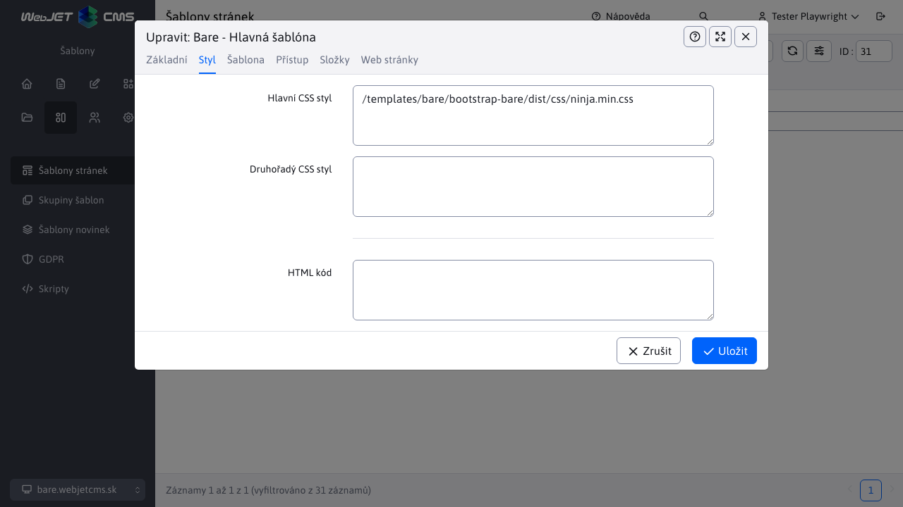
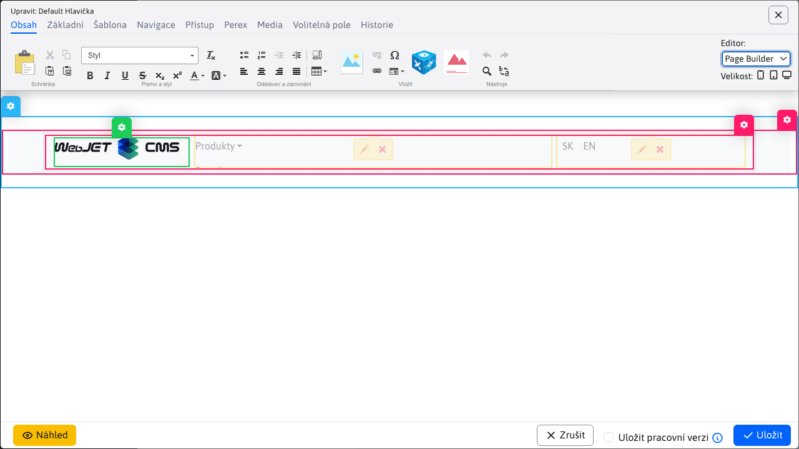

# Bare šablona

Základní ukázková šablona pro WebJET CMS s využitím [Thymeleaf šablon](http://docs.webjetcms.sk/v2022/#/frontend/thymeleaf/README) napsaných ve formátu [PugJS](http://docs.webjetcms.sk/v2022/#/developer/frameworks/pugjs). Je založena na [Start Bootstrap - Bare](https://startbootstrap.com/template/bare/).

Doporučujeme ji použít jako základ JAKÉKOLIV nové šablony pro WebJET CMS.

Zdrojový kód šablony můžete získat ve [WebJET CMS github repozitáři](https://github.com/webjetcms/templates-bare).


## Použití ve WebJET CMS

Šablonu stáhněte a umístěte do složky `templates/bare/bootstrap-bare/` (pokud používáte gradle projekt tak samozřejmě ještě do `src/main/webapp`). Pokud ji umístíte do jiné složky je třeba upravit cesty ve zdrojových kódech, stačí když vyhledáte tento řetězec v souborech a cestu upravíte.

Všechny cesty, které píšete do `.pug/.scss/.js` souborů používáte včetně prefixu `/templates/bare/....`, neboli jakoby pro použití ve WebJETu. Pokud spustíte lokální verzi přes `npm run start`, silnice ale mají prefix `/` (jelikož kořenová složka je vlastně `dist`). V souboru `node_scripts/bs-config.js` je nastaveno přesměrování, pokud změníte cestu k šabloně nezapomeňte ji upravit iv tomto souboru.

V terminálu přejděte do složky `src/main/webapp/templates/bare/bootstrap-bare` a vygenerujte `dist` verzi příkazem:

```sh
npm install
npm run build
```

Před vytvořením nové domény/struktury stránek ve WebJET CMS doporučujeme nejprve vytvořit šablony.

### Skupina šablon

Vytvořte novou skupinu šablon s názvem `Bare`, nastavte pole:
- `Priečinok` nastavte na `/templates/bare/bootstrap-bare` (případně na složku kde máte šablonu umístěnou)
- `Typ editora stránok` nastavte na hodnotu `Page Builder`.


V kartě metadata nastavte:
- `Autor, Copyright, Developer, Generator` na vaše údaje (používají se v šabloně)


### Šablona

Vytvořte novou šablonu `Bare - Hlavná šablóna`, nastavte pole:
- `Názov šablóny` na hodnotu `Bare - Hlavná šablóna`
- `HTML Šablóna` na hodnotu `bare/bootstrap-bare/dist/index.html` (pokud se vám složka dist ve výběru nezobrazuje zkontrolujte, zda jste vygenerovali `dist` verzi po stažení šablony).


V kartě Styl nastavte

- `Hlavný CSS štýl` na hodnotu `/templates/bare/bootstrap-bare/dist/css/ninja.min.css`.



### Struktura web stránek

Pokud jste nevytvořili ještě novou doménu/strukturu stránek, nyní **vytvořte novou doménu** a nastavte její šablonu `Bare - Hlavná šablóna`:
- klikněte na Web stránky-Seznam web stránek
- klikněte na ikonu `+` pro přidání nové složky
- zadejte Název složky `Slovensky`
- zadejte Název položky v menu `sk`
- zadejte do URL adresa hodnotu `sk`
- nastavte Nadřazenou složku na kořenovou složku (hodnotu `/`)
- nastavte doménu


V kartě Šablona:
- v poli Šablona pro webové stránky vyberte `Bare - Hlavná šablóna`


Pokud již doménu/strukturu stránek máte vytvořenou, doporučujeme upravit stávající složky - v kartě Šablona složky nastavte `Bare - Hlavná šablóna` a zapněte možnost `Aplikovať na všetky existujúce podpriečinky a podstránky`. Toto nastavte iv kartě `Systém` na stávající složky.

### Nastavení hlavičky a patičky

Přejděte do sekce Web stránky - Seznam web stránek, klikněte na kartu Systém a přejděte do složky Hlavičky. Otevřete stránku `Základná hlavička` v editoru. V kartě Šablona zkontrolujte, že stránka používá šablonu `Bare - Hlavná šablóna` (pokud ne, nastavte a stránku uložte a znovu otevřete v editoru). Smažte vše co se ve stránce nachází a následně přidejte Page Builder blok `Header-menu`.

Zobrazí se vám 3 sloupce:
- WebJET logo – to můžete změnit za vhodné logo vaší stránky
- Menu aplikace - pravděpodobně nemá správně nastavenou kořenovou složku, klikněte na ikonu tužky v aplikaci av okně nastavení aplikace změňte `Koreňový adresár` na adresář vaší domény. Zatím ale nemáte vytvořenou strukturu stránek aplikace tedy zatím nebude nic zobrazovat.
- Přepínání jazykové mutace - zobrazuje přepínač jazykové mutace `SK - EN`, pokud jazykové mutace nepoužíváte, aplikaci můžete vymazat.



Podobně postupujte pro nastavení patičky (stránka `Základná pätička`), smažte všechno a vložte blok `footer-footer`. Kromě standardních textových sloupců, kde můžete jednoduše upravit text podle vašich potřeb, obsahuje patička aplikace:
- Přihlášení do `newslettra` (hromadného emailu) - používá se zjednodušená varianta pouze s polem pro zadání emailu. Zjednodušený registrační formulář registruje do všech emailových skupin, které mají zapnutou možnost `Povoliť pridávanie/odoberanie zo skupiny samotným používateľom` a `Vyžadovať potvrdenie e-mailovej adresy`.
- GDPR cookies - aplikace pro nastavení cookies, jejich seznam bere z aplikace GDPR-Cookie manažer, ve které nastavíte seznam cookies, které web stránka používá. Můžete importovat [základní seznam cookies](cookies.xlsx).

Přejděte do Šablony-seznamu šablon a hlavičku/patičku nastavte šabloně `Bare - Hlavná šablóna` (v kartě Šablona nastavte pole Hlavička a Patička).

Poznámka: šablona obsahuje menu v hlavičce, proto položky Hlavní a boční navigace ponechejte v nastavení šablony prázdné.

### Nastavení jazykových mutací

Šablona je připravena pro jazykové mutace, využívá aplikaci Zrcadlení struktury. Doporučujeme v seznamu web stránek (karta Složky) vytvořit kořenové složky `Slovensky` a `English`.

Složkou nastavte pole `URL adresa` na hodnotu `sk` nebo `en`, rovněž nastavte `Názov položky v menu` na hodnotu `sk` nebo `en` (tato položka se zobrazí v hlavičce v přepínači jazyků) a v kartě Šablona pole `Jazyk` na příslušnou hodnotu. Následně postupujte podle návodu pro [nastavení zrcadlení](http://docs.webjetcms.sk/v2022/#/redactor/apps/docmirroring/README).

Pro druhou jazykovou mutaci vytvořte kopie hlavičky/patičky, pro jejich automatické použití v příslušné jazykové verzi přidejte prefix `EN-` k názvu stránky (např. stránku `Default Hlavička` zduplikujte na `EN-Default Hlavička`). Ve stránce upravte nastavení aplikací (kořenová složka pro aplikaci menu).

### Vytvoření stránek

Šablona obsahuje několik připravených bloků, ve stránce je přidáte jednoduše přes PageBuilder.

## Pro web designéra

Prostudujte si níže uvedené body, chcete-li upravit kód šablony (HTML, CSS, JavaScript).

### Stromová struktura

Všechny soubory šablony se nacházejí ve složce src, která obsahuje následující strukturu:
- `assets` - obrázky, ikony a písma, doporučujeme dodržet navrženou strukturu pod složek. Ve složce `images` se nacházejí ukázkové obrázky pro bloky PageBuilder.
- `js` - JavaScript soubory, hlavní soubor je `ninja.js`.
- `pug` - HTML kód šablon ve formátu [PugJS](https://pugjs.org/).
  - `includes` - sdílené bloky mezi šablonami (např. hlavička sdílená mezi šablonou hlavní stránky a pod stránky).
  - `pagebuilder` - bloky pro [PageBuilder](http://docs.webjetcms.sk/v2022/#/frontend/page-builder/blocks). V blocích doporučujeme využívat v maximální možné míře možnost `include`. Do `container` bloků vkládejte stávající `column` bloky a do `section` stávající `container` bloky. Při změně `column` bloku se změna projeví iv `container` a `section` blocích.
- `scss` - CSS styly ve formátu pro [Ninja](http://docs.webjetcms.sk/v8/#/ninja-starter-kit/)

Designové šablony jsou kompilovány z pug formátu do HTML formátu pro použití přes [Thymeleaf](http://docs.webjetcms.sk/v2022/#/frontend/thymeleaf/README). Pro prototypování s použitím `npm run start` doporučujeme dodržet možnost `include` bloků pro PageBuilder do šablon. Najednou tak ověříte zobrazení stránky is obsahem a zároveň ověříte i zobrazení bloků. V ideálním stavu použijete v prototypu všechny bloky na jedné stránce. Snadno tak vizuálně ověříte jejich funkčnost a zobrazení při změně CSS stylů nebo HTML kódu.

### Generování dist verze

`dist` adresář vygenerujete následujícími příkazy:

```sh
#vygenerovanie dist adresara
npm run build

#vygenerovanie dist adresara, spustenie sledovania zmien v suboroch cez browser-sync a spustenie chrome
#v tomto rezime je spusteny prehliadac pocuvajuci na zmeny v suboroch
#POZOR: je napojeny len na ciste HTML subory, nie na plny WebJET, bezi teda bez Thymeleaf sablon
#vyhodne na prototypovanie HTML/CSS bez potreby spustenia celeho WebJET CMS
npm run start
```

jednotlivé `npm` skripty jsou definovány v [package.json](https://github.com/webjetcms/templates-bare/blob/master/package.json) v elementu `scripts` a provedeno z `node_scripts/*.js` adresáře:
- `npm run build` - vygeneruje kompletní `dist` adresář.
- `npm run build:assets` - nově vygeneruje soubory z adresáře `assets` (obrázky, ikony písma).
- `npm run build:pug` - nově vygeneruje HTML soubory ze zdrojových pug souborů.
- `npm run build:scripts` - nově vygeneruje JavaScript soubory ze src adresáře.
- `npm run build:scss` - vygeneruje css soubory ze zdrojových `scss` souborů.
- `npm run clean` - smaže `dist` adresář.
- `npm run start` - spustí režim prototypování - vygeneruje `dist` adresář, sleduje změny v souborech a otevře prohlížeč s prototyp verzí.
- `npm run start:debug` - spustí režim prototypování s `debug` režimem prohlížeče.

Konfigurace pro režim prototypování `browser-sync` se nachází v souboru [node-scripts/bs-config.js](https://github.com/webjetcms/templates-bare/blob/master/node_scripts/bs-config.js). Tam je případně třeba upravit cestu pro nahrazování adres písem/obrázků, které jsou linkovány s plnou URL adresou v CSS souborech (jelikož během prototypování se URL adresa stránek odlišuje vůči adrese ve finální verzi přes WebJET CMS).

### Zpracování JavaScript souborů

Aby bylo možné používat přímo npm moduly v souboru [ninja.js](https://github.com/webjetcms/templates-bare/blob/master/src/js/ninja.js) je použit [browserify](https://www.npmjs.com/package/browserify) s rozšířením [esmify](https://www.npmjs.com/package/esmify). Zpracování je v souboru [render-scripts.js](https://github.com/webjetcms/templates-bare/blob/master/node_scripts/render-scripts.js).

Důvod je, aby se všechny použité JavaScript knihovny ve web stránce daly spravovat přes npm (čili snadno aktualizovat).

V souboru `ninja.js` tedy můžete použít `import/require` pro importování potřebných knihoven pro zobrazení stránky.

Následně můžete použít [npm-check-updates](https://www.npmjs.com/package/npm-check-updates) pro kontrolu verzí a snadnou aktualizaci.

### Seznam stylů pro editor

V editoru lze kromě základních formátovacích prvků Odstavec a Nadpis 1-6 přidat potřebné CSS styly. Z důvodu komplexnosti `ninja.min.css` se tyto zapisují do souboru `src/scss/editor.scss` který je generován do `dist/css/editor.css`.


Podporováno je základní aplikování styly na libovolný element, ale také stylování konkrétních HTML elementů:

```css
.blue {
    color: blue;
}
.zvyrazneny-text {
    background-color: yellow;
}

a {
    &.btn.btn-primary {
        /*bootstrap default*/
    }
    &.btn.btn-secondary {
        /*bootstrap default*/
    }
}

table {
    &.table {
        &.table.table-dark {
            /*bootstrap default*/
        }
        &.table.table-striped {
            /*bootstrap default*/
        }
        &.table-bordered {
            /*bootstrap default*/
        }
    }
}
```

Pokud se kurzor nachází v tabulce zobrazí se ve výběrovém poli Styl i možnosti stylů pro tabulku:


Při použití více CSS stylů najednou (např. `btn btn-primary`) se aplikují na aktuálně zvolený element všechny. Styly, které se aplikují pouze na element, se ve výběrovém poli nezobrazí, pokud není daný element označen, nebo se v něm nenachází kurzor.

Pokud `editor.css` nevkládáte také do designu šablony, tak se jeho styly při zobrazení web stránky neaplikují. Standardně se tedy používá jen jako seznam definic stylů.

Pokud chcete, můžete definovat styl zobrazený ve výběrovém poli v editoru i přímo v ostatních souborech. Takto definovaný styl ale musí obsahovat jako první komentář `/* editor */`. Příklad je v souboru `src/scss/3-base/_link.scss`:

```css
a {
    &.btn.more-info {
        /* editor */
        font-size: 150%;
        background-color: var(--bs-orange);
        color: var(--bs-white);
    }
}
```

ve výběrovém poli se následně zobrazí možnost nastavení CSS stylu `btn more-info` na A elementu. Výhoda takového použití je v tom, že máte na jednom místě definici pro editor i samotné styly.

Při aplikování CSS stylu, který nemá nastaven žádný HTML tag, se styl aplikuje na rodičovský element ve kterém se nachází kurzor. Chcete-li styl aplikovat pouze na označený text (selekci) je třeba jej definovat pro HTML tag `span`:

```css
span.more-info {
    /* editor */
    font-size: 150%;
    background-color: orange;
    color: white;
}
```

následně lze označit text a aplikovat tento styl pouze na označený text. Pokud by neměl HTML značku `span` aplikoval by se na rodičovský element, čili typicky na celý odstavec - `p`.

Pokud vám nevyhovuje výchozí název stylu ve výběrovém poli, můžete jej změnit přidáním komentáře:

```css
span.more-info {
    /* editor title: Nice Editor Title */
    font-size: 150%;
    background-color: orange;
    color: white;
}
```

případně ve zkrácené formě přímo s komentářem na konci řádku definice stylu:

```css
span.more-info { /* Nice Editor Title */
    font-size: 150%;
    background-color: orange;
    color: white;
}
```

Podporováno je i aplikování více stylů najednou. Použije se, pokud je v CSS definován i element:

```css
p.paragraph-green {
    color: green;
}
p.paragraph-red-border {
    border: 1px solid red;
}
p.paragraph-yellow-background {
    background-color: yellow;
}
```

uživatel si může zvolit libovolnou kombinaci těchto stylů na element `p`. Pokud je již styl na elementu aplikován, opětovným zvolením se styl odstraní. Můžete tak snadno aplikovat několik stylů najednou.

Chcete-li aby se ve výběrovém menu zobrazovaly názvy ve vašem stylu, můžete v režimu Page Builder přidat do hlavičky stránky definici CSS souborů stylů pro editor:

```html
<script>
    webjetContentsCss = [
       '/admin/skins/webjet8/ckeditor/dist/plugins/webjetcomponents/samples/contents.css',
       '/templates/jet/assets/css/editor.css'
    ];
</script>
```

Doporučujeme přidat jen minimální styl potřebný pro stylování názvů.

## Tvorba PageBuilder bloků

Pokud potřebujete vytvořit nový blok pro PageBuilder postupujte podle tohoto návodu.

### Struktura složek

Bloky se nacházejí v `scr/pug/pagebuilder` a jsou v pod složkách `column,container,section` podle typu bloku. Následně jsou organizovány podle jejich významu, složky můžete pojmenovat libovolně podle vaší potřeby. Pod názvem této složky se pak zobrazí v knihovně bloků.

Doporučujeme postupovat ze spodu, tedy nejprve vytvořit bloky v `column` složky, ty následně pomocí include vložit do `container` a to následně do `section`.

Například soubor `src/pagebuilder/column/card/card.pug`:

```javascript
.col-md-6
    .card
        .card-body
            h5.card-title Special title treatment
            p.card-text With supporting text below as a natural lead-in to additional content.
            a.btn.btn-primary(href='#') Go somewhere
```

soubor `src/pug/pagebuilder/container/cards/cards.pug`

```pugjs
.container
    .row
        include ../../column/card/card
        include ../../column/card/card

```

soubor `src/pug/pagebuilder/section/cards/cards.pug`

```pugjs
section
    include ../../container/cards/cards
```

výhoda takového postupu je v tom, že pokud upravíte něco v `column` pug souboru, projeví se díky použití `include` příkazu změna iv `container` iv `section` verzi.

### Generování náhledů PageBuilder bloků

Pokud upravíte pug soubor bloku pro PageBuilder můžete vygenerovat náhledové obrázky voláním adresy `/components/grideditor/phantom/generator.jsp`. Použijte následující nastavení:
- šířka: 1000
- výška: 600
- zoom: 1
- docid: 383
- JSP šablona: `/templates/bare/bootstrap-bare/dist/index.html`

Náhledové obrázky se vygenerují do stejné struktury jako jsou pug soubory bloků. Zároveň se vygenerují i do `dist` složky. Při build procesu se obrázky kopírují ve skriptu `render-assets.js`. Při manuální změně obrázku můžete spustit pouze tento skript příkazem:

```sh
npm run build:assets
```

Generování vyžaduje nainstalován [PhantomJS](https://phantomjs.org/download.html), umístění a nastavení konf. proměnných je v souboru `localconf.jsp`.

## Copyright and License

Copyright 2013-2021 Start Bootstrap LLC. Code released pod the [MIT](https://github.com/StartBootstrap/startbootstrap-bare/blob/master/LICENSE) license.
