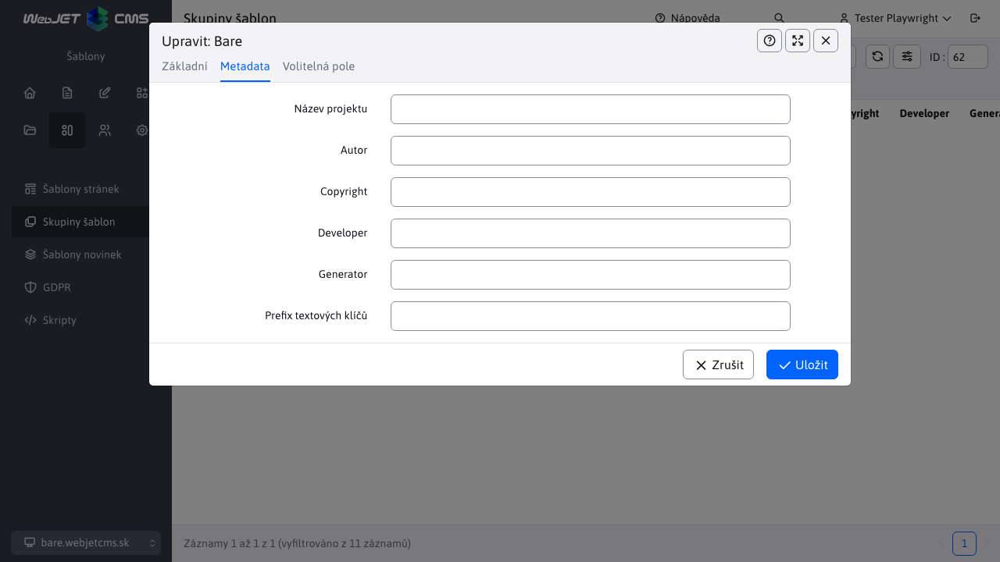

# Holá šablona

Základní ukázka šablony pro WebJET CMS pomocí [Šablony Thymeleaf](http://docs.webjetcms.sk/v2022/#/frontend/thymeleaf/README) napsané ve formátu [PugJS](http://docs.webjetcms.sk/v2022/#/developer/frameworks/pugjs). Je založen na [Spustit Bootstrap - Bare](https://startbootstrap.com/template/bare/).

Doporučujeme ji použít jako základ pro jakoukoli novou šablonu pro WebJET CMS.

Zdrojový kód šablony můžete získat v části [WebJET CMS github repozitář](https://github.com/webjetcms/templates-bare).


## Použití v systému WebJET CMS

Stáhněte si šablonu a umístěte ji do složky `templates/bare/bootstrap-bare/` (pokud používáte projekt gradle, tak samozřejmě ještě na `src/main/webapp`). Pokud jej umístíte do jiné složky, musíte upravit cesty ve zdrojových kódech, stačí vyhledat tento řetězec v souborech a upravit cestu.

Všechny cesty, které zapíšete do `.pug/.scss/.js` soubory, které používáte, včetně předpony `/templates/bare/....` tedy jako pro použití v systému WebJET. Pokud spustíte místní verzi prostřednictvím `npm run start`, ale cesty mají předponu `/` (protože kořenová složka je ve skutečnosti `dist`). V souboru `node_scripts/bs-config.js` je nastaveno přesměrování, pokud změníte cestu k šabloně, nezapomeňte ji upravit také v tomto souboru.

V terminálu přejděte do složky `src/main/webapp/templates/bare/bootstrap-bare` a generovat `dist` verze příkazu:

```sh
npm install
npm run build
```

Před vytvořením nové struktury domény/stránek v systému WebJET CMS doporučujeme nejprve vytvořit šablony.

### Skupina šablon

Vytvořte novou skupinu šablon s názvem `Bare`, nastavte pole:
- `Priečinok` nastavit na `/templates/bare/bootstrap-bare` (nebo do složky, kde máte šablonu).
- `Typ editora stránok` nastavit na `Page Builder`.


Na kartě Metadata nastavte:
- `Autor, Copyright, Developer, Generator` k vašim datům (použitým v šabloně)



### Šablona

Vytvoření nové šablony `Bare - Hlavná šablóna`, nastavte pole:
- `Názov šablóny` na hodnotu `Bare - Hlavná šablóna`
- `HTML Šablóna` na hodnotu `bare/bootstrap-bare/dist/index.html` (pokud se složka dist ve výběru nezobrazí, zkontrolujte, zda jste vygenerovali `dist` verze po stažení šablony).


Na kartě Styl nastavte

- `Hlavný CSS štýl` na hodnotu `/templates/bare/bootstrap-bare/dist/css/ninja.min.css`.


### Struktura webových stránek

Pokud jste ještě nevytvořili novou strukturu domény/sídla, můžete nyní **vytvořit novou doménu** a nastavit její šablonu `Bare - Hlavná šablóna`:
- klikněte na Webové stránky - seznam webových stránek
- klikněte na ikonu `+` přidání nové složky
- Zadejte název složky `Slovensky`
- zadejte název položky nabídky `sk`
- zadejte hodnotu do adresy URL `sk`
- nastavit rodičovskou složku na kořenovou složku (hodnota `/`)
- nastavit doménu


Na kartě Šablona:
- v poli Šablona pro webové stránky vyberte `Bare - Hlavná šablóna`


Pokud již máte vytvořenou strukturu domény/místa, doporučujeme upravit stávající složky - na kartě Šablona složky nastavte. `Bare - Hlavná šablóna` a zapněte možnost `Aplikovať na všetky existujúce podpriečinky a podstránky`. Nastavte to také na kartě `Systém` do stávajících složek.

### Úprava záhlaví a zápatí

Přejděte do části Webové stránky - Seznam webových stránek, klikněte na kartu Systém a přejděte do složky Záhlaví. Otevřete stránku `Základná hlavička` v editoru. Na kartě Šablona zkontrolujte, zda stránka používá šablonu. `Bare - Hlavná šablóna` (pokud ne, nastavte a uložte stránku a znovu ji otevřete v editoru). Odstraňte vše na stránce a poté přidejte blok Page Builder. `Header-menu`.

Zobrazí se 3 sloupce:
- Logo WebJET - můžete si ho vyměnit za logo vhodné pro vaše stránky
- Nabídka aplikace - pravděpodobně není správně nastavena kořenová složka, klikněte v aplikaci na ikonu tužky a v okně nastavení aplikace změňte nastavení. `Koreňový adresár` do adresáře domény. Zatím jste však nevytvořili strukturu stránek, takže aplikace zatím nic nezobrazí.
- Přepínání jazyků - zobrazí přepínač jazyků `SK - EN` Pokud jazykové mutace nepoužíváte, můžete aplikaci odstranit.


Podobně postupujte i při nastavení zápatí (str. `Základná pätička`), vše vymažte a vložte blok `footer-footer`. Kromě standardních textových sloupců, kde můžete snadno upravovat text podle svých potřeb, obsahuje zápatí aplikace:
- Přihlášení k `newslettra` (hromadný e-mail) - používá se zjednodušená verze s pouhým polem pro zadání e-mailu. Zjednodušený registrační formulář se registruje do všech e-mailových skupin, které mají tuto možnost povolenou `Povoliť pridávanie/odoberanie zo skupiny samotným používateľom` a `Vyžadovať potvrdenie e-mailovej adresy`.
- GDPR cookies - aplikace pro nastavení cookies, jejich seznam je převzat z aplikace GDPR-Cookie Manager, ve které nastavíte seznam cookies, které webové stránky používají. Můžete importovat [základní seznam souborů cookie](cookies.xlsx).

Přejděte do seznamu šablon a nastavte záhlaví/zápatí na šablonu `Bare - Hlavná šablóna` (na kartě Šablona nastavte pole Záhlaví a Zápatí).

Poznámka: šablona obsahuje nabídku v záhlaví, proto v nastavení šablony ponechte položky Hlavní a Boční navigace prázdné.

### Nastavení jazykových mutací

Šablona je připravena pro jazykové mutace, používá aplikaci Zrcadlení struktury. Doporučujeme vytvořit kořenové složky v seznamu webových stránek (karta Složky). `Slovensky` a `English`.

Nastavení pole na složky `URL adresa` na hodnotu `sk` nebo `en`, nastavené stejným způsobem `Názov položky v menu` na hodnotu `sk` nebo `en` (tato položka se zobrazí v záhlaví přepínače jazyků) a na kartě Šablona pole `Jazyk` na příslušnou hodnotu. Poté postupujte podle pokynů pro [nastavení zrcadlení](http://docs.webjetcms.sk/v2022/#/redactor/apps/docmirroring/README).

Pro druhou jazykovou verzi vytvořte kopie záhlaví/zápatí, přidejte předponu pro automatické použití v příslušné jazykové verzi. `EN-` k názvu stránky (např. stránka `Default Hlavička` duplikát na `EN-Default Hlavička`). Na stránce upravte nastavení aplikace (kořenová složka aplikace menu).

### Vytváření stránek

Šablona obsahuje několik hotových bloků, které můžete do stránky přidat jednoduše pomocí PageBuilderu.

## Pro webového designéra

Pokud chcete upravit kód šablony (HTML, CSS, JavaScript), prostudujte si níže uvedené body.

### Struktura stromu

Všechny soubory šablon jsou umístěny ve složce src, která má následující strukturu:
- `assets` - obrázky, ikony a písma, doporučujeme dodržovat navrhovanou strukturu podsložek. Ve složce `images` jsou k dispozici ukázkové obrázky pro bloky PageBuilder.
- `js` - JavaScript, hlavní soubor je `ninja.js`.
- `pug` - Kód HTML šablon ve formátu [PugJS](https://pugjs.org/).
  - `includes` - Sdílené bloky mezi šablonami (např. záhlaví sdílené mezi šablonou hlavní stránky a podstránkou).
  - `pagebuilder` - bloky pro [PageBuilder](http://docs.webjetcms.sk/v2022/#/frontend/page-builder/blocks). V blocích doporučujeme co nejvíce využívat možnosti `include`. Do `container` vložit existující bloky `column` bloků a do `section` Stávající `container` Bloky. Při změně `column` se změna projeví také v bloku `container` a `section` bloky.
- `scss` - Styly CSS ve formátu pro [Ninja](http://docs.webjetcms.sk/v8/#/ninja-starter-kit/)

Šablony návrhů jsou zkompilovány z formátu pug do formátu HTML pro použití prostřednictvím [Thymeleaf](http://docs.webjetcms.sk/v2022/#/frontend/thymeleaf/README). Pro prototypování pomocí `npm run start` doporučujeme postupovat podle možnosti `include` bloky pro PageBuilder do šablon. Tímto způsobem můžete ověřit zobrazení stránky a obsah současně s ověřením zobrazení bloku. V ideálním případě použijete všechny bloky na jedné stránce v prototypu. To usnadňuje vizuální ověření jejich funkčnosti a zobrazení při změně stylů CSS nebo kódu HTML.

### Generování verze dist

`dist` pro vytvoření adresáře použijte následující příkazy:

```sh
#vygenerovanie dist adresara
npm run build

#vygenerovanie dist adresara, spustenie sledovania zmien v suboroch cez browser-sync a spustenie chrome
#v tomto rezime je spusteny prehliadac pocuvajuci na zmeny v suboroch
#POZOR: je napojeny len na ciste HTML subory, nie na plny WebJET, bezi teda bez Thymeleaf sablon
#vyhodne na prototypovanie HTML/CSS bez potreby spustenia celeho WebJET CMS
npm run start
```

individuální `npm` skripty jsou definovány v [package.json](package.json) v prvcích `scripts` a vyrobené z `node_scripts/*.js` Adresář:
- `npm run build` - generuje kompletní `dist` Adresář.
- `npm run build:assets` - znovu vygeneruje soubory z adresáře `assets` (obrázky, ikony písma).
- `npm run build:pug` - přegeneruje soubory HTML ze zdrojových souborů pug.
- `npm run build:scripts` - znovu vygeneruje soubory JavaScriptu z adresáře src.
- `npm run build:scss` - generuje soubory css ze zdrojového kódu `scss` soubory.
- `npm run clean` - maže `dist` Adresář.
- `npm run start` - spustí režim prototypování - generuje `dist` sleduje změny v souborech a otevře prohlížeč s verzí prototypu.
- `npm run start:debug` - spustí režim prototypování pomocí `debug` Režim prohlížeče.

Konfigurace pro režim prototypování `browser-sync` se nachází v souboru [node-scripts/bs-config.js](node_scripts/bs-config.js). Možná je potřeba upravit cestu pro nahrazení adres písem/obrázků, které jsou v souborech CSS propojeny s plnou adresou URL (protože během prototypování se adresa URL stránek liší od adresy ve finální verzi prostřednictvím systému WebJET CMS).

### Zpracování souborů v jazyce JavaScript

Aby bylo možné používat moduly npm přímo v souboru [ninja.js](src/js/ninja.js) se používá [browserify](https://www.npmjs.com/package/browserify) s prodloužením [esmify](https://www.npmjs.com/package/esmify). Zpracování je v souboru [render-scripts.js](node_scripts/render-scripts.js).

Důvodem je, že všechny knihovny JavaScriptu použité na webové stránce lze spravovat prostřednictvím npm (tj. snadno aktualizovat).

V souboru `ninja.js` abyste mohli použít `import/require` importovat knihovny potřebné pro zobrazení stránky.

Pak můžete použít [npm-check-updates](https://www.npmjs.com/package/npm-check-updates) pro správu verzí a snadné aktualizace.

### Seznam stylů pro editor

V editoru můžete kromě základních formátovacích prvků Odstavec a Nadpis 1-6 přidat také potřebné styly CSS. V zájmu komplexnosti `ninja.min.css` jsou zapsány do souboru `src/scss/editor.scss` který je generován na `dist/css/editor.css`.


Podporováno je základní použití stylů na libovolný prvek i stylování konkrétních prvků HTML:

```css
.blue {
    color: blue;
}
.zvyrazneny-text {
    background-color: yellow;
}

a {
    &.btn.btn-primary {
        /*bootstrap default*/
    }
    &.btn.btn-secondary {
        /*bootstrap default*/
    }
}

table {
    &.table {
        &.table.table-dark {
            /*bootstrap default*/
        }
        &.table.table-striped {
            /*bootstrap default*/
        }
        &.table-bordered {
            /*bootstrap default*/
        }
    }
}
```

Pokud se kurzor nachází v tabulce, zobrazí se v poli pro výběr stylu také možnosti stylu pro tuto tabulku:


Při použití více stylů CSS najednou (např. `btn btn-primary`) se použijí na aktuálně vybraný prvek. Styly, které se aplikují pouze na prvek, se ve výběrovém poli nezobrazují, pokud není prvek vybrán nebo není přítomen kurzor.

Pokud `editor.css` nevkládáte ani do návrhu šablony, takže se její styly při zobrazení webové stránky neuplatní. Ve výchozím nastavení se tedy používá pouze jako seznam definic stylů.

Pokud chcete, můžete styl zobrazený v poli výběru v editoru definovat také přímo v jiných souborech. Takto definovaný styl však musí obsahovat komentář jako první. `/* editor */`. Příklad je v souboru `src/scss/3-base/_link.scss`:

```css
a {
    &.btn.more-info {
        /* editor */
        font-size: 150%;
        background-color: var(--bs-orange);
        color: var(--bs-white);
    }
}
```

ve výběrovém poli se zobrazí možnost nastavení stylu CSS. `btn more-info` na prvku A. Výhodou tohoto postupu je, že máte definici editoru i samotných stylů na jednom místě.

Při použití stylu CSS, který nemá nastavenou značku HTML, se styl použije na nadřazený prvek, ve kterém se nachází kurzor. Pokud chcete styl aplikovat pouze na vybraný text (selektor), musíte jej definovat pro značku HTML `span`:

```css
span.more-info {
    /* editor */
    font-size: 150%;
    background-color: orange;
    color: white;
}
```

Poté můžete vybrat text a použít tento styl pouze na vybraný text. Pokud by neměl značku HTML `span` by se použil na nadřazený prvek, tj. obvykle na celý odstavec - `p`.

## Vytváření bloků PageBuilder

Pokud potřebujete vytvořit nový blok pro PageBuilder, postupujte podle tohoto návodu.

### Struktura složky

Bloky jsou umístěny v `scr/pug/pagebuilder` a jsou v podsložkách `column,container,section` podle typu bloku. Ty jsou pak uspořádány podle svého významu; složky můžete pojmenovat libovolným způsobem. V knihovně bloků se pak zobrazí pod tímto názvem složky.

Doporučujeme postupovat odspodu, tj. nejprve vytvořit bloky voblasti `column` pak je pomocí include vložte do složky `container` a ten následně do `section`.

Například soubor `src/pagebuilder/column/card/card.pug`:

```javascript
.col-md-6
    .card
        .card-body
            h5.card-title Special title treatment
            p.card-text With supporting text below as a natural lead-in to additional content.
            a.btn.btn-primary(href='#') Go somewhere
```

Soubor `src/pug/pagebuilder/container/cards/cards.pug`

```
.container
    .row
        include ../../column/card/card
        include ../../column/card/card

```

Soubor `src/pug/pagebuilder/section/cards/cards.pug`

```
section
    include ../../container/cards/cards
```

Výhodou takového postupu je, že pokud něco změníte. `column` pug, projeví se to použitím `include` změna příkazu i v `container` také v `section` Verze.

### Generování náhledů bloků PageBuilder

Pokud upravíte soubor bloku pug pro PageBuilder, můžete vygenerovat náhledové obrázky voláním adresy `/components/grideditor/phantom/generator.jsp`. Použijte následující nastavení:
- Šířka: 1000
- Výška: 600
- přiblížení: 1
- docid: 383
- Šablona JSP: `/templates/bare/bootstrap-bare/dist/index.html`

Náhledové obrázky jsou generovány ve stejné struktuře jako soubory bloků pug. Jsou také generovány do `dist` složka. V procesu sestavování se obrazy kopírují ve skriptu `render-assets.js`. Při ruční změně obrázku můžete tento skript spustit pouze příkazem:

```sh
npm run build:assets
```

Generování vyžaduje nainstalované [PhantomJS](https://phantomjs.org/download.html), umístění a nastavení konfiguračních proměnných je v souboru `localconf.jsp`.

## Autorská práva a licence

Copyright 2013-2021 Start Bootstrap LLC. Kód uvolněn pod licencí [MIT](https://github.com/StartBootstrap/startbootstrap-bare/blob/master/LICENSE) licence.
