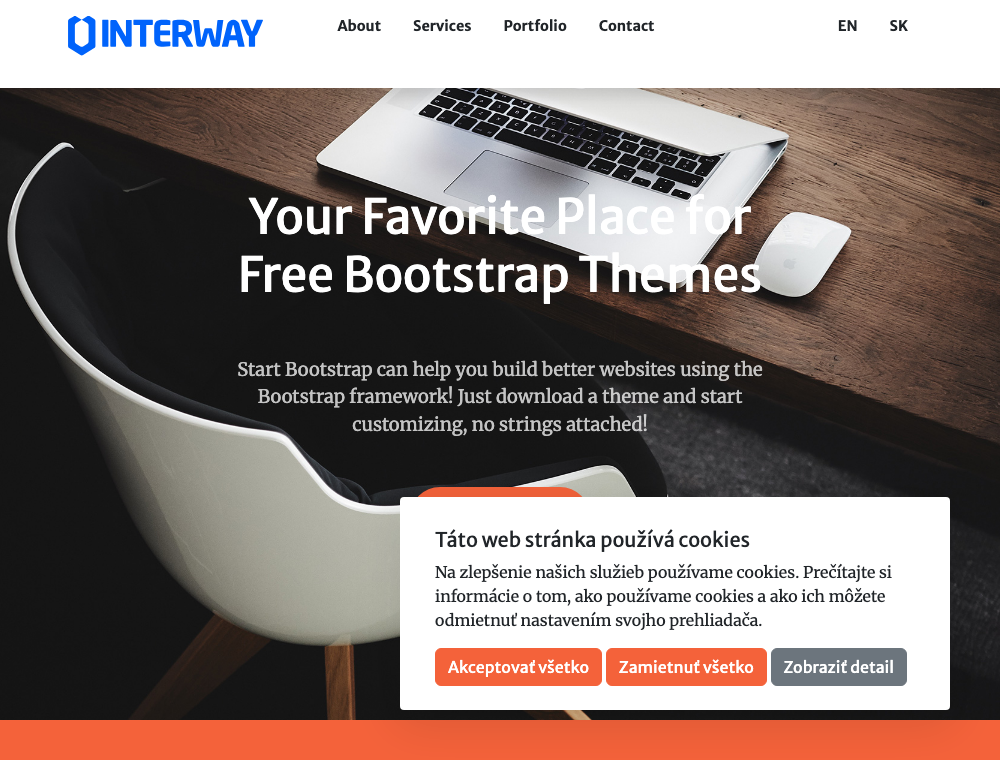
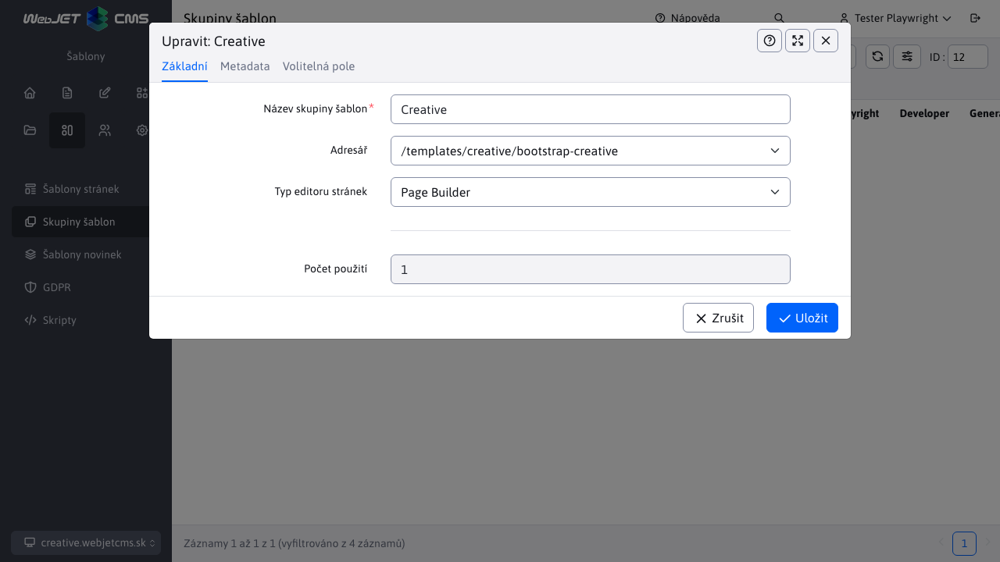
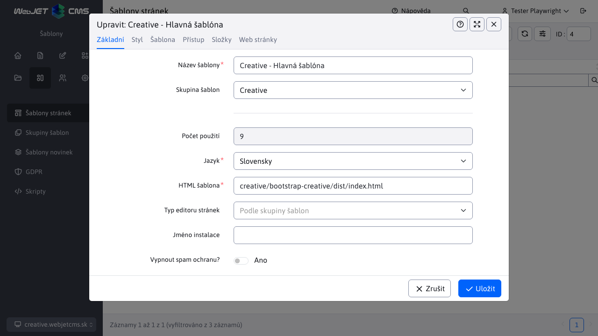
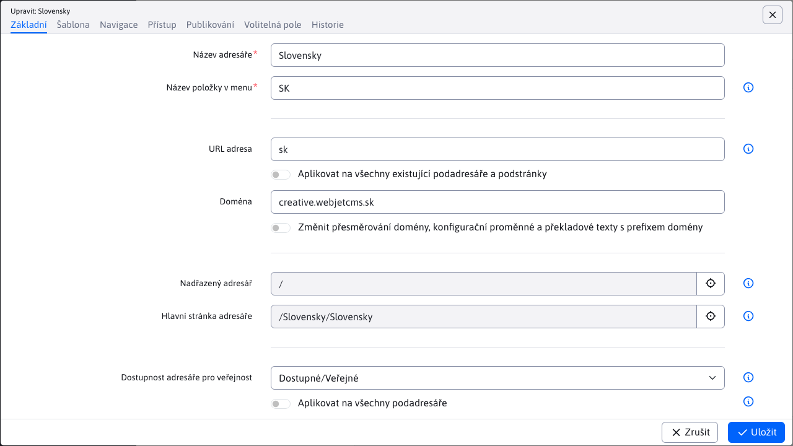
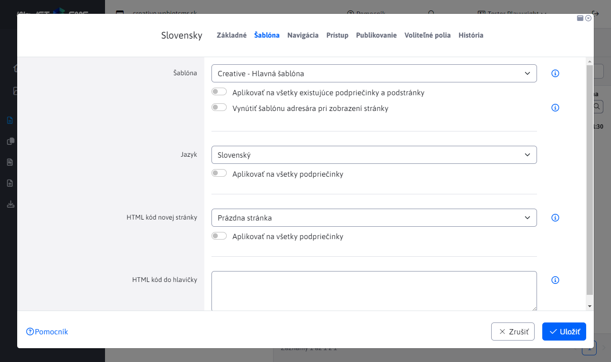

# Creative šablona

Základní jednostránková (`singlepage`) ukázková šablona pro WebJET CMS s využitím [Thymeleaf šablon](http://docs.webjetcms.sk/v2022/#/frontend/thymeleaf/README) napsaných ve formátu [PugJS](http://docs.webjetcms.sk/v2022/#/developer/frameworks/pugjs). Je založena na [Start Bootstrap - Creative]().

Zdrojový kód šablony můžete získat ve [WebJET CMS github repozitáři](https://github.com/webjetcms/templates-creative).

## Použití ve WebJET CMS

Použití je stejné jako při [Bare šabloně](../template-bare/README.md#použití-ve-webjet-cms), rozdíl je samozřejmě v názvech - všude nahraďte `bare` za `creative`. Složka se šablonou je `src/main/webapp/templates/creative/bootstrap-creative/`, použité cesty v šabloně a skupině šablon začínají na `/templates/creative/bootstrap-creative/`.

### Skupina šablon

Postupujte podle návodu pro Bare šablonu s upravenou cestou `/templates/creative/bootstrap-creative/`.

### Šablona

Postupujte podle návodu pro Bare šablonu s upravenou cestou `creative/bootstrap-creative/dist/index.html`. V kartě styl nastavte Hlavní CSS styl na `/templates/creative/bootstrap-creative/dist/css/ninja.min.css`.

### Struktura web stránek

Postupujte podle návodu pro Bare šablonu.

V kartě Šablona:
- v poli Šablona pro webové stránky vyberte `Creative - Hlavná šablóna`

### Nastavení hlavičky a patičky

Postupujte podle návodu pro Bare šablonu. Jelikož se jedná o jednostránkovou šablonu, připravené menu obsahuje přímo zadané kotvy (odkazy). Ty můžete upravovat, jsou tvořeny jako odrážkový seznam. Klepnutím na existující název se zobrazí okno pro nastavení textu a případného odkazu.

Nový můžete vytvořit tak, že kliknete na existující odkaz, okno nastavení odkazu zavřete kliknutím na Storno a následně se kurzorem posunete na místo kde chcete nový odkaz. Stiskněte `Enter` pro vytvoření nové odrážky (i když se zobrazuje v řádku) a napište text. Ten následně označte a klikněte na ikonu vytvoření odkazu. V okně zadejte URL adresu (např. `#mojblok`) a v kartě Rozšířené zadejte do pole Třídy stylu hodnotu `nav-link`.

Bloku v editoru stránek můžete nastavit ID (na které se pak v menu odkážete v poli URL adresa) kliknutím na ikonu ozubeného kola v modrém bloku (sekce) a následným zvolením ikony tužky v zobrazeném menu. Klepněte na Pokročilé a v kartě Selektor můžete nastavit ID bloku (např. `mojblok`).

## Pro web designéra

Postupujte podle návodu pro Bare šablonu, v Creative je navíc použit [Font Awesome](https://fontawesome.com). Kopírování jeho písem je nastaveno v `src/main/webapp/templates/creative/bootstrap-creative/node_scripts/render-assets.js` a importovány do CSS z NPM modulu v `src/main/webapp/templates/creative/bootstrap-creative/src/scss/ninja.scss`.
