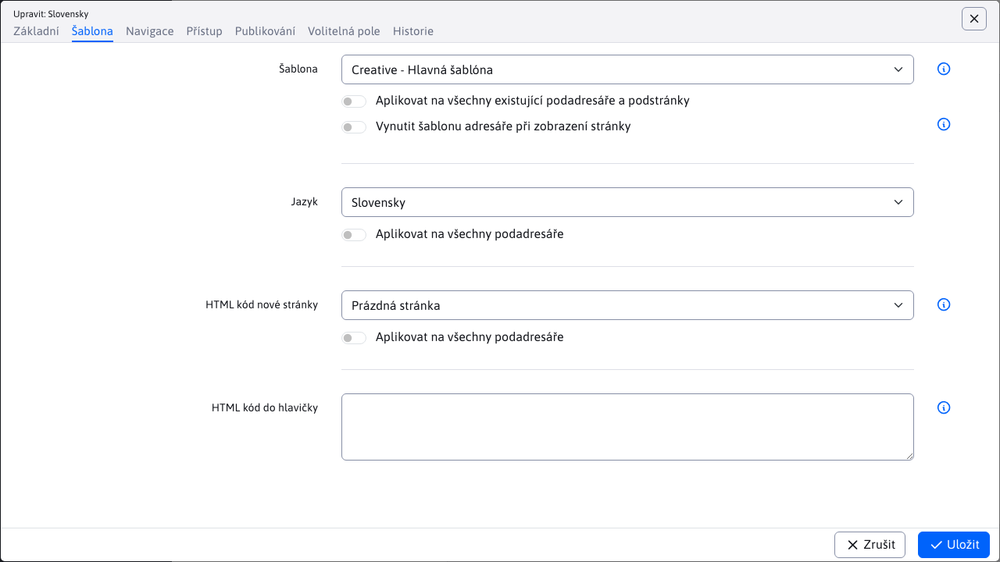

# Kreativní šablona

Základní jednostránkový (`singlepage`) vzorová šablona pro WebJET CMS pomocí [Šablony Thymeleaf](http://docs.webjetcms.sk/v2022/#/frontend/thymeleaf/README) napsané ve formátu [PugJS](http://docs.webjetcms.sk/v2022/#/developer/frameworks/pugjs). Je založen na [Start Bootstrap - Creative]().

Zdrojový kód šablony můžete získat v části [WebJET CMS github repozitář](https://github.com/webjetcms/templates-creative).

## Použití v systému WebJET CMS

Použití je stejné jako u [Holá šablona](../template-bare/README.md#použití-v-cms-webjet), rozdíl je samozřejmě v názvech - nahradit všude `bare` Pro `creative`. Složka šablony je `src/main/webapp/templates/creative/bootstrap-creative/`, cesty použité v šabloně a skupině šablon začínají na adrese `/templates/creative/bootstrap-creative/`.

### Skupina šablon

Postupujte podle pokynů pro šablonu Bare s upravenou cestou `/templates/creative/bootstrap-creative/`.

### Šablona

Postupujte podle pokynů pro šablonu Bare s upravenou cestou `creative/bootstrap-creative/dist/index.html`. Na kartě Styl nastavte styl Hlavní CSS na hodnotu `/templates/creative/bootstrap-creative/dist/css/ninja.min.css`.

### Struktura webových stránek

Postupujte podle pokynů pro šablonu Bare.

Na kartě Šablona:
- v poli Šablona pro webové stránky vyberte `Creative - Hlavná šablóna`

### Úprava záhlaví a zápatí

Postupujte podle pokynů pro šablonu Bare. Protože se jedná o jednostránkovou šablonu, připravené menu obsahuje přímo zadané kotvy (odkazy). Ty můžete upravovat, jsou vytvořeny jako seznam s odrážkami. Kliknutím na existující nadpis se zobrazí okno pro nastavení textu a případného odkazu.

Nový odkaz vytvoříte tak, že kliknete na existující odkaz, zavřete okno nastavení odkazu kliknutím na tlačítko Zrušit a poté přesunete kurzor na místo, kde chcete vytvořit nový odkaz. Stiskněte tlačítko `Enter` vytvořit novou odrážku (i když je na řádku) a zadat text. Poté jej vyberte a klikněte na ikonu vytvořit odkaz. V okně zadejte adresu URL (např. `#mojblok`) a na kartě Upřesnit zadejte hodnotu do pole Třídy stylů. `nav-link`.

ID bloku v editoru stránky (na který pak můžete odkazovat v poli URL v nabídce) nastavíte kliknutím na ikonu ozubeného kola v modrém bloku (sekci) a následným výběrem ikony tužky v zobrazené nabídce. Klikněte na tlačítko Upřesnit a na kartě Výběr můžete nastavit ID bloku (např. `mojblok`).

## Pro webového designéra

Postupujte podle pokynů pro šablonu Bare, v aplikaci Creative se navíc používá [Úžasné písmo](https://fontawesome.com). Kopírování jeho písem je nastaveno v `src/main/webapp/templates/creative/bootstrap-creative/node_scripts/render-assets.js` a importovány do CSS z modulu NPM v položce `src/main/webapp/templates/creative/bootstrap-creative/src/scss/ninja.scss`.
