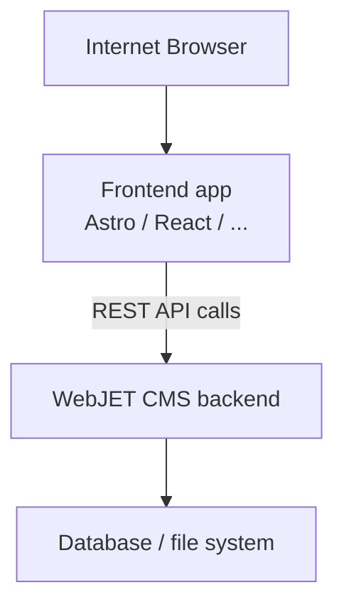

# Headless režim

WebJET CMS podporuje **headless** provozní režim, ve kterém slouží jako čistě `backend` CMS. Obsah, navigace, vyhledávání a formuláře jsou dostupné přes REST API. Frontend aplikace (např. Astro, Next.js, Vue, React nebo jakýkoli HTTP klient) si data stáhne a zobrazuje je podle vlastních šablon.


V jednom WebJET CMS můžete mít více (desítky) domén a následně mít menší web stránky vytvořené v různých technologiích, které konzumují a zobrazují obsah z CMS systému.

## Jak to funguje



- Všechny REST služby jsou dostupné na cestě `/rest/headless/v1/`.
- Autentifikace je řešena přes session cookies – frontend musí cookies ze CMS posouvat zpět prohlížeči (`Set-Cookie` hlavičky).

Na serverové straně jsou provedeny i aplikace, které mohou být také integrovány. Typicky ale vyžadují `jQuery/Bootstrap`, samozřejmě můžete [naprogramovat vlastní aplikaci](../../custom-apps/README.md) s technologií, kterou na frontend používáte.


## Konfigurační proměnné

Nastavení se konfigurují v administraci WebJET CMS → **Nastavení → Konfigurace** (nebo v `conf/constants.properties`).

| Proměnná | Popis | Příklad hodnoty |
| --- | --- | --- |
| `accessControlAllowOriginUrls` | Silnice (URL vzory), pro které se nastavuje CORS hlavička `Access-Control-Allow-Origin`. Oddělte čárkou. | `/rest/headless/*,/rest/*` |
| `accessControlAllowOriginValue` | Povoleno origin domény pro CORS. Může obsahovat více hodnot oddělených čárkou – backend automaticky vybere shodu podle `Referer` hlavičky požadavku. | `https://frontend.example.com` |
| `restAllowedIpAddresses` | IP adresy ze kterých lze volat [veřejné REST služby](../../custom-apps/spring/public-services.md) | `127.0.0.1` |

pokud nechcete povolit všechny REST služby můžete nastavit povolení na IP adresu pouze pro REST služby headless režimu:

`txt
restAllowedIpAddresses-HeadlessPageRestController
restAllowedIpAddresses-HeadlessNewsRestController
restAllowedIpAddresses-HeadlessActionsRestController
`

všechny nastavte na IP adresu, ze které budou volány, například `127.0.0.1`.

### Příklad nastavení CORS

Aby frontend aplikace běžící na `https://frontend.example.com` mohla volat API, nastavte:

```txt
accessControlAllowOriginUrls=/rest/*
accessControlAllowOriginValue=https://frontend.example.com
```

Máte-li více frontend (staging + produkce):

```txt
accessControlAllowOriginValue=https://frontend.example.com,https://staging.example.com
```

Backend automaticky vybere správnou hodnotu podle `Referer` hlavičky příchozího požadavku.

## Zabezpečení a XSRF

Backend kontroluje `Referer` hlavičku při POST požadavcích (ochrana před XSRF útokem). Frontend musí u server-side volání posílat i `Referer` hlavičku ze skutečného požadavku prohlížeče. V ukázkové Astro aplikaci to řeší pomocná funkce `createFetchOptions(request)` v `src/lib/api.ts`.

Pro klientské (browser) volání není XSRF kontrola aktivní, protože `Referer` posílá prohlížeč sám.

## Konfigurace frontend

Frontend aplikace se konfiguruje přes `.env` soubor (jednotný formát pro více frameworků).

### Nastavení API endpoint

Vytvořte `.env` soubor v kořenovém adresáři projektu:

```bash
# .env
PUBLIC_API_BASE=https://cms.iway.sk/rest/headless/v1
```

**Poznámka:** Prefix `PUBLIC_` je potřebný pro Astro – znamená, že proměnná bude dostupná iv prohlížeči. V klientském kódu se získává jako:

```typescript
const apiBase = import.meta.env.PUBLIC_API_BASE;
```

### Konfigurace podle prostředí

Můžete vytvořit více `.env` souborů:

- `.env` – výchozí nastavení
- `.env.local` – lokální nastavení (nebude commitnuto do Gitu)
- `.env.production` – produkční nastavení (pokud frontend sestavujete s `--mode production`)

Příklad `.env.example`:

```bash
# .env.example
# Headless CMS API endpoint (full path including /rest/headless/v1)
# Update this to match your Headless CMS server
PUBLIC_API_BASE=https://cms.example.com/rest/headless/v1

# Optional variables
#HEADLESS_PROXY_PREFIXES=/images/,/files/,/thumb/,/shared/,/components,/FormMailAjax.action,/rest/,/apps/form/mvc/
#HEADLESS_HOST=127.0.0.1
#HEADLESS_PORT=3000
#HEADLESS_HTTPS=true
#HEADLESS_HTTPS_CERT=./.cert/localhost.pem
#HEADLESS_HTTPS_KEY=./.cert/localhost-key.pem

# Disable SSL certificate verification for local development with self-signed certificates
#NODE_TLS_REJECT_UNAUTHORIZED=0
```

## Proxy pro statický obsah

Frontend aplikace obvykle potřebuje také sloužit obrázky, soubory a `/thumb` přímo z CMS backendu. Doporučujeme nakonfigurovat reverse proxy pro prefixy:

```txt
/images/
/files/
/thumb/
/shared/
/components/
/rest/
```

V ukázkové Astro aplikaci je proxy nakonfigurována automaticky v `astro.config.mjs`:

- **Backend origin se počítá automaticky** z `PUBLIC_API_BASE` (odstraněním `/rest/headless/v1`).

Další dostupné proměnné v `.env` souboru:

| proměnná | Popis | Výchozí hodnota |
| --- | --- | --- |
| `PUBLIC_API_BASE` | Úplná cesta na Headless API | `https://cms.example.com/rest/headless/v1` |
| `HEADLESS_PROXY_PREFIXES` | Prefixy URL, které se proxy-ují na backend | `/images/,/files/,/thumb/,/shared/,/components,/FormMailAjax.action,/rest/,/apps/form/mvc/` |
| `HEADLESS_HOST` | Host, na kterém poslouchá frontend server | `127.0.0.1` |
| `HEADLESS_PORT` | Port frontend-u | `3000` |
| `HEADLESS_HTTPS` | Zapne HTTPS pro frontend server (`true`/`false`) | `false` |
| `HEADLESS_HTTPS_CERT` | Cesta k SSL certifikátu (PEM) | `./.cert/localhost.pem` |
| `HEADLESS_HTTPS_KEY` | Cesta k SSL klíči (PEM) | `./.cert/localhost-key.pem` |

## Další zdroje

- [Seznam REST služeb](services.md)
- [Ukázková Astro aplikace](example.md)
