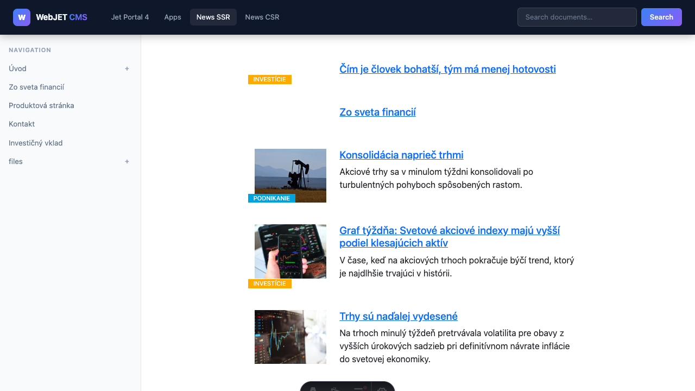

# Headless REST služby

Všechny služby jsou dostupné pod základní cestou:

```txt
/rest/headless/v1/
```

Odpovědi jsou ve formátu JSON. Chybové odpovědi mají strukturu:

```json
{
  "status": 404,
  "error": "Not Found",
  "message": "Page not found: /neexistujuca-stranka"
}
```

---

## Stránky

### GET `/rest/headless/v1/pages/by-path`

Vrátí obsah stránky podle její virtuální cesty.


**Parametry (query string):**

| Parametr | Povinný | Popis |
| --- | --- | --- |
| `path` | ano | Virtuální cesta stránky, například. `/o-nas` |
| `lng` | ne | Kód jazyku (např. `en`). Pokud není zadán, použije se výchozí jazyk domény. |
| `preview` | ne | `true` = náhled nezveřejněné verze (vyžaduje admin session) |

**Příklad volání:**

```bash
curl "https://cms.example.com/rest/headless/v1/pages/by-path?path=/o-nas"
```

**Odpověď:**

```json
{
  "docId": 42,
  "title": "O nás",
  "virtualPath": "/o-nas",
  "language": "sk",
  "body": "<h1>O nás</h1><p>Text stránky...</p>",
  "seo": {
    "metaTitle": "O nás – Firma s.r.o.",
    "metaDescription": "Krátky popis stránky pre vyhľadávače.",
    "metaKeywords": "firma, o nás",
    "canonicalUrl": "https://cms.example.com/o-nas",
    "robots": "index, follow"
  }
}
```

Pole `body` obsahuje kompletní HTML tělo stránky včetně všech WebJET komponent (news, formuláře, …) tak, jak by se zobrazilo v klasickém režimu. Frontend jej může vložit přímo do DOM nebo použít jen části.

---

### GET `/rest/headless/v1/preview/pages/by-id`

Vrátí obsah stránky podle `docId` (ID dokumentu). Určeno pro CMS editor – náhled před uveřejněním.

**Parametry:**

| Parametr | Povinný | Popis |
| --- | --- | --- |
| `docId` | ano | ID dokumentu |
| `lng` | ne | Kód jazyka |

---

## Navigace

### GET `/rest/headless/v1/navigation`

Vrátí stromovou strukturu navigace.

**Parametry:**

| Parametr | Povinný | Popis |
| --- | --- | --- |
| `rootPath` | ne | Virtuální cesta kořenové skupiny. `/` |
| `rootGroupId` | ne | ID skupiny – alternativa k `rootPath` |
| `depth` | ne | Maximální hloubka (0 = neomezená, ve výchozím nastavení 0) |
| `lng` | ne | Kód jazyka |

**Příklad volání:**

```bash
curl "https://cms.example.com/rest/headless/v1/navigation?rootPath=/&depth=2"
```

**Odpověď:**

```json
[
  {
    "docId": 10,
    "title": "Domov",
    "virtualPath": "/",
    "language": "sk",
    "level": 0,
    "hasChildren": true,
    "children": [
      {
        "docId": 11,
        "title": "O nás",
        "virtualPath": "/o-nas",
        "level": 1,
        "hasChildren": false
      }
    ]
  }
]
```

---

## Novinky (News)

### POST `/rest/headless/v1/news`

Vrátí stránkovaný seznam novinek. Používá POST kvůli složitější vstupní struktuře.



**Content-Type:** `application/json`

**Tělo požadavku (HeadlessNewsRequest):**

```json
{
  "groupIds": [24],
  "alsoSubGroups": false,
  "publishType": "new",
  "order": "date",
  "ascending": false,
  "paging": false,
  "pageSize": 10,
  "offset": 0,
  "perexNotRequired": false,
  "loadData": false,
  "checkDuplicity": false,
  "perexGroup": [],
  "perexGroupNot": []
}
```

| Pole | Typ | Popis |
| --- | --- | --- |
| `groupIds` | `number[]` | **Povinné.** Seznam ID skupin novinek |
| `alsoSubGroups` | `boolean` | Zahrnout také podskupiny (výchozí `false`) |
| `publishType` | `string` | Filtr publikování: `new` = aktuální, `old` = archiv (vypršeno), `all` = všechny, `next` = budoucí, `valid` = aktuální včetně data konce |
| `order` | `string` | Řazení: `date`, `title`, `priority`, `id` |
| `ascending` | `boolean` | `true` = vzestupně, `false` = sestupně |
| `paging` | `boolean` | Zapnout stránkování (výchozí `false`) |
| `pageSize` | `number` | Počet položek na stránku |
| `offset` | `number` | Posun (číslo záznamu od 0) |
| `perexNotRequired` | `boolean` | Zahrnout i novinky bez perexu |
| `loadData` | `boolean` | Načíst i plné HTML tělo novinky (`htmlData`) |
| `checkDuplicity` | `boolean` | Kontrola duplicity |
| `perexGroup` | `number[]` | Filtr podle skupin perexu (zahrnutí) |
| `perexGroupNot` | `number[]` | Filtr podle skupin perexu (vyloučení) |

**Odpověď:**

```json
{
  "items": [
    {
      "docId": 101,
      "title": "Nová novinka",
      "virtualPath": "/novinky/nova-novinka",
      "language": "sk",
      "perexImage": "/images/novinky/foto.jpg",
      "perexGroups": [1, 2],
      "htmlData": "Krátky perex text...",
      "publishStart": "2026-07-01T10:00:00",
      "groupId": 24,
      "available": true
    }
  ],
  "page": 1,
  "size": 10,
  "totalElements": 42,
  "totalPages": 5
}
```

Headless API pro novinky nyní povoluje načíst pouze adresáře nakonfigurované v proměnné `newsAdminGroupIds` a jejich podadresáře, čímž zabraňuje načítání novinek z nepovolených adresářů.

---

## Vyhledávání

### GET `/rest/headless/v1/actions/search`

Fulltextové vyhledávání v dokumentech.


**Parametry:**

| Parametr | Povinný | Popis |
| --- | --- | --- |
| `q` | ano | Hledaný výraz |
| `page` | ne | Číslo stránky (0-based, ve výchozím nastavení 0) |
| `size` | ne | Počet výsledků na stránku (výchozí 20, max. 100) |
| `scope` | ne | Omezení hledání (volitelné) |
| `lng` | ne | Kód jazyka |

**Příklad volání:**

```bash
curl "https://cms.example.com/rest/headless/v1/actions/search?q=produkt&page=0&size=20"
```

**Odpověď:**

```json
{
  "items": [
    {
      "docId": 55,
      "title": "Produkt XY",
      "virtualPath": "/produkty/produkt-xy",
      "language": "sk",
      "perex": "/images/news/produkt-xy.jpg",
      "snippet": "...text so zvýrazneným produktom..."
    }
  ],
  "page": 0,
  "size": 20,
  "totalElements": 3,
  "totalPages": 1
}
```

---

## Posílání cookies

Většina služeb vrací v odpovědi `Set-Cookie` hlavičku (např. session ID). Frontend musí tuto hlavičku posouvat prohlížeči, aby se zachoval stav session (přihlášení, jazykové nastavení, …).


Příklad v Astro (server-side):

```typescript
const result = await getPage('/o-nas', undefined, Astro.request);
const setCookie = result.headers.get('set-cookie');
if (setCookie) {
  Astro.response.headers.append('Set-Cookie', setCookie);
}
```

---

## TypeScript typy (lib/api.ts)

Ukázková Astro aplikace obsahuje hotový TypeScript klient v `docs/examples/headless-astro/src/lib/api.ts` se všemi typy a funkcemi pro každý endpoint. Můžete jej zkopírovat do svého projektu.
