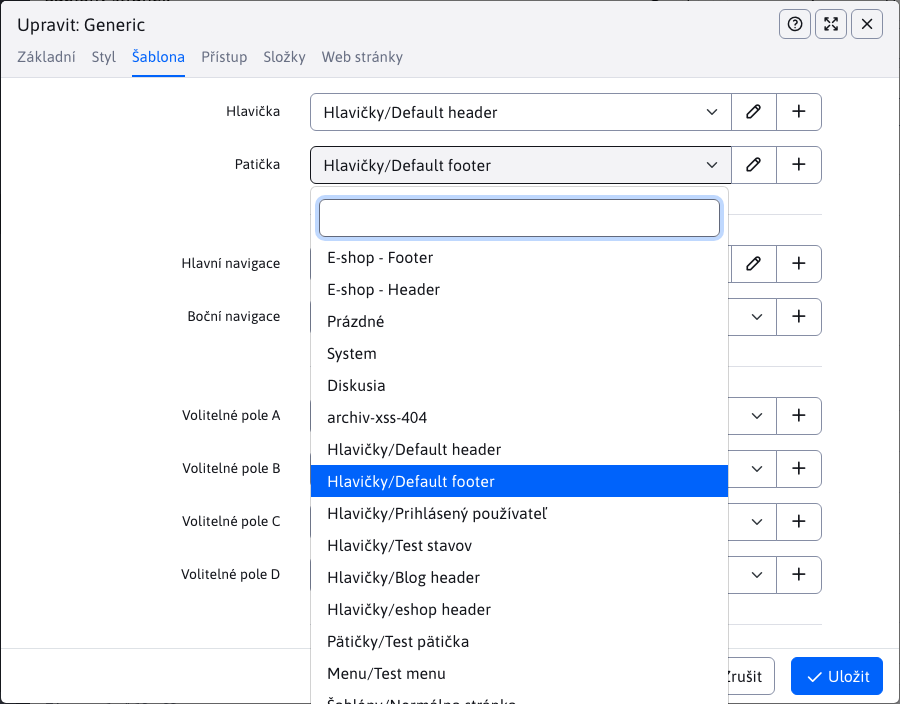

# Nastavení šablon

## Jedno web sídlo

Při použití pro jedno web sídlo/doménu není třeba nastavovat nic speciálního/rozdílného vůči WebJET 8

## Správa více domén

Při správě více domén je třeba definovat následující konfigurační proměnné:
- `multiDomainEnabled=true` - zapnutí správy více domén
- `enableStaticFilesExternalDir=true` - zapnutí dělení dat aplikaci pro domény samostatně a použití externího adresáře na statické soubory.
- `cloudStaticFilesDir=/cesta/na/disku/` - nastavení cesty k externím souborům domén. Jedná se o cestu na disku (např. `/mnt/cluster/static-files/`), která může být i mimo složku s web aplikací (např. na síťovém disku sdíleném mezi uzly clusteru). V případě potřeby můžete ale doménové soubory mít ve složce s web aplikací, tehdy můžete nastavit hodnotu `{FILE_ROOT}static-files` při kterém se makro `{FILE_ROOT}` nahradí za složku, ze které je web aplikace spuštěna.
- `templatesUseDomainLocalSystemFolder=true` - zapnutí používání lokálního `System` adresáře pro domény
- `multiDomainAdminHost` - pokud máte samostatnou/vyhrazenou doménu pro přístup do administrace nastavte doménové jméno. Pokud hodnota bude prázdná bude možné přistoupit do administrace na všech doménách.

Po nastavení těchto proměnných doporučujeme restart serveru nebo minimální smazání všech cache objektů.

Takové nastavení zajistí oddělení dat a souborů jednotlivých domén. Pokud potřebujete sdílet soubory mezi doménami můžete použít složku `/shared`, který je mezi doménami sdílen.

!>**Upozornění:** při použití externího adresáře WebJET potřebuje mít i prázdné složky `/images, /files` a případně `/shared` v kořenovém adresáři, aby je zobrazil v sekci Všechny soubory. Technicky do GIT repozitáře nelze push-nout prázdný adresář, vytvořte tedy v těchto adresářích nějaký prázdný soubor (ideálně něco jako `velmi-dlhy-nahodny-text.txt`).

WebJET 2021 zobrazuje složky v seznamu webových stránek pouze pro zvolenou doménu. Při uložení kořenové složky domény se automaticky vytvoří lokální `System` složka pro stránky hlaviček, patiček, menu atp. Při uložení kořenové složky domény je proto třeba obnovit celou stránku, aby se korektně načetl odkaz na složku `System`.

Složka `System` je na rozdíl od WebJET 8 uložen v kořeni (můžete jej zobrazit ve struktuře složek kliknutím na list Složky pri stlačené `shift` klávese) a ne v prvním adresáři zvolené domény (pokud ale existuje v doménovém adresáři, použije se ten).

Výběrová pole pro hlavičku, patičku, menu, volná pole v seznamu web stránek, nebo v úpravě šablony zobrazují stránky ve složce `System` a to včetně první úrovně podsložek (na rozdíl od WebJET 8). Ve složce `System` si tedy můžete sami vytvářet pod složky pro hlavičky, patičky, menu, případně podle šablon nebo jiného klíče. Jméno stránky má prefix jméno adresáře, tzn. `Hlavičky/Homepage`.

