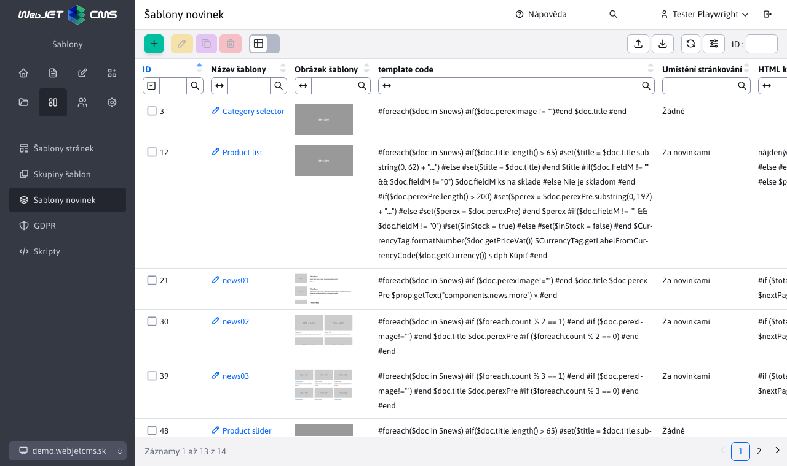

# Šablony novinek

Šablony novinek spravují designové šablony (HTML kód) pro aplikaci [Novinky](../../../redactor/apps/news/README.md). Podporovány jsou všechny akcie včetně exportu a importu. Pro přístup k sekci potřebujete právo Novinky - úprava šablon.



Sekce nahrazuje původní způsob definování šablon novinek pomocí překladových klíčů, které začínaly prefixem `news.template.`.


!> **Upozornění:** při prvním spuštění se **automaticky** konvertují překladové klíče s prefixem `news.template.` na šablony novinek do tabulky.

## Editor

Dostupná jsou následující pole:
- **Název šablony** - povinné pole s **jedinečným** název šablony novinek
- **Obrázek šablony** - pole pro výběr ilustračního obrázku zobrazených novinek (pro lepší orientaci při výběru šablony v aplikaci novinky)
- **Šablonovací nástroj** - výběr šablonovacího nástroje (dosud podporován pouze `Velocity`)
- **HTML kód** - kód šablony
- **Umístění stránkování** - místo kam se vloží stránkování
- **HTML kód stránkování** - kód stránkování


## Vkládání kódu

Při vytváření nebo editaci šablony novinek máte možnost využít nabídky připravených kódů. Tyto kódy slouží k usnadnění práce a zobrazí se po **pravém kliku** na pole **HTML kód** nebo **HTML kód stránkování**, čímž se vyvolá okno s nabídkou. Každá sekce má ještě svoji pod-sekci, kde jsou již nabídky připravených kódů.


Po kliknutí na nabízený kód se zvolený kód vloží do pole nad kterým jste akci pravým klikem vyvolali. Takto si umíte jednoduše vytvořit šablonu.


!> **Upozornění:** nabídka pro pole **HTML kód** a **HTML kód stránkování** se liší.

## Příklady kódu

Šablony novinek používají [Velocity Engine](https://velocity.apache.org/engine/2.3/vtl-reference.html) pro zobrazení, je tedy možné definovat cykly, podmínky a jiný programový kód. Připraveny jsou šablony s jedním, dvěma i třemi sloupci. Šablony doporučujeme editovat pouze uživateli, kteří vědí co dělají a znají syntax `Velocity Engine`. Doporučujeme vycházet z připravených šablon a případně je jen upravovat. Standardní redaktor by neměl mít právo na editaci šablon novinek, měl by je jen používat.

Několik ukázek práce s pokročilými objekty:

```velocity
//nastavenie premennej podla pageParams objektu:
#set ($anonymousQuestions = $pageParams.getBooleanValue("anonymousQuestions", false))

//nastavenie premennej:
#set ($fileType = $media.mediaLink.split("[.]"))

//prechod cez zoznam perex skupin a nastavenie CSS triedy podla mena perex skupiny
<div class="grid-item grid-item-$doc.docId
#foreach($perexGroup in $doc.perexGroupNames)
    #if ($perexGroup == "news-red")
    grid-item-red
    #elseif ($perexGroup == "news-green")
    grid-item-green
    #elseif ($perexGroup == "news-blue")
    grid-item-blue
    #end
#end
" data-doc-id="$doc.docId">

//nacitanie medii a vypis
#foreach($media in $MediaDB.getMedia($doc, "files"))
    #set ($fileType = $media.mediaLink.split("[.]"))
    #if($fileType[1].equals('jpg') || $fileType[1].equals('png') || $fileType[1].equals('gif')) <a rel='wjimageviewer' href="$media.mediaLink"  > </a> #end
#end

//nacitanie medii a vypis
<div class="row"> #foreach($media in $MediaDB.getMedia($doc, "files"))
    #set ($fileType = $media.mediaLink.split("[.]"))
    #if(!$fileType[1].equals('jpg') && !$fileType[1].equals('png') && !$fileType[1].equals('gif')) <a href="$media.mediaLink" class="col-md-4 text-truncate icon-$fileType[1]" target="_blank"> $media.mediaTitleSk</a> #end
#end </div>

//vypis diskusnych prispevkov
//vyzaduje pridanie sk.iway.iwcm.forum.ForumDB do parametra Vlozit triedu do Velocity sablony
#set($forumDb = $ForumDB.getForumFieldsForDoc(null, $doc.docId))
#set($commentCount = $forumDb.size())
#set($showComment = 3)
#set($e = $commentCount - $showComment)
#foreach($forum in $forumDb)
    <div class="comment" #if($foreach.count > $e)style="display:block;"#end>
    <div class="comment-header"> $forum.autorFullName <span>$forum.questionDateDisplayDate $forum.questionDateDisplayTime</span> </div>
    <p>$forum.question</p>
</div>
#end

//vypis texu podla prihlaseneho/neprihlaseneho pouzivatela
#if ($actionBean.getCurrentUser()) LOGGED #end
#if (!$actionBean.getCurrentUser()) NOT-LOGGED #end

//zoznam vsetkych stranok ako odkazy - standardne $pages pouziva format 1 2 3 ... 7 8 9, pagesAll obsahuje 1 2 3 4 5 6 7 8 9
//v pages je objekt PaginationInfo, obsahuje property label, pageNumber, url, active, actual, first, last, link a getLi() pre ziskanie celeho HTML kodu LI elementu
$pagesAll
//celkovy pocet stran strankovania, napr 23, da sa ziskat aj z $lastPage.pageNumber
$totalPages

//podmienene zobrazenie ak je zadany perex obrazok
#if ($doc.perexImage!="")<a href="$context.link($doc)"></a>#end
```

Pokud potřebujete zobrazovat datum prvního uložení web stránky nastavte konf. proměnnou `editorAutoFillPublishStart` na hodnotu `true`. Po nastavení bude editor automaticky vyplňovat pole Datum začátku v kartě Perex v editoru aktuálním datem. Toto datum lze v případě potřeby i manuálně změnit. Následně v šabloně můžete použít následující objekty:

```velocity
//datum a cas posledneho ulozenia
$doc.lastUpdateDate $doc.lastUpdateTime

//datum a cas vytvorenia
$doc.publishStartString
```
