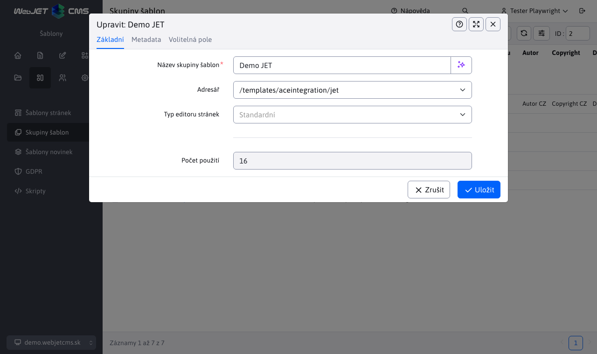

# Skupiny šablon

Skupiny šablon umožňují **nastavovat metadata více šablonám**, jako je např. název projektu, autor, copyright atp. Seskupení šablon je vhodné hlavně v projektech, kde se nachází několik domén s rozdílnými designy/šablonami.

## Seznam skupin šablon

Seznam skupin šablon zobrazuje přehled vytvořených skupin, ve výchozím nastavení existuje skupina nepřiřazené.

## Editor skupiny šablon

## Karta Základní

- Název skupiny šablon - jednoznačný název skupiny šablon.
- Složka - hlavní složka, ve které se nacházejí soubory šablony (JSP/HTML soubor s designem, CSS styly, JavaScript soubory).
- Typ editoru stránek:
  - Standardní - hlavní editor stránek s formátováním textu, vkládáním obrázků, odkazů atp.
  - HTML editor – používá se pro speciální stránky, které potřebují používat přesný HTML editor.
  - Page Builder - režim editace stránky skládající se z [připravených bloků](../page-builder/README.md).
  - `Grid Editor` - předchůdce režimu Page Builder, bude v roce 2024 odstraněn.
- Počet použití - počet šablon v této skupině.

## Karta Metadata

- Umožňuje nastavit metadata používaná v [hlavičce sablon](../thymeleaf/webjet-objects.md#ninja-šablona).
- Prefix textových klíčů - zadáním prefixu lze modifikovat překladové klíče aplikací vložených ve stránce. Příklad: pokud aplikace používá překladový klíč `components.inquiry.answers` a ve skupině šablon nastavíte prefix `jetportal`, tak se vyhledá při zobrazení aplikace klíč `jetportal.components.inquiry.answers` a pokud existuje, použije se. Pokud překlad pro tento klíč neexistuje, použije se samozřejmě původní hodnota z klíče `components.inquiry.answers`. Můžete tak snadno změnit text zobrazený v aplikaci v určité skupině šablon.

## Karta volitelná pole

Skupině lze definovat [volitelná pole](../webpages/customfields/README.md), jejichž použití záleží na designéru šablony.
