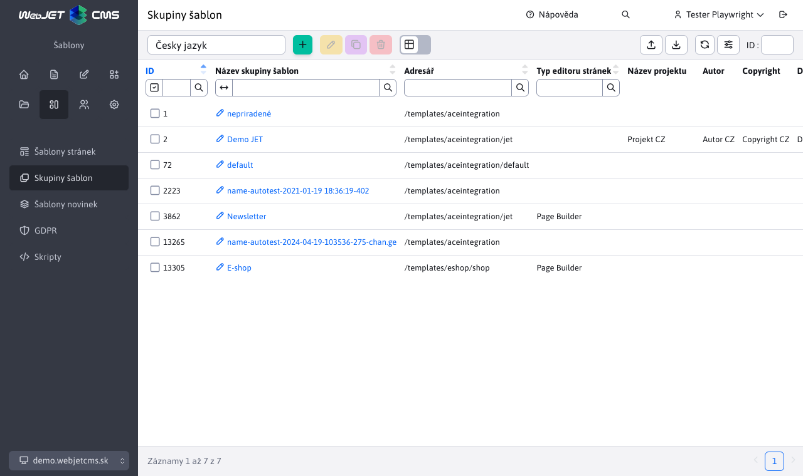

# Skupiny šablon

Skupiny šablon umožňují **nastavit metadata pro více šablon** jako je název projektu, autor, autorská práva atd. Seskupování šablon je užitečné zejména v projektech, kde existuje více domén s různými návrhy/šablonami.

## Seznam skupin šablon

Seznam skupin šablon zobrazuje přehled vytvořených skupin, ve výchozím nastavení je zde nepřiřazená skupina.

## Editor skupiny šablon

## Základní karta

- Název skupiny šablon - jedinečný název skupiny šablon.
- Složka - hlavní složka, ve které jsou umístěny soubory šablony (návrhový soubor JSP/HTML, styly CSS, soubory JavaScript).
- Typ editoru stránky:
  - Standardní - hlavní editor stránky s formátováním textu, vkládáním obrázků, odkazů atd.
  - Editor HTML - používá se pro speciální stránky, které potřebují přesný editor HTML.
  - Page Builder - režim úprav stránky, který se skládá z [připravené bloky](../page-builder/README.md).
  - `Grid Editor` - předchůdce režimu Page Builder, bude odstraněn v roce 2024.
- Počet použití - počet šablon v této skupině.

## Karta Metadata

- Umožňuje nastavit metadata používaná v aplikaci [záhlaví šablon](../thymeleaf/webjet-objects.md#šablona-ninja).
- Předpona textového klíče - zadáním předpony lze upravit překladové klíče aplikací vložených do stránky. Příklad: pokud aplikace používá překladový klíč `components.inquiry.answers` a nastavte předponu ve skupině šablon `jetportal`, aby se klíč vyhledával při zobrazení aplikace. `jetportal.components.inquiry.answers` a případně se použijí. Pokud pro tento klíč neexistuje žádný překlad, použije se samozřejmě původní hodnota z klíče. `components.inquiry.answers`. Text zobrazený v aplikaci můžete snadno změnit v určité skupině šablon.

## Karta Volitelná pole

Skupinu lze definovat [volitelná pole](../webpages/customfields/README.md) jehož použití závisí na tvůrci šablony.
