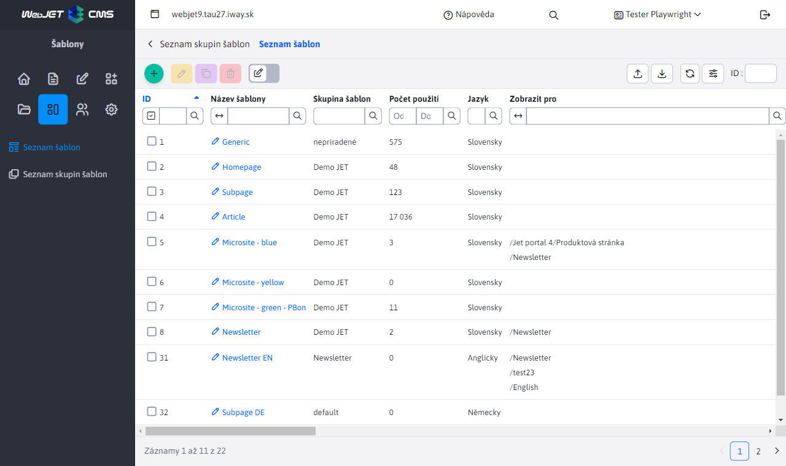
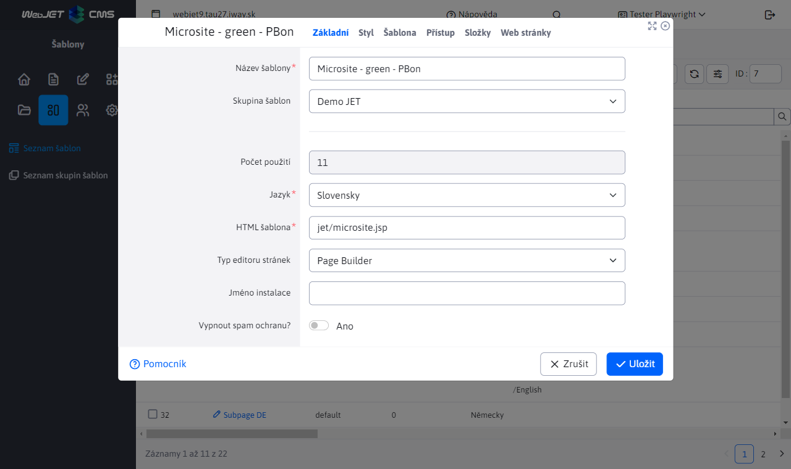

# Šablony

Šablony se vytvářejí v administrátorské oblasti Web JET v sekci Šablony kliknutím na nabídku Seznam šablon.

## Seznam šablon

Sloupec Počet použití zobrazuje počet stránek, které šablonu používají. Pokud je to 0 stránek, můžete šablonu odstranit. Pokud chcete odstranit šablonu, která je použita na některých stránkách, použijte funkci Sloučit šablony (pole Sloučit tuto šablonu do na kartě Šablona v editoru). Tímto způsobem se všechny stránky a složky používající aktuálně upravovanou šablonu změní na vybranou šablonu.

## Editor šablon

### Základní karta

- Skupina šablon - přiřazení šablony k [skupiny šablon](template-groups.md).
- Šablona HTML určuje, která šablona JSP/HTML se má použít (šablona HTML musí být uložena ve složce `/templates` a mají příponu `jsp` nebo `html`).
- Typ editoru stránky - určuje, jaký typ editoru stránky je použit, pro složité webové stránky se obvykle používá. [Page Builder](../page-builder/README.md). Ve výchozím nastavení se hodnota nastavená ve skupině šablon dědí.
- Název instalace - při zobrazení šablony je možné změnit název instalace, což ovlivní verze použitých aplikací - umožňuje použít ve složce pro šablonu speciálně upravenou aplikaci. `/components/MENO_INSTALACIE/aplikacia/`.
- Vypnout ochranu proti spamu - vypněte ochranu proti spamu, pokud je stránka v této šabloně načtena pomocí služby REST nebo pokud se jedná o stránku používanou pro hromadné zasílání e-mailů.

### Karta Styl

- Hlavní styl CSS - seznam odkazů na soubor CSS, který šablona používá. Výše uvedené CSS se také použije k získání seznamu stylů CSS pro výběr v editoru stránky.
- Sekundární styl CSS - další styl CSS, který se nepoužívá v nabídce Styly v editoru stránky.
- Kód HTML umožňuje definovat další kód HTML, který se vloží na konec stránky (nebo na místo definované v šabloně HTML).

Soubory CSS lze zadat každý na nový řádek nebo oddělit čárkou.

Editor stránek v oblasti administrace automaticky vyhledá soubor `/templates/template-name/dist/css/editor.css` který se načte spolu se stylem CSS šablony. V souboru `editor.css` můžete nadefinovat určité vlastnosti, které se budou používat pouze v editoru.

### Šablona karty

- Přiřazení webových stránek používaných jako záhlaví, zápatí atd.

V šabloně html se na zadaná místa vloží webové stránky definující záhlaví, zápatí a nabídku a vytvoří se šablona. Do šablony se poté vloží navigační panel a vlastní text webové stránky, čímž se vytvoří konečná webová stránka odeslaná do internetového prohlížeče návštěvníka.

- Sloučit tuto šablonu do - umožňuje nahradit aktuálně zobrazenou šablonu šablonou vybranou v poli výběru na existujících stránkách a složkách. Chcete-li se vyhnout nekonzistenci, použijte tuto funkci před odstraněním šablony.

### Karta Přístup

Umožňuje definovat složky, pro které se zobrazí šablona pro výběr při úpravě webové stránky.

### Karta Složky

Pro existující šablonu zobrazí seznam složek, které mají zobrazenou šablonu nastavenou jako výchozí šablonu pro vytvoření nové webové stránky.

### Karta Webové stránky

Pro existující šablonu zobrazí seznam webových stránek, které šablonu používají.

## Jazykové mutace

Pokud provozujete webové stránky ve více jazycích, není nutné vytvářet samostatné šablony pro každý jazyk. Doporučujeme použít možnost [nastavení jazyka pro složku webové stránky](../../redactor/webpages/group.md#šablona-karty).

Po nastavení jazyka složky WebJET automaticky vyhledá jazykové verze souvisejících záhlaví, zápatí a nabídek v šabloně. Pokud má šablona záhlaví pojmenované "výchozí záhlaví" nebo "výchozí záhlaví EN", bude WebJET při zobrazení stránky s nastaveným jazykem EN automaticky vyhledávat stránku s "výchozím záhlavím EN".

V šabloně tedy máte výchozí jazyk a výchozí záhlaví/zápatí/menu stránky. Nastavíte anglickou složku ve webových stránkách na angličtinu a WebJET bude při zobrazení stránky vyhledávat příslušné EN verze záhlaví/zápatí/stránek menu.

## Displej specifický pro zařízení

WebJET podporuje možnost přizpůsobení šablony pro konkrétní zařízení. Ve výchozím nastavení je to `phone, tablet, pc` podle připojeného zařízení, ale může být ovlivněna parametrem URL. `?forceBrowserDetector=blind` např. pro optimalizovanou šablonu pro zrakově postižené.

Typ zařízení se na serveru zjišťuje pomocí hlavičky HTTP. `User-Agent`. Telefon je detekován, když je nalezen výraz `iphone`, nebo `mobile` a zároveň výraz `android`. Tablet jako `ipad||tablet||kindle` nebo pokud obsahuje `android` a neobsahuje `mobile`.

Při zobrazení webové stránky v telefonu se vyhledá nastavená šablona webové stránky s výrazem `device=phone`. Pokud má stránka šablonu `Homepage` je vyhledána šablona `Homepage device=phone`. Pokud existuje, použije se.

V této optimalizované šabloně můžete použít jinou stránku záhlaví nebo jiný soubor šablony HTML.

Podobně se automaticky vyhledávají záhlaví/zápatí webových stránek, pokud je na stránce nastaveno. `Default header` je automaticky prohledáván `Default header device=phone`. Pokud existuje, použije se. Nemusíte tedy vytvářet samostatné šablony, stačí vytvořit vhodnou webovou stránku s upraveným záhlavím/zápatím.
