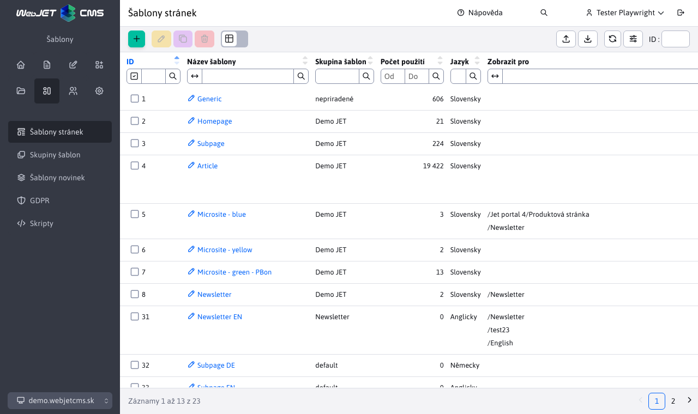

# Šablony

Šablony se vytvářejí v admin části Web JET v sekci Šablony po kliknutí na menu Seznam šablon.

## Seznam šablon

Sloupec počet použití zobrazuje počet stránek, které danou šablonu používají. Pokud je to 0 stránek, můžete šablonu vymazat. Chcete-li vymazat šablonu, která je použita na některých stránkách, použijte funkci sloučení šablon (pole Sloučit tuto šablonu do v kartě Šablona v editoru). Takto všechny stránky a složky, používající aktuálně editovanou šablonu budou změněny na zvolenou šablonu.

## Editor šablony

### Karta základní

- Skupina šablon - přiřazení šablony do [skupiny šablon](template-groups.md).
- HTML šablona definuje jaká JSP/HTML šablona se použije (HTML šablona musí být uložena ve složce `/templates` a mít příponu `jsp` nebo `html`).
- Typ editoru stránek - definuje jaký typ editoru stránek se použije, pro komplexní web stránky se typicky používá [Page Builder](../page-builder/README.md). Ve výchozím nastavení se dědí hodnota nastavená ve skupině šablon.
- Jméno instalace - při zobrazení šablony lze změnit jméno instalace, což ovlivňuje použité verze aplikací - umožňuje pro šablonu použít specificky upravenou aplikaci ve složce `/components/MENO_INSTALACIE/aplikacia/`.
- Vypnout spam ochranu - spam ochranu vypněte, pokud se stránka v této šabloně načítá pomocí REST služby, případně pokud se jedná o stránku použitou pro hromadný email.

### Karta Styl

- Hlavní CSS styl - seznam odkazů na CSS soubor, které šablona používá. Uvedený CSS se použije i pro získání seznamu CSS stylů pro výběr v editoru stránek.
- Druhořadý CSS styl - doplňkový CSS styl, nepoužije se pro výběrové menu Styly v editoru stránek.
- HTML kód umožňuje definovat dodatečný HTML kód, který se vloží na konec stránky (respektive na místo definované v HTML šabloně).

CSS soubory lze zadávat každý na nový řádek nebo oddělené čárkou.

Editor stránek v admin části automaticky hledá soubor `/templates/template-name/dist/css/editor.css` který načte spolu s CSS stylem šablony. V souboru `editor.css` můžete předefinovat určité vlastnosti, které mají být použity pouze v editoru.

### Karta Šablona

- Přiřazení web stránek použitých jako hlavička, patička atp.

Do html šablony se na určená místa vloží web stránky definující hlavičku, patičku a menu, čímž vznikne šablona. Do šablony se následně vloží navigační lišta a samotný text web stránky, čímž vznikne výsledná web stránka zaslaná do prohlížeče internetu návštěvníka.

- Sloučit tuto šablonu do - umožňuje nahradit právě zobrazenou šablonu zvolenou ve výběrovém poli ve stávajících stránkách a složkách. Aby nedošlo k nekonzistenci použijte tuto funkci před smazáním šablony.

### Karta Přístup

Umožňuje definovat složky, pro které se šablona bude zobrazovat pro výběr při editaci web stránky.

### Karta Složky

U stávající šablony zobrazuje seznam složek, které mají nastavenou zobrazenou šablonu jako výchozí šablonu pro vytvoření nové webové stránky.

### Karta Web stránky

U stávající šablony zobrazuje seznam web stránek, které šablonu používají.

## Jazykové mutace

Pokud provozujete web stránku ve více jazykových mutacích není třeba vytvářet samostatné šablony pro každou jazykovou mutaci. Doporučujeme využít možnosti [nastavení jazyka pro složku web stránky](../../redactor/webpages/group.md#karta-šablona).

Po nastavení jazyka složky WebJET automaticky vyhledá i jazykové mutace přiřazených hlaviček, patiček a menu v šabloně. Pokud má šablona nastavenou hlavičku s názvem "default hlavička" nebo "SK-default hlavička" automaticky při zobrazení stránky s nastaveným jazykem EN WebJET vyhledá stránku "EN-default hlavička".

V šabloně máte tedy výchozí jazyk a výchozí stránku záhlaví/patičky/menu. Složce English ve web stránkách nastavíte anglický jazyk a WebJET při zobrazení stránky bude hledat příslušné EN verze stránek pro hlavičky/patičky/menu.

## Zobrazení pro specifické zařízení

WebJET podporuje možnost úpravy šablony pro specifické zařízení. To je standardně `phone, tablet, pc` dle připojeného zařízení, lze jej ale ovlivnit pomocí URL parametru `?forceBrowserDetector=blind` Např. pro optimalizovanou šablonu pro slabozraké.

Typ zařízení se detekuje na serveru podle HTTP hlavičky `User-Agent`. Telefon se detekuje při nalezení výrazu `iphone`, nebo `mobile` a současně výrazu `android`. Tablet jako `ipad||tablet||kindle` nebo pokud obsahuje `android` a neobsahuje `mobile`.

Při zobrazení web stránky na telefonu se hledá nastavená šablona pro web stránku s výrazem `device=phone`. Pokud má stránka šablonu `Homepage` vyhledá se šablona `Homepage device=phone`. Pokud existuje, použije se.

V takto optimalizované šabloně můžete použít jinou stránku v hlavičce nebo jiný HTML soubor šablony.

Podobně automaticky se postupuje i pro hledání web stránek hlaviček/patiček, je-li nastavena stránka `Default header` automaticky se vyhledá `Default header device=phone`. Pokud existuje, použije se. Nemusíte tak vytvářet samostatné šablony, stačí vytvořit vhodnou web stránku s upravenou hlavičkou/patičkou.
