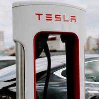

## Použití bodu zájmu

Pro `/thumb` používání [nastavený bod zájmu](../../redactor/apps/gallery/README.md) přidáním parametru URL `ip` (bod zájmu). Bod zájmu lze nastavit na libovolný obrázek, nejen na ten v galerii, kliknutím na tlačítko upravit v editoru stránky nebo v průzkumníku.

Pro demonstrační účely je označená oblast zájmu poměrně vysoká, aby bylo vidět, jak se provádí posun při generování snímků převážně čtvercového rozměru vzhledem k označené oblasti.

Pokud není označena žádná oblast, považuje se za označený celý obrázek.

Všimněte si pevně označeného stojanu Tesla.

## Pevná šířka

Máte pouze parametr `w`, výška `h` se vypočítá podle poměru stran původního výřezu.

Vytvoří se obrázek široký 200 pixelů, vypočítá se výška (tj. výsledek může být libovolně vysoký - v závislosti na poměru stran oblasti) a použije se pouze vybraná oblast. Výsledný obrázek má rozměr `200x270` bodů:

`/thumb/images/gallery/test-vela-foto/dsc04131.jpg?w=200&ip=1`

## Pevná výška

Máte pouze parametr `h`, šířka `w` se vypočítá podle poměru stran původního výřezu.

Stejně jako `ip=1` jsme zadali pouze výšku, šířka se vypočítá, výsledný obrázek má rozměr `148x200` bodů:

`/thumb/images/gallery/test-vela-foto/dsc04131.jpg?h=200&ip=2`

## Pevná šířka a výška vyplněná barvou

Výřez se celý vejde do zvolené velikosti. `w` a `h`, **Ne** je vycentrován a zbytek je obarven barvou z parametru `c` (výchozí bílá)

Zadali jste PŘESNOU velikost obrázku, do které se musí vybraná oblast vejít, ale obrázek může být reálně menší než zadaná část, v tomto případě. `300x200` bodů, pravá strana se obarví zadanou barvou (v příkladu výchozí bílá bez zadané barvy `c` parametr).

`/thumb/images/gallery/test-vela-foto/dsc04131.jpg?w=300&h=200&ip=3`

## Pevná šířka a výška vyplněná barvou - vycentrovaná

Výřez se celý vejde do zvolené velikosti. `w` a `h`, je vycentrován a zbytek je obarven barvou z parametru `c` (výchozí bílá)

Zadali jste PŘESNOU velikost obrázku, do které se musí vybraná oblast vejít, ale obrázek může být reálně menší než zadaná část. V tomto případě `300x200` bodů, okolí se obarví zvolenou barvou, takže obrázek bude mít VŽDY zadaný rozměr (nebude přeskakovat). Barva se zadává jako hexadecimální hodnota pomocí parametru `c` (bez znamení `#`).

`/thumb/images/gallery/test-vela-foto/dsc04131.jpg?w=300&h=200&ip=4&c=ffff00`

## Vystředěný s poměrem stran - snížený

Zmenšete výřez a vycentrujte jej tak, aby byl zachován poměr stran požadované velikosti.

Máte plochu 271x362 a chcete čtverec 200x200, výsledný obrázek je vystředěná část plochy v požadovaném poměru stran jako maximální velikost. To znamená, že celou oblast jakoby posuneme dolů a vycentrujeme (POZOR: nebereme oblast 200x200, ale čtverec 271x271 podle požadovaného poměru stran). Jako byste zvolenou oblast zvětšovali směrem k jejímu středu, dokud nevyplníte celý výřez (podle poměru stran, ne podle rozměru). Nejprve tedy provedete ořez podle poměru stran a poté jej zmenšíte na požadovaný rozměr.

`/thumb/images/gallery/test-vela-foto/dsc04131.jpg?w=200&h=200&ip=5`

Všimněte si, že v porovnání s označenou oblastí je obrázek oříznutý shora a zespodu (méně viditelný než označená oblast) kvůli odlišnému poměru stran označené oblasti a požadované velikosti.

## Vystředěno s poměrem stran - zvětšeno

Vybraný výřez bude ve výsledku kompletní, ale celkový výřez bude zvětšen podle poměru stran požadované velikosti.

V podstatě podobně jako `ip=5`, ale plocha se nezmenšuje, ale protože obrázek má i okolí, zvětšíme jej podle požadovaného poměru stran. To znamená, že výsledkem bude vždy CELÁ vybraná oblast, ale bude rozšířena do okolí (ideálně vystředěná, ale pokud je oblast na okraji, posune se):

`/thumb/images/gallery/test-vela-foto/dsc04131.jpg?w=200&h=200&ip=6`

Všimněte si, že v porovnání s označenou oblastí je obrázek rozšířen doprava a doleva (je viditelnější než označená oblast) z důvodu odlišného poměru stran označené oblasti a požadovaného rozměru.

## Vypnutí nastavené hodnoty bodu zájmu

V některých případech je vhodné nepoužít nastavenou hodnotu bodu zájmu, např. chcete-li použít. `ip=4`, tj. přesnou velikost obrázku vyplněného bílou barvou, ale nechcete použít nastavenou oblast zájmu (tj. použít co největší část obrázku). Stačí do adresy URL přidat parametr `noip=true` a nastavená hodnota se nepoužije.

`/thumb/images/gallery/test-vela-foto/dsc04068.jpeg?w=300&h=200&ip=4&noip=true&c=ffff00`

