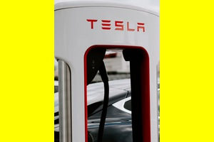

## Použití bodu zájmu

Pro `/thumb` se použití [nastavený bod zájmu](../../redactor/apps/gallery/README.md) přidáním URL parametru `ip` (interest point). Oblast zájmu lze nastavit na libovolný obrázek, nejen ten v galerii kliknutím na editaci v editoru stránek nebo v průzkumníku.

Pro ukázku je označená oblast zájmu poměrně vysoká, aby bylo zřejmé, jak se provádí posun při generování obrázků zejména čtvercového rozměru vůči označené oblasti.

Není-li označena žádná oblast považuje se za označený celý obrázek.

Všimněte si, že je těsně označen stojan Tesla.

## Fixní šířka

Máte zadaný pouze parametr `w`, výška `h` se dopočítá podle poměru stran původního výřezu.

Vygeneruje se obrázek široký 200 bodů, výška se dopočítá (tedy výsledek může být libovolně vysoký - podle poměru stran oblasti) a použije se jen zvolená oblast. Výsledný obrázek má rozměr `200x270` bodů:

`/thumb/images/gallery/test-vela-foto/dsc04131.jpg?w=200&ip=1`

## Fixní výška

Máte zadaný pouze parametr `h`, šířka `w` se dopočítá podle poměru stran původního výřezu.

Totéž jako `ip=1` jen máme zadanou pouze výšku, šířka se dopočítá, výsledný obrázek má rozměr `148x200` bodů:

`/thumb/images/gallery/test-vela-foto/dsc04131.jpg?h=200&ip=2`

## Fixní šířka a výška vyplněná barvou

Výřez se vejde celý do zvolené velikosti `w` a `h`, **ne** je centrován a zbytek je zabarven barvou z parametru `c` (výchozí bílá)

Máte zadanou PŘESNOU velikost obrázku, do které se zvolená oblast musí vejít, obrázek ale může být reálně menší než zadaná část, v tomto případě `300x200` bodů, pravá strana se obarví zadanou barvou (v ukázce výchozí bílá bez zadaného `c` parametru).

`/thumb/images/gallery/test-vela-foto/dsc04131.jpg?w=300&h=200&ip=3`

## Fixní šířka a výška vyplněná barvou - centrovaný

Výřez se vejde celý do zvolené velikosti `w` a `h`, je centrován a zbytek je zabarven barvou z parametru `c` (výchozí bílá)

Máte zadanou PŘESNOU velikost obrázku, do které se zvolená oblast musí vejít, obrázek ale může být reálně menší než zadaná část. V tomto případě `300x200` bodů, okolí se obarví zvolenou barvou, takže obrázek má VŽDY zadaný rozměr (nebude poskakovat). Barva se zadává jako hex hodnota parametrem `c` (bez znaku `#`).

`/thumb/images/gallery/test-vela-foto/dsc04131.jpg?w=300&h=200&ip=4&c=ffff00`

## Centrovaný s poměrem stran - zmenšený

Zmenší výřez a vycentruje tak, aby byl dodržen poměr stran požadované velikosti.

Máte oblast 271x362 a chcete čtverec 200x200, výsledný obrázek je centrovaná část z oblasti v požadovaném poměru stran jako max. velikost. Čili celou oblast jako kdyby posuneme směrem dolů a centrujeme (POZOR: nesebereme z ní 200x200, ale čtverec 271x271 podle požadovaného poměru stran). Jako kdyby přibližujete zvolenou oblast směrem do jejího středu, dokud nemáte vyplněn celý výřez (dle poměru stran, ne rozměru). Nejprve se tedy provede ořez podle poměru stran a následně zmenšení do požadované velikosti.

`/thumb/images/gallery/test-vela-foto/dsc04131.jpg?w=200&h=200&ip=5`

Všimněte si, že oproti označené oblasti je obrázek z důvodu rozdílného poměru stran označené oblasti a požadovaného rozměru oříznut z horní a spodní části (zřejmě méně než je označená oblast).

## Centrovaný s poměrem stran - zvětšený

Zvolený výřez bude komplet ve výsledku, ale celkově se výřez zvětší podle poměru stran požadované velikosti.

V podstatě podobné jako `ip=5`, ale oblast se nezmenšuje, ale jelikož obrázek má i okolí tak ji naopak zvětšíme podle požadovaného poměru stran. Čili ve výsledku bude vždy CELÁ zvolená oblast, ale bude rozšířena do okolí (ideálně centrovaná, pokud je ale oblast na kraji posune se):

`/thumb/images/gallery/test-vela-foto/dsc04131.jpg?w=200&h=200&ip=6`

Všimněte si, že oproti označené oblasti je obrázek z důvodu rozdílného poměru stran označené oblasti a požadovaného rozměru rozšířen vpravo a vlevo (vidno více než je označená oblast).

## Vypnutí nastavené hodnoty bodu zájmu

V některých případech je vhodné nepoužít nastavenou hodnotu bodu zájmu. chcete použít `ip=4`, neboli přesný rozměr obrázku vyplněný bílou barvou, ale nechcete použít nastavenou oblast zájmu (tedy použít co největší část obrázku). Do URL adresy stačí přidat parametr `noip=true` a nastavená hodnota se nepoužije.

`/thumb/images/gallery/test-vela-foto/dsc04068.jpeg?w=300&h=200&ip=4&noip=true&c=ffff00`

