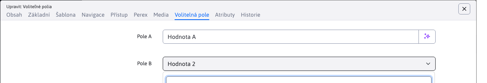
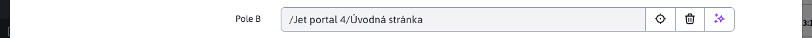

# Volitelná pole

Některá dialogová okna mají kartu volitelná pole, kde lze nastavovat volitelné atributy (hodnoty, texty) podle vaší potřeby. Hodnoty je následně možné přenést a použít v designové šabloně jako:

```html
Web stránka:
<iwcm:write name="field_a"/> až <iwcm:write name="field_t"/>

Adresár:
<iwcm:write name="group_field_a"/> až <iwcm:write name="group_field_d"/>
```

Názvy Pole A - Pole X lze změnit v konfiguraci v části editace textů. Stačí modifikovat klíče:
- `editor.field_x` - pro web stránku
- `temp-ID.editor.field_x` - pro web stránku se šablonou `ID` Např. `temp-3.editor.field_a` změní název volného pole A pouze pro web stránky, které používají šablonu s `ID` 3.
- `groupedit.field_x` - pro adresář
- `user.field_x` - pro uživatele
- `components.qa.field_x` - pro aplikaci Otázky a odpovědi
- `components.banner.field_x` - pro aplikaci Bannerový systém
- `components.media.field_x` - pro aplikaci Média
- `components.perex.field_x` - pro aplikaci Značky
- `components.invoice.field_x` - pro aplikaci Elektronický obchod

Technické informace se nacházejí v [dokumentaci pro programátora](../../../developer/datatables-editor/customfields.md).

## Typy polí

Pole se standardně zobrazují jako textová, pomocí změny definice přes překladové klíče lze typy polí změnit.


!>**Upozornění:**, **nastavení typu** se musí nastavit vždy pro výchozí jazyk (nastavený v konfigurační proměnné `defaultLanguage`), i když WebJET je používán v jiném jazyce.

### Text


Typ pole `text` je standardní textové pole. Je ale možné limitovat maximální velikost pole ai po zadaném počtu znaků zobrazit varování:
- `editor.field_x.type=text` - standardní textové pole o velikosti maximálně 255 znaků
- `editor.field_x.type=text-10` - standardní textové pole o velikosti maximálně 10 znaků
- `editor.field_x.type=text-160, warningLength-50` - standardní textové pole o velikosti maximálně 160 znaků, po zadání 50 znaků se zobrazí varování o překročení doporučené délky textu (např. pole popis Google doporučuje mít dlouhé 50-160 znaků)

Při dosažení zadaného počtu znaků v nastavení `warninglength` se zobrazí varování. Příklad takového varování :


Text samotného varování se získává z překladového klíče, který si musíte připravit a sestává z `prefix.field_x.warningText`. Klíč předchozí hlášky byl definován jako `editor.field_J.warningText=hláška...`.

### Textová oblast

Typ pole `textarea` je standardní textová (více řádková) oblast.

- `editor.field_x.type=textarea` - standardní textová oblast


### Needitovatelný text

Pro zobrazení jednoduchého textu můžete nastavit ty pole na hodnotu `label`. Hodnota se pouze zobrazí bez možnosti její editace.

- `editor.field_x.type=label` - needitovatelný text


### Výběrové pole



Pro možnost výběru z předem definovaných hodnot je možné do `.type` zadat možné hodnoty oddělené znakem `|`:

`editor.field_x.type=Hodnota 1|Hodnota 2|Hodnota 3`

Chcete-li mít možnost **nastavit prázdnou hodnotu** začněte seznam možností hodnotou `|`:

`editor.field_x.type=|Hodnota 1|Hodnota 2|Hodnota 3`

### Výběrové pole více možností


V případě potřeby použití výběru více možností se před hodnotu doplní `multiple`:

`editor.field_x.type=multiple:Hodnota 1|Hodnota 2|Hodnota 3`

Hodnoty se pak ukládají do pole oddělené pomocí znaku `|`

`Hodnota 1|Hodnota 3`

### Boolovská hodnota

Pro možnost zadání Boolovské/binární hodnoty zadejte do `.type` možnost `boolean`.

### Číslo

Pro možnost zadání číselné hodnoty zadejte do `.type` možnost `number`.

### Datum

Pro možnost zadání data zadejte do `.type` možnost `date`.

### Nezobrazit

Pokud potřebujete nepoužívaná pole skrýt můžete použít pole typu `none`.

`editor.field_x.type=none`

### Autocomplete


Pole typu `autocomplete` funguje podobně jako výběrové pole, ale umožňuje zadat i jinou hodnotu, než jsou výchozí možnosti. Funkce se zapne prefixem `autocomplete:` v možných hodnotách oddělených znakem `|`. Zároveň výchozí možnosti se zobrazují postupně po zadání alespoň 3 znaků:

`temp-3.editor.field_d.type=autocomplete:Autocomplete Možnosť 1|Autocomplete Iná možnosť|Autocomplete Pokus 3`

### Výběr obrázku


Pole pro výběr obrázku má typ `image`. Zobrazí standardní dialog pro nahrání/výběr stávajícího obrázku.

`editor.field_x.type=image`

### Výběr odkazu


Podobně jako pro obrázek je nastavením `.type` na hodnotu `link` možné otevřít výběr odkazu na soubor, nebo jinou web stránku:

`editor.field_x.type=link`

### Výběr složky webových stránek

Pro výběr složky webových stránek lze použít typ `json_group`:
- `editor.field_x.type=json_group` - zobrazí výběr složek webových stránek


- `editor.field_x.type=json_group_null` - přidáním `null` na konec typu lze nastavit i prázdnou hodnotu (zobrazí se tlačítko pro smazání vybrané složky)



### Výběr webové stránky

Pro výběr stránek lze použít typ `json_doc`:
- `editor.field_x.type=json_doc` - zobrazí výběr stránek


- `editor.field_x.type=json_doc_null` - přidáním `null` na konec typu lze nastavit i prázdnou hodnotu (zobrazí se tlačítko pro smazání vybrané webové stránky)


### Výběr složky souborového systému


Pro výběr adresáře v souborovém systému nastavením `.type` na hodnotu `dir`. Po kliknutí na ikonu kříže na konci textového pole se zobrazí dialogové okno pro výběr složky v souborovém systému.

`editor.field_x.type=dir`

### Výběr stávající stránky z adresáře


Pro výběr existující stránky (její `docId`) lze použít typ `docsIn_GROUPID`:
- `editor.field_x.type=docsIn_67` - zobrazí výběr stránky z adresáře 67
- `editor.field_x.type=docsIn_67_null` - přidáním `null` na konec typu lze vybrat i prázdnou možnost (nenastavit žádnou stránku)

### Číselník


Propojení na číselník je přes typ `enumeration_X` kde X je ID typu číselníku. Jako hodnota a label se ve výchozím nastavení nastaví `string1` hodnota z číselníku:
- `editor.field_x.type=enumeration_2` - zobrazí jako výběrové pole možnosti z typu číselníku 2, hodnota i label budou z `string1`
- `editor.field_x.type=enumeration_2_null` - přidáním `_null` na konec typu lze vybrat i prázdnou možnost

#### Vlastní sloupce pro label a hodnotu

Je možné specifikovat, které vlastnosti z číselníku se použijí pro label a hodnotu výběrového pole:
- `editor.field_x.type=enumeration_2_string1_id` - label bude z `string1`, hodnota z `id`
- `editor.field_x.type=enumeration_2_string2_string3` - label bude z `string2`, hodnota z `string3`
- `editor.field_x.type=enumeration_2_string1_id_null` - label bude z `string1`, hodnota z `id`, s možností prázdné hodnoty

Můžete použít kteroukoli vlastnost z číselníku:
- `string1` až `string12` - textová pole
- `decimal1` až `decimal4` - číselná pole
- `boolean1` až `boolean4` - boolovská pole
- `date1` až `date4` - datumová pole
- `id` - identifikátor záznamu v číselníku

### Unikátní identifikátor

Typ pole `uuid` umožňuje generovat unikátní identifikátor. Pokud má pole při zobrazení prázdnou hodnotu, vygeneruje se nový `uuid`, podobně, když smažete hodnotu a přejdete kurzorem do jiného pole vygeneruje se nová hodnota.


### Barva

Typ pole `color` umožňuje vybrat barvu včetně nastavení průsvitnosti.


## Propojení na šablonu

V některých případech je třeba mít definované různé názvy a možnosti volitelných polí podle šablony stránky/adresáře nebo podle skupiny šablon. WebJET umožňuje nastavit překladové klíče s prefixem `temp-ID.` pro šablonu, nebo s prefixem překladových textů nastavených ve skupině šablon:
- `temp-ID.editor.field_x=Pole X` - nastavení názvu pole pro šablonu se zadaným `ID`
- `temp_group_prefix.editor.field_x=Pole X` - nastavení názvu pole pro skupinu šablon, která má nastavený Prefix textových klíčů na hodnotu `temp_group_prefix`


## Propojení na doménu

Překladové klíče lze modifikovat i podle aktuální domény. Stačí nastavit konfigurační proměnnou `constantsAliasSearch` na `true`, což aktivuje vyhledávání konfiguračních proměnných a překladových klíčů s doménovým prefixem. Máte-li například. doménu `demo.webjetcms.sk` je možné vytvořit konfigurační proměnné typu `demo.webjetcms.sk-installName` ale také překladové klíče typu `demo.webjetcms.sk-editor.field_x.type=link`.

Doména se ale může měnit, proto doporučujeme vytvořit tvz. doménové aliasy. Ty lze nastavit více doménám na stejnou hodnotu (např. pro test a produkční domény) a při změně domény není třeba přejmenovat všechny klíče a konfigurační hodnoty. Alias definujete v konfiguraci jako novou proměnnou s názvem `multiDomainAlias:demo.webjetcms.sk` a hodnotou např. `demo`. Následně v prefixech klíče můžete použít prefix `demo` namísto celé domény.
