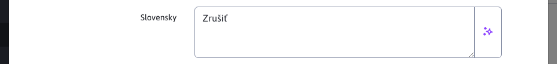

# Volitelná pole

Některá dialogová okna mají kartu volitelných polí, kde můžete nastavit volitelné atributy (hodnoty, texty) podle svých potřeb. Tyto hodnoty pak lze přenést a použít v šabloně návrhu jako:

```html
Web stránka:
<iwcm:write name="field_a"/> až <iwcm:write name="field_t"/>

Adresár:
<iwcm:write name="group_field_a"/> až <iwcm:write name="group_field_d"/>
```

Názvy Pole A - Pole X lze změnit v konfiguraci v části pro úpravu textu. Stačí upravit klíče:
- `editor.field_x` - pro webovou stránku
- `groupedit.field_x` - pro adresář
- `user.field_x` - pro uživatele
- `components.qa.field_x` - pro aplikaci Q\&amp;A
- `components.banner.field_x` - pro aplikaci Banner System
- `components.media.field_x` - pro aplikaci Média

Technické informace naleznete v [dokumentace pro programátora](../../../developer/datatables-editor/customfields.md).

## Typy polí

Pole se ve výchozím nastavení zobrazují jako text, změnou definice pomocí překladových klíčů je možné měnit typy polí.


**Varování:**, **nastavení typu** musí být vždy nastaven výchozí jazyk (nastavený v konfigurační proměnné `defaultLanguage`), i když je WebJET používán v jiném jazyce.

### Text


Typ pole `text` je standardní textové pole. Je však možné omezit maximální velikost pole a zobrazit varování i po určitém počtu znaků:
- `editor.field_x.type=text` - standardní textové pole s maximální velikostí 255 znaků.
- `editor.field_x.type=text-10` - standardní textové pole s maximální velikostí 10 znaků.
- `editor.field_x.type=text-160, warningLength-50` - standardní textové pole s maximální délkou 160 znaků, po zadání 50 znaků se zobrazí upozornění na překročení doporučené délky textu (např. Google doporučuje, aby pole popisu mělo 50-160 znaků).

Po dosažení zadaného počtu znaků v nastavení `warninglength` zobrazí se varování. Příklad takového varování :


Samotný text varování se získává z překladového klíče, který je třeba připravit a který se skládá z následujících částí. `prefix.field_x.warningText`. Úchyt předchozí zprávy je definován jako `editor.field_J.warningText=hláška...`.

### Textová oblast

Typ pole `textarea` je standardní textová (víceřádková) oblast.

- `editor.field_x.type=textarea` - standardní textová oblast



### Neupravitelný text

Chcete-li zobrazit prostý text, můžete pole ty nastavit na hodnotu `label`. Hodnota se pouze zobrazí bez možnosti úpravy.
- `editor.field_x.type=label` - needitovatelný text


### Výběrové pole


Chcete-li vybrat z předdefinovaných hodnot, můžete zadat. `.type` zadejte možné hodnoty oddělené znakem `|`:

`editor.field_x.type=Hodnota 1|Hodnota 2|Hodnota 3`

Pokud chcete mít možnost **nastavit prázdnou hodnotu** začít seznam možností hodnotou `|`:

`editor.field_x.type=|Hodnota 1|Hodnota 2|Hodnota 3`

### Výběrové pole s více možnostmi


Má-li být použita vícenásobná volba, je hodnota uvozena předponou `multiple`:

`editor.field_x.type=multiple:Hodnota 1|Hodnota 2|Hodnota 3`

Hodnoty jsou pak uloženy v poli odděleném znakem `|`

`Hodnota 1|Hodnota 3`

### Logická hodnota

Chcete-li zadat logickou/binární hodnotu, zadejte následující příkaz `.type` Možnost `boolean`.

### Číslo

Chcete-li zadat číselnou hodnotu, zadejte `.type` Možnost `number`.

### Datum

Chcete-li zadat datum, zadejte `.type` Možnost `date`.

### Nezobrazujte

Pokud potřebujete skrýt nepoužívaná pole, můžete použít pole typu `none`.

`editor.field_x.type=none`

### Automatické dokončování


Typ pole `autocomplete` funguje podobně jako pole pro výběr, ale umožňuje zadat jinou hodnotu než výchozí možnosti. Funkce je povolena předponou `autocomplete:` v možných hodnotách oddělených znaménkem `|`. Současně se po zadání alespoň 3 znaků postupně zobrazí výchozí možnosti:

`temp-3.editor.field_d.type=autocomplete:Autocomplete Možnosť 1|Autocomplete Iná možnosť|Autocomplete Pokus 3`

### Výběr obrázků


Pole pro výběr obrázku má typ `image`. Zobrazí standardní dialogové okno pro nahrání/výběr existujícího obrázku.

`editor.field_x.type=image`

### Výběr odkazů


Podobně jako na obrázku je nastavení `.type` na hodnotu `link` je možné otevřít výběr odkazu na soubor nebo jinou webovou stránku:

`editor.field_x.type=link`

### Výběr existující stránky z adresáře


Výběr existující stránky (její `docId`) je možné použít typ `docsIn_GROUPID`:
- `editor.field_x.type=docsIn_67` - zobrazí výběr stránek z adresáře 67
- `editor.field_x.type=docsIn_67_null` - přidáním `null` je také možné vybrat prázdnou možnost na konci typu (nenastavovat žádnou stránku).

### Adresář


Připojení k dialeru se uskutečňuje prostřednictvím typu `enumeration_X` kde X je ID typu číselníku. Hodnota je nastavena na ID záznamu z číselníku:
- `editor.field_x.type=enumeration_2` - zobrazí možnosti z číselníku typu 2 jako výběrové pole.

### Výběr adresáře souborového systému


Výběr adresáře v souborovém systému nastavením `.type` na hodnotu `dir`. Kliknutím na ikonu křížku na konci textového pole zobrazíte dialogové okno pro výběr adresáře v souborovém systému.

`editor.field_x.type=dir`

### Jedinečný identifikátor

Typ pole `uuid` umožňuje vygenerovat jedinečný identifikátor. Pokud má pole při zobrazení prázdnou hodnotu, vytvoří se nová hodnota. `uuid` Stejně tak když odstraníte hodnotu a přesunete kurzor do jiného pole, vytvoří se nová hodnota.


## Odkaz na šablonu

V některých případech je nutné mít různé názvy a možnosti pro volitelná pole definované podle šablony stránky/adresáře nebo podle skupiny šablon. WebJET umožňuje nastavit překladové klíče s předponou `temp-ID.` pro šablonu nebo s předponou textů překladu nastavenou ve skupině šablon:
- `temp-ID.editor.field_x=Pole X` - nastavení názvu pole pro šablonu se zadaným `ID`
- `temp_group_prefix.editor.field_x=Pole X` - nastavení názvu pole pro skupinu šablon, která má předponu textového klíče nastavenou na hodnotu `temp_group_prefix`


## Odkaz na doménu

Překladové klíče lze také upravit podle aktuální domény. Stačí nastavit konfigurační proměnnou `constantsAliasSearch` na adrese `true`, který aktivuje vyhledávání konfiguračních proměnných a překladových klíčů s předponou domény. Pokud máte například doménu `demo.webjetcms.sk` je možné vytvořit konfigurační proměnné typu `demo.webjetcms.sk-installName` ale také překladové klíče typu `demo.webjetcms.sk-editor.field_x.type=link`.

Doména se však může změnit, proto doporučujeme vytvořit tzv. doménové aliasy. Ty lze nastavit na stejnou hodnotu pro více domén (např. pro testovací a produkční doménu) a při změně domény není nutné přejmenovávat všechny klíče a konfigurační hodnoty. Alias definujete v konfiguraci jako novou proměnnou s názvem `multiDomainAlias:demo.webjetcms.sk` a hodnotu např. `demo`. Tuto předponu pak můžete použít v předponách klíčů. `demo` místo celé domény.
