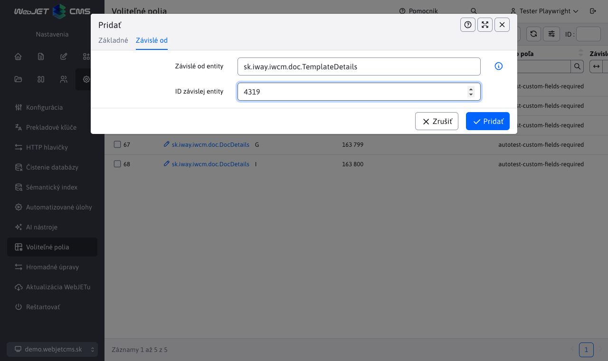

# Tabulka Volitelná pole

Tabulka Volitelná pole umožňuje centrálně nastavit vlastnosti volitelných polí pro různé entity v systému. Nastavení jsou uvedena v menu `Nastavenia` pod položkou `Voliteľné polia`. Pomocí této tabulky lze nastavit parametry povinného pole bez potřeby editace překladových klíčů.

!>**Upozornění:** Aktuálně funguje nastavení POUZE parametru **Povinné pole**, zbytek nastavení bude implementován v budoucnosti.

## Sloupce tabulky

Tabulka obsahuje následující sloupce:

| Sloupec | Popis |
| --- | --- |
| **Použít pro entitu** | Název třídy entity (např. `sk.iway.iwcm.doc.DocDetails`), pro kterou se nastavení aplikuje. Pole podporuje autocomplete - po zadání alespoň 1 znaku se zobrazí návrhy dostupných entit, které využívají volitelná pole. |
| **Volitelné pole** | Písmeno abecedy (AZ), kterým se identifikuje volitelné pole. Odpovídá názvem polí `field_A`, `field_B` atp. |
| **ID entity** | Volitelné ID konkrétní entity (např. ID stránky). Pokud není zadáno, nastavení se aplikuje globálně pro všechny entity dané třídy. |
| **Typ pole** | Typ volitelného pole (např. `text`, `textarea`, `boolean`, `number` atd.). |
| **Popis pole** | Popis (label), který se zobrazí u volitelného pole v editoru. |
| **Tooltip pole** | Text nápovědy, který se zobrazí po najetí myší přes ikonu<i class="ti ti-info-circle"></i> . |
| **Povinné pole** | Pokud je nastaveno na `true`, pole bude povinné a při uložení entity se zkontroluje, zda je vyplněno. |

V kartě Závislé od lze nastavit pole:

| Sloupec | Popis |
| --- | --- |
| **Závislé na entity** | Název třídy na které je toto nastavení závislé, používá se pouze pro `DocDetails` webové stránky kde je možné mít závislost na šabloně, nastavte `cz.iway.iwcm.doc.TemplateDetails` |
| **ID závislé entity** | ID entity na které je nastavení závislé, pokud se má volitelné pole takto nastavit pouze pro šablonu s ID 6 nastavte hodnotu 6 |

## Priorita nastavení

Nastavení se aplikují podle priority:

1. **Globální nastavení** - záznamy bez vyplněného `ID entity` platí pro všechny entity dané třídy.
2. **Specifická nastavení** - záznamy s vyplněným `ID entity` mají vyšší prioritu a přepíší globální nastavení pro daný identifikátor.
3. **Závislé na** - pro některé entity (např. `DocDetails`) se automaticky aplikuje i kontext šablony (`TemplateDetails`) podle použitého ID šablony, který má nejvyšší prioritu.

Např. pro web stránku (`DocDetails`) lze nastavit pole A jako povinné globální (bez ID entity), ale pro stránky se šablonou s konkrétním ID může být tato povinnost přepsána.

## Validace

Kombinace polí `Použiť pre entitu`, `Označenie poľa` a `ID entity` musí být jedinečná. Systém nedovolí vytvořit duplicitní záznam se stejnou kombinací těchto hodnot.

## Povinná pole

Pokud je pro volitelné pole zapnut příznak `Povinné pole`, systém automaticky:

- Označí pole jako povinné v editoru (zobrazí se vizuální označení povinného pole).
- Při ukládání entity zkontroluje, zda je pole vyplněno. Pokud není, zobrazí chybovou hlášku a uložení se nepovolí.
