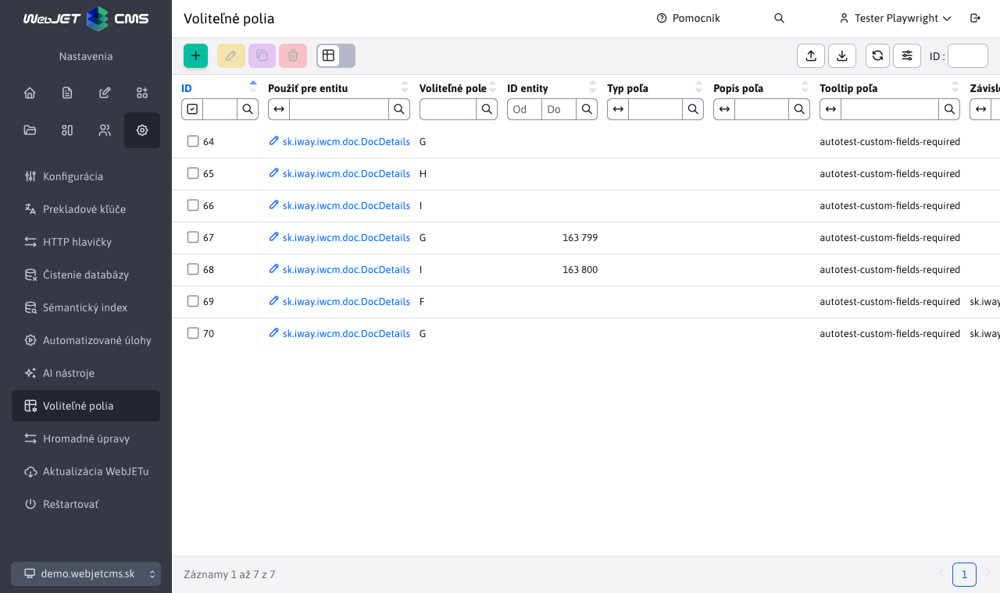

# Tabulka Volitelná pole

Tabulka Volitelná pole umožňuje centrálně nastavit vlastnosti volitelných polí pro různé entity v systému. Nastavení jsou uvedena v menu `Nastavenia` pod položkou `Voliteľné polia`. Pomocí této tabulky lze měnit typ pole, popis, povinnost, tooltip i typově specifické parametry bez potřeby editace překladových klíčů.



## Sloupce tabulky

Tabulka obsahuje následující sloupce:

| Sloupec | Popis |
| --- | --- |
| **Použít pro entitu** | Název třídy entity (např. `sk.iway.iwcm.doc.DocDetails`), pro kterou se nastavení aplikuje. Pole podporuje autocomplete - po zadání alespoň 1 znaku se zobrazí návrhy dostupných entit, které využívají volitelná pole. |
| **Volitelné pole** | Písmeno abecedy (AZ), kterým se identifikuje volitelné pole. Odpovídá názvem polí `field_A`, `field_B` atp. |
| **ID entity** | Volitelné ID konkrétní entity (např. ID stránky). Pokud není zadáno, nastavení se aplikuje globálně pro všechny entity dané třídy. |
| **Typ pole** | Typ volitelného pole (např. `text`, `textarea`, `boolean`, `number` atd.). |
| **Popis pole** | Popis (label), který se zobrazí u volitelného pole v editoru (můžete zadat překladový klíč). |
| **Tooltip pole** | Text nápovědy, který se zobrazí po najetí myší přes ikonu<i class="ti ti-info-circle"></i> . |
| **Povinné pole** | Pokud je nastaveno na `true`, pole bude povinné a při uložení entity se zkontroluje, zda je vyplněno. |


## Podporované typy pole

V poli **Typ pole** jsou dostupné typy:

| Typ | Zobrazení | Výběr |
| --- | --- | --- |
| `text` | Textové pole | Jednohodnotové |
| `textarea` | Textová oblast (více řádků) | Jednohodnotové |
| `select` | Výběrové pole (dropdown) | Jednohodnotové |
| `multiselect` | Výběrové pole s možností výběru více hodnot | Vícehodnotové (hodnoty oddělené `\|`) |
| `radio` | Seznam rádio tlačítek | Jednohodnotové |
| `checkbox` | Seznam zaškrtávacích polí | Vícehodnotové (hodnoty oddělené `\|`) |
| `boolean` | Přepínač ano/ne | Jednohodnotové |
| `number` | Číselné pole | Jednohodnotové |
| `date` | Výběr data | Jednohodnotové |
| `autocomplete` | Textové pole s návrhy | Jednohodnotové |
| `image` | Výběr obrázku | Jednohodnotové |
| `link` | Výběr odkazu | Jednohodnotové |
| `json_group` | Výběr složky webových stránek | Jednohodnotové |
| `json_doc` | Výběr webové stránky | Jednohodnotové |
| `dir` | Výběr složky souborového systému | Jednohodnotové |
| `docsIn` | Výběr stávající stránky z adresáře | Jednohodnotové |
| `uuid` | Automaticky generovaný unikátní identifikátor | Jednohodnotové |
| `color` | Výběr barvy včetně průsvitnosti | Jednohodnotové |
| `none` | Pole se nezobrazí | — |

!>**Upozornění:** Typ `enumeration` již není samostatně dostupný typ pole v tabulce. Propojení na číselník se nastavuje jako **zdroj možností** u typů `select`, `multiselect`, `radio` a `checkbox` (viz [Zdroj možností](#zdroj-možností)).

## Nastavení podle typu

Při změně typu pole se v editoru dynamicky zobrazí doplňková pole, která patří pouze k danému typu:

| Typ pole | Doplňková nastavení |
| --- | --- |
| `text` | **Maximální délka textu**, **Délka textu pro zobrazení varování**, **Text varování** |
| `select`, `multiselect`, `radio`, `checkbox` | **Zdroj možností** (přepínač **Statické možnosti** / **Číselník**) |
| `autocomplete` | seznam možností (editor typu `OPTIONS_SIMPLE`, řádky s jednou hodnotou) |
| `docsIn` | **Výběr složky webových stránek** (určí zdroj stránek pro výběr) |

### Chování povinného pole podle typu

Pokud je u typů `select`, `docsIn`, `json_group`, `json_doc` vypnuto **Povinné pole**, editor automaticky nabídne i prázdnou hodnotu. U typů `radio` a `checkbox` vypnuté povinné pole znamená, že uživatel nemusí vybrat žádnou možnost.

### Zdroj možností

U typů `select`, `multiselect`, `radio` a `checkbox` si umíte změnit zdroj možností pomocí přepínače **Zdroj možností**:

- **Statické možnosti** - zobrazí pole **Možnosti pro výběrové pole** (editor typu `OPTIONS`, řádky `label:value`). Používá se pro pevný seznam možností zadaný přímo v nastavení.
- **Číselník** - zobrazí pole **Propojení na číselník** s nastavením `ID číselníka`, `label` sloupce a `value` sloupce. Možnosti se načtou dynamicky z vybraného číselníku.

#### Statické možnosti

Statické možnosti se zadávají v poli **Možnosti pro výběrové pole** ve formátu `label:value`, každá možnost na novém řádku. Pokud je `label` a `value` stejný, stačí zadat jednu hodnotu:

```
Slovensko:sk
Česko:cz
Rakúsko:at
```

#### Propojení na číselník

Při výběru zdroje **Číselník** se zobrazí pole **Propojení na číselník**, kde se nastavuje:

- **ID číselníku** - identifikátor typu číselníku, ze kterého se načtou možnosti
- **Label sloupec** - vlastnost z číselníku použitá jako zobrazený text (výchozí `string1`)
- **Value sloupec** - vlastnost z číselníku použitá jako uložená hodnota (výchozí `string1`)

Můžete použít kteroukoli vlastnost z číselníku: `string1` až `string12`, `decimal1` až `decimal4`, `boolean1` až `boolean4`, `date1` až `date4`, `id`.

### Rozdíl mezi select/multiselect a radio/checkbox

Typy `select` a `radio` umožňují výběr právě jedné hodnoty, ale liší se zobrazením:

- **`select`** - zobrazí se jako rozbalovací seznam (dropdown)
- **`radio`** - zobrazí se jako seznam rádio tlačítek, všechny možnosti jsou viditelné najednou

Typy `multiselect` a `checkbox` umožňují výběr více hodnot:

- **`multiselect`** - zobrazí se jako rozbalovací seznam s možností výběru více položek
- **`checkbox`** - zobrazí se jako seznam zaškrtávacích polí, všechny možnosti jsou viditelné najednou

U vícehodnotových typů (`multiselect`, `checkbox`) se vybrané hodnoty ukládají do pole oddělené znakem `|`.

### Zpětná kompatibilita s typem enumeration

Starší záznamy s typem `enumeration` se při otevření v editoru automaticky zobrazí jako typ `select` se zdrojem možností `Číselník`. Po jejich nejbližším uložení se typ uloží jako `select`. Původní konfigurace číselníku zůstane zachována.

## Karta Závislé na

V kartě **Závislé na** lze nastavit pole:

| Sloupec | Popis |
| --- | --- |
| **Závislé na entity** | Název třídy na které je toto nastavení závislé, používá se pouze pro `DocDetails` webové stránky kde je možné mít závislost na šabloně, nastavte `cz.iway.iwcm.doc.TemplateDetails` |
| **ID závislé entity** | ID entity na které je nastavení závislé, pokud se má volitelné pole takto nastavit pouze pro šablonu s ID 6 nastavte hodnotu 6 |


## Priorita nastavení

Nastavení se aplikují podle priority:

1. **Globální nastavení** - záznamy bez vyplněného `ID entity` platí pro všechny entity dané třídy.
2. **Specifická nastavení** - záznamy s vyplněným `ID entity` mají vyšší prioritu a přepíší globální nastavení pro daný identifikátor.
3. **Závislé na** - pro některé entity (např. `DocDetails`) se automaticky aplikuje i kontext šablony (`TemplateDetails`) podle použitého ID šablony, který má nejvyšší prioritu.

Např. pro web stránku (`DocDetails`) lze nastavit pole A jako povinné globální (bez ID entity), ale pro stránky se šablonou s konkrétním ID může být tato povinnost přepsána.

## Validace

Kombinace polí `Použiť pre entitu`, `Voliteľné pole`, `ID entity`, `Závislé od entity` a `ID závislej entity` musí být jedinečná. Systém nedovolí vytvořit duplicitní záznam se stejnou kombinací těchto hodnot.

## Povinná pole

Pokud je pro volitelné pole zapnut příznak `Povinné pole`, systém automaticky:

- Označí pole jako povinné v editoru (zobrazí se vizuální označení povinného pole).
- Při ukládání entity zkontroluje, zda je pole vyplněno. Pokud není, zobrazí chybovou hlášku a uložení se nepovolí.

Pro typy `checkbox` se kontrola povinnosti vyhodnocuje tak, že musí být zaškrtnuta alespoň jedna možnost. Pro typy `radio` musí být vybrána právě jedna možnost.
