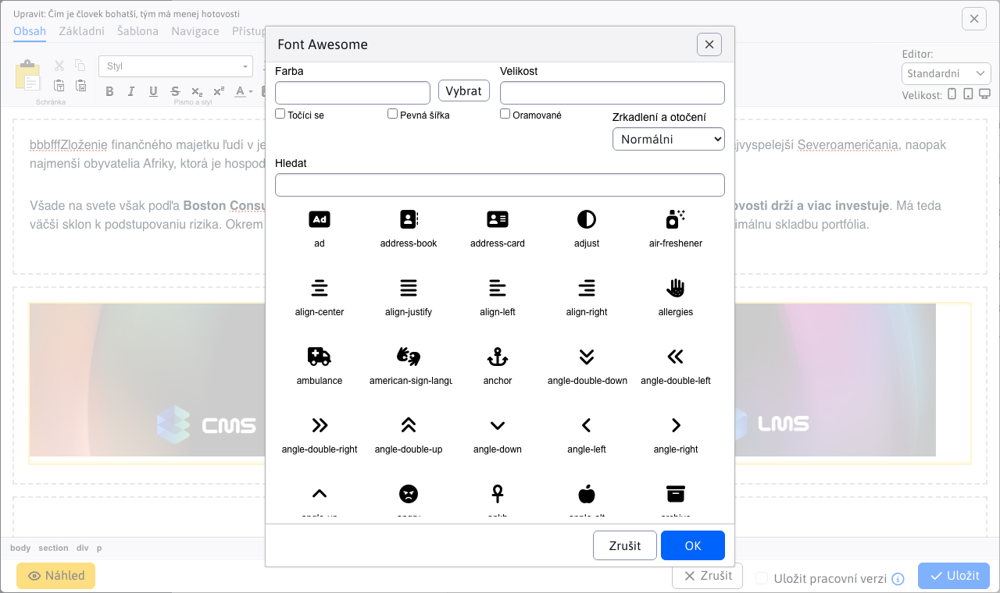

# FontAwesome

WebJET v editoru podporuje vkládání ikon ze sady [FontAwesome](https://fontawesome.com) kliknutím na ikonu , čímž se zobrazí okno pro vložení ikony FontAwesome do stránky.



Ikony lze vyhledat podle jejich názvu a kliknutím na tlačítko OK se ikona vloží na webovou stránku.

## Aktivace rozšíření

Rozšíření se aktivuje nastavením cesty k souborům CSS. `FontAwesome` prostřednictvím konfigurační proměnné `editorFontAwesomeCssPath` kde nastavíte cestu k souborům CSS. Na novém řádku lze zadat více souborů, například:

```
/templates/jet/assets/fontawesome/css/fontawesome.css
/templates/jet/assets/fontawesome/css/solid.css
```

Po nastavení se na panelu nástrojů editoru stránky začne zobrazovat ikona pro vložení ikony FontAwesome. Aby se ikona správně zobrazovala, musí být samozřejmě v šabloně webové stránky nastaveny také cesty stylů CSS. Stejné cesty nastavte i v poli **Hlavní styl CSS** Šablony.

## Další ikony

Standardní seznam ikon obsahuje základní ikony založené na sadě ikon verze 4. Pokud potřebujete vložit ikony z novějších sad, můžete je přidat do konfigurační proměnné `editorFontAwesomeCustomIcons` ve formátu `css-name:text` každý na novém řádku, například:

```
fa-wand-magic-sparkles:Super Magic Wand
fa-wheelchair-move:Wheelchair Move
```
