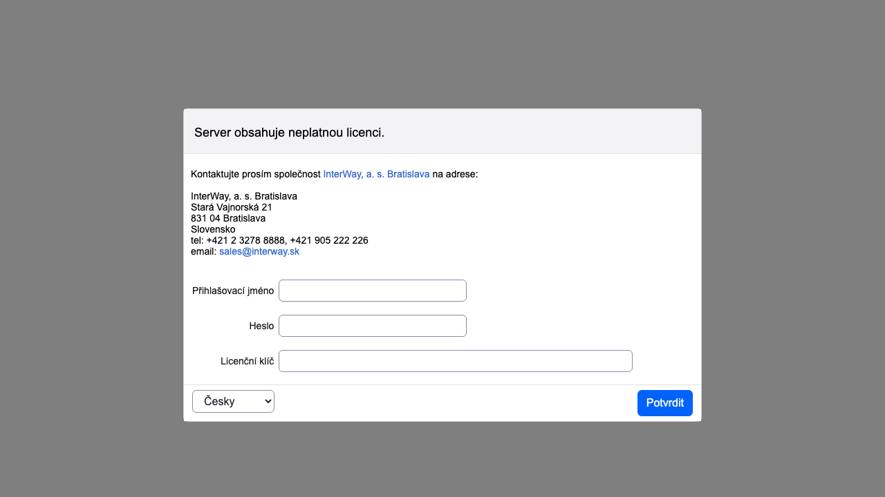
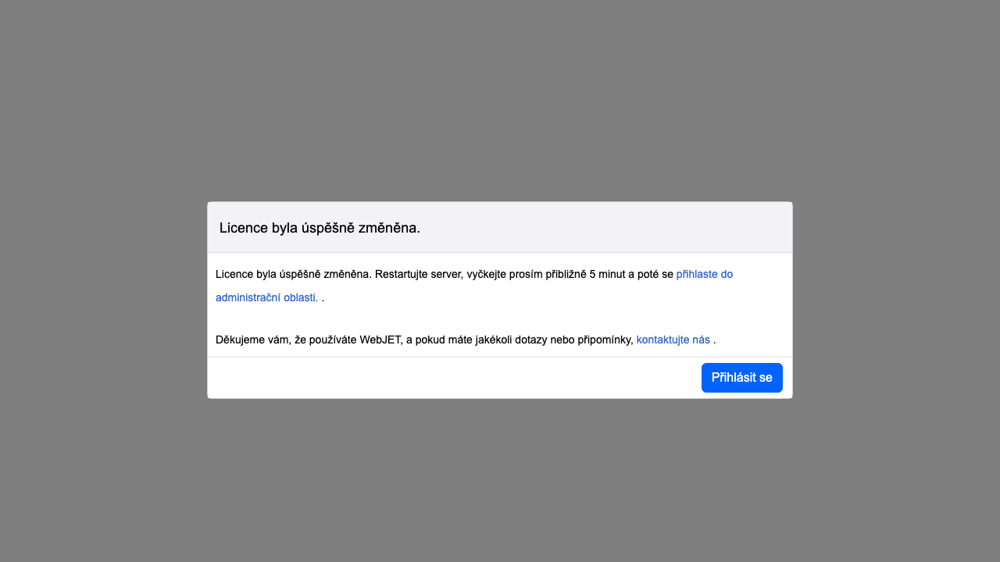

# Nastavení licenčního čísla

Licenční číslo pro WebJET se zadává v sekci Nastavení/Konfigurace v proměnné conf. `lisense`. V proměnné conf. je možné mít další licence pro další domény (např. při použití licence Enterprise). `licenseDomains` kde se každá další doménová licence zadává na nový řádek.

## Nesprávné číslo licence

Pokud WebJET obsahuje licenční číslo s vypršeným datem platnosti, nesprávný název domény nebo je licenční číslo zadáno nesprávně, zobrazí se po přihlášení do správy v protokolech serveru možnost aktualizovat licenční číslo a při spuštění se zobrazí v protokolech serveru:

```log
[webjet][s.i.i.InitServlet][INFO][0] 2023-10-02 09:27:30 - -----------------------------------------------
[webjet][s.i.i.InitServlet][INFO][0] 2023-10-02 09:27:30 - WebJET initializing, root: /www/tomcat/webapps/webjet
[webjet][s.i.i.InitServlet][INFO][0] 2023-10-02 09:27:30 -
[webjet][s.i.i.InitServlet][INFO][0] 2023-10-02 09:27:30 - VERSION: 9
[webjet][s.i.i.InitServlet][INFO][0] 2023-10-02 09:27:30 - Checking database connection:
[webjet][s.i.i.InitServlet][INFO][0] 2023-10-02 09:27:30 -    Database connection: [OK]
[webjet][s.i.i.InitServlet][INFO][0] 2023-10-02 09:27:30 - INIT (db): license=xxxxxxxxxxxxxxxxxxxxxxxxxxxxxxx
[webjet][s.i.i.InitServlet][INFO][0] 2023-10-02 09:27:30 - License is valid until: 01.06.2022 23:59:59
[webjet][s.i.i.InitServlet][INFO][0] 2023-10-02 09:27:30 - ERROR: License is out of date, please contact
  InterWay (www.interway.sk)
  for new license.
```

Pokud se možnost zadání licenčního čísla nezobrazí automaticky při otevření sekce pro správu, otevřete adresu. `/wjerrorpages/setup/license`.



Zadejte své přihlašovací údaje a ověřte svá práva správce a nový licenční klíč. Kliknutím na tlačítko OK uložte. Zobrazí se potvrzení o uložení:



Pokud se aplikační server nerestartuje automaticky, restartujte jej. Při restartu bude použito zadané licenční číslo.

## Zadejte číslo licence přímo do databáze

Pokud nemůžete zadat licenční číslo prostřednictvím webového rozhraní, můžete použít následující příkaz SQL přímo na databázovém serveru:

```sql
UPDATE _conf_ SET value='xxx' WHERE name='license';
```

pro Oracle používají zápis:

```sql
UPDATE webjet_conf SET value='xxx' WHERE name='license';
```
