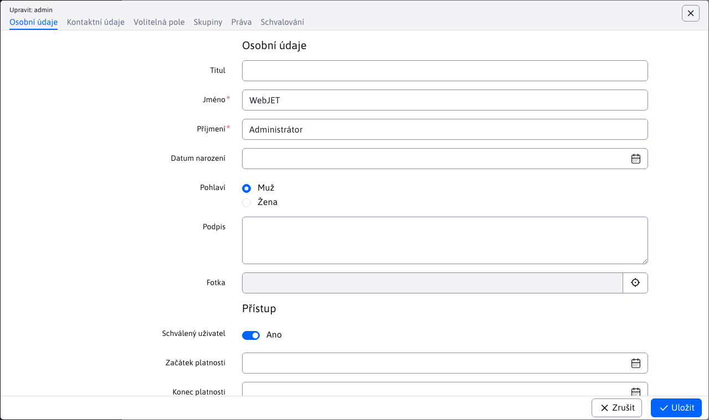

# Nastavení nové instalace

Pokyny pro vytvoření nové instalace/čisté databáze pro nový projekt v aplikaci WebJET. Instalace je z bezpečnostních důvodů povolena pouze v doméně. `localhost`, po instalaci můžete použít standardní název domény.

## Předpoklady

- lokálně funkční WebJET (nakonfigurovaný Tomcat, webová aplikace)
- přístup k DB serveru s právy k vytvoření nového schématu DB (nebo již vytvořeného schématu DB).

## Základní požadavky na server

- Server s minimálně 8 GB paměti (pro aplikace s větší zátěží minimálně 12 GB), procesor s minimálně `Dual Core 2 GHz` (pro servery s větším zatížením čtyřjader), diskový prostor alespoň 40 GB.
- Databáze `MySQL/MariaDB verzie 5.0+` (v kódování UTF-8) nebo databáze `Microsoft SQL 2012+` nebo databáze `Oracle 11g+` nebo `PostgreSQL 16+`.
- [Otevřený JDK](https://adoptium.net/temurin/releases/) verze 17 a aplikační server [Tomcat](https://tomcat.apache.org/download-90.cgi) 9.
- Připojení k serveru SMTP pro odesílání e-mailů.
- Funkční server DNS.
- Pro urychlení generování náhledových obrázků doporučujeme nainstalovat knihovnu [ImageMagick](https://imagemagick.org/script/download.php).

Pro instalace výrobků, jako jsou `NET, LMS, DSK` minimální požadavky vhodné pro instalace až 50 uživatelů (25 pracujících současně). Při vyšším počtu uživatelů je nutné přiměřeně navýšit paměť RAM a procesor - pro každých dalších 50 současně pracujících uživatelů +4 GB paměti a 1 CPU. Pro více než 200 uživatelů doporučujeme clusterové řešení.

Pro instalace výrobků, jako jsou `NET, LMS, DSK` je nutné na serveru povolit `websocket` připojení a instalace serveru [RabbitMQ](https://www.rabbitmq.com/).

## Vytvoření schématu DB

- připojit se k serveru DB a vytvořit novou databázi/schéma (pokud ještě není vytvořeno).
- v souboru `src/main/resources/poolman.xml` v projektu gradle nebo `/WEB-INF/classes/poolman.xml` při použití připraveného souboru WAR nastavte připojení k databázi:

[MariaDB](https://mariadb.com/kb/en/library/about-mariadb-connector-j/):

```xml
<?xml version="1.0" encoding="UTF-8"?>

<poolman><management-mode>local</management-mode>
    <datasource>
      <dbname>iwcm</dbname>
      <driver>com.mysql.jdbc.Driver</driver>
      <url>jdbc:mysql://MENO-SQL-SERVERA/MENO-SCHEMY</url>
      <username>DB-LOGIN</username>
      <password>DB-HESLO</password>
  </datasource>
</poolman>
```

[Microsoft SQL](http://jtds.sourceforge.net/faq.html):

```xml
<?xml version="1.0" encoding="UTF-8"?>

<poolman><management-mode>local</management-mode>
  <datasource>
      <dbname>iwcm</dbname>
      <driver>net.sourceforge.jtds.jdbc.Driver</driver>
      <url>jdbc:jtds:sqlserver://MENO-SQL-SERVERA:1433/MENO-SCHEMY;encoding=utf-8</url>
      <username>DB-LOGIN</username>
      <password>DB-HESLO</password>
  </datasource>
</poolman>
```

[Oracle](https://docs.oracle.com/en/database/oracle/oracle-database/23/jajdb/):

```xml
<?xml version="1.0" encoding="UTF-8"?>

<poolman><management-mode>local</management-mode>
  <datasource>
      <dbname>iwcm</dbname>
      <driver>oracle.jdbc.OracleDriver</driver>
      <url>jdbc:oracle:thin:@MENO-SQL-SERVERA:1521/MENO-INSTANCIE</url>
      <username>DB-LOGIN</username>
      <password>DB-HESLO</password>
  </datasource>
</poolman>
```

[PostgreSQL](https://jdbc.postgresql.org/documentation/use/):

```xml
<?xml version="1.0" encoding="UTF-8"?>

<poolman><management-mode>local</management-mode>
    <datasource>
        <dbname>iwcm</dbname>
        <driver>org.postgresql.Driver</driver>
        <url>jdbc:postgresql://localhost/DB-NAME?currentSchema=webjet_cms</url>
        <username></username>
        <password></password>
    </datasource>
</poolman>
```

Podporovány jsou následující prvky XML:
- `dbname` - název databázového připojení, pro tabulky WebJET CMS musí mít hodnotu `iwcm`, ale v XML jich můžete nastavit více `datasource` a vytvořit spojení s jinými databázemi, nastavte zde jedinečný název.
- `driver` - třída ovladače databáze java
- `url` - URL ve formátu pro `JDBC` Připojení
- `username` - přihlašovací jméno
- `password` - přihlašovací heslo

Volitelně je možné nastavit:
- `initialConnections` - výchozí počet otevřených databázových připojení (výchozí 0)
- `minimumSize` - minimální počet trvale otevřených databázových připojení (výchozí 0)
- `maximumSize` - maximální počet otevřených databázových připojení (výchozí 50)
- `connectionTimeout` - počet sekund, po které je spojení považováno za neuzavřené (výchozí 300)
- `autoCommit` - pokud je nastaveno na true, je nastaveno `connection.setAutoCommit(true);` (výchozí nastavení `false`)
- `testQuery` - testovací výraz SQL pro ověření funkčnosti připojení. Pro ovladače JDBC v4 se používá volání `isValid()`, pro starší řidiče je třeba nastavit. Hodnota `true` nastaví výchozí výraz `SELECT 1` (používá se automaticky pro `jtds` ovladač). Je však možné nastavit vlastní výraz SQL.

## Plnění režimu DB

WebJET obsahuje integrovanou konfiguraci, která dokáže naplnit prázdné schéma DB.

- spustit WebJET/Tomcat
- WebJET při spuštění hlásí chybu (více chyb)

```log
[27.11 8:32:49 {webjet} {InitServlet}] -----------------------------------------------
[27.11 8:32:49 {webjet} {InitServlet}] WebJET initializing, root: ...
[27.11 8:32:49 {webjet} {InitServlet}]
[27.11 8:32:49 {webjet} {InitServlet}] Checking database connection:
[27.11 8:32:49 {webjet} {InitServlet}]    Database connection: [OK]
java.sql.SQLSyntaxErrorException: Table 'MENO-SCHEMY._conf_' doesn't exist
...
[27.11 8:32:49 {webjet} {InitServlet}] ERROR: Server not configured.
[27.11 8:32:49 {webjet} {InitServlet}] ERROR: Server not configured.
[27.11 8:32:49 {webjet} {InitServlet}] ERROR: Server not configured.
...
```

Při pokusu o přihlášení nebo přístup na webové stránky WebJET se zobrazí chybová zpráva:


- Otevřete adresu URL v prohlížeči [instalace](http://localhost/wjerrorpages/setup/setup).

> WebJET vše, co začíná na `/wjerrorpages/` bude zpracován, i když není spuštěn. Automaticky poskytuje statický soubor [/wjerrorpages/dberror.html](http://localhost/wjerrorpages/dberror.html) pro jakýkoli požadavek GET. V adresáři `/wjerrorpages/` je možné mít i obrázky, ale doporučujeme je vkládat prostřednictvím `data:` vstup přímo do `dberror.html`.

- Výše uvedená adresa URL má výjimku a je povoleno ji použít, i když WebJET není správně spuštěn (ale pouze na doméně `localhost` nebo `iwcm.interway.sk`).
- Zobrazí se dialogové okno instalace WebJET:


- Zkontrolujte/zadejte údaje pro nastavení připojení k databázi (výchozí hodnoty jsou hodnoty ze souboru poolman.xml). Instalace vytváří připojení přímo k těmto hodnotám (ignoruje hodnoty v souboru poolman.xml), takže je potřebuje. Pokud však soubor `poolman.xml` již existuje, nepřepisuje se, takže při dalším spuštění se hodnoty v položce `poolman.xml`. Pokud soubor neexistuje, bude vytvořen podle zadaných hodnot.
- Zadejte jedinečný název instalace (bez mezer a diakritiky, např. `interway2023`) a licenční číslo (pokud nepoužíváte verzi Open Sorce) a zkontrolujte ostatní hodnoty.
- Klepnutím na tlačítko OK spusťte instalaci. Pokud je ověření zadaných hodnot úspěšné, zobrazí se následující zpráva:


Na pozadí WebJET vyplní počáteční data (podle `/WEB-INF/sql/blank_web_DBTYPE.sql`) a poté provede restart. Pokud se restart neprovede automaticky (server není nastaven na automatický restart), restartujte aplikační server ručně.

V logu byste měli vidět něco jako:

```log
fillEmptyDatabaseMySQL
fillEmptyDatabaseMySQL 1
fillEmptyDatabaseMySQL 2
hasDatabase=false

#
# Table structure for table '_conf_'
#

CREATE TABLE _conf_ (
  name varchar(255) NOT NULL default '',
  value varchar(255) NOT NULL default '',
  UNIQUE KEY name (name)
) ENGINE=MyISAM;

...


#
# Dumping data for table 'users'
#

INSERT INTO users VALUES("1", "", "", "Administrátor", "admin", "d7ed8dc6fc9b4a8c3b442c3dcc35bfe4", "1", NULL, "Interway s.r.o.", "Hattalova 12/a", "", "lubos.balat@interway.sk", "83103", "Slovakia", "0903-450445", "1", "", NULL, NULL, NULL, NULL, NULL, NULL, NULL, NULL, NULL, NULL, NULL)
Executing:
INSERT INTO users VALUES("2", "", "Obchodny", "Partner", "partner", "34f414bd2609b73403ea09787fb0aac4", "0", "2", "Interway s.r.o.", "Hattalova 12/a", "", "lubos.balat@interway.sk", "83103", "Slovensko", "0903-945990", "1", "", NULL, NULL, NULL, NULL, NULL, NULL, NULL, NULL, NULL, NULL, NULL)
Executing:
INSERT INTO users VALUES("3", "", "VIP", "Klient", "vipklient", "d1a9b4b9977e4829011396ec9dd2cf6a", "0", "1", "Interway s.r.o.", "Hattalova 12/a", NULL, "lubos.balat@interway.sk", "83103", "Slovensko", "0903-945990", "1", NULL, NULL, NULL, NULL, NULL, NULL, NULL, NULL, NULL, NULL, NULL, NULL)
[27.11 9:24:31 {webjet} {InitServlet}] RESTART request ret=true
[27.11 9:24:31 {webjet} {InitServlet}] RESTART request ret=true
```

Po restartu se provede aktualizace schématu podle následujícího postupu. `autoupdate.xml`:

```
PathFilter init
PathFilterInit - customPath: /Users/jeeff/Documents/DISK_E/webapps-server/ppa
[27.11 9:25:05 {webjet} {InitServlet}] init start
[27.11 9:25:05 {webjet} {InitServlet}] contextDbName=null
Constants - clearValues
[27.11 9:25:05 {webjet} {InitServlet}] dbName=iwcm
[27.11 9:25:05 {webjet} {InitServlet}] -----------------------------------------------
[27.11 9:25:05 {webjet} {InitServlet}] WebJET initializing, root: /Users/jeeff/Documents/workspace-idea/webjet8/WebContent/
[27.11 9:25:05 {webjet} {InitServlet}]
[27.11 9:25:05 {webjet} {InitServlet}] Checking database connection:
[27.11 9:25:05 {webjet} {InitServlet}]    Database connection: [OK]

...

[27.11 9:25:06 {webjet}] update database call
[27.11 9:25:06 {webjet}] ----- Updating database [DBType=3] -----
[27.11 9:25:06 {webjet}]    18.5.2004 [jeeff] vo vyhladavani statistiky sa eviduje remote host [27.11 9:25:06 {webjet}] count=1 [27.11 9:25:06 {webjet}] [1/1] [27.11 9:25:06 {webjet}] [OK] [27.11 9:25:06 {webjet}] [OK]
[27.11 9:25:06 {webjet}]    24.5.2004 [jeeff] tabulka s tipmi dna [27.11 9:25:06 {webjet}] count=1 [27.11 9:25:06 {webjet}] [1/1] [27.11 9:25:06 {webjet}] [OK] [27.11 9:25:06 {webjet}] [OK]
[27.11 9:25:06 {webjet}]    9.6.2004 [joruz] zoznam alarmov pre notifikaciu registracie [27.11 9:25:06 {webjet}] count=1 [27.11 9:25:06 {webjet}] [1/1] [27.11 9:25:06 {webjet}] [OK] [27.11 9:25:06 {webjet}] [OK]

...

[27.11 9:25:39 {webjet}] MeninyImport constructor
[27.11 9:25:39 {webjet}]  -> loading prop [sk]: /text.properties
[27.11 9:25:41 {webjet}] ExcelImportJXL doImport: sheet=meniny
[27.11 9:25:41 {webjet}] header[0]=day;
[27.11 9:25:41 {webjet}] header[1]=month;
[27.11 9:25:41 {webjet}] header[2]=name;
[27.11 9:25:41 {webjet}] header[3]=lng;
[27.11 9:25:41 {webjet}]    importujem meniny: 1.1 (Nový rok, Deň vzniku SR) [sk]
[27.11 9:25:41 {webjet}]    importujem meniny: 2.1 Alexandra [sk]
[27.11 9:25:41 {webjet}]    importujem meniny: 3.1 Daniela [sk]
[27.11 9:25:41 {webjet}]    importujem meniny: 4.1 Drahoslav [sk]
[27.11 9:25:41 {webjet}]    importujem meniny: 5.1 Andrea [sk]
[27.11 9:25:41 {webjet}]    importujem meniny: 6.1 Antónia (Zjavenie pána, Traja králi) [sk]

...

[27.11 9:26:07 {webjet}] 10 tasks should run on this node
[27.11 9:26:07 {webjet}] ---------------- INIT DONE --------------
PathFilterInit - customPath: /Users/jeeff/Documents/DISK_E/webapps-server/ppa
[27.11 9:26:07 {webjet}] ---------------- INIT DONE indexed --------------
[27.11 9:26:07 {webjet}] runRefresh start

...

[webjet][s.i.i.s.s.BaseSpringConfig][INFO][0] 2023-09-29 12:18:13 - -------> Configure security, http=org.springframework.security.config.annotation.web.builders.HttpSecurity@364552cf
[webjet][s.i.i.s.s.SpringSecurityConf][INFO][0] 2023-09-29 12:18:13 - configure - SpringAppInitializer - end - sk.iway.iwcm.system.spring.BaseSpringConfig
[webjet][s.i.i.s.s.SpringSecurityConf][INFO][0] 2023-09-29 12:18:13 - configure - SpringAppInitializer - start - sk.iway.webjet.v9.V9SpringConfig
[webjet][s.i.i.s.s.SpringSecurityConf][INFO][0] 2023-09-29 12:18:13 - configure - SpringAppInitializer - end - sk.iway.webjet.v9.V9SpringConfig
[webjet][s.i.i.s.s.SpringSecurityConf][INFO][0] 2023-09-29 12:18:13 - configure - SpringAppInitializer - start - sk.iway.webjet_init.SpringConfig
[webjet][s.i.i.s.s.SpringSecurityConf][INFO][0] 2023-09-29 12:18:13 - configure - SpringAppInitializer - end - sk.iway.webjet_init.SpringConfig
```

V tomto okamžiku je WebJET inicializován a spuštěn do výchozího stavu.

## Přihlášení do administrace

Přihlaste se do [administrátor sekce](http://localhost/admin/) s názvem `admin` a heslo `heslo`:


WebJET vás vyzve ke změně hesla:


Po přihlášení se na domovské obrazovce může zobrazit zpráva, že převod databáze nebyl proveden. Klikněte na odkaz [Spuštění konverze](http://localhost/admin/update/update_webjet7.jsp) pro převod databáze. Pokud se tato zpráva nezobrazí, je instalační databáze již připravena v novém formátu, pokračujte. [nastavením práv](#nastavení-práv).


Na stránce převodu začněte na konci [hashování hesel](http://localhost/admin/update/update_passwords.jsp) přepnout režim ukládání hesel na zabezpečený `hash`.

Doporučujeme také odstranit `STAT` tabulky, jak je uvedeno na stránce (není nutné), například vložením příkazů do [/admin/updatedb.jsp](http://localhost/admin/updatedb.jsp).

```sql
DROP TABLE stat_browser;
DROP TABLE stat_country;
DROP TABLE stat_site_days;
DROP TABLE stat_site_hours;
DROP TABLE stat_doc;
DROP TABLE stat_views;
```

Zavřete kartu, na které je převod proveden.

## Nastavení práv

V původním okně přejděte na [Uživatelé -> Seznam uživatelů](http://localhost/admin/v9/users/user-list/), pomocí navigace v levém menu.


Otevřené úpravy **Admin** Uživatelé. Po zobrazení okna zaškrtněte karty **Osobní údaje** a **Kontaktní údaje** vaše údaje.



V kartách **Práva** povolit potřebná práva. Minimálně přidejte práva:
- Konfigurace
- Konfigurace - zobrazení všech proměnných


Po nastavení práv se odhlaste, aby se nová práva uplatnila, a znovu se přihlaste. Po přihlášení přejděte na [Nastavení/Konfigurace](http://localhost/admin/v9/settings/configuration/) a nastavte následující konfigurační proměnné:
- Pokud je server v prostředí InterWay nebo je umístěn za proxy serverem/vyvažovačem zátěže, nastavte proměnnou `serverBeyoundProxy` na hodnotu `true`. V tomto režimu WebJET očekává v hlavičce HTTP IP adresu návštěvníka. `x-forwarded-for` a protokol používaný v `x-forwarded-proto`.
- Proměnnou můžete nastavit `logLevel` na hodnotu `debug` pro podrobnější logovaní.
- Doporučujeme nastavit proměnnou `webEnableIPs` na seznam prefixů IP adres, ze kterých budete před spuštěním přistupovat na web (např. 127.0.0.1,10.,192.168.,195.168.35.4,195.168.35.5).

Dále postupujte podle pokynů pro [nastavení šablony](../../frontend/setup/README.md).
