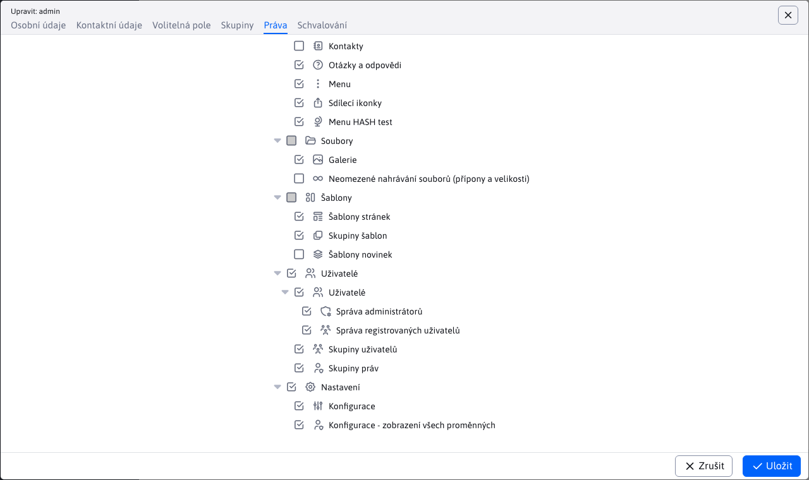

# Zřízení nové instalace

Návod na zřízení nové instalace/čisté databáze pro nový projekt ve WebJETu. Instalace je z bezpečnostních důvodů povolena pouze na doméně `localhost`, po instalaci můžete používat standardní doménové jméno.

## Předpoklady

- lokálně funkční WebJET (nakonfigurován Tomcat, web aplikace)
- přístup na DB server s právy pro zřízení nového DB schématu (nebo již zřízené DB schéma)

## Základní požadavky na server

- Server s minimálně 8 GB paměti (pro aplikace s větší zátěží minimálně 12GB), procesor alespoň `Dual Core 2 GHz` (pro servery s větší zátěží Quad core), místo na disku alespoň 40GB.
- Databáze `MySQL/MariaDB verzie 5.0+` (s kódováním UTF-8), nebo databáze `Microsoft SQL 2012+` nebo databáze `Oracle 11g+` nebo `PostgreSQL 16+`.
- [Open JDK](https://adoptium.net/temurin/releases/) verze 17 a aplikační server [Tomcat](https://tomcat.apache.org/download-90.cgi) 9.
- Připojení na SMTP server pro posílání emailů.
- Funkční DNS server.
- Pro urychlení generování náhledových obrázků doporučujeme nainstalovanou knihovnu [ImageMagick](https://imagemagick.org/script/download.php).

Pro instalace produktů jako je `NET, LMS, DSK` jsou uvedeny minimální požadavky vhodné pro instalace do 50 uživatelů (současně pracujících 25). Pro vyšší počet uživatelů je třeba vhodně navýšit paměť RAM i CPU – pro každých dalších současně pracujících 50 uživatelů +4GB paměti a 1CPU. Pro více než 200 uživatelů doporučujeme clusterové řešení.

Pro instalace produktů jako je `NET, LMS, DSK` je na serveru třeba povolit `websocket` spojení a instalovat server [RabbitMQ](https://www.rabbitmq.com/).

## Vytvoření DB schématu

- připojte se na DB server a vytvořte novou databázi / schéma (pokud ještě není zřízena)
- v souboru `src/main/resources/poolman.xml` v gradle projektu, nebo `/WEB-INF/classes/poolman.xml` při použití hotového WAR souboru, nastavte databázové připojení:

[MariaDB](https://mariadb.com/kb/en/library/about-mariadb-connector-j/):

```xml
<?xml version="1.0" encoding="UTF-8"?>

<poolman><management-mode>local</management-mode>
    <datasource>
      <dbname>iwcm</dbname>
      <driver>com.mysql.jdbc.Driver</driver>
      <url>jdbc:mysql://MENO-SQL-SERVERA/MENO-SCHEMY</url>
      <username>DB-LOGIN</username>
      <password>DB-HESLO</password>
  </datasource>
</poolman>
```

[Microsoft SQL](http://jtds.sourceforge.net/faq.html):

```xml
<?xml version="1.0" encoding="UTF-8"?>

<poolman><management-mode>local</management-mode>
  <datasource>
      <dbname>iwcm</dbname>
      <driver>net.sourceforge.jtds.jdbc.Driver</driver>
      <url>jdbc:jtds:sqlserver://MENO-SQL-SERVERA:1433/MENO-SCHEMY;encoding=utf-8</url>
      <username>DB-LOGIN</username>
      <password>DB-HESLO</password>
  </datasource>
</poolman>
```

[Oracle](https://docs.oracle.com/en/database/oracle/oracle-database/23/jajdb/):

```xml
<?xml version="1.0" encoding="UTF-8"?>

<poolman><management-mode>local</management-mode>
  <datasource>
      <dbname>iwcm</dbname>
      <driver>oracle.jdbc.OracleDriver</driver>
      <url>jdbc:oracle:thin:@MENO-SQL-SERVERA:1521/MENO-INSTANCIE</url>
      <username>DB-LOGIN</username>
      <password>DB-HESLO</password>
  </datasource>
</poolman>
```

[PostgreSQL](https://jdbc.postgresql.org/documentation/use/):

```xml
<?xml version="1.0" encoding="UTF-8"?>

<poolman><management-mode>local</management-mode>
    <datasource>
        <dbname>iwcm</dbname>
        <driver>org.postgresql.Driver</driver>
        <url>jdbc:postgresql://localhost/DB-NAME?currentSchema=webjet_cms</url>
        <username></username>
        <password></password>
    </datasource>
</poolman>
```

Podporovány jsou následující XML elementy:
- `dbname` - jméno databázového připojení, pro WebJET CMS tabulky musí mít hodnotu `iwcm`, v XML ale můžete nastavit více `datasource` elementů a vytvořit tak připojení i do dalších databází, nastavte sem unikátní jméno
- `driver` - java třída databázového ovladače
- `url` - URL adresa ve formátu pro `JDBC` připojení
- `username` - přihlašovací jméno
- `password` - přihlašovací heslo

Volitelně lze nastavit:
- `initialConnections` - výchozí počet otevřených databázových spojení (výchozí 0)
- `minimumSize` - minimální počet neustále otevřených databázových spojení (výchozí 0)
- `maximumSize` - maximální počet otevřených databázových spojení (výchozí 50)
- `connectionTimeout` - počet sekund, kdy je spojení považováno za neuzavřené (výchozí 300)
- `autoCommit` - je-li nastaveno na true nastaví se `connection.setAutoCommit(true);` (výchozí `false`)
- `testQuery` - testovací SQL výraz pro ověření funkčnosti spojení. Pro `JDBC` ovladače v4 se používá volání `isValid()`, pro starší ovladače je třeba nastavit. Hodnota `true` nastaví výchozí výraz `SELECT 1` (použije se automaticky pro `jtds` ovladač). Je ale možné nastavit váš vlastní SQL výraz.

## Naplnění DB schématu

WebJET obsahuje vestavěnou konfiguraci, která umí naplnit prázdné DB schéma.

- spusťte WebJET / Tomcat
- při startu WebJET zahlásí chybu (více chyb)

```log
[27.11 8:32:49 {webjet} {InitServlet}] -----------------------------------------------
[27.11 8:32:49 {webjet} {InitServlet}] WebJET initializing, root: ...
[27.11 8:32:49 {webjet} {InitServlet}]
[27.11 8:32:49 {webjet} {InitServlet}] Checking database connection:
[27.11 8:32:49 {webjet} {InitServlet}]    Database connection: [OK]
java.sql.SQLSyntaxErrorException: Table 'MENO-SCHEMY._conf_' doesn't exist
...
[27.11 8:32:49 {webjet} {InitServlet}] ERROR: Server not configured.
[27.11 8:32:49 {webjet} {InitServlet}] ERROR: Server not configured.
[27.11 8:32:49 {webjet} {InitServlet}] ERROR: Server not configured.
...
```

Při pokusu o přihlášení nebo přístup k webové stránce WebJET zobrazí chybové hlášení:


- V prohlížeči otevřete URL adresu [instalace](http://localhost/wjerrorpages/setup/setup).

> WebJET vše co začíná na `/wjerrorpages/` zpracuje i když není nastartován. Automaticky poskytuje statický soubor [/wjerrorpages/dberror.html](http://localhost/wjerrorpages/dberror.html) při jakémkoli GET požadavku. V adresáři `/wjerrorpages/` je možné mít i obrázky, doporučujeme je ale raději vložit přes `data:` zápis přímo do `dberror.html`.

- Výše uvedená URL má výjimku a je povoleno její použití i při nekorektně nastartovaném WebJETu (ale jen na doméně `localhost` nebo `iwcm.interway.sk`).
- Zobrazí se vám dialog instalace WebJETu:


- Zkontrolujte/zadejte údaje pro nastavení databázového připojení (předvolí se hodnoty ze souboru poolman.xml). Instalace vytváří spojení přímo na uvedené hodnoty (ignoruje hodnoty v poolman.xml), proto je potřebuje. Pokud ale soubor `poolman.xml` již existuje, nepřepíše ho, čili pro další start se už použijí hodnoty v `poolman.xml`. Pokud soubor neexistuje, vytvoří se podle zadaných hodnot.
- Zadejte unikátní název instalace (bez mezer a diakritiky, například. `interway2023`) a licenční číslo (pokud nepoužíváte Open Sorce verzi) a zkontrolujte ostatní hodnoty.
- Klepněte na OK pro spuštění instalace. Pokud validace zadaných hodnot proběhne úspěšně, uvidíte následující hlášení:


Na pozadí WebJET naplní iniciální data (podle `/WEB-INF/sql/blank_web_DBTYPE.sql`) a následně provede restart. Pokud se restart neprovede automaticky (server nemá nastaveno automatické restartování) restartujte aplikační server manuálně.

V logu byste měli vidět něco jako:

```log
fillEmptyDatabaseMySQL
fillEmptyDatabaseMySQL 1
fillEmptyDatabaseMySQL 2
hasDatabase=false

#
# Table structure for table '_conf_'
#

CREATE TABLE _conf_ (
  name varchar(255) NOT NULL default '',
  value varchar(255) NOT NULL default '',
  UNIQUE KEY name (name)
) ENGINE=MyISAM;

...


#
# Dumping data for table 'users'
#

INSERT INTO users VALUES("1", "", "", "Administrátor", "admin", "d7ed8dc6fc9b4a8c3b442c3dcc35bfe4", "1", NULL, "Interway s.r.o.", "Hattalova 12/a", "", "lubos.balat@interway.sk", "83103", "Slovakia", "0903-450445", "1", "", NULL, NULL, NULL, NULL, NULL, NULL, NULL, NULL, NULL, NULL, NULL)
Executing:
INSERT INTO users VALUES("2", "", "Obchodny", "Partner", "partner", "34f414bd2609b73403ea09787fb0aac4", "0", "2", "Interway s.r.o.", "Hattalova 12/a", "", "lubos.balat@interway.sk", "83103", "Slovensko", "0903-945990", "1", "", NULL, NULL, NULL, NULL, NULL, NULL, NULL, NULL, NULL, NULL, NULL)
Executing:
INSERT INTO users VALUES("3", "", "VIP", "Klient", "vipklient", "d1a9b4b9977e4829011396ec9dd2cf6a", "0", "1", "Interway s.r.o.", "Hattalova 12/a", NULL, "lubos.balat@interway.sk", "83103", "Slovensko", "0903-945990", "1", NULL, NULL, NULL, NULL, NULL, NULL, NULL, NULL, NULL, NULL, NULL, NULL)
[27.11 9:24:31 {webjet} {InitServlet}] RESTART request ret=true
[27.11 9:24:31 {webjet} {InitServlet}] RESTART request ret=true
```

Po restartu se provede aktualizaci schématu podle `autoupdate.xml`:

```
PathFilter init
PathFilterInit - customPath: /Users/jeeff/Documents/DISK_E/webapps-server/ppa
[27.11 9:25:05 {webjet} {InitServlet}] init start
[27.11 9:25:05 {webjet} {InitServlet}] contextDbName=null
Constants - clearValues
[27.11 9:25:05 {webjet} {InitServlet}] dbName=iwcm
[27.11 9:25:05 {webjet} {InitServlet}] -----------------------------------------------
[27.11 9:25:05 {webjet} {InitServlet}] WebJET initializing, root: /Users/jeeff/Documents/workspace-idea/webjet8/WebContent/
[27.11 9:25:05 {webjet} {InitServlet}]
[27.11 9:25:05 {webjet} {InitServlet}] Checking database connection:
[27.11 9:25:05 {webjet} {InitServlet}]    Database connection: [OK]

...

[27.11 9:25:06 {webjet}] update database call
[27.11 9:25:06 {webjet}] ----- Updating database [DBType=3] -----
[27.11 9:25:06 {webjet}]    18.5.2004 [jeeff] vo vyhladavani statistiky sa eviduje remote host [27.11 9:25:06 {webjet}] count=1 [27.11 9:25:06 {webjet}] [1/1] [27.11 9:25:06 {webjet}] [OK] [27.11 9:25:06 {webjet}] [OK]
[27.11 9:25:06 {webjet}]    24.5.2004 [jeeff] tabulka s tipmi dna [27.11 9:25:06 {webjet}] count=1 [27.11 9:25:06 {webjet}] [1/1] [27.11 9:25:06 {webjet}] [OK] [27.11 9:25:06 {webjet}] [OK]
[27.11 9:25:06 {webjet}]    9.6.2004 [joruz] zoznam alarmov pre notifikaciu registracie [27.11 9:25:06 {webjet}] count=1 [27.11 9:25:06 {webjet}] [1/1] [27.11 9:25:06 {webjet}] [OK] [27.11 9:25:06 {webjet}] [OK]

...

[27.11 9:25:39 {webjet}] MeninyImport constructor
[27.11 9:25:39 {webjet}]  -> loading prop [sk]: /text.properties
[27.11 9:25:41 {webjet}] ExcelImportJXL doImport: sheet=meniny
[27.11 9:25:41 {webjet}] header[0]=day;
[27.11 9:25:41 {webjet}] header[1]=month;
[27.11 9:25:41 {webjet}] header[2]=name;
[27.11 9:25:41 {webjet}] header[3]=lng;
[27.11 9:25:41 {webjet}]    importujem meniny: 1.1 (Nový rok, Deň vzniku SR) [sk]
[27.11 9:25:41 {webjet}]    importujem meniny: 2.1 Alexandra [sk]
[27.11 9:25:41 {webjet}]    importujem meniny: 3.1 Daniela [sk]
[27.11 9:25:41 {webjet}]    importujem meniny: 4.1 Drahoslav [sk]
[27.11 9:25:41 {webjet}]    importujem meniny: 5.1 Andrea [sk]
[27.11 9:25:41 {webjet}]    importujem meniny: 6.1 Antónia (Zjavenie pána, Traja králi) [sk]

...

[27.11 9:26:07 {webjet}] 10 tasks should run on this node
[27.11 9:26:07 {webjet}] ---------------- INIT DONE --------------
PathFilterInit - customPath: /Users/jeeff/Documents/DISK_E/webapps-server/ppa
[27.11 9:26:07 {webjet}] ---------------- INIT DONE indexed --------------
[27.11 9:26:07 {webjet}] runRefresh start

...

[webjet][s.i.i.s.s.BaseSpringConfig][INFO][0] 2023-09-29 12:18:13 - -------> Configure security, http=org.springframework.security.config.annotation.web.builders.HttpSecurity@364552cf
[webjet][s.i.i.s.s.SpringSecurityConf][INFO][0] 2023-09-29 12:18:13 - configure - SpringAppInitializer - end - sk.iway.iwcm.system.spring.BaseSpringConfig
[webjet][s.i.i.s.s.SpringSecurityConf][INFO][0] 2023-09-29 12:18:13 - configure - SpringAppInitializer - start - sk.iway.webjet.v9.V9SpringConfig
[webjet][s.i.i.s.s.SpringSecurityConf][INFO][0] 2023-09-29 12:18:13 - configure - SpringAppInitializer - end - sk.iway.webjet.v9.V9SpringConfig
[webjet][s.i.i.s.s.SpringSecurityConf][INFO][0] 2023-09-29 12:18:13 - configure - SpringAppInitializer - start - sk.iway.webjet_init.SpringConfig
[webjet][s.i.i.s.s.SpringSecurityConf][INFO][0] 2023-09-29 12:18:13 - configure - SpringAppInitializer - end - sk.iway.webjet_init.SpringConfig
```

V tomto momentě je WebJET inicializován a spuštěn do standardního stavu.

## Přihlášení do administrace

Přihlaste se do [admin sekce](http://localhost/admin/) se jménem `admin` a heslem `heslo`:


WebJET vás vyzve ke změně hesla:


Po přihlášení se vám na úvodní obrazovce může zobrazit hlášení, že nebyla provedena konverze databáze. Klikněte na linku [Spustit konverzi](http://localhost/admin/update/update_webjet7.jsp) pro konverzi databáze. Pokud se vám hlášení nezobrazí, je instalační databáze již připravena v novém formátu, pokračujte [nastavením práv](#nastavení-práv).


Ve stránce s konverzí spusťte na konci [hashování hesel](http://localhost/admin/update/update_passwords.jsp) pro přepnutí režimu ukládání hesel na bezpečný `hash`.

Také doporučujeme smazat `STAT` tabulky jak je uvedeno ve stránce (nejsou potřebné), například vložením příkazů do [/admin/updatedb.jsp](http://localhost/admin/updatedb.jsp).

```sql
DROP TABLE stat_browser;
DROP TABLE stat_country;
DROP TABLE stat_site_days;
DROP TABLE stat_site_hours;
DROP TABLE stat_doc;
DROP TABLE stat_views;
```

Zavřete kartu, ve které máte konverzi.

## Nastavení práv

V původním okně přejděte do části [Uživatelé -> Seznam uživatelů](http://localhost/admin/v9/users/user-list/), pomocí navigace v levém menu.


Otevřete si editaci **admin** uživatele. Po zobrazení okna zkontrolujete v kartách **Osobní údaje** a **Kontaktní údaje** své údaje.


V kartě **Práva** povolte potřebná práva. Minimálně přidejte práva:
- Konfigurace
- Konfigurace - zobrazení všech proměnných



Po nastavení práv se odhlaste pro aplikování nových práv a znovu se přihlaste. Po přihlášení přejděte do sekce [Nastavení/Konfigurace](http://localhost/admin/v9/settings/configuration/) a nastavte následující konf. proměnné:
- Pokud je server v prostředí InterWay, nebo je umístěn za proxy serverem/load balancerem nastavte proměnnou `serverBeyoundProxy` na hodnotu `true`. WebJET v tomto režimu očekává IP adresu návštěvníka v HTTP hlavičce `x-forwarded-for` a použitý protokol v `x-forwarded-proto`.
- Můžete nastavit proměnnou `logLevel` na hodnotu `debug` pro podrobnější logování.
- Doporučujeme nastavit proměnnou `webEnableIPs` na seznam prefixů IP adres, ze kterých budete na web před spuštěním přistupovat (např. 127.0.0.1,10.,192.168.,195.168.35.4,195.168.35.5).

Dále pokračujte podle návodu pro [nastavení šablon](../../frontend/setup/README.md).
