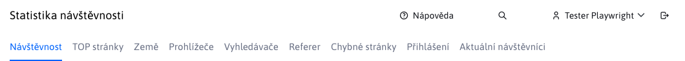
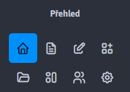
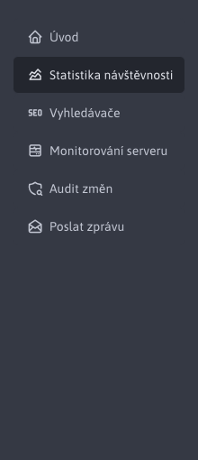
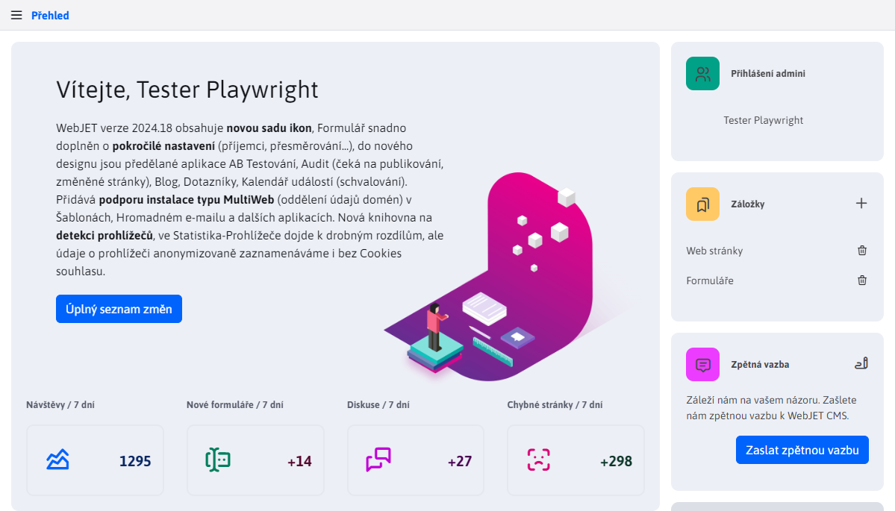
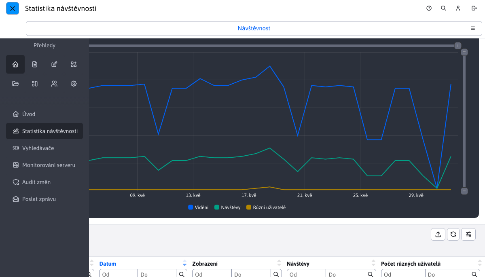
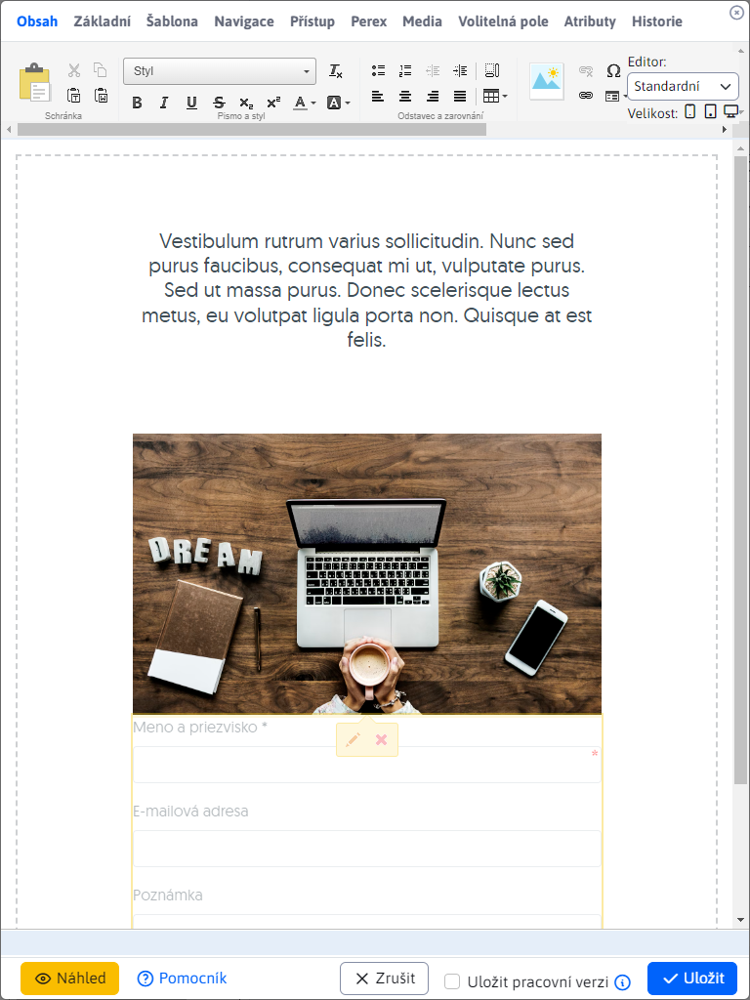
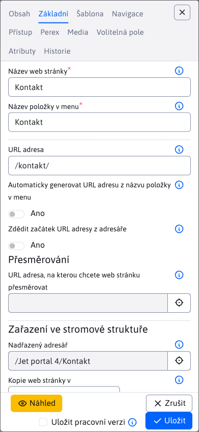

# Hlavní ovládací prvky

Rozložení administrace je standardní. V horní části je záhlaví a vlevo menu.

## Záhlaví

Záhlaví se nachází v horní části:

obsahuje následující možnosti:
- Vyberte doménu, se kterou pracujete (v případě instalace s více doménami).
- Odkaz na otevření nápovědy.
- Jméno aktuálně přihlášeného uživatele, po kliknutí na jméno se zobrazí následující možnosti:
  - Profil - úprava vlastního profilu (jméno, e-mail... - po změně profilu se musíte odhlásit a znovu přihlásit).
  - Dvoufázové ověřování - možnost aktivovat dvoufázové ověřování pomocí aplikace. `Google Authenticate` při přihlašování do administrace. Tím se zvýší bezpečnost vašeho účtu, protože kromě hesla musíte pro přihlášení zadat také kód z mobilního zařízení. Doporučujeme toto nastavení u všech účtů, jejichž prostřednictvím lze spravovat uživatelské účty a práva. Pokud používáte ověřování proti `ActiveDirectory/SSO` serveru, můžete tuto položku nabídky zakázat nastavením proměnné conf. `2factorAuthEnabled` na hodnotu `false`.
  - Správa šifrovacích klíčů - umožňuje vytvořit nový šifrovací klíč pro šifrování formulářů a zadat stávající klíč pro jejich dešifrování. Vyžaduje právo Formuláře.
  - Odhlášení - odhlášení ze správy.
-  Ikona pro odhlášení ze správy.

## Nabídka

V levé části pod logem WebJET jsou ikony představující hlavní sekce nabídky. Rozhodli jsme se takto znázornit první úroveň nabídky, abychom nemuseli mít hluboce vnořené položky nabídky:

Kliknutím na ikonu hlavní sekce zobrazíte položky nabídky vybrané sekce:

Položky nabídky se zobrazují v tmavších a světlejších barvách. Tmavší zatím nebyly přepracovány, což je vidět v odkazu na aplikaci statistik. Kliknutím na tuto položku se aplikace zobrazí ve starém designu. Kliknutím na již přepracovanou část, např. úvod, se přepne ze staré verze zpět na novou.

Přepínání mezi starou a novou verzí probíhá automaticky v závislosti na tom, zda již byla aplikace přepracována, či nikoli. V případě potřeby je možné zcela přepnout na starou verzi kliknutím na ikonu  V záhlaví přepněte na verzi 8.

## Zobrazení na mobilních zařízeních

Správa se přizpůsobuje mobilním zařízením. Pokud je šířka okna menší než 1200 pixelů, záhlaví stránky a levé menu se skryjí:

záhlaví a menu lze zobrazit kliknutím na ikonu hamburger menu.  vlevo nahoře. Pak se nad stránkou zobrazí nabídka a záhlaví:

Chcete-li zavřít nabídku, klikněte na ikonu zavřít nabídku. .

Editor v datové tabulce se při šířce okna menší než 992 pixelů (zobrazení na tabletu) zobrazí v plné velikosti okna:

V případě okna užšího než 576 pixelů se názvy polí přesunou z levé strany nad pole, aby se lépe zobrazovaly např. na mobilním telefonu:

