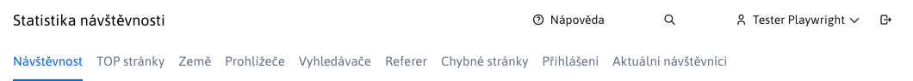
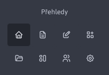
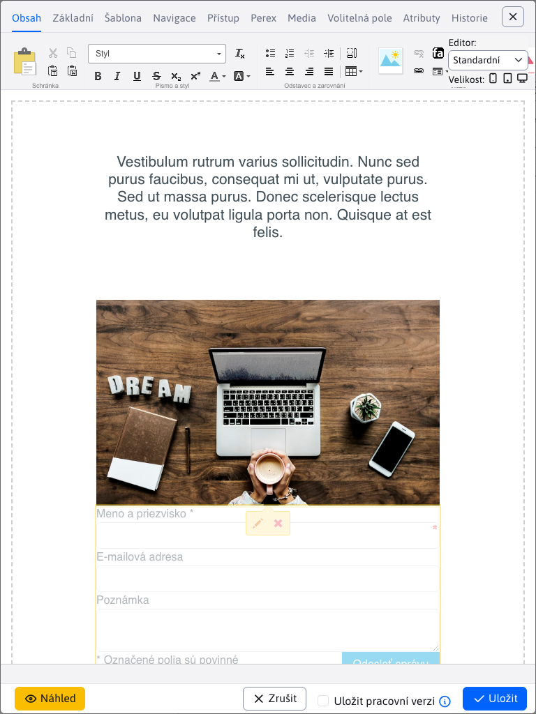
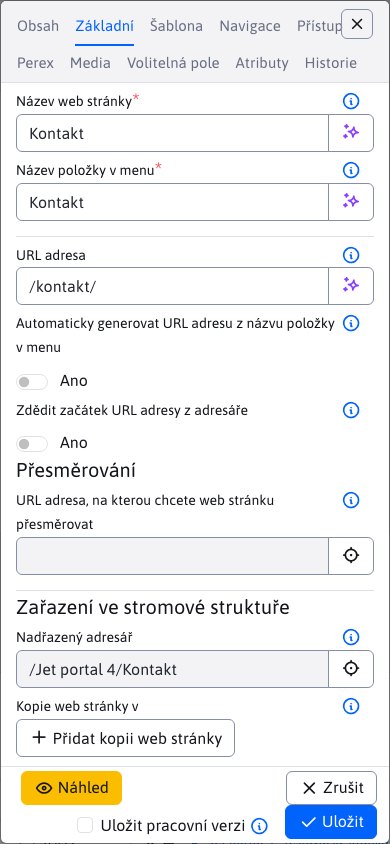

# Hlavní ovládací prvky

Rozložení administrace je standardní. V horní části se nachází hlavička, v levé části menu. Třetí úroveň menu je zobrazena jako navigační karty v hlavičce.

## Hlavička

V horní části se nachází hlavička:

obsahuje následující možnosti:
- Odkaz na otevření nápovědy.
-  Ikonu pro otevření stránky [Vyhledávání](search/README.md)
- Jméno aktuálně přihlášeného uživatele, kliknutím na jméno zobrazíte následující možnosti:
  - Profil - upravit vlastní profil (jméno, email... - po změně profilu je třeba se odhlásit a znovu přihlásit).
  - Dvoustupňové ověřování - možnost aktivovat dvoustupňové ověřování pomocí aplikace `Google Authenticate` při přihlašování do administrace. Zvyšuje se tak bezpečnost vašeho účtu, protože kromě hesla je pro přihlášení třeba zadat také kód z vašeho mobilního zařízení. Doporučujeme nastavit na všechny účty, přes které lze spravovat uživatelské účty a práva. Pokud používáte ověřování vůči `ActiveDirectory/SSO` serveru můžete menu položku vypnout nastavením konf. proměnné `2factorAuthEnabled` na hodnotu `false`.
  - Správa šifrovacích klíčů – umožňuje vytvořit nový šifrovací klíč pro šifrování formulářů a zadat existující klíč pro jejich dešifrování. Vyžaduje právo Formuláře.
  - Odhlášení - odhlášení z administrace.
-  Ikonu pro odhlášení z administrace.

V hlavičce se mohou zobrazovat karty pro přechod do třetí úrovně menu.

## Menu

V levé části pod logem WebJETu jsou ikony reprezentující hlavní sekce menu. Rozhodli jsme se pro takovou reprezentaci první úrovně menu, abychom nemuseli mít hluboce vnořené menu položky:

Klepnutím na ikonu hlavní sekce se zobrazí menu položky zvolené sekce:

Výběr domény se kterou pracujete (při více doménové instalaci) se nachází ve spodní části levého menu.

## Zobrazení na mobilních zařízeních

Administrace se přizpůsobuje mobilním zařízením. Při šířce okna méně než 1200 bodů se schová hlavička stránky a levé menu:

hlavičku a menu zobrazíte kliknutím na ikonu hamburger menu  vlevo nahoře. Následně se menu a hlavička zobrazí přes stránku. Navigační karty se v hlavičce zobrazí jako výběrové menu.

menu zavřete kliknutím na ikonu zavření menu .

Editor v datatabulce při šířce okna méně než 992 bodů (tabletové zobrazení) se zobrazí na plnou velikost okna:

U okna užšího než 576 bodů se přesunou i názvy polí z levé strany nad pole pro lepší zobrazení např. na mobilním telefonu:

