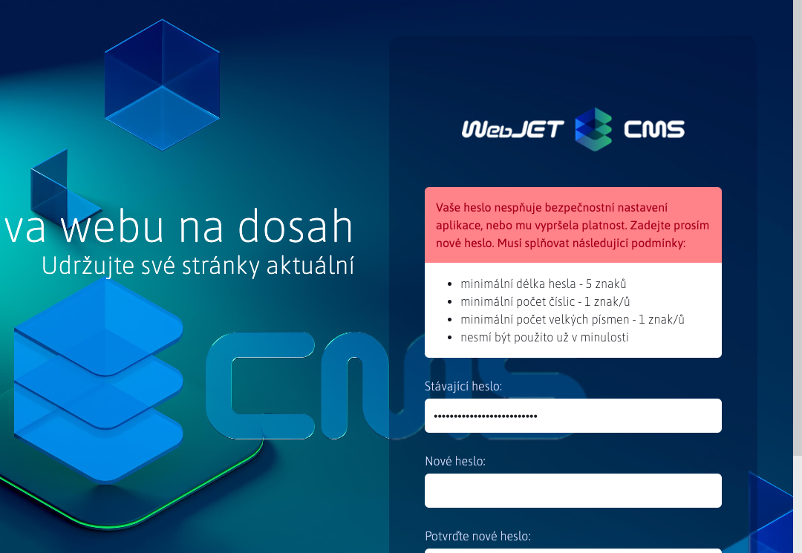
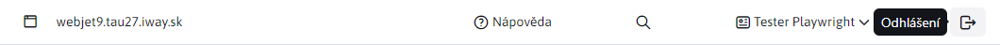

# Přihlašování a odhlašování

## Přihlášení

Do administrace systému WebJET CMS se můžete přihlásit na adrese `https://vasa-domena.sk/admin/`. Zobrazí se přihlašovací obrazovka:

do kterého zadáte své přihlašovací jméno a heslo. V přihlašovacím dialogu je integrována kontrola kvality hesla, pokud vaše heslo nemá kvalitu alespoň 4, je třeba heslo po přihlášení změnit na bezpečnější (musí obsahovat více velkých a malých písmen, číslic a speciálních znaků, jako např. `.-_?/`).

Klikněte na odkaz **Zapomenuté heslo** zobrazí se formulář pro změnu hesla. Zadejte svou e-mailovou adresu, pokud je v systému zaregistrována, obdržíte e-mail s odkazem na změnu hesla. Kliknutím na odkaz v obdrženém e-mailu zobrazíte formulář pro změnu hesla.

V závislosti na nastavení systému může platnost vašeho hesla vypršet nebo již nemusí splňovat bezpečnostní požadavky. V takovém případě budete po zadání správného hesla vyzváni k zadání nového hesla:

Zadejte nové heslo, které splňuje požadovaná kritéria.

## Odhlášení

Odkaz na odhlášení se nachází v záhlaví administrace v pravé horní části jako ikona. :

Kliknutím na ikonu odhlášení se odhlásíte ze systému WebJET CMS. Z bezpečnostních důvodů doporučujeme, abyste **vždy se po práci odhlaste** a ne jen zavřít okno prohlížeče.

!>**Varování:** pokud je velikost okna menší a záhlaví se nezobrazuje, klikněte na ikonu nabídky hamburgeru.  zobrazit záhlaví.
