# Přihlášení a odhlášení

## Přihlášení

### Přihlášení jménem a heslem

Do administrace WebJET CMS se přihlásíte na adrese ```https://vasa-domena.sk/admin/```. Zobrazí se přihlašovací obrazovka:

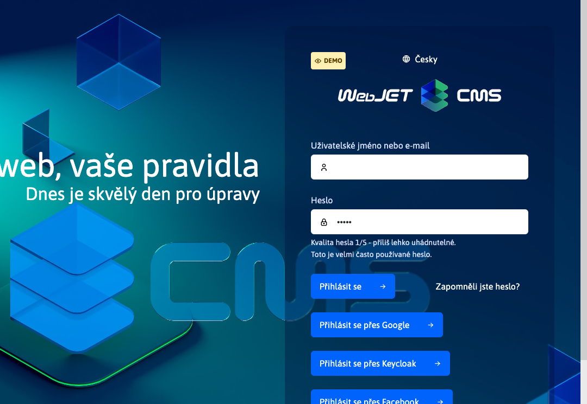

ve které zadejte vaše přihlašovací jméno a heslo. Do přihlašovacího dialogu je integrovaná kontrola kvality hesla, pokud vaše heslo nedosahuje kvality minimálně 4 je třeba heslo po přihlášení změnit na bezpečnější heslo (musí obsahovat více velká a malá písmena, číslice a speciální znaky jako ```.-_?/```).

Klepnutím na odkaz **Zapomenuté heslo** se zobrazí formulář pro změnu hesla. Zadejte vaši emailovou adresu, pokud je evidována v systému dostanete na email odkaz na změnu hesla. Klikněte na odkaz v mailu, který jste obdrželi pro zobrazení formuláře na změnu hesla.

Podle nastavení systému může uplynout platnost vašeho hesla, nebo nemusí již splňovat bezpečnostní požadavky. Tehdy se po zadání správného hesla zobrazí výzva k zadání nového hesla:

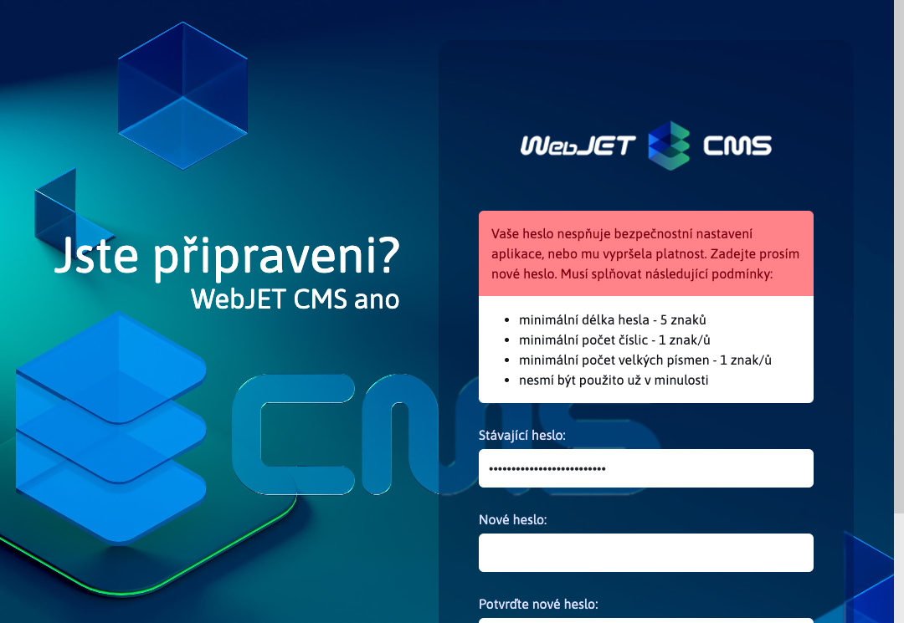

Zadejte nové heslo tak, aby splňovalo požadovaná kritéria.

### Použít přístupový klíč

**Přístupový klíč** (angl. *PassKey*) je moderní metoda přihlášení, která nahrazuje tradiční heslo. Využívá asymetrické šifrování (standard WebAuthn/FIDO2) – do systému se ukládá pouze veřejná část klíče, soukromá zůstává uložena ve vašem zařízení. Přístupový klíč je vázán na konkrétní doménu, což zabraňuje phishingovým útokům.


#### Výhody oproti heslu

- **Vyšší bezpečnost** – na serveru není uloženo žádné heslo, které by mohlo uniknout při bezpečnostním incidentu.
- **Odolnost vůči phishingu** – klíč funguje pouze na adrese, pro kterou byl vytvořen, na podvržené stránce se nepoužije.
- **Žádné zapomenuté heslo** – přihlášení funguje biometrií (otisk prstu, rozpoznání obličeje) nebo PIN-em zařízení.
- **Rychlé přihlášení** – není třeba zadávat jméno, heslo ani kód z autentifikátoru.

#### Jak se přihlásit přístupovým klíčem

Na přihlašovací stránce klikněte na tlačítko **Použít přístupový klíč**. Následně vás prohlížeč vyzve k ověření totožnosti pomocí biometrie nebo PINu vašeho zařízení.


**Windows (Windows Hello)**

Systém zobrazí výzvu `Windows Hello`. Ověřte se otiskem prstu, rozpoznáním obličeje nebo zadáním PINu zařízení. Po úspěšném ověření budete automaticky přihlášeni.

**macOS/iOS (Touch ID/Face ID)**

Systém zobrazí výzvu `Touch ID` nebo `Face ID`. Přiložte prst na snímač nebo dívejte do kamery. Po úspěšném ověření budete automaticky přihlášeni.

**Mobilní zařízení (Android / iOS)**

Systém zobrazí výzvu k odemčení zařízení (otisk prstu, obličej nebo PIN). Po úspěšném ověření budete automaticky přihlášeni.

#### Přidání nového přístupového klíče

Přístupový klíč přidáte po přihlášení kliknutím na vaše **jméno v pravé horní části** hlavičky administrace


a výběrem položky **Přístupový klíč**.

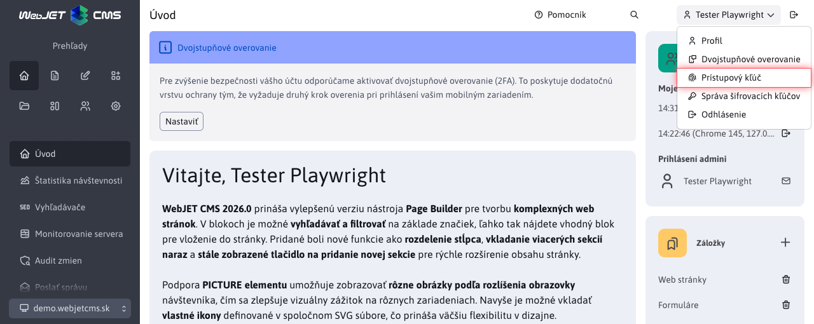

Zobrazí se správce přístupových klíčů.


Nový přístupový klíč přidáte kliknutím na ikonu<button class="btn btn-sm btn-success"><span><i class="ti ti-plus"></i></span></button>

1. Do pole **Název nového přístupového klíče** zadejte pojmenování (např. Můj notebook), abyste klíče snadno rozlišili.
2. Klepněte na tlačítko **Přidat**.
3. Prohlížeč vás vyzve k ověření totožnosti biometrií nebo PIN-em zařízení.
4. Po úspěšném ověření se klíč zobrazí v seznamu registrovaných klíčů.


Zaregistrovaný klíč můžete kdykoli odstranit jeho označením a kliknutím na ikonu koše. Veřejný klíč se ale takto odstraní jen v databázi WebJET CMS, samotný privátní klíč zůstává uložen ve vašem zařízení. Chcete-li se ujistit, že klíč již nebude možné použít, musíte jej odstranit také z nastavení vašeho zařízení (například v nastavení `Windows Hello` nebo `Apple heslách`).

!>**Upozornění:** Přístupový klíč je vázán na konkrétní zařízení a prohlížeč. Chcete-li se přihlašovat z více zařízení, zaregistrujte jej na každém zařízení zvlášť, nebo využijte cloud synchronizační službu pro přenos klíčů mezi zařízeními (například iCloud klíčenka, `Google Password Manager`).

Možnost přihlašování přístupovým klíčem můžete vypnout nastavením konfigurační proměnné `password_passKeyEnabled` na hodnotu `false`.

## Přihlášení z nového zařízení

WebJET CMS eviduje, ze kterého prohlížeče se přihlašujete do administrace. U nového prohlížeče vám odešle email a na [úvodní obrazovce](welcome.md#systémové-upozornění) zobrazí upozornění **Přihlásili jste se z nového prohlížeče**. V administraci můžete pracovat, upozornění vám umožňuje zkontrolovat, zda jste se přihlásili vy.

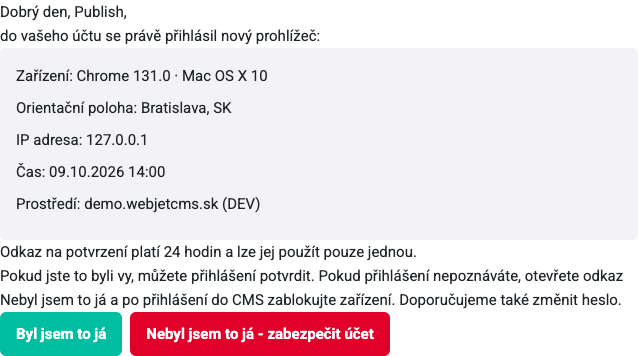

Zařízením se zde rozumí konkrétní prohlížeč a jeho profil, nikoli celý počítač. Upozornění proto můžete obdržet i na svém běžném počítači při prvním přihlášení po zavedení evidence zařízení, po vymazání cookies nebo v anonymním okně. Běžné odhlášení zapamatování prohlížeče nezruší.

Pokud přihlášení znáte, potvrďte jej odkazem **Byl jsem to já** v emailu nebo stejným tlačítkem při upozornění. Tlačítko v administraci odešle emailový kód a zobrazí pole pro jeho zadání. Pokud přihlášení neznáte, postupujte podle [návodu k zablokování zařízení](welcome.md#ak-přihlášení- neznáte).

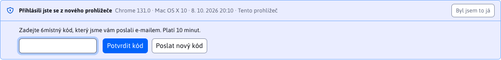

Po úspěšném dvoustupňovém ověření se nezablokovaný prohlížeč potvrdí automaticky. Obdržíte informační email bez potřeby dalšího potvrzení.

## Ověření zablokovaného zařízení

Pokud jste prohlížeč označili přes **Nebyl jsem to já** a zablokovali jej, při dalším přihlášení se po zadání správného jména a hesla zobrazí stránka **Ověření zablokovaného zařízení**. Máte-li zapnuto [dvoustupňové ověřování](#dvoustupňové-ověřování), nejprve zadáte i kód z autentifikační aplikace. Výzva k emailovému kódu je další krok k odblokování prohlížeče - neznamená, že jste zadali nesprávné heslo.

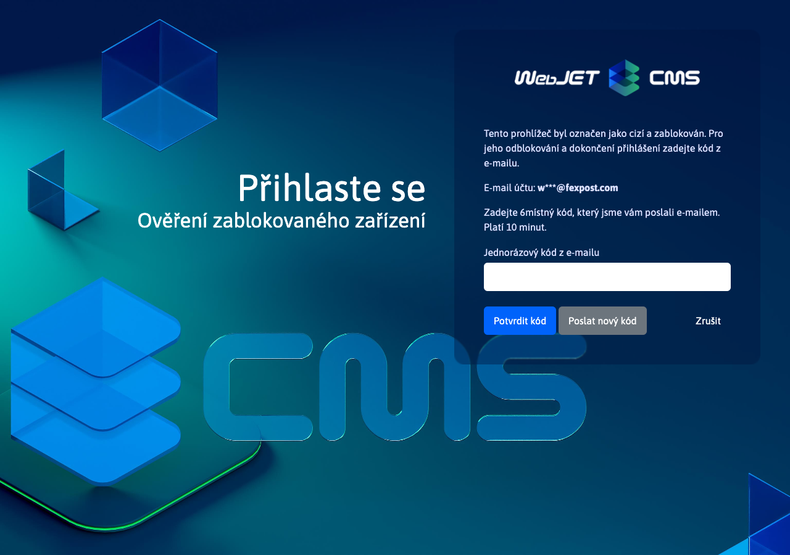

1. Otevřete emailovou schránku účtu uvedeného na obrazovce. WebJET CMS do ní automaticky odešle šestimístný kód.
2. Ve stejném prohlížeči, ve kterém jste zahájili přihlášení, zadejte kód do pole **Jednorázový kód z e-mailu**. Použijte kód z emailu, nikoli kód z autentifikační aplikace.
3. Klepněte na **Potvrdit kód**. Prohlížeč se odblokuje, potvrdí a otevře se administrace. Při následujícím přihlášení již toto ověření nepotřebuje, pokud jej znovu nezablokujete.

Email obsahuje údaje o zablokovaném prohlížeči a kód pro jeho odblokování a dokončení přihlášení:

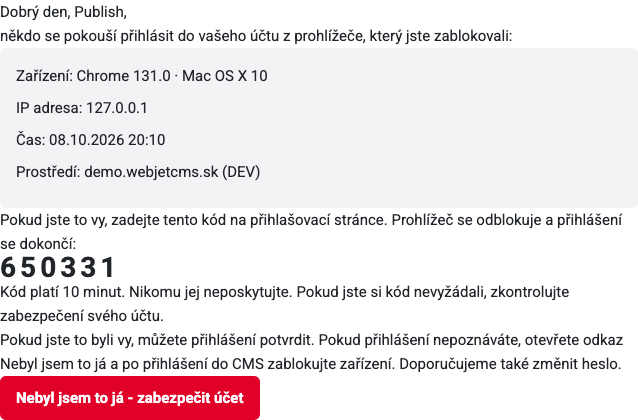

Kód platí **10 minut** a umožňuje maximálně **5 pokusů**. Pokud email nepřišel, zkontrolujte i nevyžádanou poštu a adresu zobrazenou na obrazovce. Tlačítkem **Poslat nový kód** můžete po minutě vyžádat další email. Nový kód nahradí předchozí. Opětovné odeslání během platnosti předchozího kódu neobnoví počet zbývajících pokusů. Po pěti neúspěšných pokusech počkejte na vypršení platnosti kódu.

Při nesprávném nebo neplatném kódu se zobrazí chybová zpráva a zůstanete na ověřovací stránce:

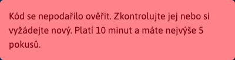

Celé ověření je třeba dokončit do **15 minut**, jinak se přihlaste znovu. Tlačítko **Zrušit** ukončí rozpracované přihlášení a prohlížeč zůstane zablokován. Bez správného kódu zůstává administrace nepřístupná. Pokud k emailové schránce nemáte přístup, obraťte se na správce.

## Odhlášení

Odkaz na odhlášení se nachází v hlavičce administrace v pravé horní části jako ikona 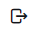:

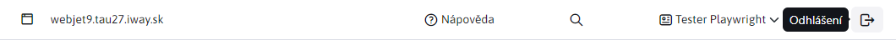

Klepnutím na ikonu odhlášení se odhlásíte z WebJET CMS. Z důvodu bezpečnosti doporučujeme, abyste se **vždy po skončení práce odhlásili** a nejen zavřeli okno v prohlížeči.

!>**Upozornění:** při menší velikosti okna se nezobrazuje hlavička, klikněte na ikonu hamburger menu  pro zobrazení hlavičky.

## Dvoustupňové ověřování

**Dvoustupňové ověřování** také známé jako **Dvoufaktorová autorizace (2FA)** pomocí aplikace `Google Authenticator` (nebo `Microsoft Authenticator`) zvyšuje bezpečnost vašeho účtu, protože kromě hesla je pro přihlášení třeba zadat i kód z vašeho mobilního zařízení.

!>**Upozornění:** Doporučujeme nastavit na všechny účty, přes které lze spravovat uživatelské účty a práva.

Pro používání **dvoustupňového ověřování** musíte mít nastavenou konfigurační proměnnou `2factorAuthEnabled` na hodnotu `true`.

Pokud používáte ověřování vůči `ActiveDirectory/SSO` serveru, můžete funkcionalitu vypnout nastavením konf. proměnné `2factorAuthEnabled` na hodnotu `false`.

!>**Upozornění:** pokud chcete každého administrátora donutit k využívání **dvoustupňového ověřování**, stačí když nastavíte konfigurační proměnnou `isGoogleAuthRequiredForAdmin` na hodnotu `true`.

### Nastavení dvoustupňového ověřování

Nastavení `2FA` naleznete kliknutím na jméno uživatele v pravé horní části

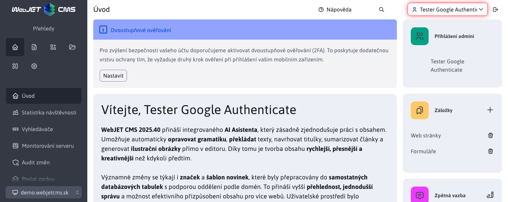

následně se zobrazí menu, ve které zvolíte možnost **Dvoustupňové ověřování**


Zobrazí se Vám okno s nastavením dvoustupňového ověřování.

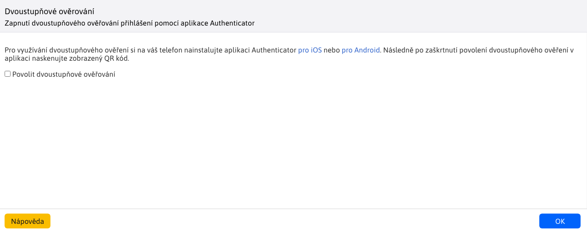

Pro další krok, budete potřebovat nainstalovanou aplikaci. V okně již jsou připraveny linky pro aplikaci `Google Authenticator`

- <a href="https://itunes.apple.com/us/app/google-authenticator/id388497605" target="_blank">Google Authenticator pro iOS</a>
- <a href="https://play.google.com/store/apps/details?id=com.google.android.apps.authenticator2" target="_blank">Google Authenticator pro Android</a>

ale můžete používat také `Microsoft Authenticator` nebo jinou aplikaci podporující `TOTP` kódy.

- <a href="https://apps.apple.com/us/app/microsoft-authenticator/id983156458" target="_blank">Microsoft Authenticator pro iOS</a>
- <a href="https://play.google.com/store/search?q=microsoft%20auth&c=apps" target="_blank">Microsoft Authenticator pro Android</a>

Následně v okně zaškrtněte možnost **Povolit dvoustupňové ověřování**, čímž se Vám zobrazí `QR` kód. Pomocí mobilní aplikace naskenujte tento `QR` kód, případně přidejte ověření zadáním vygenerovaného klíče.


!>**Upozornění:** nezapomeňte stisknout **OK** pro uložení nastavení.

### Přihlášení se zadáním kódu

Při následujícím přihlášení zadáte své standardní přihlašovací údaje

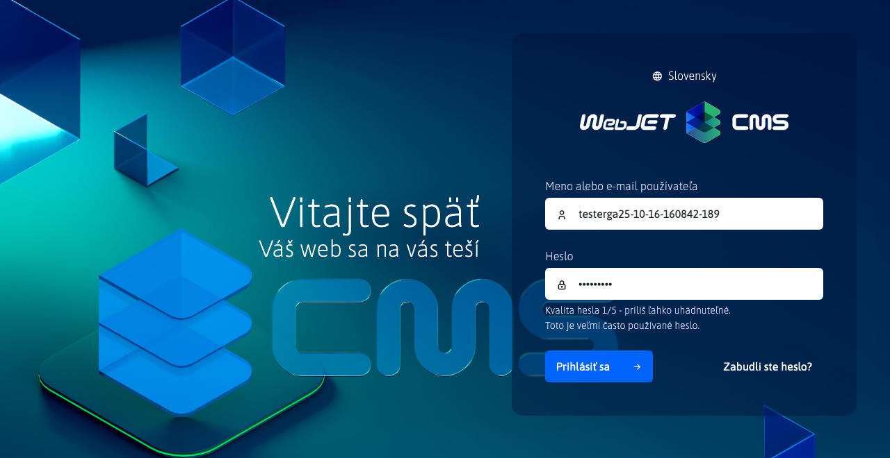

a pokud se **dvoustupňové ověřování** úspěšně nastavilo, po zadání jména a hesla budete ještě vyzváni k zadání kódu z autentifikační aplikace.

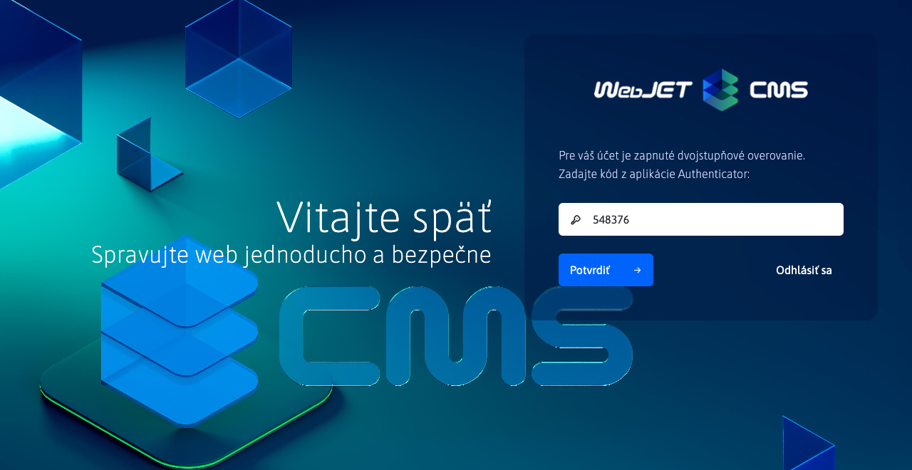

Může nastat situace, kdy zadanému kód vyprší platnost, než se stihnete přihlásit. V takovém případě musíte zadat nový kód vygenerovaný aplikací.


Zadáte-li platný kód, budete úspěšně přihlášeni.

### Ztráta mobilního zařízení

Při ztrátě zařízení můžete ztratit přístup k účtu, proto doporučujeme v aplikaci nastavit zálohování dat pro jejich jednoduchou obnovu na novém zařízení. Pokud používáte více zařízení, je možné QR kód při nastavení dvou faktorové autentizace přidat do více zařízení, nebo různých aplikací najednou.
