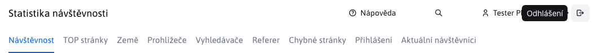

# Přihlášení a odhlášení

## Přihlášení

Do administrace WebJET CMS se přihlásíte na adrese `https://vasa-domena.sk/admin/`. Zobrazí se přihlašovací obrazovka:

ve které zadejte vaše přihlašovací jméno a heslo. Do přihlašovacího dialogu je integrovaná kontrola kvality hesla, pokud vaše heslo nedosahuje kvality minimálně 4 je třeba heslo po přihlášení změnit na bezpečnější heslo (musí obsahovat několik velká a malá písmena, číslice a speciální znaky jako `.-_?/`).

Klepnutím na odkaz **Zapomenuté heslo** se zobrazí formulář pro změnu hesla. Zadejte vaši emailovou adresu, pokud je evidována v systému dostanete na email odkaz na změnu hesla. Klikněte na odkaz v mailu, který jste obdrželi pro zobrazení formuláře na změnu hesla.

Podle nastavení systému může exspirovat platnost vašeho hesla, nebo nemusí již splňovat bezpečnostní požadavky. Tehdy se po zadání správného hesla zobrazí výzva k zadání nového hesla:

Zadejte nové heslo tak, aby splňovalo požadovaná kritéria.

## Odhlášení

Odkaz na odhlášení se nachází v hlavičce administrace v pravé horní části jako ikona :

Klepnutím na ikonu odhlášení se odhlásíte z WebJET CMS. Z důvodu bezpečnosti doporučujeme, abyste se **vždy po skončení práce odhlásili** a nejen zavřeli okno v prohlížeči.

!>**Upozornění:** při menší velikosti okna se nezobrazuje hlavička, klikněte na ikonu hamburger menu  pro zobrazení hlavičky.
