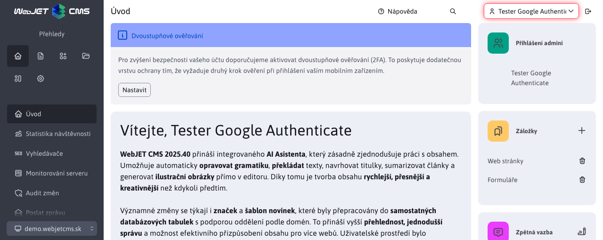
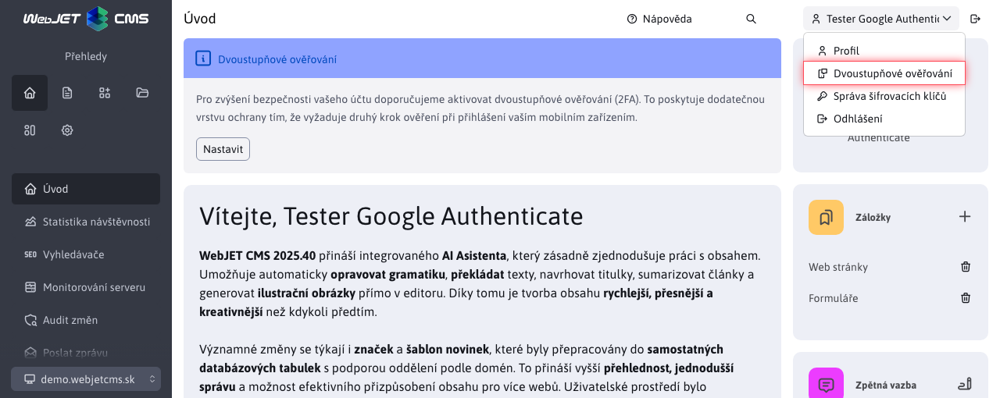
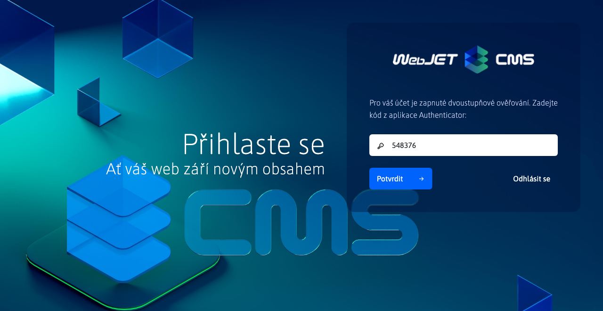
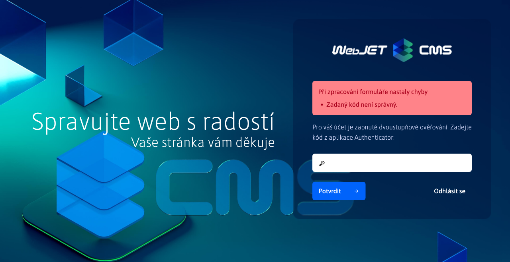

# Přihlášení a odhlášení

## Přihlášení

Do administrace WebJET CMS se přihlásíte na adrese `https://vasa-domena.sk/admin/`. Zobrazí se přihlašovací obrazovka:

ve které zadejte vaše přihlašovací jméno a heslo. Do přihlašovacího dialogu je integrovaná kontrola kvality hesla, pokud vaše heslo nedosahuje kvality minimálně 4 je třeba heslo po přihlášení změnit na bezpečnější heslo (musí obsahovat několik velká a malá písmena, číslice a speciální znaky jako `.-_?/`).

Klepnutím na odkaz **Zapomenuté heslo** se zobrazí formulář pro změnu hesla. Zadejte vaši emailovou adresu, pokud je evidována v systému dostanete na email odkaz na změnu hesla. Klikněte na odkaz v mailu, který jste obdrželi pro zobrazení formuláře na změnu hesla.

Podle nastavení systému může uplynout platnost vašeho hesla, nebo nemusí již splňovat bezpečnostní požadavky. Tehdy se po zadání správného hesla zobrazí výzva k zadání nového hesla:

Zadejte nové heslo tak, aby splňovalo požadovaná kritéria.

## Odhlášení

Odkaz na odhlášení se nachází v hlavičce administrace v pravé horní části jako ikona :

Klepnutím na ikonu odhlášení se odhlásíte z WebJET CMS. Z důvodu bezpečnosti doporučujeme, abyste se **vždy po skončení práce odhlásili** a nejen zavřeli okno v prohlížeči.

!>**Upozornění:** při menší velikosti okna se nezobrazuje hlavička, klikněte na ikonu hamburger menu  pro zobrazení hlavičky.

## Dvoustupňové ověřování

**Dvoustupňové ověřování** také známé jako **Dvoufaktorová autorizace (2FA)** pomocí aplikace `Google Authenticator` (nebo `Microsoft Authenticator`) zvyšuje bezpečnost vašeho účtu, protože kromě hesla je pro přihlášení třeba zadat i kód z vašeho mobilního zařízení.

!>**Upozornění:** Doporučujeme nastavit na všechny účty, přes které lze spravovat uživatelské účty a práva.

Pro používání **dvoustupňového ověřování** musíte mít nastavenou konfigurační proměnnou `2factorAuthEnabled` na hodnotu `true`.

Pokud používáte ověřování vůči `ActiveDirectory/SSO` serveru, můžete funkcionalitu vypnout nastavením konf. proměnné `2factorAuthEnabled` na hodnotu `false`.

!>**Upozornění:** chcete-li každého administrátora donutit k využívání **dvoustupňového ověřování**, stačí pokud nastavíte konfigurační proměnnou `isGoogleAuthRequiredForAdmin` na hodnotu `true`.

### Nastavení dvoustupňového ověřování

Nastavení `2FA` naleznete kliknutím na uživatelské jméno v pravé horní části

následně se zobrazí menu, ve které zvolíte možnost **Dvoustupňové ověřování**

Zobrazí se Vám okno s nastavením dvoustupňového ověřování.

Pro další krok, budete potřebovat nainstalovanou aplikaci. V okně již jsou připraveny linky pro aplikaci `Google Authenticator`

- <a href="https://itunes.apple.com/us/app/google-authenticator/id388497605" target="_blank">Google Authenticator pro iOS</a>
- <a href="https://play.google.com/store/apps/details?id=com.google.android.apps.authenticator2" target="_blank">Google Authenticator pro Android</a>

ale můžete používat také `Microsoft Authenticator` nebo jinou aplikaci podporující `TOTP` kódy.

- <a href="https://apps.apple.com/us/app/microsoft-authenticator/id983156458" target="_blank">Microsoft Authenticator pro iOS</a>
- <a href="https://play.google.com/store/search?q=microsoft%20auth&c=apps" target="_blank">Microsoft Authenticator pro Android</a>

Následně v okně zaškrtněte možnost **Povolit dvoustupňové ověřování**, čímž se Vám zobrazí `QR` kód. Pomocí mobilní aplikace naskenujte tento `QR` kód, případně přidejte ověření zadáním vygenerovaného klíče.

!>**Upozornění:** nezapomeňte stisknout **OK** pro uložení nastavení.

### Přihlášení se zadáním kódu

Při následujícím přihlášení zadáte své standardní přihlašovací údaje

a pokud se **dvoustupňové ověřování** úspěšně nastavilo, po zadání jména a hesla budete ještě vyzváni k zadání kódu z autentifikační aplikace.

Může nastat situace, kdy zadanému kód vyprší platnost, než se stihnete přihlásit. V takovém případě musíte zadat nový kód vygenerovaný aplikací.

Zadáte-li platný kód, budete úspěšně přihlášeni.

### Ztráta mobilního zařízení

Při ztrátě zařízení můžete ztratit přístup k účtu, proto doporučujeme v aplikaci nastavit zálohování dat pro jejich jednoduchou obnovu na novém zařízení. Pokud používáte více zařízení, je možné QR kód při nastavení dvou faktorové autentizace přidat do více zařízení, nebo různých aplikací najednou.
