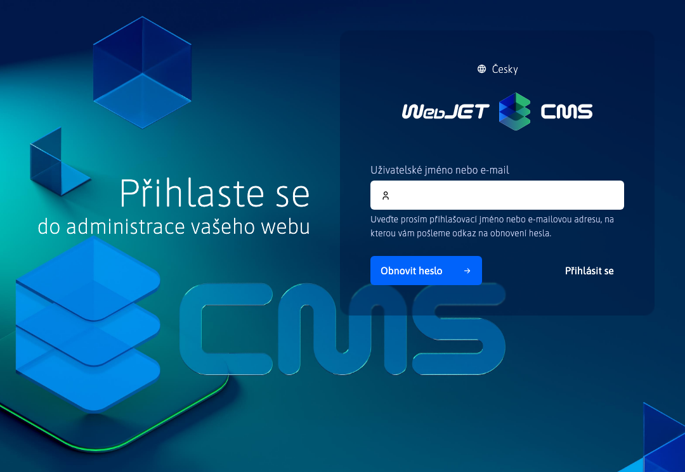
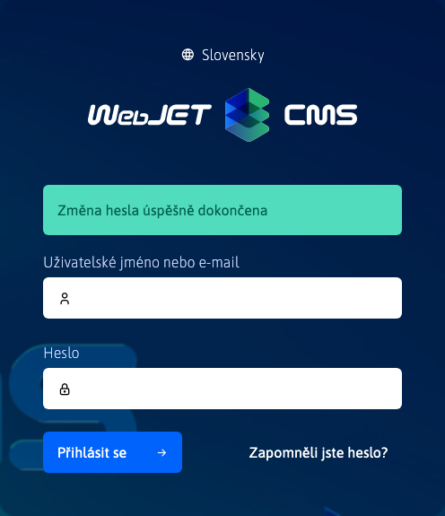
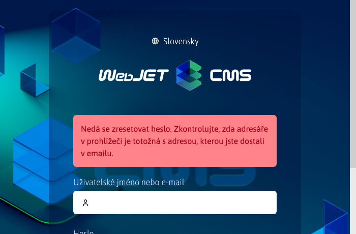
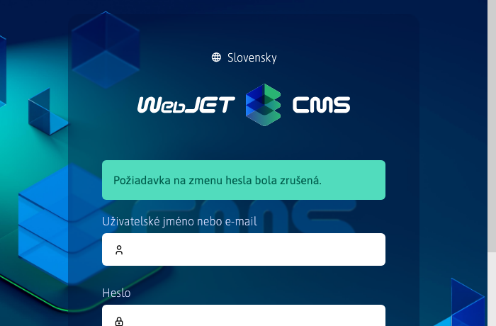

# Zapomenuté heslo

V případě, že jste zapomněli své heslo můžete ho obnovit následujícím způsobem.

## Admin sekce

Pokud jste zapomněli své heslo pro admin sekci, můžete požádat o obnovení hesla na přihlašovací stránce.

Klepnutím na na možnost  se zobrazí formulář pro obnovení hesla.

Do pole musíte zadat Vaši **emailovou adresu** nebo **přihlašovací jméno**. Žádost odešlete stisknutím tlačítka . Zobrazená notifikace Vás upozorní, že pokud účet existuje, bude zaslán email na patřičnou e-mailovou adresu.

## Zákaznická zóna

Pokud jste zapomněli své heslo pro zákaznickou zónu, můžete požádat o obnovení hesla na přihlašovací stránce.

Klepnutím na na možnost **Zapomněli jste heslo?** se zobrazí skryté pole pro obnovení.

|             Před |              Po |
| :---------------------------: | :---------------------------: |
|  |  |

Do pole musíte zadat Vaši **emailovou adresu** nebo **přihlašovací jméno**. Žádost odešlete stisknutím tlačítka . Zobrazená notifikace Vás upozorní, že pokud účet existuje, bude zaslán email na patřičnou e-mailovou adresu.

## Email ke změně hesla

Zaslaný email obsahuje 2 odkazy:
- odkaz pro změnu hesla, **Chcete-li změnit heslo, klikněte sem do 30 minut.**
- odkaz na zrušení akce změny hesla, **Pokud jste nepožádali o změnu hesla můžete tuto akci zrušit kliknutím zde.**

Jméno a email adresu ze které je odeslán email s odkazem na změnu hesla lze nastavit přes konfigurační proměnné `passwordResetDefaultSenderEmail` a `passwordResetDefaultSenderName`.

### Akce změny hesla

Klepnutím na první odkaz, **Chcete-li změnit heslo, klikněte sem do 30 minut.**, se dostanete na stránku ke změně hesla.

|          Admin sekce |     Uživatelská sekce |
| :----------------------------: | :---------------------------: |
|  |  |

!> **Upozornění:** přihlašovací jméno je typu výběrové pole z důvodu možnosti registrace více přihlašovacích jmen se stejným emailem (např. přihlášení do administrace a zákaznické konto). Výběrové pole tak obsahuje všechna přihlašovací jména, která sdílejí zadanou emailovou adresu. **Heslo bude změněno pouze uživateli, jehož přihlašovací jméno zvolíte.**

Následně musíte zadat nové heslo a znovu jej zadat pro ověření. Pokud se hesla nebudou shodovat nebo nebudou splňovat minimální požadavky na kvalitu hesla, budete upozorněni.

|       Heslo se neshoduje |          Slabé heslo |
| :----------------------------: | :----------------------------: |
|  |  |
|   |   |

Pokud se heslo pro zvoleného uživatele úspěšně změní, zobrazí se následující hlášení.

|          Admin sekce |     Uživatelská sekce |
| :----------------------------: | :---------------------------: |
|  |  |

!> **Upozornění:** po úspěšné změně hesla se odkaz, kterým jste se dostali k formuláři na změnu **stává nefunkčním**, tedy nebude možné použít k opětovné změně hesla pro stejného nebo jiného uživatele. Odkaz se stává také nefunkční, pokud jste akci neprovedli do 30 minut od přijetí emailu.

|              Admin sekce |          Uživatelská sekce |
| :-------------------------------------: | :------------------------------------: |
|  |  |

### Akce zrušení změny

Klepnutím na druhý odkaz **Pokud jste nepožádali o změnu hesla můžete tuto akci zrušit kliknutím zde.** se opět dostanete na stránku, která Vám sdělí že akce změny hesla byla zrušena, čímž se první odkaz na změnu hesla **stala nefunkční**.

|            Admin sekce |        Uživatelská sekce |
| :---------------------------------: | :--------------------------------: |
|  |  |

## Poznámky k implementaci

- změna hesla funguje přes záznam auditu, kde při žádosti o změnu hesla se vytvoří záznam typu `USER_CHANGE_PASSWORD`, který má v popisu text `Vyžiadanie zmeny hesla`
- při akci o změnu hesla se ověří, zda tento auditní záznam existuje a zda není starší 30 minut, pokud neexistuje nebo je starší, odkaz ke změně hesla již nebude fungovat a záznam zůstane existovat
- při použití odkazu ke zrušení změny hesla se vymaže tento záznam z auditu
- pokud email použitý pro změnu hesla je spojen s více účty, v auditním záznamu je vždy přihlašovací jméno nejnovějšího uživatele, kterým lze přes tento email změnit heslo
- po úspěšné akci změny hesla se záznam z auditu vymaže
