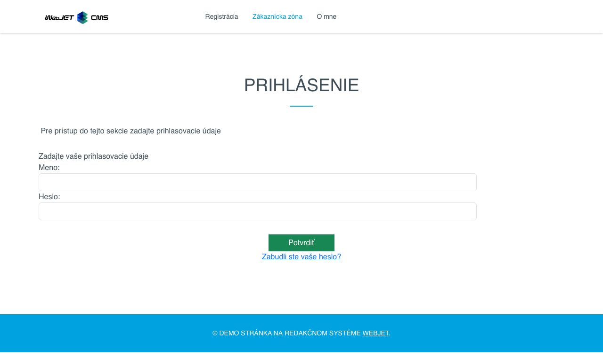
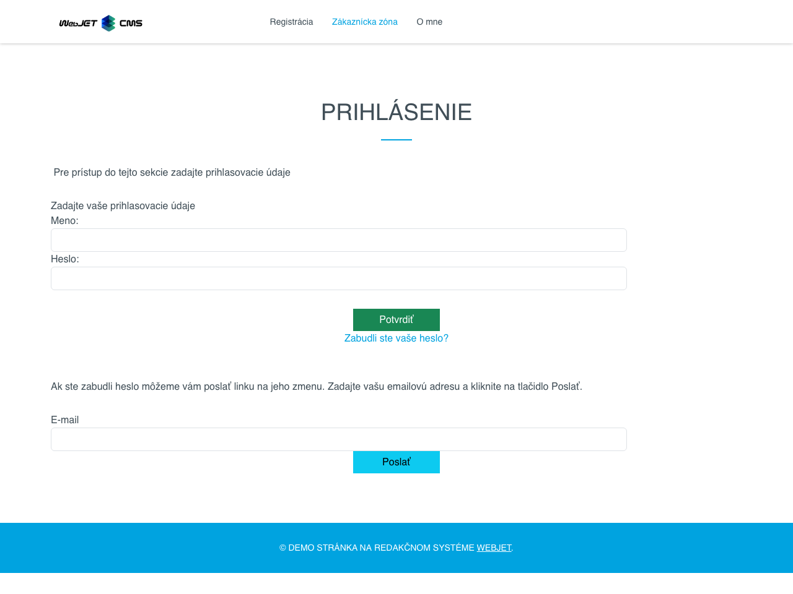
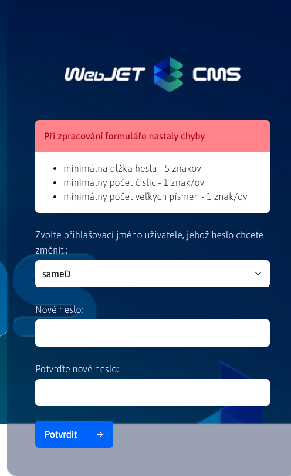
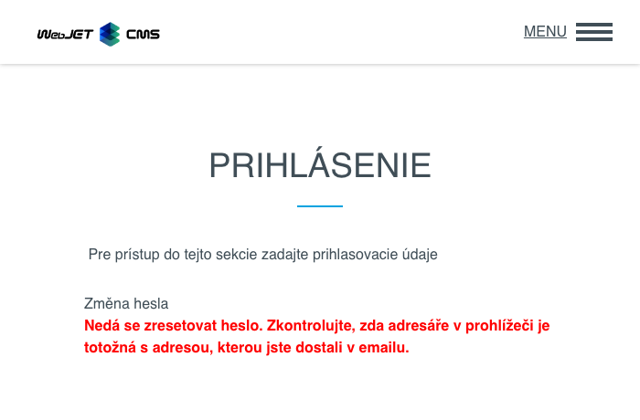
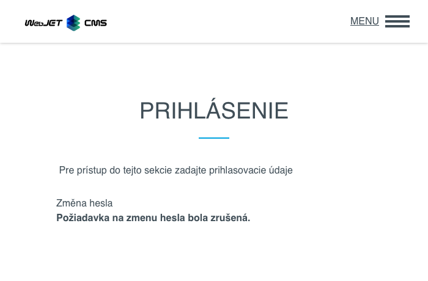

# Zapomenuté heslo

Pokud jste zapomněli své heslo, můžete jej obnovit následujícím způsobem.

## Sekce správce

Pokud jste zapomněli heslo do sekce správce, můžete si na přihlašovací stránce vyžádat obnovení hesla.

Klikněte na možnost  zobrazí se formulář pro obnovení hesla.

Musíte zadat svůj **e-mailová adresa** nebo **přihlašovací jméno**. Chcete-li žádost odeslat, stiskněte tlačítko . Upozornění vás upozorní, že pokud účet existuje, bude vám na příslušnou e-mailovou adresu zaslán e-mail.

## Zákaznická zóna

Pokud jste zapomněli heslo do zákaznické zóny, můžete si na přihlašovací stránce vyžádat obnovení hesla.

Klikněte na možnost **Zapomněli jste heslo?** zobrazí se skryté pole pro obnovení.

| Před | Po |
| :---------------------------: | :---------------------------: |
|  |  |

Musíte zadat svůj **e-mailová adresa** nebo **přihlašovací jméno**. Chcete-li žádost odeslat, stiskněte tlačítko . Upozornění vás upozorní, že pokud účet existuje, bude vám na příslušnou e-mailovou adresu zaslán e-mail.

## E-mail pro změnu hesla

Odeslaný e-mail obsahuje 2 odkazy:
- odkaz na změnu hesla, **Chcete-li změnit heslo, klikněte do 30 minut zde.**
- odkaz na zrušení akce změny hesla, **Pokud jste o změnu hesla nepožádali, můžete tuto akci zrušit kliknutím sem.**

### Akce změny hesla

Klikněte na první odkaz, **Chcete-li změnit heslo, klikněte do 30 minut zde.**, budete přesměrováni na stránku pro změnu hesla.

| Sekce správce | Uživatelská sekce
| :----------------------------: | :---------------------------: |
|  |  |

!> **Varování:** přihlašovací jméno je typem výběrového pole kvůli možnosti registrace více přihlašovacích jmen se stejným e-mailem (např. přihlášení do administrace a zákaznického účtu). Výběrové pole tedy obsahuje všechna přihlašovací jména, která sdílejí zadanou e-mailovou adresu. **Heslo se změní pouze pro uživatele, jehož přihlašovací jméno jste zvolili.**

Poté musíte zadat nové heslo a znovu jej zadat pro ověření. Pokud se hesla neshodují nebo nesplňují minimální požadavky na kvalitu hesla, budete na to upozorněni.

| Heslo neodpovídá | Slabé heslo |
| :----------------------------: | :----------------------------: |
|  |  |
|   |   |

Pokud se heslo vybraného uživatele úspěšně změní, zobrazí se následující zpráva.

| Sekce správce | Uživatelská sekce
| :----------------------------: | :---------------------------: |
|  |  |

!> **Varování:** po úspěšné změně hesla odkaz, který vás přivedl na formulář pro změnu hesla. **se stává nefunkční** to znamená, že jej nelze použít k opětovné změně hesla pro stejného nebo jiného uživatele. Odkaz se rovněž stane nefunkčním, pokud jste akci neprovedli do 30 minut od obdržení e-mailu.

| Sekce správce | Uživatelská sekce
| :-------------------------------------: | :------------------------------------: |
|  |  |

### Změna akce zrušení

Klikněte na druhý odkaz **Pokud jste o změnu hesla nepožádali, můžete tuto akci zrušit kliknutím sem.** budete přesměrováni zpět na stránku, která vás informuje, že akce změny hesla byla zrušena, a na které se zobrazí první odkaz pro změnu hesla. **se stala nefunkční**.

| Sekce správce | Uživatelská sekce
| :---------------------------------: | :--------------------------------: |
|  |  |

## Poznámky k implementaci

- změna hesla funguje prostřednictvím auditní stopy, kdy se při požadavku na změnu hesla vytvoří záznam typu. `USER_CHANGE_PASSWORD` který má v popisu text `Vyžiadanie zmeny hesla`
- při požadavku na změnu hesla se kontroluje, zda tato auditní stopa existuje a zda není starší než 30 minut; pokud neexistuje nebo je starší, odkaz na změnu hesla již nebude fungovat a auditní stopa zůstane zachována.
- při použití odkazu pro zrušení změny hesla je tento záznam z auditu vymazán.
- pokud je e-mail použitý ke změně hesla spojen s více účty, obsahuje auditní záznam vždy přihlašovací jméno posledního uživatele, který může změnit heslo prostřednictvím tohoto e-mailu.
- po úspěšné změně hesla je auditní záznam vymazán.
