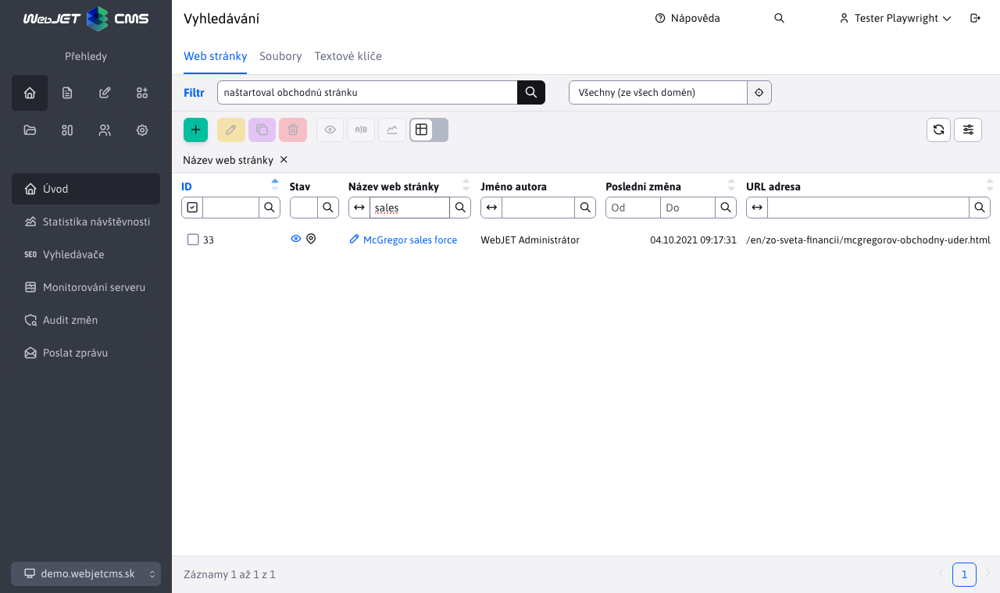

# Vyhledávání

## Přehled

Sekce **Vyhledávání** v administraci umožňuje uživatelům vyhledávat obsah ve více oblastech, jako jsou webové stránky, soubory a textové klíče. Vyhledávání poskytuje nástroje na filtrování výsledků a na zúžení rozsahu vyhledávání, což zlepšuje efektivitu práce s obsahem.

## Přístup do sekce:

Do sekce **Vyhledávání** se dostaneme v administraci pomocí ikony lupy  v hlavičce.

Viz také [Hlavička](../README#hlavička) pro další informace.

## Klíčové funkce:

1. **Fulltextové vyhledávání**:
   - Vyhledávání probíhá nejen v titulcích stránek, ale také v jejich textovém obsahu.
   - Uživatel může najít obsah i na základě klíčových slov, která se nacházejí v textu dokumentů nebo souborů.

2. **Filtrování výsledků**:
   - Kromě fulltextového vyhledávání lze využít sloupcových filtrů pro přesnější zobrazení výsledků.
   - Tabulky umožňují filtrování na základě sloupců, jako jsou `Názov web stránky`, `Meno autora` nebo `Kľúč`.

3. **Podpora více typů obsahu**:
   - Webové stránky
   - Soubory
   - Textové klíče

## Používání sekce Vyhledávání

### Rozhraní Vyhledávání:

Sekce je rozdělena do několika karet. Každá karta umožňuje specifické vyhledávání a filtrování:

#### 1. Web stránky

- **Fulltextové vyhledávání:** Zadejte klíčové slovo, které se nachází v textu stránky nebo její titulku.
- **Omezení podle stromové struktury**  Můžete omezit vyhledávání výběrem složky ve které se bude vyhledávat (hledá se iv pod složkách).
- **Filtrování:** Použijte sloupce jako `Názov web stránky` a `Meno autora` k zúžení výsledků.
- **Práva uživatelů:** Zobrazené výsledky závisí na právech jednotlivých uživatelů. Uživatel vidí pouze ty stránky, ke kterým má oprávnění.

#### 2. Soubory

- **Fulltextové vyhledávání:** Vyhledávejte text, který se nachází v obsahu souborů, jakož i v názvech souborů.
- **Filtrování:** Sloupce jako `Názov súboru` a `URL adresa` pomáhají přesně specifikovat výsledky.
- **Symbol oka:** Klepnutím na ikonu oka  při názvu souboru si můžete soubor zobrazit.
- **URL adresa:** Odkazy  umožňují rychlou navigaci do adresáře v Průzkumníkovi.

!> Upozornění: pro vyhledávání v souborech se používá [plně textový index souborů](../../files/fbrowser/folder-settings/README.md#indexování), nalezeny jsou tedy pouze soubory, které jsou indexovány.

#### 3. Textové klíče

- **Fulltextové vyhledávání:** Najděte textové klíče podle obsahu ve všech dostupných jazycích.
- **Filtrování:** Používejte sloupce, jako `Kľúč` nebo `Jazyk`, pro přesnější vyhledávání.

## Příklady použití:

- **Vyhledávání ve web stránkách:**
  - Hledáte frázi `naštartoval obchodnú stránku`.
  - Výsledky obsahují stránky, kde se tato fráze nachází v textu. Pro zúžení výsledků použijete filtr `sales` ve sloupci pro `Názov stránky`.

- **Vyhledávání v souborech:**
  - Hledáte `only for users in Bankari group`.
  - Výsledky obsahují všechny soubory, kde se tato fráze nachází v textu.

- **Vyhledávání textových klíčů:**
  - Hledáte `Pridať adresár`.
  - Výsledky obsahují klíče s českým textem `Pridať adresár`. Následně můžete použít filtr `addGroup` ve sloupci `Kľúč` ke zúžení výsledků.

