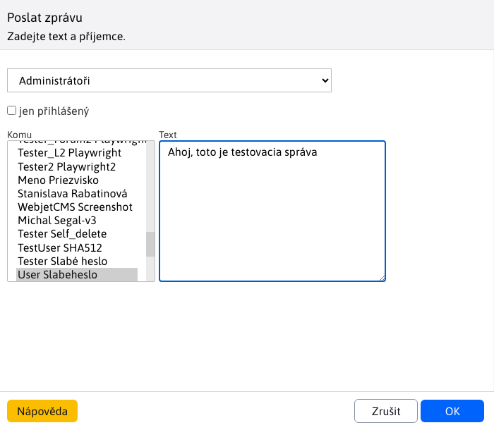

# Odeslat zprávu

Klikněte na možnost **Odeslat zprávu** se otevře nové okno, které můžete použít k odeslání zprávy více uživatelům. Zpráva se zobrazí ve vyskakovacím okně v administraci, kde pak můžete na zprávu odpovědět.

Pokud vyskakovací okno ještě není otevřeno, nová zpráva se kontroluje při načtení obsahu okna správy a poté každou minutu.

!> **Varování:** Pokud máte blokována vyskakovací okna, nové okno se nezobrazí.

## Možnosti při psaní zprávy

- **Skupina výběrových polí** - skupina uživatelů, jejichž seznam se zobrazí v **Komu**.
- **Pouze přihlášený** - Pokud je zaškrtnuto, zpráva se zobrazí pouze v případě, že je vybraný uživatel právě přihlášen.
- **Komu** - seznam jmen, kterým chcete zprávu odeslat; chcete-li vybrat více jmen, stiskněte tlačítko **CTRL** a klikněte myší na název.
- **Text** - text zprávy.

Klikněte na **OK** zadaná zpráva se odešle vybraným uživatelům.
