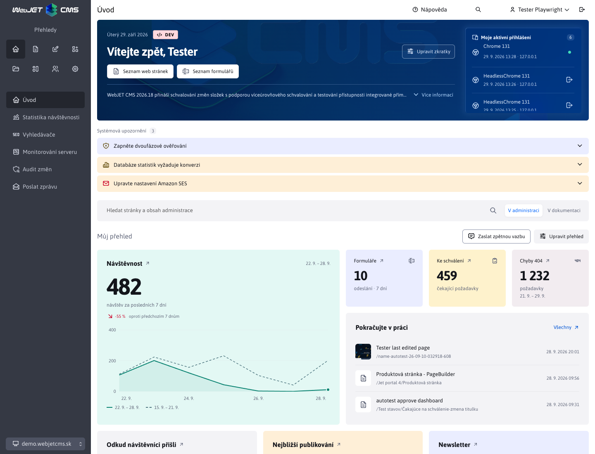
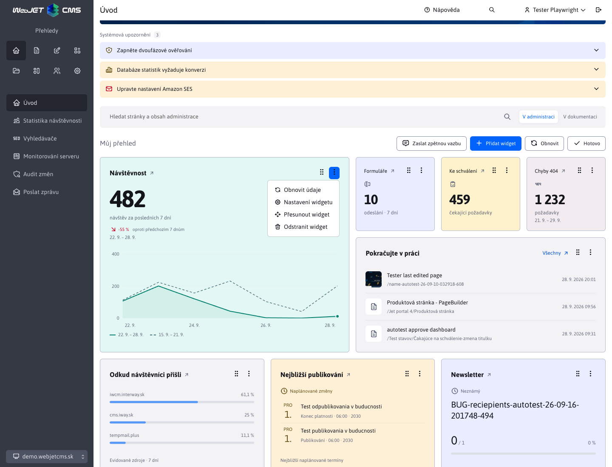
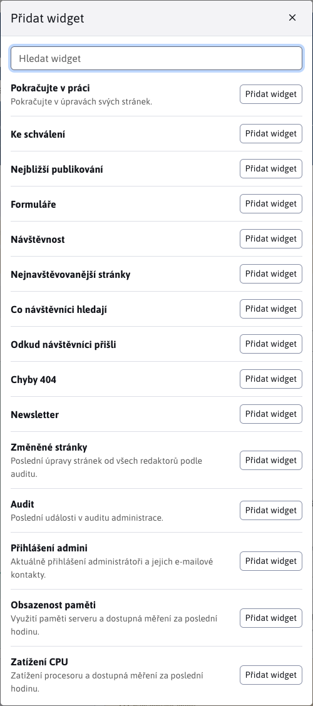
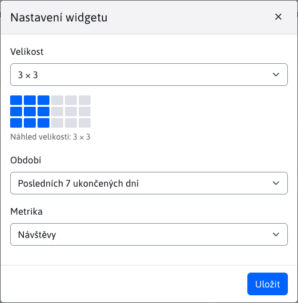
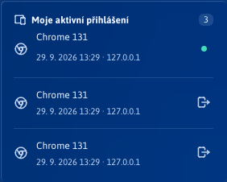
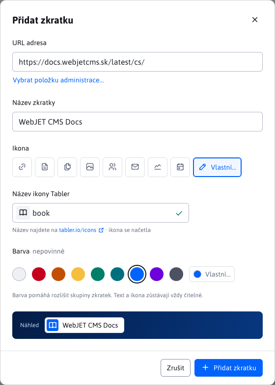
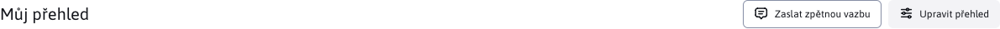
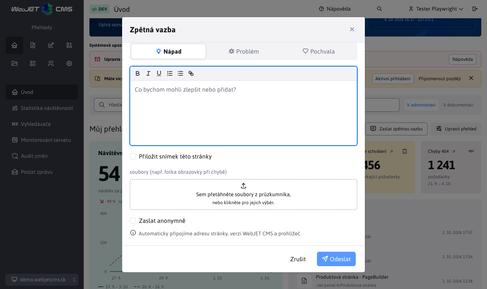

# Úvodní obrazovka

Na úvodní obrazovce můžete rychle zkontrolovat návštěvnost, odeslané formuláře či stránky čekající na schválení a vrátit se k rozpracovaným stránkám.

    <iframe width="790" height="444" src="https://www.youtube.com/embed/X2GNFn8IpCI" title="YouTube video player" frameborder="0" allow="accelerometer; autoplay; clipboard-write; encrypted-media; gyroscope; picture-in-picture" allowfullscreen></iframe>

Přehled tvoří **widgety**, tedy karty s konkrétními údaji, například grafem návštěvnosti nebo seznamem požadavků na schválení. Vyberte si ty, které využíváte, a uspořádejte je podle toho, co chcete sledovat jako první. Pomocí [zkratek](#vaše-zkratky) si otevřete často používanou část administrace nebo konkrétní složku bez hledání v menu.

Při prvním otevření se podle vašich oprávnění zobrazí výchozí widgety **Návštěvnost**, **Formuláře**, **Ke schválení**, **Chyby 404**, **Pokračujte v práci**, **Odkud návštěvníci přišli**, **Nejbližší publikování** a **Newsletter**. Další widgety si můžete sami přidat. V horní části je přivítání se zkratkami a novinkami, aktivní přihlášení a vyhledávání.

Nabídka widgetů odpovídá vašim oprávněním. Rozložení se ukládá na váš účet a je společné pro všechny domény a prohlížeče. Výběr konkrétního formuláře nebo kampaně se pamatuje zvlášť pro každou doménu.

Před názvem stránky v hlavičce celé administrace a na přihlašovací stránce se zobrazuje označení prostředí: **PROD**, **TEST**, **CIT**, **INT**, **UAT**, **DEMO**, **LOCAL** nebo **DEV**. Je také v titulku karty prohlížeče, abyste rozlišili otevřená prostředí. Správce může upravit text, ikonu, barvu, styl a popis označení podle [konfigurace prostředí](../../admin/setup/configuration/dashboard.md).

## Přizpůsobení přehledu

Na začátek přehledu umístěte widgety s údaji, které kontrolujete nejčastěji. Pokud například zpracováváte formuláře a schvalujete obsah, vyberte widgety **Formuláře** a **Ke schválení**. Widgety, které nepotřebujete, můžete odstranit.

Klepněte na **Upravit přehled**. Zobrazí se panel s možnostmi **Obnovit výchozí**, **Přidat widget**, **Zrušit** a **Uložit**. Při posouvání zůstává pod hlavičkou. Widgety mají přerušovaný obrys, úchyt pro přesun a tlačítko **Možnosti widgetu**. Doplňkové ikony a odkazy v hlavičkách se během úprav skryjí. Systémová upozornění zůstávají aktivní.

Tlačítkem **Přidat widget** otevřete katalog. Vyhledejte požadovaný widget podle názvu a při něm klikněte na **Přidat** nebo **Přidat další**. Otevře se nastavení s náhledem. Vyberte velikost a další možnosti a potvrďte je tlačítkem **Přidat widget**. Widget přibude na konec rozpracovaného přehledu a dialog se zavře. Pokud nastavení zrušíte, widget se nepřidá. Pro další widget znovu otevřete katalog z lišty úprav.

Při widgetu použijte tlačítko **Možnosti widgetu**:

- **Nastavení widgetu**: v dialogovém okně zvolte dostupnou velikost a další nastavení, například období nebo formulář. Velikost vyberte kartičkou s ilustrací rozměru a označením, například **1x1** nebo **3x3**. Ne každý widget nabízí více velikostí.
- **Přesunout klávesnicí**: widget se zvedne, šipky změní jeho pozici, **Enter** jej položí a **Esc** vrátí. Stejný přesun spustíte mezerníkem na úchytu. Při tažení myší přerušovaný cíl označuje místo vložení; **Esc** přesun zruší.
- **Odstranit z přehledu**: odstraní kartu bez potvrzení. Data v aplikaci zůstávají zachována. Oznámení nabídne **Zpět** na 8 sekund; při podržení myši nebo zaměření klávesnicí se odpočet zastaví. **Ctrl Z** vrátí poslední úpravu i po zmizení oznámení. Widget můžete přidat znovu z katalogu.
- **Obnovit údaje**: načte aktuální údaje dané karty.

V dialogovém okně **Nastavení widgetu** je vlevo náhled widgetu se skutečnými údaji a vpravo jeho nastavení. Náhled se mění dle zvolené velikosti, barvy i dalších možností. Na menší obrazovce se nastavení zobrazí pod náhledem. Úpravy potvrďte tlačítkem **Použít**. Změní se rozpracovaný přehled. Větší kartu zvolte, když chcete vidět podrobnější graf nebo seznam. Menší karta zabere v přehledu méně místa.

V části **Barva pozadí** vyberte jemný odstín z palety nebo **Vlastní barvu**, kterou můžete zadat i kódem HEX. Vybraná barva se hned zobrazí v náhledu widgetu. Při příliš tmavé vlastní barvě vás nastavení vyzve zvolit světlejší odstín. Volba **Výchozí** obnoví původní pozadí konkrétního widgetu; nové widgety používají tuto barvu automaticky.

Ve widgetu **Návštěvnost** se barvy čar grafu, bodů a legendy přizpůsobí odstínu pozadí automaticky. U bílého nebo šedého pozadí jsou čáry šedé. Předchozí období zůstává odlišeno přerušovanou čarou.

Po dokončení úprav klikněte na **Uložit** v liště. Až tímto krokem se uloží pozice, velikosti, nastavení i přidání či odstranění widgetů. Zobrazí se oznámení **Přehled byl uložen** a režim úprav se zavře. Při chybě zůstanou rozpracované změny dostupné pro opětovné uložení.

Tlačítko **Zrušit** při neuložených změnách otevře potvrzení s možnostmi **Pokračovat v úpravách** a **Zahodit změny**. Při odchodu ze stránky upozorní prohlížeč. Zkratky mají vlastní režim úprav přes tužku v horním panelu a ukládají se samostatně.

Na menší obrazovce se karty automaticky uspořádají pod sebe při zachování pořadí. Rozložení může obsahovat nejvýše 48 položek včetně zkratek, přihlášení, novinek a vyhledávání.

Tlačítko **Obnovit výchozí** naleznete v liště úprav před tlačítkem **Přidat widget**. Po potvrzení v dialogu se připraví výchozí výběr widgetů, jejich velikosti, pořadí a nastavení. Až tlačítkem **Uložit** se změna uloží a vymažou se i filtry widgetů ve všech doménách a potvrzení přečtení novinek. Vaše zkratky a ostatní nastavení účtu zůstanou zachovány.

Pokud při klepnutí na **Obnovit výchozí** podržíte klávesu **Shift**, po potvrzení se připraví přehled se všemi dostupnými widgety v každé podporované velikosti. Nepotřebné varianty můžete odstranit a výsledek potvrdit tlačítkem **Uložit**.

## Dostupné informace

Widgety z katalogu **můžete přidat opakovaně** s různými velikostmi nebo nastaveními. Můžete tak například vedle sebe **sledovat dva různé formuláře** nebo **návštěvnost za 7 a 30 dní**. Jejich dostupnost závisí na vašich oprávněních.

Statistické widgety ve výchozím nastavení používají posledních sedm ukončených dnů, lze zvolit i 30 nebo 90 dní. Porovnání používá stejně dlouhé předchozí období. Karta zobrazuje skutečný rozsah dat. Zvláštní pravidla pro období formulářů a chyb 404 jsou uvedena u příslušných widgetů.

### Zkratka do modulu

Často používanou část administrace otevřete bez hledání v menu či ve stromové struktuře složek. Zkratka může směřovat i na vlastní URL adresu. Postup přidání a příklad odkazu na konkrétní složku naleznete v části [Vaše zkratky](#vaše-zkratky).

### Pokračujte v práci

K rozpracované stránce se vrátíte bez hledání její složky. Widget zobrazuje maximálně šest vašich naposledy upravovaných stránek s náhledem obrázku, umístěním a datem úpravy. Klepnutím otevřete editor stránky. Nadpis widgetu otevře celý seznam webových stránek. Při menší velikosti karty můžete seznam rolovat.

### Ke schválení

Upozorňuje na obsah, který čeká na rozhodnutí schvalovatele. Zobrazuje požadavky dostupné v kartě **Neschváleno** ve Web stránkách. Větší varianta obsahuje šest nejnovějších požadavků na změnu nebo smazání stránky či složky. Ikona při názvu rozlišuje stránku a složku.

Klepnutím na položku otevřete její schvalování v novém okně. U složky se otevře příslušná složka ve Web stránkách spolu se schvalovacím dialogem. Klepnutím na nadpis nebo celkový počet otevřete celý seznam požadavků.

### Nejbližší publikování

Zkontrolujete, které stránky se mají v nejbližší době **zveřejnit nebo přestat zobrazovat**. Při každé změně vidíte datum a čas plánovaného publikování nebo ukončení platnosti. Klepnutím na nadpis otevřete úplný plán publikování.

### Formuláře

Zkontrolujete zde údaje o odeslaných formulářích, například dotazech nebo kontaktních zprávách. V nastaveních můžete **vybrat konkrétní formulář** nebo všechny dostupné formuláře.

Při zobrazení všech formulářů vidíte **celkový počet odeslaných odpovědí za celé období**. Velký widget zobrazí deset formulářů s nejnovějším odesláním, seřazených od nejnovějšího. U každého je název a datum posledního odeslání. Klepnutím na název otevřete jeho odpovědi.

Při výběru konkrétního formuláře se ve velkém widgetu zobrazí posledních deset odeslání **za zvolené období**. Pokud se seznam nevejde do výše karty, můžete jej rolovat. Ve sloupci **Formulář** uvidíte jméno, příjmení a e-mail z vyplněných údajů. Pokud formulář taková pole nemá, zobrazí se první tři vyplněné údaje v pořadí sloupců formuláře. Klepnutím na tyto údaje otevřete detail konkrétního odeslání.

### Návštěvnost

Umožňuje sledovat, jak se mění návštěvnost webu. V nastaveních vyberte období a sledovaný údaj: počet zobrazení, návštěv nebo unikátních návštěvníků.

Graf porovnává aktuální a předchozí období. Přesné hodnoty naleznete v popisech po podržení kurzoru nad grafem. Tabulka s údaji je dostupná čtečkám obrazovky.

### Nejnavštěvovanější stránky

Zobrazuje nejnavštěvovanější stránky za zvolené období s počtem zobrazení. Podle návštěvnosti můžete určit, kterému obsahu věnovat pozornost při aktualizaci. Klepnutím na stránku otevřete její podrobnou statistiku.

### Co návštěvníci hledají

Zobrazuje hledané výrazy a jejich počty za zvolené období. Podle výrazů můžete zjistit, o jaká témata mají návštěvníci zájem, a zkontrolovat, zda k nim máte na webu aktuální informace.

### Odkud návštěvníci přišli

Za zvolené období můžete porovnat zdroje návštěvnosti a zjistit, odkud přichází nejvíce návštěvníků.

Graf zobrazuje procentuální podíl jednotlivých evidovaných zdrojů. Přesné hodnoty naleznete v popisech po podržení kurzoru nad grafem. Tabulka s údaji je dostupná čtečkám obrazovky.

### Vady 404

Pomáhá najít adresy, které neexistují. Podle počtu chyb můžete určit, které odkazy nebo přesměrování je třeba prověřit jako první.

Zobrazuje počet chybových požadavků, nikoli počet různých adres. Chyby se evidují po týdnech, proto se zahrnou celé týdny zasahující do zvoleného období. Karta zobrazí skutečný rozsah dat a aktuální týden obsahuje údaje dostupné do tohoto okamžiku.

Pokud historické údaje nelze oddělit podle domény, karta oznámí jejich nedostupnost.

### Newsletter

Umožňuje sledovat průběh odesílání hromadného emailu a zaznamenaná otevření či kliknutí. Automaticky vybírá aktivní kampaň, nejbližší naplánovanou nebo poslední dokončenou. V nastaveních můžete zvolit i konkrétní kampaň.

Při odesílání se údaje viditelné karty obnovují každých 30 sekund. Počty otevření a kliknutí představují zaznamenané události.

### Co je nového

V uvítacím panelu naleznete novinky aktuální verze WebJET CMS. Tlačítkem **Sbalit novinky** potvrdíte jejich přečtení a ponecháte stručný souhrn. Tlačítkem **Více info** je znovu rozbalíte.

Systémová upozornění jsou seřazena podle závažnosti: chyby, varování a informace. Každý řádek obsahuje vysvětlení a dostupnou akci. Chyby zůstávají viditelné do vyřešení příčiny. Varování můžete odložit na 7 dní tlačítkem **Připomenout později** nebo **×**.

### Vyhledávání a pomoc

Použijte jej, když chcete najít stránku v administraci nebo návod k práci s WebJET CMS. Zvolte **V administraci** nebo **V dokumentaci** a zadejte hledaný výraz. Hledání v dokumentaci otevře nové okno se zadaným výrazem. Pomoc k právě otevřené části administrace naleznete i přes kontextového nápovědy v hlavičce.

### Moje aktivní přihlášení

Umožňuje zkontrolovat vaše aktivní přihlášení a odhlásit se z jiného zařízení nebo prohlížeče, který již nepoužíváte. Je vždy v horní části přehledu a nelze jej odstranit. Podrobnosti naleznete v části [Přihlášení](#přihlášení).

### Přihlášeni admini

Zobrazuje, kteří administrátoři právě pracují v systému. Můžete tak najít kolegu, se kterým potřebujete domluvit úpravu obsahu, a odeslat mu email. Dostupnost závisí na vašich oprávněních. Podrobnosti naleznete v části [Přihlášení administrátoři](#přihlášení-administrátoři).

### Změněné stránky

Při kontrole práce na obsahu zde naleznete poslední úpravy dostupných stránek v aktuální doméně is autorem změny.

### Audit

Zobrazuje poslední události auditu z celého serveru podle vašich oprávnění. Použijte jej ke kontrole nedávných operací nebo při zjišťování, což předcházelo problému.

### Obsazenost paměti

Zobrazuje graf a číselné hodnoty využití paměti serveru. Správce tak může sledovat její obsazenost, například při prověřování zpomalení systému. Údaje viditelného widgetu se aktualizují každých 5 sekund. Podrobnosti naleznete v části [Změněné stránky, audit a monitorování](#změněné-stránky-audit-a-monitorování).

### Zatížení CPU

Zobrazuje graf a číselné hodnoty zatížení procesoru serveru. Správce může sledovat, zda se během pomalých odezev zvyšuje i zatížení CPU. Údaje viditelného widgetu se aktualizují každých 5 sekund. Podrobnosti naleznete v části [Změněné stránky, audit a monitorování](#změněné-stránky-audit-a-monitorování).

## Přihlášení

V horní části přehledu můžete zkontrolovat svá aktivní přihlášení a odhlásit se z jiného zařízení nebo prohlížeče. Seznam ostatních přihlášených administrátorů je samostatný widget **Přihlášení admini**, dostupný podle oprávnění.

### Moje aktivní přihlášení

Panel **Moje aktivní přihlášení** zobrazuje všechny vaše aktivní relace, tedy přihlášení pod vaším účtem, s prohlížečem, časem a IP adresou. Při delším seznamu můžete jeho obsah posouvat. Vaše aktuální relace je první a má zelenou tečku s popisem **Toto přihlášení**. Ostatní relace můžete odhlásit přímo v seznamu, například když jste se zapomněli odhlásit na jiném počítači. Tento panel je vždy v horní části a nelze jej odstranit.

U jiné vlastní relace můžete zvolit **Odhlásit tuto relaci**. V aktuálním uzlu clusteru se ukončí okamžitě, v jiném uzlu se zobrazí informace o čekání na synchronizaci mezi uzly (typicky do minuty). Doména a uzel jsou uvedeny v pomocném textu po podržení kurzoru nad záznamem.

Data se aktualizují po přihlášení uživatele. Pokud potřebujete častější aktualizaci, správce může přidat [úlohu na pozadí](../../admin/settings/cronjob/README.md) s názvem `sk.iway.iwcm.stat.SessionClusterService` a nastavit interval, například každých 10 minut.

Úloha na pozadí z databáze smaže záznamy starší 60 minut. Pokud není nastavena, při přihlášení uživatele se smažou záznamy starší 24 hodin.

### Přihlášení administrátoři

Pokud máte právo "Úvod - zobrazení přihlášených administrátorů", můžete přes katalog přidat widget **Přihlášení admini** se seznamem všech přihlášených administrátorů. Máte tak přehled, kolik uživatelů aktuálně pracuje v administraci.

Klepnutím na ikonu<i class="ti ti-mail fs-6"></i> můžete danému administrátorovi odeslat email.

## Vaše zkratky

Zkratkami pod přivítáním otevřete i vnořenou část administrace nebo konkrétní složku ve Web stránkách. Často používaná místa tak nemusíte při každém návratu hledat v menu nebo rozbalovat strom složek.

Zkratka může směřovat na dostupný modul administrace nebo na vlastní URL adresu včetně parametrů. Při odkazu s parametry otevře cíl ve stavu, který daná adresa určuje, například s vybranou složkou. Zkratky se ukládají na vaše konto a jsou dostupné ve všech prohlížečích.

Ve výchozím nastavení jsou zkratky směřovány na webové stránky a formuláře podle vašich oprávnění. Pokud tyto moduly nejsou dostupné, zobrazí se zkratka pro první dostupný modul.

Novou zkratku přidáte takto:

1. Klepněte na **Přidat zkratku** přímo za seznamem zkratek.
2. V poli **Kam má zkratka vést?** postupně vyberte **Hlavní část**, **Sekci** a kartu pod nadpisem **Vyberte kartu**. Sekci bez dalších karet vyberete přímo. Volba **Zpět** vrátí seznam o úroveň výše. Můžete také napsat název cíle: vyhledávání nabídne koncové karty ze všech částí menu, například po zadání „číselník“ obě karty Číselníků. Cíl vyberte klepnutím nebo šipkami a klávesou **Enter**. Pro vlastní odkaz klikněte na **Použít vlastní adresu URL…** a vyplňte **URL adresu**.
3. Podle potřeby vyplňte **Název zkratky**. Pokud zůstane prázdný, použije se název vybraného cíle. U vlastní URL adresy je název povinen.
4. Vyberte **Ikonu** a **Barvu**. První ikona vychází z vybraného cíle. Volba **Vlastní…** u ikony umožňuje zadat název z knihovny Tabler; náhled se změní hned a neexistující název nelze uložit. U barvy otevře **Vlastní…** výběr barvy s nastavením průhlednosti a zadáním HEX hodnoty. Barva se použije pouze na pozadí ikony, jejíž světlost se přizpůsobí zvolenému pozadí. Paleta obsahuje také možnost **Bez barvy**.
5. Zkontrolujte náhled a klikněte na **Přidat zkratku**.

Dlouhé názvy se zkrátí trojtečkou. Celý název se zobrazí při podržení myši nebo při zaměření klávesnicí. Zkratka na nedostupnou položku menu zůstává zobrazena s vysvětlením; v režimu úprav ji můžete opravit nebo odstranit.

Režim úprav zapnete tlačítkem s tužkou **Upravit zkratky** za seznamem. Tužku nahradí tlačítko **Hotovo** napravo od přivítání, nad zkratkami. Klepnutí na zkratku pak otevře její nastavení. Po změně cíle, názvu, ikony nebo barvy klikněte na **Uložit změny**. Oznámení nabídne **Zpět** na 8 sekund. Stejný formulář obsahuje i tlačítko **Odstranit zkratku**. Po dokončení úprav klikněte na **Hotovo**.

Zkratku přesunete úchytem před ikonou. Během přesunu zůstává na původním místě přerušovaný obrys a bílá čára označuje místo vložení. Při ovládání klávesnicí přesuňte fokus na úchyt: **mezerník** zkratku zvedne, **šipky vlevo/vpravo** změní pozici, **Enter** potvrdí přesun a **Esc** jej zruší. Klepnutím na úchyt můžete pozici vybrat také v dialogovém okně.

Chcete-li zkratku na konkrétní složku, otevřete ji ve Web stránkách a zkopírujte adresu z adresního řádku prohlížeče is parametrem `groupid`. Při přidávání zkratky zvolte **Použít vlastní adresu URL…**, vložte zkopírovanou adresu a zadejte název, například **Aktuality**.

Adresa může mít například tvar `/admin/v9/webpages/web-pages-list/?groupid=123`, kde `123` je ID požadované složky. Použijte ID ze své zkopírované adresy. Klepnutím na takovou zkratku otevřete přímo danou složku, i když je vnořená hlouběji ve struktuře webu.

Křížek **×** odstraní zkratku bez potvrzení. Oznámení nabídne **Zpět** na 8 sekund. Odstranit můžete i poslední zkratku; zobrazí se **Žádná zkratka** a tlačítko pro přidání. Widgety, jejich filtry i stav novinek zůstávají zachovány.

## Změněné stránky, audit a monitorování

Při kontrole práce s obsahem a stavu serveru můžete využít widgety **Změněné stránky**, **Audit**, **Přihlášení admini**, **Obsazenost paměti** a **Zatížení CPU**. Podle vašich oprávnění si je přidejte přes katalog. Tlačítko **Obnovit** v úpravě přehledu nastaví výchozí výběr widgetů uvedený v úvodu.

**Změněné stránky** zobrazují poslední úpravy dostupných stránek v aktuální doméně is autorem změny. **Audit** zobrazuje poslední události auditu. Audit, přihlášení administrátoři a monitorování zobrazují údaje celého serveru podle příslušných oprávnění.

Grafy paměti a CPU mají barevně odlišené pozadí a výchozí velikost **3×3**. V nastaveních widgetu můžete zvolit i menší velikost **3×2**. Grafy i číselné hodnoty viditelného widgetu se aktualizují každých 5 sekund, takže můžete průběžně sledovat změny zatížení. Klepnutím na název widgetu otevřete úplný přehled.

Živé vzorky se sbírají od otevření widgetu, i když je ukládání historického monitorování vypnuto. Při skrytí karty prohlížeče nebo widgetu se pravidelné načítání pozastaví.

## Zpětná vazba

Pomocí zpětné vazby můžete vývojovému týmu WebJET CMS poslat připomínku, návrh na zlepšení nebo pochvalu. Klikněte na **Zaslat zpětnou vazbu** v horní liště úvodního přehledu. Vyplněný formulář se odešle emailem.

Vaše připomínky posoudíme při plánování dalšího vývoje. Plánované změny naleznete v [mapě rozvoje](../../ROADMAP.md).

V dialogovém okně popište, co potřebujete změnit nebo při jaké práci jste narazili na problém. Můžete přiložit také soubory, například snímek obrazovky nebo dokument s popisem požadavku.

Pokud zvolíte možnost **Zaslat anonymně**, odeslaný email nebude obsahovat vaše jméno a emailovou adresu v údajích odesílatele.
