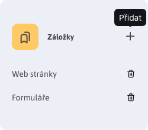
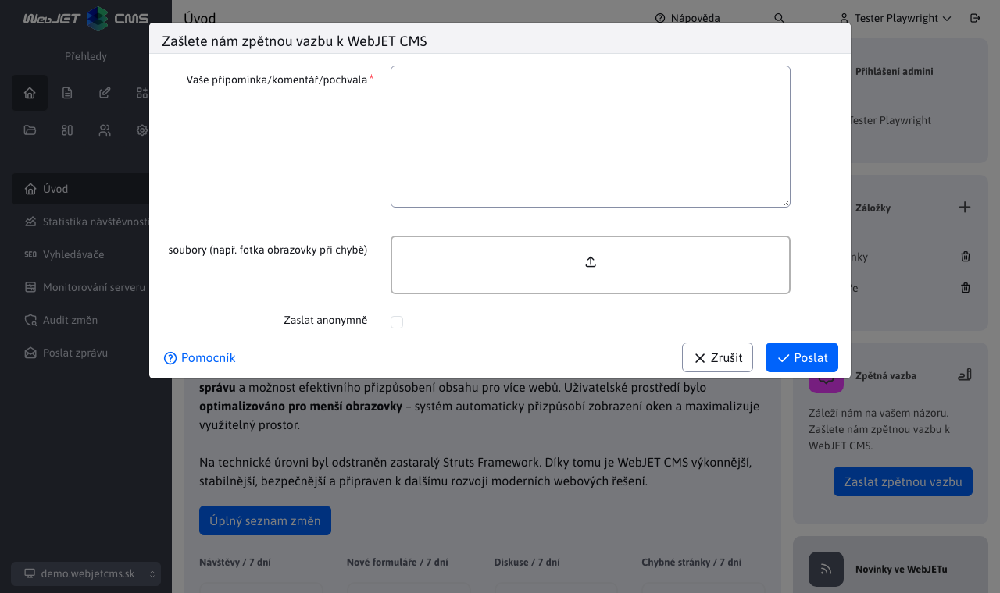

# Úvodní obrazovka

## Přihlášení

Zobrazuje seznam vašich přihlášení (pokud je povoleno přihlášení na více zařízeních najednou) a seznam přihlášených administrátorů.

### Moje aktivní přihlášení

Mini aplikace **Moje aktivní přihlášení** zobrazuje seznam všech aktivních přihlášení do administrace WebJET CMS pod Vaším uživatelským účtem. Vaše aktuální přihlášení je označeno ikonou <i class="ti ti-current-location fs-6" ></i>.

Jednotlivá přihlášení mají tooltip, který zobrazí další informace.

Klepnutím na ikonu <i class="ti ti-logout fs-6" ></i> můžete ukončit dané přihlášení. Pokud je to v rámci Vašeho aktuálního uzlu clusteru, přihlášení bude okamžitě ukončeno. Pokud je to přihlášení v jiném uzlu, přihlášení bude ukončeno po synchronizaci mezi uzly clusteru (typicky do minuty).

Poznámka: data se aktualizují po přihlášení uživatele. Můžete nastavit nový záznam do [úkoly na pozadí](../../admin/settings/cronjob/README.md) pro častější aktualizaci dat, kde jako název úlohy zadáte hodnotu `sk.iway.iwcm.stat.SessionClusterService`. Zadejte interval podle potřeby, například. každých 10 minut. Při úloze na pozadí se z databáze smažou záznamy starší 60 minut. Pokud není úloha na pozadí nastavena, záznamy se mažou při přihlášení uživatele, pokud jsou starší 24 hodin.

### Přihlášení administrátoři

Pokud máte právo "Úvod - zobrazení přihlášených administrátorů", zobrazí se také seznam všech přihlášených administrátorů. Máte tak přehled, kolik uživatelů aktuálně pracuje v administraci.

Klepnutím na ikonu <i class="ti ti-mail fs-6" ></i> můžete danému administrátorovi odeslat email.

## Záložky

Do mini aplikace záložky si můžete přidat odkazy na často používané sekce v administraci. Po přihlášení tak nemusíte hledat danou sekci v menu, ale přímo kliknete na odkaz v záložkách.

Klepnutím na oranžovou ikonu nalevo od textu Záložky se otevře dialogové okno, ve kterém zadáte název záložky a adresu, která se má otevřít po kliknutí na jméno záložky.

Ve výchozím nastavení jsou zobrazeny záložky na seznam webových stránek a formulářů. Tyto se zobrazí i když smažete všechny záložky.

Upozornění: seznam záložek se ukládá v prohlížeči, pokud používáte více prohlížečů nastavte si záložky ve všech.

  <iframe width="560" height="315" src="https://www.youtube.com/embed/G5Ts04jSMX8" title="YouTube video player" frameborder="0" allow="accelerometer; autoplay; clipboard-write; encrypted-media; gyroscope; picture-in-picture" allowfullscreen></iframe>

## Zpětná vazba

Klepnutím na tlačítko Zaslat zpětnou vazbu můžete nám, programátorům, zaslat vaši zpětnou vazbu k používání WebJET CMS. Připomínka se odešle po vyplnění formuláře emailem.

Vaše připomínky posoudíme a přidáme do [mapy rozvoje](../../ROADMAP.md). Můžete tak i vašim názorům zlepšit fungování WebJET CMS.

V dialogovém okně můžete zadat text vaší připomínky, komentář, nebo pochvalu. V případě potřeby můžete přiložit také soubory (např. fotku obrazovky nebo dokument s popisem vašeho požadavku).

Pokud zvolíte možnost Zaslat anonymně nebude do odeslaného emailu zadáno vaše jméno a emailová adresa jako jméno a email odesílatele.
