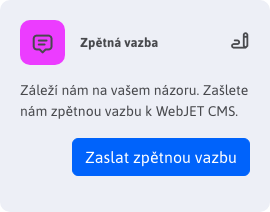

# Úvodní obrazovka

## Záložky

Do mini aplikace záložky si můžete přidat odkazy na často používané sekce v administraci. Po přihlášení tak nemusíte hledat danou sekci v menu, ale přímo kliknete na odkaz v záložkách.

Klepnutím na oranžovou ikonu nalevo od textu Záložky se otevře dialogové okno, ve kterém zadáte název záložky a adresu, která se má otevřít po kliknutí na jméno záložky.

Ve výchozím nastavení jsou zobrazeny záložky na seznam webových stránek a formulářů. Tyto se zobrazí i když smažete všechny záložky.

Upozornění: seznam záložek se ukládá v prohlížeči, pokud používáte více prohlížečů nastavte si záložky ve všech.

  <iframe width="560" height="315" src="https://www.youtube.com/embed/G5Ts04jSMX8" title="YouTube video player" frameborder="0" allow="accelerometer; autoplay; clipboard-write; encrypted-media; gyroscope; picture-in-picture" allowfullscreen></iframe>

# Zpětná vazba

Klepnutím na tlačítko Zaslat zpětnou vazbu můžete nám, programátorům, zaslat vaši zpětnou vazbu k používání WebJET CMS. Připomínka se odešle po vyplnění formuláře emailem.

Vaše připomínky posoudíme a přidáme do [mapy rozvoje](../../ROADMAP.md). Můžete tak i vašim názorům zlepšit fungování WebJET CMS.

V dialogovém okně můžete zadat text vaší připomínky, komentář, nebo pochvalu. V případě potřeby můžete přiložit také soubory (např. fotku obrazovky nebo dokument s popisem vašeho požadavku).

Pokud zvolíte možnost Zaslat anonymně nebude do odeslaného emailu zadáno vaše jméno a emailová adresa jako jméno a email odesílatele.
