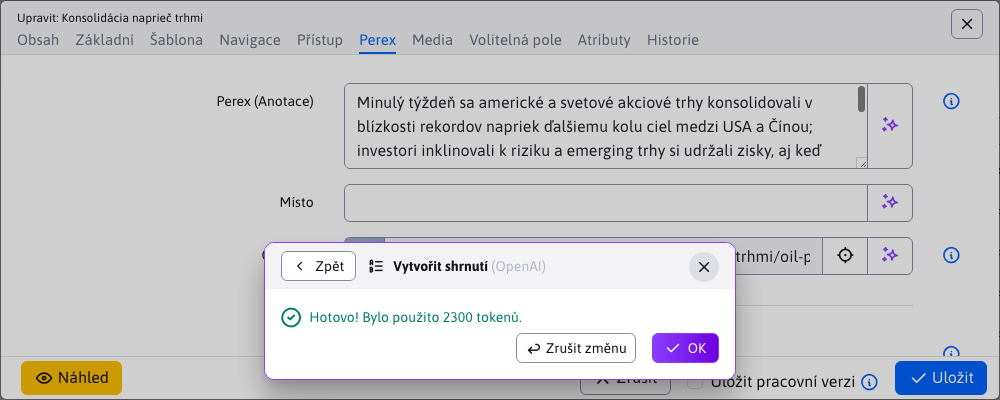
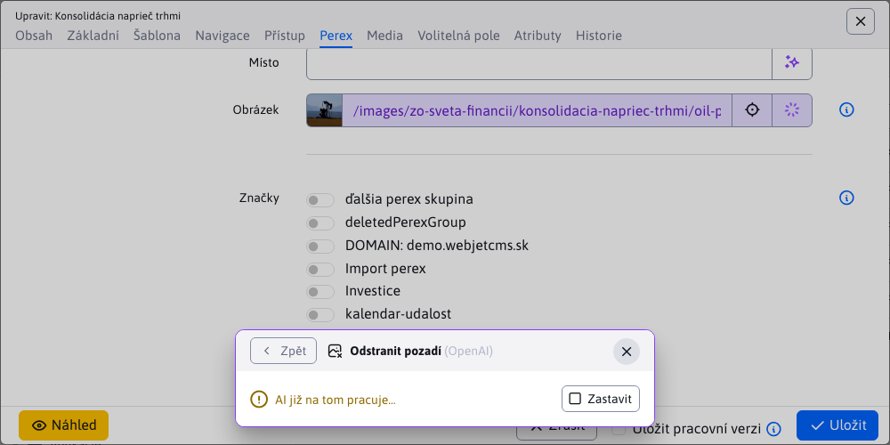
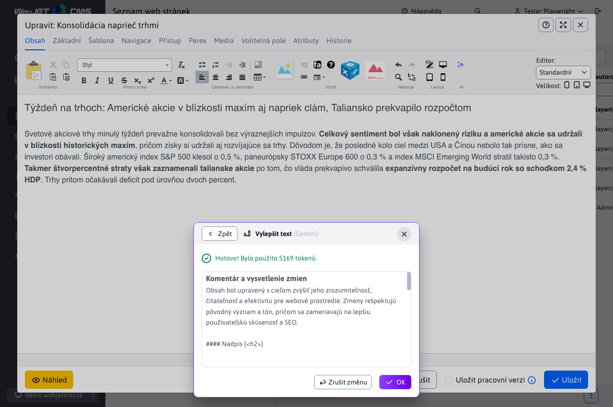
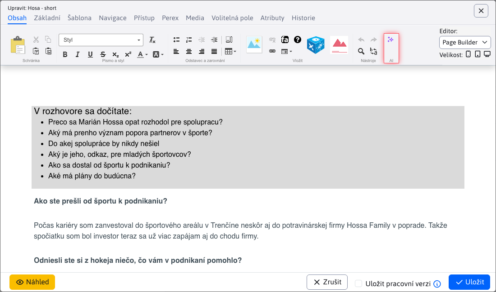
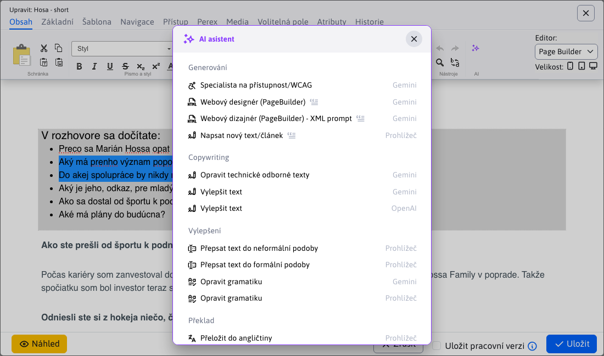
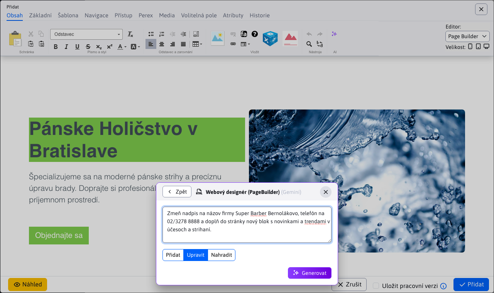
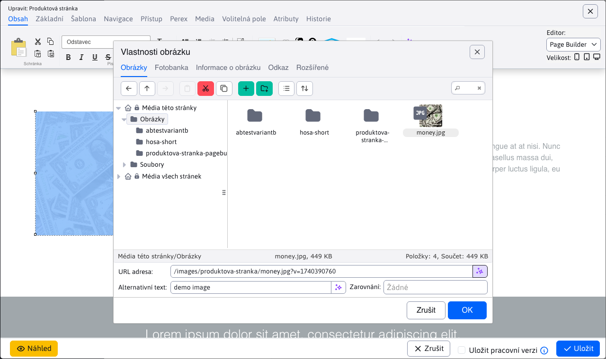

# Používání AI asistentů

Logika využívání AI asistentů je jednotná napříč celým CMS, aby měl uživatel konzistentní zážitek bez ohledu na kontext. V této kapitole naleznete přehled chování asistenta v datových tabulkách, editoru webových stránek, v nástroji PageBuilder, při označení textu i v editoru obrázků.

## Textová pole

Asistent u textového pole (jednořádkové pole i `textarea`) slouží k vygenerování nového obsahu nebo úpravě stávajícího. Spouští se přes tlačítko <button class="btn btn-outline-secondary btn-ai" type="button"><i class="ti ti-sparkles" ></i></button> na konci pole.

Po kliknutí se otevře okno se všemi dostupnými asistenty pro dané pole. Jsou přehledně rozděleni do skupin (např. **Generování**, **Vylepšení**). U každého je název, ikona a poskytovatel.

Klepnutím na asistenta se spustí jeho provedení. Má-li povoleno postupné načítání, výsledek se bude zobrazovat po částech; jinak se zobrazí až po dokončení.

Po úspěšném dokončení se výsledný text automaticky vloží do pole. V okně se zobrazí potvrzení a informace o spotřebě tokenů. Pokud výsledek nevyhovuje, pomocí tlačítka <button class="btn btn-outline-secondary btn-ai-undo" type="button"><i class="ti ti-arrow-back" ></i> Zrušit změnu</button> vrátíte původní hodnotu.

### Vstup od uživatele

Pokud asistent vyžaduje dodatečné pokyny, po jeho zvolení se nejprve zobrazí formulář pro zadání vstupu namísto okamžitého spuštění.

Asistenti, kteří potřebují vstup uživatele, mají při názvu ikonu <i class="ti ti-blockquote has-user-prompt" ></i> pro snadné rozlišení.

Pole může mít zástupný text (`placeholder`) s návodem jak správně zadat požadavek. Pokud je pole prázdné a 2x do něj kliknete (nebo stisknete klávesu `TAB`), tak se tento zástupný text přenese jako editovatelný text do pole. Můžete tak snadno upravit potřebné části a použít jej jako základ vašeho požadavku.

Po zadání pokynů stiskněte **Generovat**. Další průběh (načtení, vložení výsledku, možnost vrácení) je stejný jako u asistenta bez uživatelského vstupu.

### Quill

Nakolik i pole typu `Quill` patří mezi textová pole, AI asistenti pro něj fungují stejně jako pro klasická textová pole. Jediný rozdíl je v umístění ikony, která není na konci pole, ale v hlavičce mezi nástroji.

## Obrázková pole

Asistent u obrázkového pole slouží k vygenerování nebo úpravě obrázku. Spouští se přes tlačítko <button class="btn btn-outline-secondary btn-ai" type="button"><i class="ti ti-sparkles" ></i></button> na konci pole.

Po kliknutí se otevře okno se všemi dostupnými asistenty pro dané pole. Jsou přehledně rozděleni do skupin (např. **Generování**, **Úprava**). U každého je název, ikona a poskytovatel.

Klepnutím na asistenta se spustí jeho provedení. Pokud si vyberete asistenta, který má upravit již existující obrázek (např. **Odstranit pozadí**), ale obrázkové pole nemá nastaven žádný obrázek, vrátí se chybová hláška.

Pokud pole obsahuje obrázek, spustí se zpracování a zobrazí se indikace průběhu.

Po dokončení se zobrazí potvrzení, informace o spotřebě tokenů a náhled výsledku. Pomocí tlačítka <a target="_blank" class="zoom-in"><i class="ti ti-zoom-in" ></i></a> si můžete obrázek otevřít v plné velikosti na nové kartě.

Obrázek se neukládá automaticky. Nejprve vyplňte nebo upravte pole **Název obrázku** a **Umístění**. Hodnoty se vyplní podle původního obrázku, ale můžete je změnit. Pole **Umístění** umožňuje výběr složky přes stromovou strukturu.

Pro uložení stiskněte **Uložit obrázek**.

Pokud jste název ani umístění nezměnili nebo kombinace již existuje, zobrazí se dialog s možnostmi:
- **Přepsat soubor** – původní soubor se nahradí novým
- **Přejmenovat soubor** – systém nabídne doporučený (AI generovaný) nový název
- **Zrušit uložení** – návrat zpět bez uložení

Při volbě **Přepsat soubor** nebo **Přejmenovat soubor** se obrázek v poli okamžitě aktualizuje.

### Vstup od uživatele

Pokud asistent vyžaduje dodatečné pokyny, zobrazí se formulář. Doplňující pole jsou specifická pro konkrétního **poskytovatele**, proto se mohou měnit. U poskytovatele `OpenAI` jde například o:
- Počet obrázků
- Rozměr
- Kvalita

Asistenti, kteří potřebují vstup uživatele, mají při názvu ikonu <i class="ti ti-blockquote has-user-prompt" ></i>.

Po potvrzení probíhá zpracování standardně s jednou výjimkou pro `OpenAI`: umožňuje najednou vygenerovat více obrázků (podle **Počet obrázků**). Na příkladu níže bylo nastaveno číslo 3.

Vybrat a uložit můžete jen jeden výsledek – zvolíte jej kliknutím. Všechny náhledy lze otevřít přes <a target="_blank" class="zoom-in"><i class="ti ti-zoom-in" ></i></a>.

### Problémy s obsahem

Poskytovatel může odmítnout požadavek, pokud pokyny obsahují chráněnou nebo citlivou entitu (známá osoba, postava, licencovaná značka apod.). Konkrétní pravidla se liší podle **poskytovatele**. V takovém případě se může vrátit chybová hláška `PROHIBITED_CONTENT`.

## Editor webových stránek

Asistenti fungují také v editoru webových stránek a slouží k vygenerování nového obsahu nebo úpravě stávajícího obsahu stránky. Spouštějí se přes ikonu <button class="btn-ai" type="button"><i class="ti ti-sparkles" ></i></button> umístěnou v panelu nástrojů webového editoru.

Po kliknutí se otevře okno se všemi dostupnými asistenty pro dané pole. Jsou přehledně rozděleni do skupin (např. **Generování**, **Copywriting**, **Vylepšení**). U každého je název, ikona a poskytovatel.

Klepnutím na asistenta se spustí jeho provedení. Má-li povoleno postupné načítání, výsledek se bude zobrazovat po částech; jinak se zobrazí až po dokončení. Pokud se bude obsah načítat po částech, může to vzbudit dojem, že struktura stránky se pokazila, ale vše se vrátí do normálu, když se načte celý obsah.

Po úspěšném dokončení se výsledný obsah automaticky vloží do stránky. V okně se zobrazí potvrzení a informace o spotřebě tokenů. Pokud výsledek nevyhovuje, pomocí tlačítka <button class="btn btn-outline-secondary btn-ai-undo" type="button"><i class="ti ti-arrow-back" ></i> Zrušit změnu</button> vrátíte původní hodnotu.

V tomto případě je asistent nastaven tak (a to i doporučujeme při úpravě obsahu stránky), aby v okně ještě popsal všechny změny, které provedl na obsahu stránky, čímž nabízí zpětnou vazbu, co bylo potřeba upravit.

### Pouze část textu

Nemusíte upravovat celý obsah stránky. Asistent pracující s `CKEditor` podporuje i úpravy pouze vybrané části. Pokud označíte pouze část obsahu a následně zavoláte asistenta, upraví pouze danou vybranou část.

## PageBuilder

Asistenti fungují iv `PageBuilder` a slouží k vygenerování nového obsahu nebo úpravě existujícího obsahu stránky vloženého v `PageBuilder`. Spouštějí se přes ikonu <button class="btn-ai" type="button"><i class="ti ti-sparkles" ></i></button> umístěnou v panelu nástrojů.

Po kliknutí se otevře okno se všemi dostupnými asistenty pro dané pole. Jsou přehledně rozděleni do skupin (např. **Generování**, **Copywriting**, **Vylepšení**). U každého je název, ikona a poskytovatel.

Klepnutím na asistenta se spustí jeho provedení. Každý blok se považuje za samostatný text/obsah a zpracovává se samostatně. Okno bude postupně aktualizovat stav, kolik bloků z celkového počtu již bylo zpracováno.

Po úspěšném dokončení se výsledný obsah automaticky vloží do stránky. V okně se zobrazí potvrzení a informace o spotřebě tokenů. Pokud výsledek nevyhovuje, pomocí tlačítka <button class="btn btn-outline-secondary btn-ai-undo" type="button"><i class="ti ti-arrow-back" ></i> Zrušit změnu</button> vrátíte původní hodnotu.

V tomto případě je asistent nastaven tak (a to i doporučujeme při úpravě obsahu stránky), aby v okně ještě popsal všechny změny, které provedl na obsahu stránky, čímž nabízí zpětnou vazbu, co bylo potřeba upravit.

### Pouze část textu

Nemusíte upravovat celý obsah stránky. Asistent pracující s `PageBuilder` podporuje i úpravy pouze vybrané části. Pokud označíte pouze část obsahu a následně zavoláte asistenta, upraví pouze danou vybranou část.

## Režim chat

Pokud je asistent nastaven do režimu chat, aplikují se změny v PageBuilder na celou strukturu, nejen textový/editovatelný obsah. Asistent tak dokáže generovat nové bloky, upravovat stávající a podobně. Umíte mu zadávat požadavky na úpravu textů ve stránce a generování nových bloků. Režim aktivujete nastavením pole Typ požadavku na hodnotu `Chat` ve vlastnostech asistenta.

Okno se zadáním požadavku obsahuje nová pole pro nastavení režimu:
- **Přidat** - výstupní HTML kód z požadavku přidá na konec stránky. Neposílá asistentovi aktuální obsah stránky, provedení je tedy levnější (spotřebuje se méně tokenů).
- **Upravit** - spolu s instrukcí a vaším požadavkem se pošle i aktuální HTML kód stránky, ve kterém umí asistent upravit texty, bloky, HTML kód. Spotřebuje se více tokenů k provedení požadavku.
- **Nahradit** - podobně jako přidat, spolu s požadavkem se neposílá aktuální kód stránky. Výsledkem je nahrazená aktuální stránka. Vhodné, chcete-li začít od znovu a smazat celý aktuální obsah.

Po provedení požadavku se zobrazí okno se stavem a počtem použitých tokenů. Navíc ale v tomto okně je možnost **Pokračovat**, která znovu zobrazí okno pro zadání požadavku.

Můžete tedy pokračovat v úpravách na webové stránce a zadat požadavek na úpravu textu stránky. Zvolením možnosti **Upravit** se odešle spolu s vaším požadavkem i aktuální HTML kód stránky, asistent v něm tedy umí provést změny.

Provedené úpravy se zobrazí ve web stránce a znovu můžete klepnutím na Pokračovat zadat další požadavek, nebo klepnutím na **OK** asistenta ukončit. Všimněte si na fotce, že podle zadaného požadavku je upraven nadpis oproti předchozí verzi.

## Obrázky ve stránce

AI asistenta můžete využít i při vkládání obrázků do webové stránky. Tlačítko asistenta se nachází v pravém dolním rohu na konci pole s adresou obrázku.

Po kliknutí se otevře okno se všemi dostupnými asistenty, se kterými se pracuje stejně, jak je popsáno v části [Obrázková pole](./README.md#obrázková-pole)

## Prázdné pole

Asistenti používají často jako vstupní hodnotu obsah daného pole, pokud je pole prázdné, nezobrazí se. Například Přeložit do angličtiny nemá smysl zobrazit, je-li pole prázdné. Může nastat situace, že pro prázdné pole není dostupný žádný asistent, tehdy se zobrazí chybová zpráva. Do pole je třeba nejprve zadat text, teprve potom zobrazit asistenty.

Ne vždy se ale používá stejné pole pro vstupní hodnotu. Například v editaci webové stránky je asistent ke generování Názvu webové stránky z jejího textu. Pokud text web stránky je zatím prázdný nemusí se tato možnost zobrazit.

