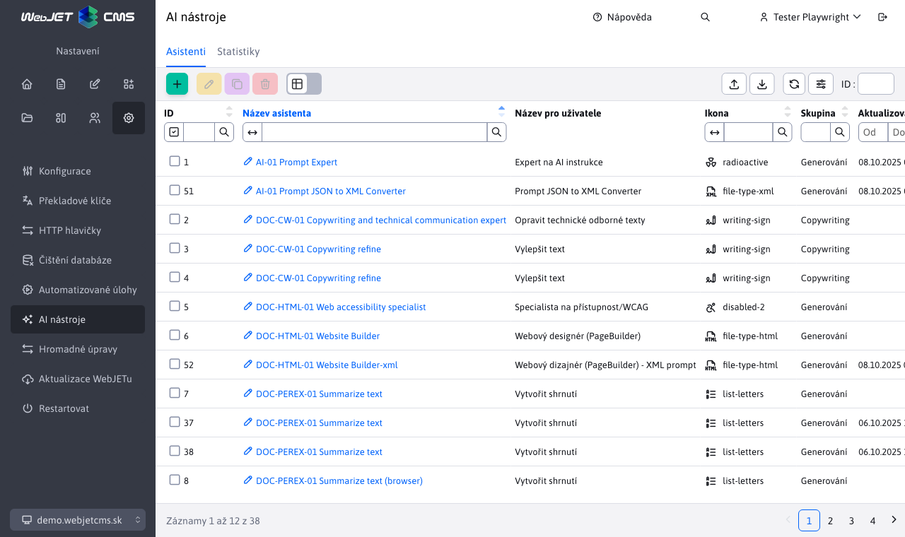
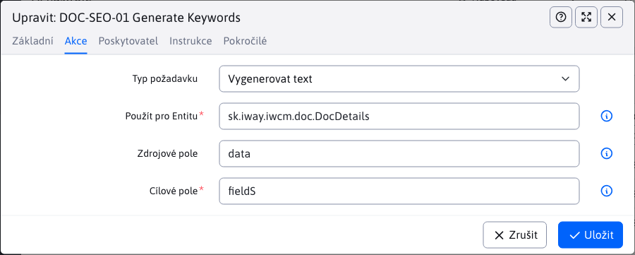
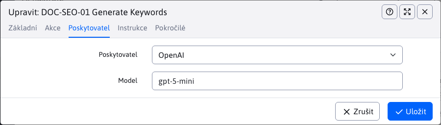
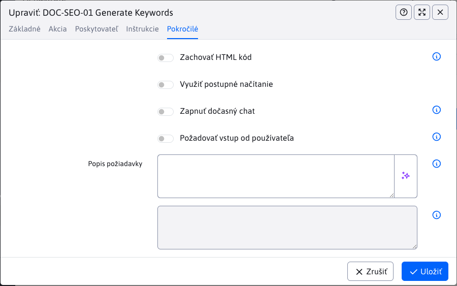
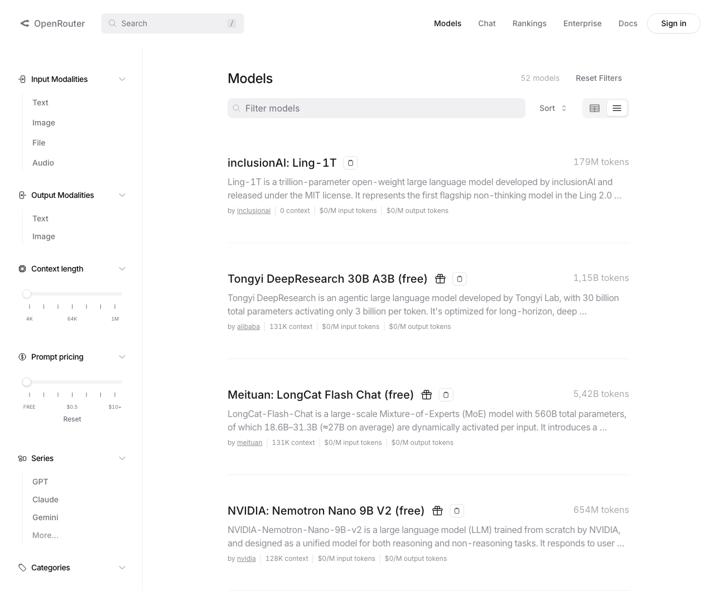

# Nastavení

Tento dokument popisuje správu a konfiguraci AI asistentů ve WebJET CMS. V sekci **AI asistenti** můžete vytvářet a upravovat jednotlivé asistenty, přičemž každý záznam představuje konkrétní typ akce s vybraným poskytovatelem AI služeb. Nastavení umožňují určit, kde (ve které tabulce) a pro které pole nebo pole bude daný asistent dostupný, čili bude provádět nastavenou akci.



!>**Upozornění:** Nastavení by měla provádět pouze osoba, která má dostatečné znalosti o fungování AI asistentů a rozumí možnostem jednotlivých poskytovatelů. Nesprávné nastavení může vést k neoptimálnímu chování asistenta nebo k omezení jeho funkčnosti. Doporučujeme, aby konfiguraci prováděl administrátor nebo technicky zdatný uživatel, který umí správně zadat instrukce a parametry pro konkrétního AI poskytovatele.

## Základní informace

V této části si probereme, jak přidat/nastavit nového **AI asistenta**. Při této akci jsou dostupné následující karty:

- Základní
- Akce
- Poskytovatel
- Instrukce
- Pokročilé

### Karta - Základní

Tato karta obsahuje základní informace o asistentovi jako název, ikona nebo datum vytvoření. Obsahuje pole:

- **Název asistenta** – interní identifikátor asistenta (uživatel ho nevidí). Musí být unikátní v kombinaci s hodnotou **Poskytovatel** (tj. stejný název můžete použít pro více asistentů, ale každý musí mít jiného poskytovatele).
- **Název pro uživatele** – zobrazený název v rozhraní. Nemusí být unikátní. Pokud není vyplněn, použije se hodnota z pole **Název asistenta**. Můžete také zadat překladový klíč (hodnota klíče se zobrazí v poli pod ním).
- **Ikona** – název ikony ze stránky https://tabler.io/icons. Zobrazuje se spolu s polem **Název pro uživatele**. Zadejte pouze identifikátor ikony (bez URL).
- **Skupina** – logické nebo vizuální seskupení asistentů v rozhraní. Nemá vliv na zpracování ani výsledek.
- **Vytvořeno** – systémem generované datum vytvoření. Nelze upravit a zobrazí se pouze při editaci stávajícího asistenta.
- **Povolit používání** – pokud není zapnuto, asistent se nezobrazuje uživatelem a nelze jej spustit (slouží jako rychlá deaktivace).


### Karta - Akce

Na této kartě nastavujete, jakou akci má AI asistent provádět, odkud bude získávat data a kde bude dostupný. K dispozici jsou tato pole:

- **Typ požadavku** – určujete, jaký typ úlohy má asistent provést:
  - Vygenerovat text
  - Vygenerovat obrázek
  - Upravit obrázek
  - Chat
- **Použít pro Entitu** – vybíráte entitu (tabulku), ve které bude asistent dostupný. Při psaní se automaticky zobrazí všechny podporované entity.
- **Zdrojové pole** – určujete pole z vybrané entity, ze kterého má asistent čerpat data při provádění akce. Toto pole není povinné; vyberte jej pouze v případě, že jsou potřebná vstupní data. Zobrazí se všechna pole dané entity.
- **Cílové pole** – vybíráte pole v entitě, kde se uloží výsledek akce asistenta nebo kde bude asistent dostupný. Opět se zobrazí všechna pole dané entity.



Pro entitu, zdrojové a cílové pole lze zadat i hodnoty typu:

- `value1,value2,value3` – aplikuje se na více hodnot
- `*` – aplikuje se na všechny hodnoty
- `%value!` – aplikuje se, pokud kdekoliv obsahuje hodnotu `value`
- `%value` – aplikuje se, pokud začíná hodnotou `value`
- `value!` – aplikuje se, pokud končí hodnotou `value`

Pro cílové pole lze zadat nejen jméno atributu v entitě, ale také CSS třídu a hodnotu `renderFormat`. Je tedy možné zadat hodnotu `dt-format-text,dt-format-text-wrap` pro aplikování na všechny typy textových polí.

Volitelná pole (tedy pole jejichž název je `fieldX`) se mohou dynamicky měnit, například podle zvolené šablony ve webových stránkách. Při generování AI asistentů se na serverové straně detekuje pouze hlavní typ bez ohledu na použitou šablonu stránky. Proto nemusí být asistent zobrazen správně pokud mají stránky různé šablony. Volitelná pole se inicializují při obnovení webové stránky podle šablony složky ve které se nacházíte, takže obnovení stránky může načíst správné hodnoty. Přechod na jinou stránku s jinou šablonou ale asistenty nezmění.

Zároveň je-li pro volitelné pole nastaven konkrétní asistent (jméno pole se shoduje s hodnotou v poli Cílové pole definice asistenta), nezobrazí se ostatní všeobecní asistenti definovaní např. podle typu pole a podobně. Předpokládá se, že pokud definujete asistenta pro konkrétní volitelné pole, nepotřebujete ostatní všeobecné asistenty (jako např. Opravit gramatiku). Pokud takového asistenta potřebujete, stačí přidat jméno volitelného pole i do těchto všeobecných asistentů.

Pokud v entitě nechcete, aby se pro pole zobrazovaly možnosti AI nástrojů, stačí do anotace nastavit atribut `ai=false` nebo přidat CSS třídu `ai-off`. V takovém případě se u pole zobrazí tlačítko pro AI asistenta jen tehdy, je-li zadán přesně pro danou entitu a pole.

```java
	@Lob
	@Column(name = "description")
	@DataTableColumn(inputType = DataTableColumnType.OPEN_EDITOR, renderFormat = "dt-format-text", tab="description", ai=false, editor = {
			@DataTableColumnEditor(type = "textarea", attr = {
					@DataTableColumnEditorAttr(key = "class", value = "textarea-code") }) })
	private String description;
```

### Karta - Poskytovatel

Tato karta slouží k výběru poskytovatele AI služeb, který bude použit ke zpracování požadavku asistenta. Ve výběrovém poli se zobrazí všichni dostupní poskytovatelé; u poskytovatele bez potřebné konfigurace se k názvu doplní upozornění **nenakonfigurován**. U nakonfigurovaných serverových poskytovatelů se seznam modelů načte přímo z jejich API a ukládá se do vyrovnávací paměti odděleně podle poskytovatele, domény a účinné konfigurace. Po výběru poskytovatele se zobrazí pouze pole podporovaná jeho CMS adaptérem; prohlížečový poskytovatel například vlastní výběr modelu nezobrazuje.



### Karta - Instrukce

Tato karta je klíčová pro správné fungování asistenta. Obsahuje jedno pole, do kterého zadáváte detailní instrukce, co má asistent provést po spuštění. Instrukce by měly být jasné, konkrétní a srozumitelné, aby asistent věděl přesně, jakou úlohu má splnit. Správně zadané instrukce zajistí, že asistent bude provádět požadované akce efektivně a podle očekávání. Více se dočtete v části [psaní instrukcí](../instructions/README.md).


### Karta - Pokročilé

Na této kartě naleznete rozšířené možnosti konfigurace asistenta, které umožňují detailněji přizpůsobit jeho chování podle vašich potřeb. Dostupná nastavení se mohou lišit v závislosti na vybraném poskytovateli AI služeb. Doporučujeme měnit tato nastavení pouze tehdy, pokud přesně víte, jaký bude jejich vliv na fungování asistenta, jelikož mohou ovlivnit jeho výsledky nebo způsob interakce s uživatelem.

- **Zachovat HTML kód** – je-li zapnuto, HTML značky ze zdrojového pole se neodstraní a odešlou se poskytovateli tak, jak jsou. Zapněte pouze v případě, že model potřebuje pracovat se strukturovaným HTML (např. analýza nebo úprava obsahu). Jinak ponechte vypnuto kvůli čistšímu vstupu.
- **Využít postupné načítání** – odpověď se bude zobrazovat po částech (streamování) namísto jednoho bloku. Vhodné u delších generovaných textů, aby měl uživatel okamžitou zpětnou vazbu. Funguje pouze pro textové výstupy.
- **Zapnout dočasný chat** – kontext a výměna zpráv se po ukončení relace neukládají. Použijte při citlivé nebo jednorázové poptávce. Historie nebude k dispozici pro další pokračování.
- **Požadovat vstup od uživatele** – před spuštěním asistenta musí uživatel zadat vlastní vstup (např. zadání tématu, doplňující instrukce nebo klíčových slov). Pokud je vypnuto, asistent běží bez dodatečného vstupu.
- **Popis požadavku** – krátká nápověda zobrazovaná u pole pro zadání vstupu (usnadňuje uživateli pochopit, co má napsat). Může být zadán i překladový klíč; jeho vyhodnocená hodnota se zobrazí v poli pod ním.



## Poskytovatelé

Poskytovatel zajišťuje AI nástroje, modely a funkcionality využívané při zpracování požadavků v CMS. Může se jednat o externí službu nakonfigurovanou například API klíčem nebo o lokální model spuštěný přímo na serveru. Jednotliví poskytovatelé se mohou lišit v možnostech, ceně, kvalitě výsledků nebo specializaci na konkrétní typy úkolů. Výběr vhodného poskytovatele závisí na vašich potřebách a požadavcích na konkrétní AI funkcionalitu.

### OpenAI

OpenAI patří mezi nejznámější a nejpoužívanější poskytovatele AI služeb. Ve WebJET CMS je jeho API již integrováno – pro aktivaci stačí zadat váš API klíč do konfigurační proměnné `ai_openAiAuthKey`. Při zadávání klíče doporučujeme využít možnosti **Šifrovat** pro vyšší bezpečnost.

Aktuálně je podporována integrace pro tyto typy požadavků:

- Generování textu
- Generování obrázků
- Úprava obrázků

API klíč získáte registrací na stránce [OpenAI](https://platform.openai.com/signup). Po přihlášení do svého účtu přejděte do sekce `API Keys`, kde si můžete vygenerovat nový klíč. Tento klíč následně vložte do nastavení CMS podle výše uvedeného postupu.

### Gemini

Gemini, podobně jako OpenAI, patří mezi nejznámější a nejpoužívanější poskytovatele AI služeb. Ve WebJET CMS je jeho API již integrováno přes nástroj [AI Studio](https://aistudio.google.com/) – pro aktivaci stačí zadat váš API klíč do konfigurační proměnné `ai_geminiAuthKey`. Při zadávání klíče doporučujeme využít možnosti **Šifrovat** pro vyšší bezpečnost.

Aktuálně je podporována integrace pro tyto typy požadavků:

- Generování textu
- Generování obrázků
- Úprava obrázků

API klíč získáte následovně:

- Otevřete stránku [Google AI Studio](https://aistudio.google.com/apikey).
- Přihlaste se do účtu `Google` (klíč bude vázán na tento účet).
- Klepněte na `Create API key`.
- Vyberte existující nebo vytvořte nový `Google Cloud` projekt, ke kterému se klíč přiřadí.
- Potvrdíte generování – zobrazí se vygenerovaný klíč, který následně vložte do nastavení CMS podle výše uvedeného postupu.

Nově vygenerovaný klíč funguje nejdříve v bezplatném (omezeném) režimu – platí limity na počet požadavků za minutu/hodinu/den. Pro vyšší limity a stabilní provoz nastavte fakturaci přes odkaz `Set up billing` u klíče. Po přidání způsobu platby se limity zpřístupní podle aktuálních podmínek společnosti `Google`.

Pokročilá nastavení (kvóty, fakturace, rotace klíčů, statistiky) naleznete v [Google Cloud Console](https://console.cloud.google.com/).

### OpenRouter

Služba [OpenRouter](https://openrouter.ai) propojuje různé poskytovatele AI služeb do jednoho společného API. Technicky váš požadavek směřuje na API daného poskytovatele, výhoda je, že nepotřebujete mít vytvořené účty u více poskytovatelů, ale máte jeden účet v OpenRouteru, který používáte pro více poskytovatelů AI služeb. Mnoho modelů je dostupných zdarma, služba je tedy výhodná také pro testování/zkoušení možností AI modelů.

Pro používání placených modelů do služby můžete doplnit fixní kredit, nebo nastavit automatické doplňování kreditu, pokud se spotřebuje. Dostupné jsou i statistiky využití jednotlivých modelů.

Vygenerovaný API klíč nastavte do konfigurační proměnné `ai_openRouterAuthKey`.



### Lokální modely

Lokální modely provádějí požadavky přímo na aplikačním serveru WebJET CMS. Kvalita modelů samozřejmě nedosahuje kvality velkých komerčních modelů, ale jsou spuštěny lokálně na vašem serveru, data neopouštějí vaše prostředí. Není potřebná speciální grafická karta, tyto modely jsou spouštěny na standardních procesorech. Samozřejmě ale jejich provoz zvyšuje požadavky na výpočetní výkon a paměť serveru. Praktické nasazení je třeba ověřit a provést i zátěžové testy.

!>**Upozornění:**: aktuálně je podporován běh modelů na architekturách `Linux x86_64`, `Windows x64` nebo `macOS ARM64`.

Dostupné jsou tři samostatné typy poskytovatelů:

- **Lokální model pro generování textu** - používá model `utter-project/EuroLLM-1.7B-Instruct` a podporuje pouze generování textu. Streamování odpovědi není podporováno a požadavky se neukládají.
- **Lokální překladový model** - používá model `facebook/m2m100_418M` k překladu čistého textu. Nepodporuje HTML kód, `INCLUDE` příkazy, strukturovaný vstup ani doplňující vstup uživatele.
- **Lokální embeddingový model** - používá model `intfloat/multilingual-e5-base` k [sémantické indexování a vyhledávání](../../apps/semantic-search/README.md). Model generuje vektory s `768` dimenzemi.

Modelové balíky ve formátu ZIP musí být předem připraveny a schváleny pro WebJET CMS. Nejprve je třeba ve vašem `build.gradle` souboru přidat závislost a task na vytvoření souborů (verzi `com.webjetcms:webjet-ai-local` nastavte shodnou s verzí ve WebJET CMS):

```gradle
dependencies {
	....
	implementation "com.webjetcms:webjet-ai-local:2.0.4"
}

def localAiModelsDirectory = file('src/main/webapp/WEB-INF/local-ai-models')
def localAiModelTasks = [
    prepareLocalAiTextModel: [
        model: 'utter-project/EuroLLM-1.7B-Instruct',
        variant: 'q4-k-m',
        output: 'eurollm-1.7b-instruct-q4-k-m.zip'
    ],
    prepareLocalAiTranslationModel: [
        model: 'facebook/m2m100_418M',
        variant: 'int8',
        output: 'm2m100-418m-int8.zip'
    ],
    prepareLocalAiEmbeddingModel: [
        model: 'intfloat/multilingual-e5-base',
        variant: 'fp32',
        output: 'multilingual-e5-base-fp32.zip'
    ]
]

localAiModelTasks.each { taskName, modelDefinition ->
    tasks.register(taskName, JavaExec) {
        group = 'webjet-ai'
        description = "Prepares ${modelDefinition.model} for local WebJET AI use."
        classpath = configurations.runtimeClasspath
        mainClass = 'com.webjetcms.ai.local.tool.LocalModelTool'
        args 'prepare',
            '--model', modelDefinition.model,
            '--output', new File(localAiModelsDirectory, modelDefinition.output).absolutePath
        if (modelDefinition.variant != null) {
            args '--variant', modelDefinition.variant
        }
        if (providers.gradleProperty('overwriteLocalAiModel').getOrElse('false').toBoolean()) {
            args '--overwrite'
        }
    }
}
```

Následně z kořenové složky projektu spusťte generování modelů:

```shell
gradlew prepareLocalAiEmbeddingModel
gradlew prepareLocalAiTranslationModel
gradlew prepareLocalAiTextModel
```

Nástroj stáhne pevně určené soubory modelu, ověří jejich velikost a kontrolní součet a vytvoří ZIP ve složce `src/main/webapp/WEB-INF/local-ai-models`. Stávající ZIP nepřepíše, chcete-li jej vědomě nahradit, spusťte příslušný skript s parametrem `-PoverwriteLocalAiModel=true`. Každé vytvoření nebo přepsání modelového balíčku vyžaduje připojení k internetu.

Cestu k vytvořenému balíku nastavte v příslušné konfigurační proměnné:

| Proměnná | Model | Cesta vytvořená skriptem |
| --- | --- | --- |
| `ai_localEmbeddingModelBundlePath` | `intfloat/multilingual-e5-base` | `/WEB-INF/local-ai-models/multilingual-e5-base-fp32.zip` |
| `ai_localTranslateModelBundlePath` | `facebook/m2m100_418M` | `/WEB-INF/local-ai-models/m2m100-418m-int8.zip` |
| `ai_localTextModelBundlePath` | `utter-project/EuroLLM-1.7B-Instruct` | `/WEB-INF/local-ai-models/eurollm-1.7b-instruct-q4-km.zip` |

Cesta může být absolutní cesta na serveru nebo cesta začínající `/WEB-INF/`. Cesty začínající `/WEB-INF/` se vyhodnotí vůči kořenovému adresáři nasazené aplikace na serveru.

Cesty jsou globální pro celou instalaci, soubor musí být čitelný procesem aplikačního serveru a po jejich změně je zapotřebí restart. Model se otevře až při prvním použití. Poskytovatel se v editoru označí jako nenakonfigurovaný, dokud příslušná cesta není nastavena.

Nastavte ještě konfigurační proměnné:

- `ragEmbeddingDimensions` na hodnotu 768
- `ragSemanticSearchEnabled` na hodnotu true - aktivuje sémantické vyhledávání
- `searchType` na hodnotu `semantic` pro podporu sémantického vyhledávání
- `ragAnswerAllowed` na hodnotu true pokud chcete nad vyhledáváním zobrazit i sekci "Přehled od AI" a máte aktivován i `ai_localTextModelBundlePath`. Upozorňujeme, že se jedná o poměrně malý jazykový model, takže RAG odpovědi oproti komerčním modelům nemusí být vůbec zobrazeny, nebo nejsou zcela správné/kompletní. Zároveň generování přehledu od AI výrazně zatěžuje výkon serveru a odpověď trvá výrazně déle oproti jednoduchému sémantickému hledání.

Více informací naleznete v [dokumentaci k vyhledávání](../../apps/search/README.md).

!>**Upozornění:**: při změně `ragEmbeddingDimensions` se smaže tabulka `rag_embedding_chunks` se stávajícími záznamy sémantického indexu, protože podle dimenze je nastavena datová struktura.

Pro embedding v sekci AI nástroje upravte asistenta `RAG-EMB-INDEX` a `RAG-EMB-SEARCH` - oběma nastavte v kartě Poskytovatel hodnotu Poskytovatel na Lokální embeddingový model a hodnotu Model na `intfloat/multilingual-e5-base`. Asistentovi `RAG-SEARCH` nastavte Lokální model pro generování textu a model `utter-project/EuroLLM-1.7B-Instruct`. Pokud takoví asistenti neexistují, systém je vytvoří při prvním použití sémantického indexování nebo vyhledávání, potom po vytvoření poskytovatele a modely nastavte.

Pro lokální překlad musí pole **Instrukce** obsahovat zdrojový a cílový jazyk ve formátu JSON, případně s prefixem `Translator:`:

```text
Translator: {"sourceLanguage":"sk","targetLanguage":"en","maximumOutputTokens":200}
```

Jazyky musí být určeny explicitně; hodnota `autodetect` není podporována. Hodnota `userLng` použije aktuální jazyk uživatele a kód `cz` se automaticky změní na `cs`. Volitelná hodnota `maximumOutputTokens` musí být kladné celé číslo, nejvíce `200`.

!>**Upozornění:** Modelové soubory mohou mít stovky megabajtů až několik gigabajtů. Před aktivací ověřte dostatek diskového prostoru a operační paměti a použijte pouze balík z důvěryhodného zdroje.

Nezapomeňte také nastavit [úlohu na pozadí](../../apps/semantic-search/README.md), která provádí indexování.

### Prohlížeč

AI přímo v prohlížeči je aktuálně [připravovaný standard](https://developer.chrome.com/docs/ai/get-started) vytvořený společností Google. Aktuálně je podporován v prohlížeči Google Chrome za použití zabezpečeného (HTTPS) spojení. Po standardizaci API se předpokládá, že bude dostupný i v jiných prohlížečích. Dostupnost AI v prohlížeči můžete vypnout nastavením konfigurační proměnné `ai_browserAiEnabled` na hodnotu `false`, kdy se možnosti přestanou zobrazovat.

Pro spuštění AI v prohlížeči je třeba splnit:

- [HW požadavky](https://developer.chrome.com/docs/ai/get-started#hardware) počítače.
- Spojení do WebJET CMS musí být zabezpečeno (použit protokol HTTPS).

Pokud splňujete požadavky, doporučujeme nejprve vyzkoušet asistenta pro překlad a následně pro sumarizaci textu – to jsou nejjednodušší služby, které AI v prohlížeči podporuje. Tím ověříte stažení a instalaci modelu na váš počítač a jeho funkčnost v prohlížeči.

Některá rozhraní jsou [dosud v experimentálním režimu](https://developer.chrome.com/docs/ai/built-in-apis#api_status). Pro jejich použití je třeba otevřít v prohlížeči stránku Experimenty zadáním adresy `chrome://flags/#prompt-api-for-gemini-nano` a nastavit hodnotu `Enabled` pro položky `Prompt API for Gemini Nano`, `Summarization API for Gemini Nano`, `Writer API for Gemini Nano`, `Rewriter API for Gemini Nano`. Následně klikněte na Znovu spustit pro restart prohlížeče. Doporučujeme na stránce v horní části zadat výraz `gemini` pro filtrování možností a jejich snazší nalezení. Bez povolení těchto možností bude dostupné pouze API pro překlad a sumarizaci.


Ověřit stav AI modelů můžete zadáním následující adresy do řádku prohlížeče: `chrome://on-device-internals/`.

Některé API zatím nepodporují práci ve všech jazycích, proto může po použití dojít k automatickému překladu. Překladač je však při prvním použití třeba také stáhnout, proto doporučujeme jako první vyzkoušet AI nástroj pro překlad, aby se překladač nainstaloval. Následně se už bude dát použít i po provedení jiných AI asistentů k překladu výstupního textu.

## Připojení

Volání externích AI služeb vyžaduje připojení na internet. Ujistěte se, že váš server má přístup k vnějším službám a že firewall nebo jiná bezpečnostní opatření neblokují požadavky na API daného poskytovatele. Lokální modely internetové připojení při zpracování nevyžadují. Pro externí poskytovatele se používají následující doménová jména:

- OpenAI: `api.openai.com`
- Gemini: `generativelanguage.googleapis.com`
- OpenRouter: `openrouter.ai`

tyto je třeba povolit v odchozích požadavcích na případném proxy serveru nebo firewallu.
